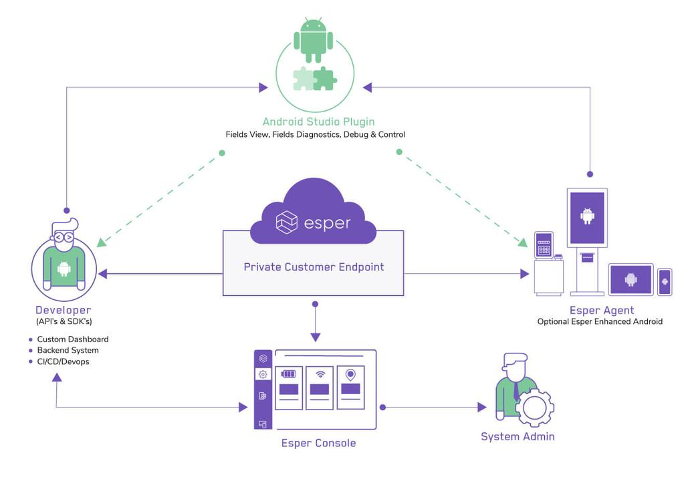

# Introduction

Esper is at heart a technology company that provides Android dedicated device fleet management solutions for enterprises led by APIs, SDKs, and tools for developers. Based in Silicon Valley with supporting teams in Seattle, Esper is currently the only company providing a full stack, API-driven implementation delivering a secure platform for purpose-built Android-based dedicated devices.

## Overview

Welcome to the Esper Console where Android™ developers can build, test, deploy, diagnose, and manage their applications seamlessly and securely to Android-based dedicated devices. Using the console, you will be able to generate API Keys and obtain your Enterprise ID; this enables you to use the Esper [APIs](./api.md) either by calling them via [REST](https://api.esper.io/), with our Esper [SDK for Python](./pythonsdk.md), or by using our Esper [CLI](./espercli.md). Additionally, our Esper [plugin](./esperplugin.md) for Android Studio is available for developers to use, and provides a set of resources to facilitate diagnostics and debugging of applications—whether running in a test lab or deployed in the field.

Esper provides tools that enable Android developers to deliver highly secure solutions to Dedicated Devices, all the while giving them superior flexibility and control over the process. This leads to a better development experience spanning the entire development lifecycle. Furthermore, this lightens the burden on IT, enabling them to focus on more pressing aspects of your product. A [rich API](https://api.esper.io) set and a variety of [open-source SDKs](https://github.com/esper-io/esper-client-py) and tools allow you to incorporate device management for your dedicated device apps and dedicated devices.

## Esper and Android Developers

Esper gives developers the APIs and tools needed to build, deliver, and maintain Dedicated Device applications—all in one place. Esper offers a full suite of APIs and tools enabling Android developers to more efficiently develop, deploy, and support Dedicated Device applications through the entire life cycle.

From the Console you can also perform important activities for working with your apps and devices during the development, test, and scaled deployment phases:

- Defining device templates with standardized provisioning settings specific to a particular app or set of apps.
- Managing your set of apps for development, test, and deployment.
- Including select Play for Work apps using your managed Google Play account.
- Provisioning devices using the Console to prepare them for development and deployment use, as well as manage them ongoing.
- Creating groups of devices to ease the process of targeting sets of devices during development, and ultimately managing a diverse fleet of devices across different apps.
- Setting alerts for specific battery or network conditions on your devices.
- Managing users, including adding additional users to your endpoint for either development or admin use, through the Company Settings.

Many of the above Console features are available via the Esper APIs, so please be sure to check out our API documentation to get started. And install the Esper SDK for Python, our Esper CLI, and the Esper Tools for Android Studio.

## Sign Up for an Esper Trial Account

To try out Esper simply sign up for a developer trial account on the [Esper Website](https://esper.io/signup/). Once the account is setup and you generate your API key, you can test out all the features of our innovative platform—whether building out a kiosk, point of sale solution, or for an entirely new Dedicated Device category. It is the best platform designed for the Android app developer targeting Dedicated Devices. Check out the [Developer Hub](../readme.md) and the [API Documentation](https://api.esper.io).

## Scale your Deployment

Coupled with the intuitive Esper Console and Esper Manage Dashboard, Esper allows you to gradually scale your fleet at your own pace. You have options here; start with emulated devices, your currently available Dedicated Device or off-the-shelf Android hardware. You can also choose Esper Development Devices that run Esper Enhanced Android. Across the endless variety of Dedicated Devices, Esper gives you supreme control of your app on your own device.

## Esper Tools

Esper gives you access to a suite of development tools you need to build, deliver, and maintain dedicated device solutions all in one place. Below is an overview of the Esper Tools:

- **Esper Console**: Device Onboarding and Management Platform.
- **Esper Cloud**: A private Cloud dedicated to each development team.
- **[Esper Virtual Device](./esperplugin.md#esper-android-virtual-device)**: An emulation environment for development and verification testing use with Esper Enhanced Android. You can also use emulation in Android Studio with a stock Android image running our Esper Agent.
- **Esper Enhanced Android**: A fortified version built with Android OS for Dedicated Devices. Adds key features for Dedicated Device needs not met by stock Android.
- **Esper Development Devices**: Esper sourced Dedicated Devices for you test drive Esper Enhanced Android.
- **[Esper APIs](https://api.esper.io)**: Rich API set for Dedicated Device application development, deployment, and management.
- **[Esper SDKs](./pythonsdk.md)**: Available for Python—and soon for Kotlin, Java, and JavaScript.
- **[Esper CLI](./espercli.md)**: A unified command line interface to the Esper APIs, provided with source code so you can extend it yourself.
- **Esper Remote Debug**: Everything you need to do secure remote debugging of deployed Dedicated Devices running Esper Enhanced Android.
- **Esper Dedicated Device Cookbooks**: Available quick starts for Kiosk, POS, Restaurant, and Logistics Dedicated Device solutions.
- **[Esper Support](./support.md)**: Chat, GitHub, email and phone.

## Esper Device Orchestration Features

Through the Esper Console you can access all the features and capabilities you need to effectively orchestrate and manage Dedicated Device fleets:

- Seamless Enrollment and Bulk Enrollment (afw#, QR Code, NFC-based, IMEI/Serial number)
- Remote View and Remote Control
- Application Lockdown and Management
- Device Monitoring
- Device Groups
- Device Graphs
- Device Security State Assessment
- Device and Group Commands and Actions
- Rich Alert Engine
- Unlimited Private App Storage
- Unlimited App Versions
- Android Enterprise (AKA Android for Work)
- App Install Scheduler
- App Management
- Enforce compliance policies
- Firmware-over-the-air (FOTA) Android OS Updates

## Next steps

1.  To understand system requirements, see [Requirements](./requirements.md)
2.  To get started, see [Getting Started Guide](./gettingstarted.md)
3.  Checkout Esper APIs [documentation](https://api.esper.io)
4.  Checkout Esper SDK on [GitHub](https://github.com/esper-io/esper-client-py)
5.  Checkout [Esper CLI](https://github.com/esper-io/esper-cli), a command line tool for accessing APIs.
6.  To learn more about Esper, visit [esper.io](https://esper.io)

## Contact Us

You can also send us an email at [support@esper.io](mailto:support@esper.io) for any questions or concerns.
