# Esper console
The Esper console is a feature-rich user interface for you to operate and manage your fleet of Android devices. Esper provides a range of super simple options to deploy company‑owned devices at scale.

## Static Interface Elements

### Navigation Bar
No matter where you are in the Esper Console, there will be a navigation bar along the left side of the screen. This enables you to quickly navigate to each of the other sections of the Esper Console. These sections are:

   - Dashboard
   - Provisioning Methods
   - Provisioning Templates
   - Devices
   - Groups
   - Apps
   - Alerts
   - Compliance Policy
   - Reports
   - Geofence
   - Pipeline
   - Company Settings
   - Esper Enhanced Updates
   - API Key Management

You can hide the names in the navigation bar to show just icons by clicking on the chevron at the top. Click on the chevron again to slide the navigation bar back out to show the names.

### Feedback Widget
No matter where you are in the Console, the blue Feedback button at the bottom right corner of the Console will allow you to share detailed feedback and report issues without leaving the screen.

Clicking **Feedback** brings up a screen with the following tools:

   - Box tool – Highlight a specific area of the page and comment on that area. If you prefer, don’t enter a comment; simply leave the box outline.
   - Blackout tool – Blackout any sensitive information on the screen.
   - Pen tool – Draw anything you like! Circle and Point works great with a touch screen and pen.
   - Line tool – Underline, strikethrough, draw a straight line.
   - Line with arrow tool – Point to something.
   - Comment tool – Drop a pin and make a comment.
   

When you’re ready to submit your feedback, click the check-mark to the right of the toolbar. This will bring up a pop-up box that will enable you to select a feedback category and fill in your comments. To submit your feedback or comment, click Send. Your feedback will go directly directly to Esper’s engineering team, who will then add it to our feature and issue tracking system.

### What’s New Button
At the top right of the screen is the **What’s New** button.

When you click it a panel will slide in from the right side of the screen; scroll through it to learn more about updates and improvements to your Esper experience.

### Toast Notifications
Most notifications on your Esper console will appear as toast notifications at the bottom left corner of your screen. These notifications disappear after a few seconds; if you prefer, you can click on the X to dismiss them. If there are multiple notifications queued, click the X of the topmost notification to get to the next one in the queue.

These types of notifications are called “toast notifications” because they pop up like toast from a toaster.

### Informational Slider Screen and Dropdowns
Many actions in the Esper console can be carried out on multiple devices across a wide variety of situations. Some devices may be offline or have poor internet connectivity. When these types of action are taken, a status screen will slide out from the right side of the console, showing the status of the action on each of the devices on which it is being executed.

You will encounter these slider screens frequently as you use your Esper console.

 
Some operations—such as installing a new version of your app after hours across thousands of devices—can be performed over hours or days. Fortunately, you don’t need to watch the status reported on the informational slide out screen the whole time. To force an update to the overall status displayed in the slider, click the refresh button in the upper right hand corner. To exit a slider, click the X next to the refresh button. You return to the slider by clicking on the link or button associated with that action. 

For certain operations performed on a set of devices in a group, a popdown will appear on the screen. This gives you a quick summary of the top level status, with an option to open up the accompanying detailed slider screen.

### Logging Out
To log out of the Console, click on the user icon at the top-right corner of the screen and select Log Out from the drop down menu.

   
### Users
Esper’s user management functions can be reached by clicking on the user icon at the top-right of the screen, then selecting **User Management** from the dropdown menu.

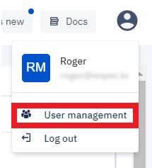

Access to this page is only available to those with Enterprise Admin roles, those with other roles will not see the User management option in the drop down. Click on **User Management**.

There are four main roles for Esper Console users: *Enterprise Administrator, Enterprise Viewer, Group Administrator*, and *Group Viewer*. Each role has different permissions, ranging from an Enterprise Administrator, who is able to view or change anything, down to a Group Viewer, who can view those things having to do with those groups to which the Group Viewer is assigned.
The privileges and permissions for each role are as follows:

### Adding a New User
To add a new user, click on New User

Enter the new user’s name, username, email, and password. Re-enter the password and click **Next**.

Select the new user’s role from the dropdown menu.

If you’re creating a Group Admin or Group Viewer, assign to the appropriate groups and click **Confirm**.

After adding a user, be sure to give the user their login credentials so that they can log in.

### Editing a User
The User Management screen also enables you to edit the details of a user. To do so, click on the pencil icon in line with that user’s listing.

You will be able to change the username, email, full name, password, and role assigned to the user. If you do that, be sure to pass the changes on to the account owner so they can continue to access the Esper console.

### Deleting a User
To delete a user from the enterprise, click on the trash can icon in line with that user’s listing. That user will no longer be able to access their account:

## Dashboard

When you enter the Esper Console, the first page you encounter is the Dashboard. It acts as the homepage for the console and provides useful, at-a-glance information about the status of your Android fleet.

The first time you log in to a newly created Esper console, you’ll see a default screen indicating you do not have any devices enrolled and offering the option to create a cloud-based simulated Android device, called a Simulare:

 

If you’d like to simulate an Android device, click Simulare Device. You will see a momentary “You are all set!” message after which a mock device will be available for you to experiment with and learn on until you’re ready to provision an actual device.

Capabilities such as Apps, Remote View and Capture log may not be available on a Simulated device.

NOTE: This feature is only available on accounts created after Friday, September 27, 2019. If you became an Esper client before then and would like access to a simulated device, contact us.

Once you enroll and provision your first device, this screen changes to the full Dashboard view.

### Status Panels

The main body of the Dashboard contains four status panels:
#### 1\. Deployment Status
The Deployment status panel shows the current deployment status of all your devices, with the number of devices in each of four possible statuses: online devices, offline devices, under provisioning, and recently added. Clicking one of these statuses will take you to the [Device Dashboard](./console.md#devices) section, filtered to show the devices currently in that status.

#### 2\. Security summary
The Security summary panel provides a snapshot of security status of all your deployed devices, with the number of devices in each of four possible statues: high risk, medium risk, low risk, or no risk. Clicking on one of these statuses will take you to the [Device Dashboard](./console.md#devices) section, filtered to show you the devices in the risk category indicated.

#### 3\. Where are your devices?
The Where are your devices? panel shows the physical location reported by each of your devices on a map. Immediately below the map is a summary of cities worldwide containing the highest number of devices.

#### 4\.Alerts status
The Alerts status panel provides a summary of alerts you’ve created and the number of times each has fired. You can see the number of alerts fired by selecting that alert from the dropdown menu.

## Provisioning methods

Provisioning is the initial step of enrolling, configuring, and managing an Android device using the Esper platform and associated developer tools.
Esper provides several different methods for provisioning Android devices, depending on the capabilities of the device being configured:
   Android for Work, part of Android for Enterprise
   6-Tap QR Code, part of Android for Enterprise
   The Provisioner Tool
   Seamless Provisioning
Additional provisioning methods may be available including Google Zero-Touch Enrollment, Samsung Knox Mobile Enrollment, IMEI/Serial Number-based, NFC-based, and in some specific cases using a downloaded APK. Please contact Esper directly to find out if your account qualifies and your device is supported.

If you meet the prerequisites, you may provision your device using any of the above methods. To select one of the provisioning methods, or to see detailed steps for that method, hold your mouse over it and the Provision button will appear. Click on the Provision button and detailed steps for the selected method will appear.

### Selecting a Provisioning Method
Each of the four provisioning methods is suited to different situations. Click the name of a method to get specific instructions. All methods require Internet connectivity.

1.  [AfW provisioning](./console/device-provisioning/afw-provisioning/index.md) 
    The AfW method is best used for:
      - Devices that have GMS (Google Mobile Services) support enabled
      - Devices with a camera for QR code scanning
      - Android 6.0 and above
      - Factory reset of device required
   You can also use IMEI / Serial Numbers with the AfW provisioning method on some devices. This is useful when shipping a device directly to a customer so they can provision it themselves, for devices without a camera, and it prevents repurposing the device by exploiting factory reset. It requires a passcode, which is the same as the password used by the Esper Settings app set up in the Compliance Policy. See the **Upload IMEI CSV** section below for more information on how to load IMEIs and Serial Numbers into a template.

2.  [6-Tap QR Code Provisioning](./console/device-provisioning/qr-code-provisioning/index.md)
    6-Tap QR code provisioning is best used for:
      - Devices that have Google Mobile Services (GMS) support enabled
      - Devices with a camera for QR code scanning
      - Android 7.0 and above
      - Factory reset of device required
   Beginning with Android 9 you can include credentials for the Wi-Fi network to be used for provisioning in your template. They’ll be included in the QR code, eliminating the need to enter them on the device to establish the required Internet connectivity.

3.  [Provisioner Tool](./console/device-provisioning/adb-provisioning/index.md) 
   The Provisioner Tool is a user-friendly provisioning tool by Esper that runs on Mac and Windows. You can conveniently use this to provision:
      - All Android Devices—GMS and most Non-GMS—running Android 4.4 or newer
      - Devices with or without camera
      - Multiple devices at once
      - Android Studio AVDs for development and test purposes
   You’ll need a USB cable to connect the device to the computer you’re using for provisioning. There is an Ethernet-based approach you can use if the device is on the same subnet as the computer running the Provisioner Tool.
Requires you on the device to turn on Developer Options and enable USB Debugging.

The Provisioner Tool does not support Google Single Sign-on (SSO). If you set up your Esper Console login using Google SSO, simply go to your account on the Esper Console, enter in a password, and save it—you will no longer be using Google SSO and can now sign in on the Provisioner Tool and continue to use the login method on the Esper Console.

4.  [Seamless provisioning](./console/device-provisioning/imei-or-serial-number-based-provisioning/index.md)
     Seamless provisioning is only for devices running Esper Enhanced Android:
      - IMEI/Serial Number method is use for bulk provisioning of devices
      - Enables true no-touch provisioning using a predetermined Wi-Fi access point
     
    Contact Esper to find out more about Esper Enhanced Android and Seamless Provisioning.

    :::tip
    In case a device gets stuck during provisioning, we have introduced a cheat way to skip out of it. Tap 7 times on Esper logo on provision screen to show reset button if this action needs to be performed during the provisioning process.
    :::

### Need Help Choosing?

If you find choosing between these methods confusing, we have provided an easy way to find the best provisioning method: Fill the form on the right side. You’ll need to provide the following information:
   - **Android version** — Check the android version on your device by navigating to Settings > About >  Android Version. Choose the correct version of Android for your device from the dropdown menu.
   - **Esper Enhanced** — Esper Enhanced Android is purpose-built Android OS, optimized for deployment under the Esper system. Esper provides Esper Enhanced devices on request from customers. Click YES, if your devices are Esper Enhanced.
   - **GMS support** — Click YES, if your Android device supports Google Mobile Services. If the Play Store app is included on your device, your device is likely a GMS device.
   - **Camera** —  Choose YES, if your device has a working camera.
Then click Suggest Provisioning Method. 

Based on your selections, the tool will suggest one of the four provisioning methods by highlighting it. Click on it to see the steps to provision your device.
If you still have trouble figuring the provisioning process, Esper support will be happy to assist you. Send an email to support@esper.io.

:::TIP: In case a device stalls during provisioning, there’s a way to exit out and factory reset the device. On any provisioning screen showing the Esper logo, tap the logo seven times; this will bring up the Factory Reset button. Simply touch the button to start the reset process.
:::

## Provisioning Templates

Provisioning Templates give you a straightforward way to enroll and provision multiple devices. You create templates for devices in which you specify the compliance policy, apps, device settings, device group—even the wallpapers—you want to be provisioned on your devices.
The Provisioning Templates are shown as tiles with the most-recently created at the top. You can easily find templates by name using the **Search Templates** feature:

   
You can easily open up the QR code to use during AfW or 6-Tap QR Code provisioning by clicking on **View QR Code**. 
Be careful sharing the QR code as in some cases Wi-Fi access point credentials are included, and anyone with it can enroll a supported Android device into your fleet. For those cases where distributing a QR code outside of your organization would be required, instead consider using AfW IMEI/Serial Number provisioning with a passcode.

### Actions on Template Tiles
Clicking on the ellipses (...) at the top right of one of the template tiles opens a pop-up menu that enables you to do the following to that template:
   - Preview
   - Edit
   - Duplicate
   - Upload IMEI CSV
   - Download Config
   - Delete

**Preview**
Click Preview to preview the Provisioning Template. Click on the + sign to expand each section. 
NOTE: You can not edit the template using Preview.

**Edit**
To edit a template, click Edit. You can update the Policy, Apps, Branding, Settings, Group and Add Devices options as you wish. To save the changes, click on the Update button on the Preview page.

**Duplicate**
To copy a template, click Duplicate. You can then rename the template and update the Policy, Apps, Branding, Settings, Group and Add Devices options as you wish. Any IMEI or Serial Numbers in the original template will not be carried over to the duplicated template. To save the changes, click on the Update button on the Preview page.

**Upload IMEI CSV**
To upload a set of IMEI/Serial Numbers for devices you want to provision using the AfW or for Esper Enhanced Android devices with this template, click Upload IMEI CSV. The CSV file containing the IMEI and serial numbers must adhere to the following conditions:
   - The CSV requires the first entry of “imei1, imei2, serial number”.
   - Then on each cell below enter “[IMEI #], [IMEI #], [Serial Number]”.
   - If you don’t want to add a second IMEI or serial number, leave the space blank between the commas
   - Thus if you are entering just IMEIs, you can make each row either “[IMEI #], [IMEI #],” or “[IMEI #], ,” or “, [IMEI #],”.
   - If you are entering just serial numbers, you can make each cell “, , [Serial #]”.
   - The comma separation is required.
   - The IMEI numbers need to be valid 15-digit numbers; IMEIs are being validated through Luhn’s algorithm.
   - File should not be empty.
   - Don’t list more than three values in a single row.
   - Don’t upload duplicate IMEIs.
   - Don’t switch the order of IMEI and serial numbers.
   - Any time a CSV is uploaded, the previous IMEIs and Serial Numbers for that template will be deleted and replaced by the new additions from the CSV. This will not impact any devices that have already been provisioned.
   
Below is an example set of entries for a CSV file:
   - The required header
   - Two IMEIs and one Serial Number
   - Two IMEIs
   - One IMEI and one Serial Number
   - One IMEI as first entry
   - One IMEI as second entry
   - One Serial Number

You can also upload a CSV or individually add IMEIs and Serial Numbers when **editing a template**.

**Download Config**
Clicking Download Config will enable you to download the config.json file for use during ADB and by IMEI-based provisioning methods. Contact Esper if you have any questions. 

**Delete**
Click on Delete to delete a selected template. You will still be able to view the policy, apps, and settings of the template when viewing a device previously provisioned using that template.

### Creating a Provisioning Template

To create a provisioning template, click **Create Template**.

   Enter a unique name and an optional description for the Provisioning Template, then click Next.

### Compliance Policy Section

A Compliance Policy is a set of configurations or permissions that will be applied to all the devices provisioned through the template. Each configuration determines particular system behavior, in some cases including whether the device user is able to change a configuration on the device using the Android Settings app. This section lets you set the Compliance Policy that will govern all the devices provisioned using this template. You can change this after provisioning by defining a new Compliance Policy and then applying it to a Device or a Group.
(./assets/NewConsole/TemplatePolicy.png)

Hovering your mouse cursor over any item will give you a short explanation on-screen. Below is a detailed explanation of each of the configurations you can set in this section.

### Dropdown menus

**Lock Screen Password Rules**
  The Lock screen password rule specifies the conditions for the device unlock password, with the default being None. If you choose alphabetic or alphanumeric, you must set a minimum password length of at least 4 characters and up to 25—use the small up/down arrows to set your required password length:
(./assets/NewConsole/LockPwdLength.png)
   
  **Alphabetic**: Restricts acceptable password to only upper and lowercase alphabetic characters (A to Z, and a to z).
  **Alphanumeric**: Expands acceptable password to include numbers, and special characters in addition to alphabetic characters.
  **None**: There is no password required to unlock the device.
  
The password for a device will be set up during the initial setup of the device by the user.

Lock screen must be on in order to set Lock screen password rules. If you select either Alphabetic or Alphanumeric password rules, then Lock screen will be set to On by Esper if it is currently Off.

**Default App Permission** 
    Default app permissions determine enforcement of the runtime-permission rule across all the apps on a device including Enterprise apps installed by Esper, in-ROM apps that are enabled, as well as any installed via Managed Google Play. This ensures you can control the user experience on the device regarding how run-time permissions are granted. There are three possible settings:

   **Allow Automatically**: This rule will grant all the permissions any app requests without showing a prompt to the user. This is the typical setting used for single-purpose solutions using a fully trusted, customer-supplied application.
   **Ask User**: This keeps the default behavior intact with regards to permission management. All apps on the device will show a prompt to the user to request permission. For example, by choosing this option then every app will ask the user each time before accessing a device module with a message such as “Allow app X to access Gallery? Allow/Deny”. This may be unsuitable for some solutions, especially Kiosk-based apps. It can be useful for certain unusual situations dealing with App permissions—contact us directly to find out more.
   **Deny Automatically**: This rule will deny any permission request from any app on the device. No notification will be shown to the user. You can grant permissions to apps individually from the Esper Console.

**System Updates** 
    The System updates option allows you to enforce a system update policy on the device when a system update is available via the device’s over-the-air (OTA) update service. There are four possible settings:
   **Update automatically**: This option will install any over-the-air (OTA) updates automatically as soon as they become available without user interaction,  and reboot the devices when necessary.
   **Postpone installation**: This option postpones installation of an OTA update for 30 days. After 30 days, the system will prompt the device user to install the update. Subsequent updates will also follow the same 30-day postponement. This is ideal when you need time to validate your solution against new system updates before they are installed.
   **Windowed Installation**: This option allows you to define a window of time during which the OTA update will be installed without user interaction. This option is ideal for devices with a known down period. A drop-down will appear to enable you to set the start and end times for the maintenance window.
   **Disable Update**: This option allows you to disable updates on the device. It is available for a limited set of OTA services that support this feature. If the device does not support disabling updates, it will default to Postpone installation. Before setting this option please contact Esper directly to make sure the devices you plan to provision support this configuration.

**Android Settings App**
   Android settings app determines how device users can access the Android device settings. There are three possible settings:
   **System settings app**: This setting will display the icon for the default Android settings app on the Home screen. Clicking this icon will take the user to the default Android settings. Depending on the other configurations set by the Compliance Policy, some options may be disabled to the user. If an app is set up in Kiosk mode on the device, the System settings app will be inaccessible to the device user while the app is in Kiosk mode.
   **None**: No icon for any settings app will be available for the user to choose from the device’s Home screen.
   **Esper settings app**: Esper offers a custom settings app that gives device users access to a subset of the available Android settings when servicing a device. The Esper settings app is intended for use by technicians servicing a device locally. It’s protected by the Dock & Esper Settings App password to prevent unauthorized access. This app offers a reduced number of settings:
      - Wi-Fi: Change the Wi-Fi access point used by the device.
      - Torch: Turn on the Torch (AKA “flashlight”) if the device has a camera flash LED.
      - Auto-Rotation: Turn auto-rotation on or off.
      - Factory Reset: Perform a factory reset of the device, regardless of the Compliance Policy applied. 
      - Kiosk App: Change the app that runs in kiosk mode. The device user can choose any installed app on the device to act as the kiosk app, with the Esper Console kept in sync on the configuration stats.
      - Esper Branding: Turn off the Esper logo on the Home screen.
      - About: Supplies information regarding the endpoint name the device is enrolled in, in case the customer has access to multiple Esper endpoints.

**Dock & Esper Settings App** 
    The dock is specifically for devices in Kiosk mode. When a device is in kiosk mode, you can access the dock by tapping 3 times in the upper left corner of the screen, or by pressing the power button consecutively 3 times with a slight pause between each press. When you do so, an expander arrow will slide out of the upper right corner:
Tap the expander arrow; you’ll need to enter the password you set in the Compliance Policy.
(./assets/NewConsole/DeviceAppSlider.jpg)

   Once you’ve entered the password, a dock will slide out that gives you three options:
      - Exit Kiosk mode. If the device is in multi-app mode, no action is taken.
      - Reboot the device.
      - Open the  Esper Settings app; selecting the Esper Settings app will require you to enter the password again to gain access.

To slide the dock back in, click on the expander arrow again; it will disappear after a few seconds.
NOTE: If you exit Kiosk mode into multi-app mode, you can still activate the expander arrow to ensure you can put the device back into Kiosk mode locally even if the Esper Settings app was not included on the Home screen.Dock and Esper Settings App Password

This password controls access to the hidden dock available in kiosk mode, the Esper Settings app, and serves as the PIN used for IMEI-based provisioning via AfW. The password is alphanumeric and can be from 1 to 10 characters.

The default password is 1234. It is possible to set up a template without a password for these features, or just leave the default password; Esper strongly recommends setting up a more complex password for stronger security. The same password will be set for all devices provisioned using the template.

**TIP**: If your device is set up in Kiosk mode, the dock will be accessible even if you choose either no settings app or the Android settings app as part of your applied Compliance Policy. That means you should set an appropriate password for the Dock & Esper Settings app if you plan to deploy your devices in Kiosk mode.

### Google Account Restrictions

This setting enables you to restrict the number of Google accounts that can be added on the device and used with Google apps like Gmail, Google Play Store, and YouTube. By default, any number of accounts can be added to a specific device; this setting restricts this number. For example, if you set this setting to two, only two accounts will be permitted on the device, further addition (or deletion) of accounts will not be possible unless a different Compliance policy is reapplied.

**NOTE**: If you don’t check the Google account restrictions box and plan to provision your device in Multi application mode, we recommend disabling Google Play Store to prevent installation of unapproved apps.

:::tip
The Google Account Restriction feature is applicable only to Google Mobile Services (GMS) Android devices. If you include the Android Settings App and wish to prevent any Google accounts from being added, set **Number of accounts** to 0.
:::

### Factory Reset Protection 

Factory Reset Protection (FRP) enables you to lock a device if a user factory resets it via soft/hard keys on GMS devices. In case of a factory reset, the device will get locked and can only be unlocked by entering a pre-authorized google account ID. Additional information about how to get your Google Account ID is available in the Compliance Policy section.

When you turn on the FRP button, you’ll need to enter the Google ID of the account you want to use to authorize post factory resets on the devices provisioned with this template.

**NOTE**: This feature is only available on GMS devices running Android 5.1 and above.

See [here](./console/policy-management/getgoogleaccount.md) to know how to get the Google account ID of your account and how FRP protects your device.

**Lock Screen**  If Lock Screen is on, it enables the default “lock screen” to be displayed upon a screen timeout as specified in the Settings section. If this is on, the device user will have the option to set the password. If Lock screen password rules are defined, the device user will be required to enter a password that conforms with these rules.  
**Safe-Mode Login**  TWhen Safe-mode login is on, users will be able to boot to Safe Mode on their device; when Safe-mode login is off, users will be unable to boot to Safe Mode. 
**Factory Reset**  Factory Reset controls whether or not the user can perform a factory reset on the device using the Android Settings app. When Factory Reset is off, the user will not be able to perform a factory reset on the device. This does not prevent a hard-key factory reset, see Factory Reset Protection to prevent hard-key factory reset.  
**Notification bar**  If you want device users to be able to swipe down to see the notification bar, set Notification Bar to on. If you don’t, set it to off. You will typically want this off for Kiosk mode-based solutions. Conversely in most cases a user is required to submit a Bug Report that was requested through Esper via the Notification Bar, thus inaccessible with the Notification Bar turned off.  
**Screenshot**  If you want device users to be able to take screenshots, set Screenshot to On. If you don’t, set it to Off. This will prevent users from initiating a screenshot using the appropriate hardkey sequence or available softkey on the device.  
**USB connectivity**  USB connectivity allows users to connect USB devices—things like flash drives, digital cameras, mice, or keyboards—to the device. If you want device users to be able to connect other hardware to the device, set USB Connectivity to on. If you don’t, set it to off. 
**SMS**  SMS controls the ability of the device to send or receive text messages via short-message service (SMS). If it is turned Off, the device will not send or receive text messages regardless of which SMS app is used. Set SMS to on if you wish to enable the device to send and receive text messages via SMS.  
**Outgoing calls**   OIf you want device users to be able to make outgoing calls, set Outgoing Calls to on. If you don’t, set it to off.  
**Camera Access**  If you want device users to be able to use the camera, set Camera Access to on. If you don’t, set it to off. 
   **NOTE**: Your app will still be able to access the camera if this setting is set to off. 
**NFC**   If you want device users to be able to use near-field communication (NFC) on their devices—on those devices that support NFC—set NFC to on; if you don’t, set it to off. If any of your apps require NFC, make sure this setting is set to on.  
**Google PlayStore** If you want device users to have access to your Managed Google Play Store, set the Google Play Store setting to On; if you don’t, set it to Off. You’ll still be able to install any approved Google Play Store apps from Esper onto the device. This only applies to GMS devices, as AOSP devices do not include Google Play Store support. 
**USB tethering** USB tethering specifies if the user is able to use their device to share a mobile connection to another device such as a laptop. If you’d like device users to let their devices share a mobile connection with other devices, set the USB tethering to On; if you don’t, set it to Off. 
**Edit date and time**  If you’d like device users to be able to set the date and time on the device, set the Edit Date and Time setting to On; if you don’t set it to Off. 
**Application uninstall**  Setting Application uninstall to On will block app uninstallation both locally on the device and using Esper. Set it to off if you need to be able to uninstall applications remotely using Esper. 
   **NOTE**: With this set to on you will still be able to update your application installed on the device using Esper.   
**USB File transfer**  If you’d like device users to be able to transfer files to or from the device using a USB cable or flash drive, set USB file transfer to On; if you don’t, set it to Off. 
**Google Assistant**   If you’d like device users to be able to use voice command via Google Assistant on devices where this is supported, set Google Assistant to On; if you don’t, set it to Off.
   **Note**: On a few devices, this setting may need to be on if you wish to have Google Play Store show up on the device.    
**Local App Install** TThis feature allows installation of apps from unknown sources on the device. To enable this on the device, the user needs to follow these instructions. **Settings >Apps and Notifications > Special App Permissions> Install Unknown Apps** and choose the route they wish to install the apps from. For example, if the device user chooses Chrome, they will be able to download and install apps from the Chrome browser on the device. If turned off, the device user will not be allowed to install apps from any unknown sources. 

### Restrict Incoming and Outgoing calls
   Selecting the checkbox next to Restrict outgoing/incoming calls using customised dialer opens up two more checkboxes:
      - Restrict incoming calls to uploaded contacts only
      - Restrict outgoing calls to uploaded contacts only
Selecting either or both of these checkboxes will restrict incoming or outgoing calls to a specific list of telephone numbers, which you need to then upload to the device using a .csv file.
The .csv file format is one phone number per cell row using the first column, with each number preceded by the country code - see the example below.

Only one upload file is stored for each, if you upload a new file the old entries are deleted and only the entries from the new file are used.
If you wish to enable outbound calls, be sure to include your device’s phone app as a package name for [Preloaded apps in Apps] if the phone app is preinstalled.

:::tip
Spreadsheets commonly interpret + as part of a mathematical formula. Use the appropriate method specific to that spreadsheet to indicate the number is not part of a formula. For example in Excel you prepend a ‘ to each entry. Remember to save the file as a .csv.
:::

### ADB
Android Debug Bridge (ADB) is a command-line tool that enables developers to use a Unix shell to communicate with an Android device. If the ADB option is checked in the device’s Compliance Policy, you may turn on ADB via Devices > Device > Settings for a configurable time period. If the ADB option is unchecked in the Compliance Policy, ADB can not be turned on from Settings. Most stock Android devices will require opening the port on the device for the Esper agent to set up a secure connection to the Esper Cloud for ADB debugging. You can find out more about using ADB with Esper here.

   **NOTE**: We never allow turning on ADB from the device on any Esper-provisioned device.

### Resetting to Default Settings
You may reset these values to default at any time by clicking the **Reset to defaults** button at the bottom of this panel.
When you are satisfied with your Compliance Policy configurations, click **Next**.

### Apps section

The Apps section lets you choose the apps you would like to have installed on your device during provisioning. You may choose to install Enterprise apps uploaded via the [App Management](./console.md#apps) section of the Console or apps approved via [Play For Work](./console/play-work/index.md) from your Managed Google Play Store account.  

### Kiosk or Multi-App Mode 
Your first step is click a radio button to choose either Kiosk mode or Multi application mode.

**Kiosk mode** pins a selected Enterprise or Google Play Store app to the device unless the user exits kiosk mode. This is useful for cases in which the device will be used for a single purpose—for example, an airport kiosk—and only the selected app needs to run on it.
**NOTE**: For an optimal Kiosk mode implementation other Compliance Policy configurations need to be properly set. See this [technical article](https://blog.esper.io/kiosk-on-esper) for more details.

In **Multi application mode**, the device user is free to use any Enterprise or Google Play app approved and installed using Esper.

### Advanced Settings
Clicking on **Advanced Settings** will launch a dialog box in which you can select either the Esper DPC Launcher or the default Android launcher.

Most users will use the default setting: the Esper DPC Launcher. If you select **Esper DPC Launcher**, the Esper Device agent will take administrative control of the device and only approved apps will be able to be installed or used. All the features of Esper Device agents will be functional. This gives you more control over the apps that can be used and the actions that can be taken on the device.
If you select **Default Android Launcher**, the default Android launcher will be used. The device user will be able to exit the Esper Agent (DPC) as they would any other Android app. DPC will continue to run in the background and provide some device management, but many management features will not be available. Specifically, the following will be unavailable:
   - Capture Screenshot
   - Remote View and Remote Control
   - Over-the-Air OS updates for Esper Enhanced Android OS
   - Latest Device Agent updates for Devices with Android version less than 6.0
   
The device screen will look and act much like a regular Android device with Esper Device Agent showing up as an app that can be opened and closed.

   
Even when the device user has exited Esper Device Agent they‘ll be able to see it running in the background in the notification bar. This feature is for very specific use cases, if you are unsure whether you should use the Default Android Launcher please contact Esper.
There is also a checkbox that allows you to include or bypass Google Play setup during provisioning on GMS devices. If this is unchecked, the Google Play store will not be set up on the device—reducing provisioning time dramatically. If you have enrolled the device into a Managed Google Play account, the default value for this is on; if the endpoint is not enrolled then the default is off. It does not apply to Android Open Source Project devices that are non-GMS.
Once you have made your selection, click **Close**.

**Preloaded Apps**
Android devices normally come with a number of apps loaded onto them in ROM. This field enables you to select which of these will be available on the device after provisioning. Enter the package names of any preloaded apps you want to show up into this field. Package names must be separated by commas.
**NOTE**: One easy way to find the package names is to provision one of your devices and then view the Preloaded Apps on that device—the package name for each app will be listed. You can also use ADB as well. You currently can not set a Preloaded App as the Kiosk mode app via a Provisioning Template, but you can do so at the Device level after the device has been provisioned.

**Esper Cloud Apps**
The **Esper Cloud Apps** tab gives you the ability to load any Enterprise apps and approved Managed Google Play apps onto the device when it is provisioned. These apps must have been previously uploaded to Esper as an Enterprise app through Apps or previously approved through Managed Google Play.
**NOTE**: Before using a managed Google Play account, you need to set up a Managed Google Play account through Esper.
Once an Enterprise app has been uploaded into your Esper Cloud Endpoint, select it from the dropdown menu, then select the version, and click on Add to add it to your template.

 
**Play Store Apps**
The Play store apps section of the Your App tab gives you the ability to load approved apps from the Google Play Store onto the device as it is provisioned. This section will only appear if you have enrolled your endpoint in [Managed Google Play]. These apps must have been approved through Play for Work before they can be selected here. Simply click on the approved Play Store app you wish to install, and it will be added to the list of apps.

   
**NOTE**: If you include a Google Play Store app in your template but use it to provision a non-GMS device without support for Google Play, the app will not be installed when provisioned.

**Play Store Tab**
For convenience, a **Play Store** tab has been provided on this page where you can approve Google apps you’d like to add to your template. This option is only available if you have set up a [Managed Google Play] account, and is mirrored in [Apps].
(./assets/NewConsole/PlayStore.png)

**TIP**: Only once you approve a Google Play Store app, you may add it from the list shown in the Provisioning Template under Your app.
When you are satisfied with your apps settings, click **Next**.

### Branding section
The Branding section lets you customize the devices you’re provisioning by uploading the wallpapers that will be displayed on the device once it’s provisioned. You can upload separate portrait and landscape wallpapers. If your device is fixed to a display orientation you only need to upload the wallpaper for that orientation.

This does not apply to devices deployed in Kiosk mode.

Supported image formats are JPEG, PNG, or JPG with a 25MB size limit. Be sure to crop the image to match the screen resolution of the devices you plan to provision with this template, otherwise they will be stretched to fit.

   
To preview the Portrait wallpaper you uploaded, click **See preview**.
When you are satisfied with your wallpaper, click **Next**.

### Settings section
The Settings section lets you determine levels for most of the device settings—things like screen brightness, alarm volume, and screen timeout. You can also set up devices with Wi-Fi credentials, along with determining the duration of an ADB session if ADB was enabled in the [Compliance Policy] section.

   
**TIP**: If the **Android Settings App** is enabled for a device in Multi application mode, the device user can access these settings and change them on the device.

**General Device Settings**
Most of these are fairly straightforward:
   - Turn Bluetooth on or off.
   - Turn Wi-Fi on or off*.
   - Select GPS accuracy from the dropdown menu.
   - Set the brightness of the screen using a slider.
   - Set the alarm volume using a slider.
   - Set notification volume using a slider.
   - Set music volume using a slider.
   - Set ring volume using a slider.
   - Select screen orientation from the dropdown menu (Auto, Landscape, or Portrait)*.
   - Select screen timeout duration—the time after which the device screen will turn off if left idle—ranging from 15 seconds to Never (meaning the screen will always be on, important for Kiosk mode deployments.
   - Select the time zone in which the device will be deployed; after deployment, you will have the ability to change the device’s time zone remotely via dashboard. If you don’t specify a device time zone, the time zone set by the device will be used.
*If the device only uses Wi-Fi for Internet connectivity, since Esper requires the device to be connected to the Internet in order for the Esper system to work, Esper will turn Wi-Fi on after 10 seconds to establish the required Internet connectivity.
*Some device makers swap the settings for Landscape and Portrait. If your device was provisioned with a specific orientation but is locked into the other orientation, try swapping this setting to achieve the proper screen orientation setting.

The Time Zone field has a robust search capability. As you begin to type, suggestions will be displayed. For example, typing “Pacific” will bring up all the time zones that start with “Pacific.” Listings are by country, for example to find the timezones for the U.S.A., search for “America” or “US”.
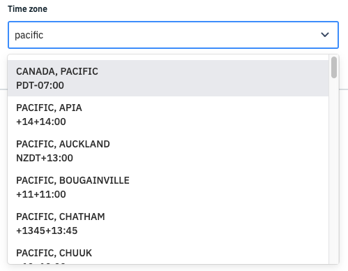
   
**ADB**

Android Debug Bridge (ADB) is a command-line tool that enables administrators to use a Unix shell to communicate with an android device. If ADB was checked in the Compliance Policy section, you can turn on ADB here for a configurable time period. If ADB wasn’t checked in the Compliance Policy section, ADB can not be turned on here.
(./assets/NewConsole/ADBDuration.png)
   
:::tip
Keeping ADB set to “Always ON” is NOT recommended for security reasons.
:::

**WIFI Access Points**

You can preload preferred Wi-Fi networks to which the provisioned device will automatically connect as they become available. 

   
The device will automatically connect to the given WiFi access points as per the availability and network strength after provisioning.
 
:::tip
The WiFi on/off and WiFi access points feature are not available for android 10.0 and above
:::

This section has four fields to configure: Wi-Fi SSID, Wi-Fi Password, Wi-Fi Security type, and whether the access point is hidden. The Wi-Fi SSID and Wi-Fi Password fields are text fields into which you enter the SSID and password for the access point. Select the security type from the dropdown menu. There are four possible choices:
   - NONE
   - WPA
   - WEP
   - EAP
If you select EAP, an extra dropdown menu will appear to enable you to select a Phase 2 Authorization protocol:
   - NONE
   - PAP
   - MSCHAP
   - MSCHAPV2
   - GTC
   - SIM
   - AKA
   - AKA_PRIME

:::tip
The Wi-Fi On/Off and Wi-Fi Access Points feature are not available for Android 10.0 and newer.
:::

**Add Wi-Fi Credentials to Be Used During Provisioning***
This feature gives you the capability to include the required Wi-Fi credentials in the QR code generated by a Provisioning Template. After reading the QR code, the provisioned device will automatically connect to these access points as they become available.

   
Like  Wi-Fi Access Points, this section has three fields: Wi-Fi SSID, Wi-Fi Password, and Wi-Fi Security type. The Wi-Fi SSID and Wi-Fi Password fields are text fields into which you enter the SSID and password for the access point. Select the security type from the dropdown menu. There are four possible choices:
   - NONE
   - WPA
   - WEP
   - EAP
If you select EAP, an extra dropdown menu will appear to enable you to select a Phase 2 Authorization protocol:
   - NONE
   - PAP
   - MSCHAP
   - MSCHAPV2
   - GTC
   - SIM
   - AKA
   - AKA_PRIME
   
Hidden access points are not supported for use during provisioning.
When you are satisfied with your settings, click Next.

### Group section
The Group section lets you assign devices provisioned using this template to an existing group, or to create a new group.

   
To select an existing group, click the radio button next to its name. If you’d like to create a new group, click **Create a new group**. Enter a unique name for the new group into the popup menu that appears. Once the new group is created, it will automatically be selected and used with this template.

When you are satisfied with your group selection, click **Next**.

**Add Devices (IMEI Provisioning)**
If you are editing a template—rather than creating one—the next section will be Add Devices. The **Add Devices** section gives you the option to individually add or delete the International Mobile Equipment Identity (IMEI) or serial numbers of devices you want to provision with this template. You can also upload a CSV file containing IMEIs and Serial Numbers. Please format your CSV using the instructions found [here].

To manually add a device to be provisioned, enter either its serial number or its IMEI in the **Add IMEI/Serial Number** field and click on the **Add** button.

Within a few seconds, the IMEI or serial number will be registered with the backend. The newly added device’s IMEI or serial number will appear in the **IMEI/Serial Number** field, and a toast notification will appear in the bottom left corner of the Console:

:::tip
Esper validates all IMEI numbers entered. If you enter an IMEI that cannot be verified as an valid IMEI number, you’ll get an error. Additionally if the IMEI or Serial Number is already associated with another Provisioning Template, you’ll also get an error.
:::

Click **Next**.

### Preview

The Preview section gives you a preview of the entire Provisioning Template. If you wish to edit any settings, use the Back button to go back to the appropriate screen:

When you are satisfied with your template, click **Save**. You will see a pop-up to confirm your settings. Click **Okay**. If you are creating a new template and select **Cancel**, the system will discard the template you are creating; if you’re editing an existing template, the system will discard any changes made to the template.

   
**Template Tiles**
Your new Provisioning Template will now be visible as a tile on the Provisioning Templates page. You can search for it in the search bar. 
You can also sort the tiles using the sorting dropdown:
   - Recently Created
   - Recently Updated
   - Ascending (A to Z)
   - Descending (Z to A)
To preview your new template, click on it. To provision a device using your new template using a QR Code-based provisioning method, click on **View QR Code**.
When you have clicked **View QR Code**, you’ll also have the option to download the config.json file you can use during ADB and IMEI provisioning via Google Zero-Touch or Samsung Knox Mobile Enrollment. Simply click **Download Config**.

These templates will also be available for use via the Esper Device Provisioner.
You can delete a Provisioning Template by clicking on **Delete Template**. If you do so, the information about the Provisioning Template will be saved to display for any device that has been provisioned using the deleted template.
 

## Devices

This section talks about understanding how to manage your Esper provisioned device after the provisioning steps are complete.

It consists of the following sections -

1.  [Getting Started](./console.md#getting-started)
2.  [Categories](./console.md#categories)
3.  [Search](./console.md#search)
4.  [Device Tile (also, Grid View)](./console.md#device-tile)
5.  [Map View of Devices](./console.md#map-view)
6.  Further Device Management functionalities found on clicking the `Details` button for an **individual device** are listed as follows -

    a. [Device information](./console/device-management/-/index.md#information) - Hardware, software, memory, location, storage and other detail of the device.

    b. [Actions](./console/device-management/-/index.md#device-actions) - Admin can take actions such as reboot, lock, lockdown, ping or exit kiosk mode.

    c. [Event Feed](./console/device-management/-/index.md#event-feed) - Admin can view event feed log of the device.

    d. [Device Graphs](./console/device-management/-/index.md#device-graphs) - Admin can view in graphical format 15 unique device metrics represented for individual devices.

    e. [Apps](./console/device-management/-/index.md#apps) - Admin can un-hide preloaded apps, install/uninstall private apps and hide installed google apps from here. Admin also has the capability to clear app data for supported apps from this section.

    f. [Compliance Policy](./#compliance-policy) - Admin can apply pre-created compliance policy on the selected device from this section.

    g. [Security](https://docs.esper.io/home/console/device-management/-/#security) - This section gives details regarding the security status of the device.

    h. [Remote View](./console/device-management/-/index.md#remote-viewer) - Admin can remote view the device if device user accepts the request.

    i. [Capture log](./console/device-management/-/index.md#capture-logs) - Admin can capture device's android bug report front his section in case any issue arises.

### Getting Started

If you are logging in to your endpoint for the very first time you will see the following screen which gives you a choice to either provision a device or Simulate a device.

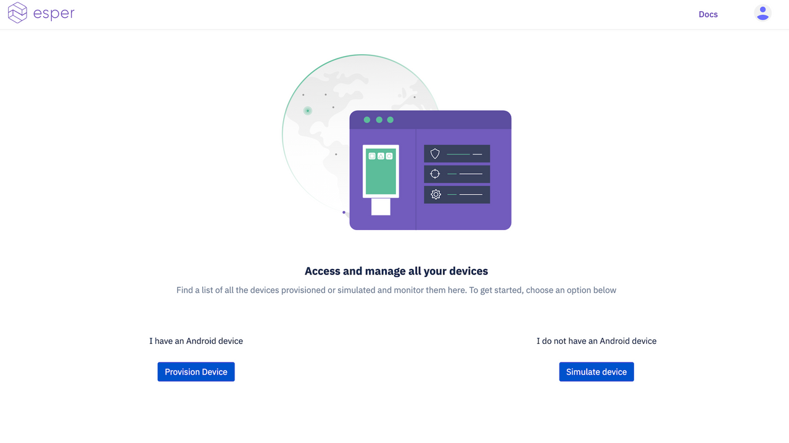

You can choose to provision a real Android device the details to which are provided in the [Provision Device](./console/device-provisioning/index.md) section of this documentation. Or you may choose to Simulate a Device. You will see a momentary "You are all set!" message after which a mock device will be available for you to experiment and play around with till you provision an actual device.

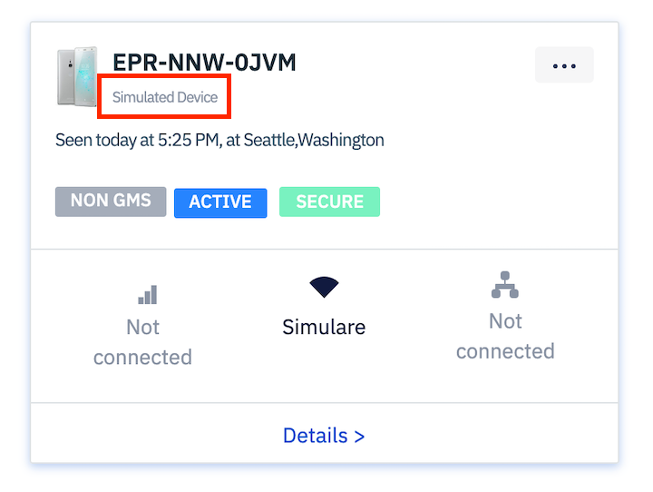

Simulare helps you explore the Esper platform without using a real device. We provide this simulated device to act as an actual device to help you experience the capabilities of our platform.

Capabilities such as Apps, Remote View and Capture log might not be available on a Simulated device.

This device is only available for new signups currently. Please note that trial accounts created on or after September 27, 2019 will have this feature enabled. Accounts created before that will not. Please reach out to us at support@esper.io if you signed up before September 27, and would like to try out Simulated devices.

### Categories

There are checkboxes on the top of the page with categories such as  that can be checked to view devices in each particular state 

- Active - currently online  
- Inactive - currently offline
- Under provisioning - devices undergoing provisioning 
- Devices with low battery - devices with battery under 30% charging
- Recently added devices - devices provisioned within the last 3 days
- Low risk devices - device with security status low
- Medium risk devices - devices with security status medium
- High risk devices - devices with security status high
- No risk devices - device with security status 'secure'

 See the [Security](https://docs.esper.io/home/console/device-management/-/#security) section to know how the security status of a device is determined

### Search

Search is provided on the top right where you can search for devices in Devices using the Esper assigned device code which is displayed on the device homepage.

### Device View

There are 3 types of viewing styles - grid, list and maps. The default view is Grid, but the user can click on list and maps to access the list view and the map view. 

Under the Grid view each device will be represented as tiles in the ‘Device management’ tab with a summary of all device information such as location, network, health, and risk status of the device. Click on  on the tile for any individual device to see further actions and changes that can be made for this device: 

### Grid View 

Under the Grid view each device will be represented as tiles in the ‘Device management’ tab with a summary of all device information such as location, network, health, and risk status of the device. Click on [Details](./console/device-management/-/index.md) on the tile for any individual device to see further actions and changes that can be made for this device:

#### Device Tiles

Devices which have been enrolled on to your Esper Cloud or are undergoing provisioning and have started communicating to the backend, show up as Device tiles in the grid view.

For example - 

This is a typical device tile that shows the device system generated name, device model, last seen time and location, online/offline status, gms/non-gms status, security status (secure), network connection and an option to see further details.

You will notice an ellipsis button on top right corner. Clicking on this brings up the following options - 

1. View device on map - Clicking this shows the exact location of the device on google maps like this - 

    

2. Add Tags - To make it easier to remember, we have capability to add tags on devices to easily identify devices in a location or type of device or wifi ssid or any other information we wish to keep tagged on the device.

    On clicking the Add Tags button, the following pop up appears - 

    

    Enter tags and click 'Add'. Note that maximum number of tags per device is 3.

    

    You may edit or delete the tags using actions. On clicking the edit (pencil icon) the text box lets you edit and Update the tag as shown below - 

    

    You may also click on the delete (trash icon) to delete a tag.

    

3. Remove from Group - This option only appears if the device is part of a group other than the 'Default Group'. Clicking this will simply remove the device from the group and make it a part of the 'Default Group'.

4. Device rename - Esper uses a unique Device ID to identify each and every device enrolled in Esper. This Device ID will be prominently displayed in the device tile and device lists. However many customers want to apply their own naming conventions for their devices. So we’ve added a new feature called Device rename that enables you to give each device any name of your choosing. It is an alias for customer purposes as we still continue to use the Device ID under the hood.

Click on Device rename and this dialog pops up enabling you to give it a friendly name, change the current friendly name, or revert back to the Device ID if you wish.

The new device name will appear in all views of Esper including the Device home screen moving forward after you change it.

Here are a few more examples of device tiles - 

Example 1- 
This is a device at high security risk highlighted in red. Its currently offline and supports Google Mobile services.
It is connected to wifi Esper-SSID. It was last seen on 12/10/2019 at Bellevue, Washington.

Example 2- 
This is a device is secure hence highlighted in green. Its currently offline and supports Google Mobile services.
It is connected to wifi JZSB. It was last seen on 12/06/2019 at Kuala Lumpur.

Example 3- 
This is a device at low risk hence highlighted in dark grey. Its currently offline and supports Google Mobile services.
It is connected to wifi Droidcon. It was last seen on 09/20/2019 at an undetermined location. It has been tagged with DroidConNYC indicating it was used to demo in Droid conference held in NYC. This is an example of how customers can use tags to identify and search their devices.

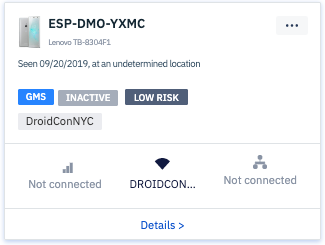

Example 4 - Devices listed 'Under Provisioning' refer to devices which are still getting provisioned (such as google app getting updated etc). These are devices that have not yet achieved the active status. 

### List View

 When the number of devices in a fleet crosses over into the 100s it is hard to view or sort them in the device tile view. With the new List View users can easily see a list of all devices available on the dashboard along with device information columns including online/offline status, serial number, group name, Android version, and andy tags. 

Search by device name can be used without having to click and enter into device details page to get detailed information about each device. 

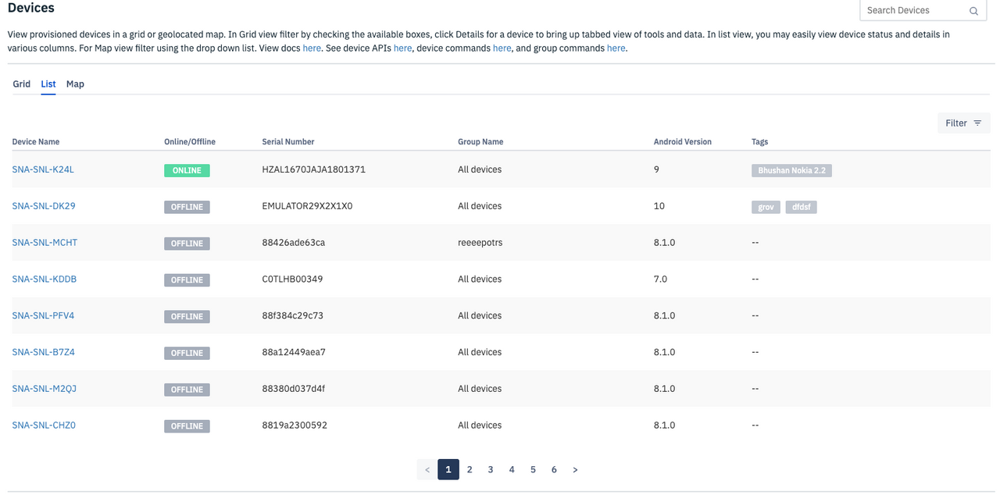

Each device name is a link that will take the dashboard user to the [details](./console/device-management/-/index.md) of that device.

This view gives the capability to filter devices via - 

1. Group Name 
2. Policy Name 
3. GMS/Non-GMS 
4. Network Type (Cellular, Ethernet, Wifi, Other)
5. Android Version
6. Registered Date
7. Online/Offline 
8. Security Status 
9. Last Seen

In the filters, a search capability has been provided to select values.
Currently, user can only filter by one value of each of above. For example, I can choose Group A, Policy B and Active which will give me a filtered list of devices in Group A which are active and have policy B applied on them.

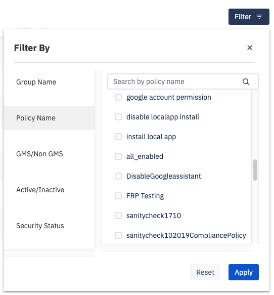

### Map View

Under the Map view, the types of devices can be chosen from the dropdown. Once selected, the device locations are show:.

Once you click on the cluster icon, devices in the cluster will appear. Upon clicking on the individual devices, device information will be displayed. Clicking on the device name will take the dashboard user to [details](./console/device-management/-/index.md) section of that device.

Another satellite version of maps that can be viewed by clicking `Satellite` is shown below - 

Device tiles can be viewed in satellite view as well by zooming and clicking on the device pins -

:::tip
Device name and group names are actionable links in the device tiles that show up on maps on clicking device pins. Clicking them will take user to the respective device and group details pages.
:::

## Groups

Using Groups devices can be sectioned into groups and mass actions can be performed on a group of devices. Users can perform mass reboot, lock, check heartbeat, apply a compliance policy, install/uninstall apps and OS updates on thousands of devices in one click using Group features. 

There is a pre-existing group called "All Devices", which is the default group where devices fall unless otherwise specified during provisioning via template.

### Creating a Group

You can create a Group by clicking the button `Create Group` on the top right. 

Enter a unique name and click Create. 

Once you create a Group, you have the option to add devices from the  default **All devices** group. To move devices, users can -

- click on the checkboxes on the left of the device that needs to be moved.  
- select all devices by clicking on the top checkbox. 
- search for a particular device by enter device code via Search box. 
- sort the device list by 'last updated'. 

Once the required devices are selected, user can click on `Add devices` to add the selected devices to the Group. Individual devices can be added by clicking on the plus sign on right end.

Devices can be moved back to All Devices by selecting checkbox and clicking on `Remove selected`. Individual devices can be removed by clicking on the trash button on right end.

Once the correct set of devices have been moved to the Group. Click `Save`. You should receive a message "Successfully updated the group" on the left corner of the dashboard. 

You should now view list of all groups created in tile view. We will know more about 'group tile' further below into this document.

Another way to create a groups is during [template creation](./console/device-template/index.md). In the group section on template, user can pre create a group such that any device provisioned using the said template will fall in the (created and) selected group.

Refer to Device Template->Group section for more information on this. 

### Deleting a Group

You can delete a Group by selecting one or many Groups using the top right button **`Delete group`**. 

- Click on `Delete Group` (shown in image below)
- Select by clicking on the groups you wish to delete
- Click on bottom right `Delete Selected Groups`  

### Refresh Groups list
There is an option to refresh groups screen by clicking on a button `Refresh` on the top right corner to view recent changes.

### Search Group

User can search for a group by typing the group name in the search box on top right. 

 
### Group Tile 
 
 The Groups are listed in tile view that contain show the group icon, name and number of devices in the Group.

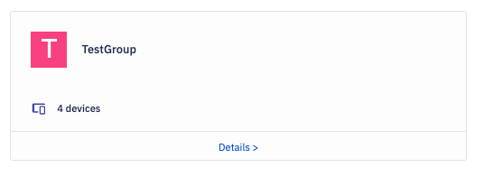

On clicking **`Details`**, you can take actions such as reboot, lock, ping, and wipe for the devices in the Group

There are 5 tabs under the Group Details - 

- Manage 
- Actions
- Compliance Policy
- Apps
- OS updates

1. **Manage** 

    This section is to view the `Device tile` of all devices present in the group. 

    

    The device tiles will show the following information for each device in the group - 

    - Device name
    - Device manufacturer
    - Last seen date, time and location
    - Active/Inactive status
    - Gms/Non-Gms
    - Risk Status
    - Ethernet, Wi-Fi and Cellular connection name and status
    - Link to device details

    See more about information about individual devices in the [Devices](https://docs.esper.io/home/console.html#devices) section on this document.

    There are six filters provided to sort through the list of device tiles based on the following categories - 

    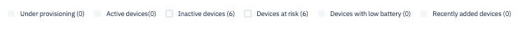

    - Under provisioning - Devices in the group that are currently undergoing provisioning
    - Active devices - Devices in the group that are currently active ie online
    - Inactive devices - Devices in the group that are currently inactive ie offline
    - Devices at risk - Devices in the group that are at high, medium or low security risk (See [Security](https://docs.esper.io/home/console/device-management/-/#security_) in [Devices](https://docs.esper.io/home/console/device-management/-/) for more information on how the security risk level of a device is calculated)
    - Devices with low battery - Devices in the group with battery percentage less than 15%
    - Recently added devices - Devices in this group which are provisioned in the time period of last 3 days

2. **Actions**
    The groups actions such as Reboot, Screen lock and Heartbeat can be applied on all the devices in a group as a mass action. 
    
    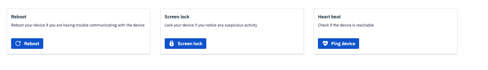

    Reboot - When the Reboot action is applied on a group, all active devices will receive the command to reboot. The live report generated will show the progress bar of reboot action on group and count of successful and unsuccessful attempts on active devices as well as the number of inactive devices as seen below- 

    

    On clicking "See details", a live status update of successful and unsuccessful devices and reason for failure appears in a sidebar such as follows -

    

    Refresh button can be clicked to get the latest update. Clicking on 'Success' will show details of succeeded devices and 'Failed' shows status of failed devices.

    Screen lock - When the Screen lock action is applied on a group, all active devices will receive the command to lock screen. The live report generated will show the progress bar of locking action on group and count of successful and unsuccessful attempts on active devices as well as the number of inactive devices in similar fashion as shown in images of the Reboot action.
    

    Heart beat - When the Heart beat action is applied on a group, all active devices will receive the command to report whether they are online (or alive). The live report generated will show the progress bar of 'ping' action on group and count of successful and unsuccessful attempts on active devices as well as the number of inactive devices in similar fashion as shown in images of the Reboot action.

    Wipe device - When the Wipe action is applied on a group, all active devices will receive the command to reset themselves to factory settings. The live report generated will show the progress bar of 'wipe' action on group and count of successful and unsuccessful attempts on active devices as well as the number of inactive devices in similar fashion as shown in images of the Reboot action.

    Push a WiFi access point - When a WiFi access point is pushed to a group, dashboard user will be asked to enter the details of WiFi access point.

    

    All active devices will receive the command to connect to the given WiFi access point. The live report generated will show the progress bar of the action on group and count of successful and unsuccessful attempts on active devices as well as the number of inactive devices in similar fashion as shown in images of the Reboot action.

    :::tip
    The groups actions will get applied on active (online) devices. The inactive devices currently do not get the command if they are not online at the time the action was applied.
    :::

3. **Compliance Policy** 
    A pre created compliance policy can be chosen from the drop down and applied to all devices in the group in one click. A preview of the chosen policy can be viewed under the drop down as seen below. 

    

    When a Compliance Policy is applied on a group, all active devices will receive the command to comply by the given policy. The live report generated will show the progress bar of application of policy on group and count of successful and unsuccessful attempts on active devices as well as the number of inactive devices as seen below- 

    

    On clicking `Show more` user can see the details such as name of active devices, model, current policy and last updated for Active as well as Inactive devices.

    Active device detail status for policy application-
    

    Inactive device detail status for policy application-
    

    Once the policy application process is completed, another line is added detailing the policy application failure on devices. This lists Device names, model and reason for failure as shown below-
    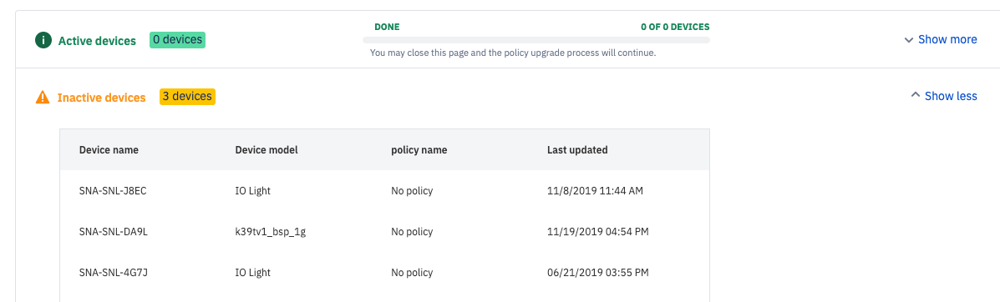

    :::tip
    The compliance policy will get applied on active (online) devices. The inactive devices currently do not get the policy if they are not online at the time the action was applied.
    :::

4. **Apps** 

    To address the need to manage app actions on fleet of devices, we rolled out our initial implementation of a robust App Unification feature on our Cloud backend which enables Esper to easily handle all types of apps and app-related actions for customers at the Group level.

    The app section in group has 3 sub sections- 
    1. Install/Uninstall
    2. Scheduled Install
    3. Approvals

    **Install/Uninstall**

    This section is used to install of uninstall **privately uploaded apps (also knowns as Enterprise apps) and Google Play apps** to the groups.

    To deploy a Google app or a private app to a group, go to Groups > Details for the group you wish to deploy the app on. Go to the Apps tab where you will view this screen.

    

    Choose between Install and Uninstall actions in the drop-down select app action. The Select App dropdown then shows a list of all uploaded private APKs and approved Google apps. 

    After selecting a version from the “Select Version” dropdown, in the 'App Details Preview', you can see under the heading 'App type' indicating whether its a private app (App type - Enterprise) or a Google app (App type - Google) as shown below. 

    

    Additionally, you can also view the app icon, app name, version number and package name of the app in this section. Clicking the Install button on the bottom right will deploy the app on the group.

    

    A collapsible sidebar will appear on the right showing the latest status of the install command fired on the devices in the group. Click on Success and Failed to view the device name, model and status of the devices that received the commands successfully and devices that failed to receive the command respectively. 

    

    It will continue to update the status over a period of 3 minutes after which you can use the refresh function to get the latest installation status from the devices.  

    Groups Uninstall works similarly as above if the App action chosen is 'Uninstall' in the dropdown menu.

    History of Groups App commands - 
    The history sections shows the history of the group commands for installation and uninstallation of apps fired on the group. 

    

    Details such as app name, action applied, app type, app version, package name and status can be viewed in columns in a paginated report. The Results column has a link to 'View' which can show the detailed report on the collapsible sidebar for successful and failed devices for that command. 

    Both the command history and detailed sidebar reports are refreshable manually by dashboard user.

    **Scheduled install**

    You may create a scheduled app install by clicking the `Create Scheduled install` button. Enter the App name, version, schedule the start and end date/time for the app install. Lastly, give this schedule a unique name and click "Create Schedule" to get started.

    

    You can also view scheduled app installation for Group along with start and end time.

    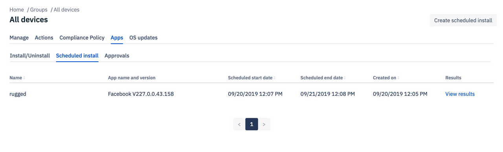

    You can click on **`View Results`** to see the number of successful and unsuccessful device installations:

    

    **Approvals**

    The approvals section is to show, hide or disable In-ROM apps (also referred to as Preloaded apps) on devices.

    The catch is that admin needs to enter the exact package name of the In-ROM app that they wish to approve or unapprove. The best way to get the exact package name of an In-ROM app is via an adb command as shown below - 

    `adb shell pm list packages`

    User should turn on adb for the device (physically connected via USB) from Device->Actions(Settings), authorize adb usage from the device and run the above command to get the exact package name as shown -  

    

    Once you have the exact package name of the In-ROM app you wish to execute the action on, go to Approvals section in Groups. The following screen will show - 

    

    There are three options here - Show, Hide and Disable. You may enter the package name and choose any of these 3 options. Click 'Apply'. 

    A prompt such as below will appear (in this example, we chose 'Show') - 

    

    Click 'Yes' and the group command status will start to show -

    

    Just like other group commands, click 'See details' to view the collapsible sidebar report - 

    

    Similar functionality is present for Hide and Disable actions for In-ROM apps.

5. **OS Updates**

This section is only relevant for fleet of Esper Enhanced Android devices.  

Here you can see a list of the Esper Enhanced Android updates that have been deployed on the current group with details such as build number, device type, number of devices, and date deployed along with an option to view results.

By clicking on the **`Deploy OS Updates`** button you may choose any available Build number by then clicking on **`Select Build`**.

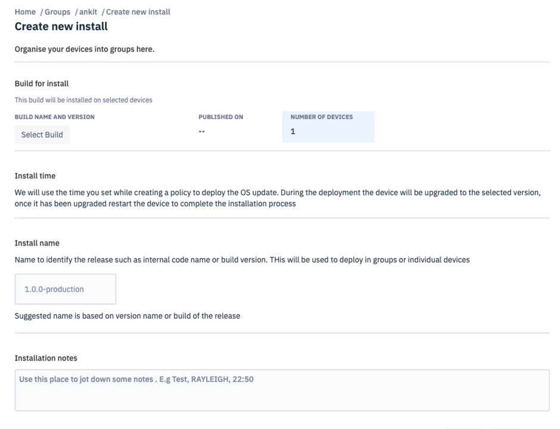

:::tip
Please note that currently only the latest 30 builds of the Esper Enhanced Android updates will be visible to the user for deployment
:::

The **`Number of devices`** will populate with the devices in the group on which this update is applicable; this pertains to those that have an OS build version lower than the selected version for the deployment:

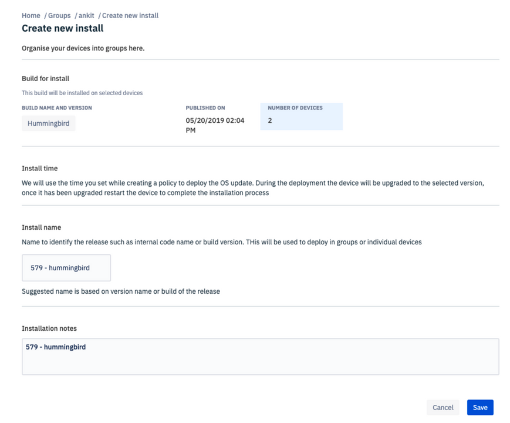

You may add the installation name, any pertinent notes, and after that click **`Save`**:

Coming Soon! 
In a future update users will have the option to choose the time window for their OS update installation.

## Apps

This section enables you to manage your applications. You may add the following type of apps to your device:

1.  Upload Private Apps (APK files) to the Esper Cloud.
2.  Install Google Play Apps after [approving](./console/device-template/how-approve-google-play-store-app/index.md) them.

:::tip
To approve In-ROM apps or Preloaded apps in a device, you may do so from template during provisioning or post provisioning from Groups->Apps->Approvals section.
:::

### Upload Private Apps (APK files) to Esper Cloud:

- You can upload your own mobile app through an APK file using the upload button on the top right hand corner.
- There are some rules that the uploaded app must adhere to in-order to succeed upload and provisioning -

  1.  The APK has to have a unique version name and number.
  2.  Max size - 500 MB
  3.  Extension - .apk [only]
  4.  APK Signature verification
  5.  The app should not set itself as the default launcher. This will cause conflict with the Esper Agent(DPC).
  6.  Latest Android APK standards (currently we allow APKs without icons)

- You can upload your own android app APK file using the upload button on the top right hand corner
- The uploaded apps will be shown under the 'Uploaded apps' section:

When you click on any private app, it will open the details of the same. For example in the below screen, you may see details of the Zomato (uploaded) app. It shows the following details -

1.  Name of the app
2.  Package name
3.  App icon (if parsable)
4.  Version number (for each version). Note that the same app can have various versions.
5.  Number of devices the app is installed on
6.  The date the app was uploaded on
7.  Size of the app
8.  Compatibility with SDK version
9.  App description  - We now have a new field for you to add your app version specific description or release notes.

In the above image, you can see ellipsis (3 dots) under Actions.

Here is another example of an app with description -

On clicking the ellipsis under Action, user has options to:

1.  Delete the app version
2.  Edit description  - You can now add and edit description or release notes per version of the app. 

    A description can also be added during app upload.
    

3.  Download the app version

### Install Google Play Apps after [approving](./console/device-template/how-approve-google-play-store-app/index.md) them:

- You can also allow a user to download apps from Google Play Store.
- This requires approving a specific app from the Play Store to allow a user to download the app on their device:

- You also have the option to handle new 'App Permission Requests' for the approved apps. You can:

1.  Approve the requests for new app permissions so that users can update the installed app.
2.  Revoke the requests for new app permissions so that users cannot update the installed apps.

3\. You can set the option to receive email notification whenever an app requests new permissions by adding the appropriate email address or addresses in the notification settings:

- You can then select the device you want the app to be installed on by clicking on the 'Select option' and then 'Select the Device':

- Once the app is installed on the device, a notification shows up indicating the app was successfully installed:

- You also have the option to update or uninstall the app from a specific device:

- You can unapprove the app from all the installed devices by clicking the 'UNAPPROVE' button.     <i> Note: Unapproving an app does NOT mean uninstalling it. If the app was approved earlier, it will continue to stay installed in your device until it is explicitly uninstalled. Post uninstallation, if it has been unapproved, user/admin will not be able to uninstall it on the device.</i>

- You can also see all the approved Google Play Store apps under Play Store section:

## Play for Work

Learn about setting up Play for Work apps using Esper.

- Play for Work gives you access to the Enterprise version of Google Play.
- Here you can either APPROVE or UNAPPROVE applications that can be downloaded onto your dedicated devices. After an app is approved it be visible on Google Play for device installation:

### Approve an app

- Approve an app by clicking **APPROVE** button.

- Upon clicking APPROVE a pop-up will appear:

- Via the pop-up you can set app permission requests:

- Upon clicking SAVE, your settings will be applied to the app. The dedicated device user can then access it from the Play Store within the given app permission requests:

### Unapprove an app

- Once you click UNAPPROVE, the access to the application is removed from user’s Google Play account:

- Click the OK button to remove the application from user’s Google Play account:

- After clicking OK you will get a message indicating that it was successfully UNAPPROVED:

### Approval settings

Upon clicking OK you will see a pop-up showing the APPROVAL SETTINGS tab and NOTIFICATIONS tab. Choose the desired APPROVAL SETTINGS:

### Notifications

sets up email notifications for anyone requesting new permissions to the specified email address or addresses:

You have the option to decide which of the apps are to appear on the device Google Play Store. Go to the Play For Work section and choose the option Organize App-

Any app added in the collections on this page will show up on the Google Play Store app on the device - 

## Alerts

Learn about available Alerts.

User Alerts to monitor the performance of your devices. You can create a device alert that watches a single metric:

- The alert performs one or more actions based on the value of the metric relative to a threshold over a selected time period.
- Choose an alert, the **set condition**, the **name** for the alert and then click on **'Create alert'**:

_Delete icon_ - this to delete an alert:

## Compliance Policy

Policy is a standard set of rules or permissions that are related to security of the devices and apps that admin can apply on the devices to be provisioned via template. Admin may set default app permissions, Android setting app, system updates, password rules, and turn on the toggle buttons for the settings he/she wishes to enable on the devices.

- A new policy is created and can be deployed on any device.
- The new policy gets listed on the **'Compliance Policy'** page which can be edited or deleted as required:

### Create a policy

Click on `New Policy` to start creating a new policy.

Dashboard users and admins create policies in a context, for example a compliance policy for any device operating at retail outlets in Texas. The description box enables the context to be associated and saved with Compliance Policies.

Below is a list of features you can turn on or off in the policy section. These are part of our standard Compliance policy that can be configured and reapplied as per requirements of the customer after provisioning.

### Available policy options

1.  Device Password Rules - If you choose alphabetic or alphanumeric, a minimum password length can be entered. The default minimum password length is 4.   The Password rule is a policy that specifies the rules for the device unlock password that users can set.

    Alphabetic: Restricts acceptable password to contain only alphabetic characters (A to Z) in both upper and lower case.

    Alphanumeric: Expands from Alphabetic to also include numbers and special characters.

    None: There is no password required to lock the device.

    The password for a device is setup during the initial setup of the device by the user.

     

2.  Default App Permission  

    Default app permissions determines enforcement of the runtime-permission rule across all the apps on a device (e.g. Gallery, Camera).

    Allow automatically: This rule will grant all the permissions any app requests without showing a prompt to the user.

    Ask user: This keeps the default behavior intact with regards to permission management. All apps on the device will show a prompt to the user to request permission. For example, by choosing this option then every app will ask the user each time before accessing a device module with a message such as “Allow app X to access Gallery? Allow/Deny”

    Deny automatically: This rule will deny any permission request from any app on the device. 

3.  System Updates  The System updates option allows you to enforce a system update policy on the device when a system update/OTA update is available.

    Update automatically: Enforcing this rule will install any OTA update automatically and reboot the device without requesting the user.

    Postpone installation: This option postpones installation of an OTA update for 30 days.

    Windowed installation: This option allows you to define a time window during a full day period inside which the OTA update will be installed.

      

4.  Android Settings App  Android settings app determines how users can access the Android device settings. There are three options to choose for the type of settings app to be made available on the device as follows - 

    _Default setting app_: Selecting this will show the icon for the default Android settings app. Clicking this icon will take the user to the default Android settings.

    _No settings app_: No icon for any settings app will be available for the user to choose from the device’s dashboard.

    _Esper settings app_: Esper offers a custom Settings’ app that limits the user to only a subset of the available Android settings. This app is made secure via the Esper settings app password protection. Settings provided via this app are limited to:
    1. Changing the Wi-Fi Access Point

    2. Enabling the “flashlight” if there’s a camera flash LED on the device

    3. Control the display orientation of the device.

    4. A robust means for users to be able to factory reset their device irrespective of the policy. 
        
    5. About - We have added information regarding provisioning endpoint in the about section for the user to be able to view the endpoint name the device is registered in, in case they have access to multiple endpoints.
        
    6. Kiosk app - An option to switch the kiosk app from this menu. User can choose any installed app on device to act as the kiosk app.
        
    7. Esper Branding - User can turn off the Esper logo in case they wish to use their own logo as a reseller of Esper platform.
        
    
    

     

### Google Account Restrictions

 This feature gives users an option to restrict the number of Google accounts that can be added on the device and be used with Google apps such as Gmail, Google Play Store, Youtube etc. By default, the addition of any number of accounts is allowed, however, if the admin applies a Compliance policy by checking the box shown below, the number of allowed accounts will be restricted to the admin entered value. For example, if the admin has set it to 2, after adding two accounts on the device, further addition (or deletion) of accounts will not be possible unless a different Compliance policy is reapplied.
Note: If user has not checked this box in the applied policy, it is recommended that they disable Google Play Store to prevent installation of unapproved apps.

:::tip
The Google Account Restriction feature is applicable only to GMS android devices ie the android devices that support Google Mobile Services.
:::

### Factory Reset Protection  

_FRP Toggle Button_ - FRP or Factory Reset Protection enables you to lock your device if a user tries to factory reset it via soft/hard keys. In case of a factory reset, the device will get locked and will only be reusable by a pre-authorized google account ID. See Policy section in docs to know how to get your google account id. Note that this feature is only available on android versions 5 and above.  

On turning on the FRP button, user needs to enter the Google ID of the account they wish to authorize to enable usage of the device post factory reset.   See [here](./console/policy-management/getgoogleaccount.md) to know how to get the Google account ID of your account and how FRP protects your device.

Other Compliance Policy Toggle Buttons- 

1.  Lock Screen  If Locked screen is switched ON, it enables the default “lock screen” to be displayed upon a screen timeout as specified in the Settings section. If it is enabled, the user has an option to set the password rule in the dropdown above.  
2.  Safe-Mode Login  Turn Safe mode login On to allow users to boot to safe mode on their device. Leave Off to prevent Safe mode login. 
3.  Factory Reset  Factory reset dictates whether or not the user can perform a factory reset on the device. Turning it Off prevents a factory reset by the user. This is not inclusive of the hard key factory reset.  
4.  Notification bar  Notification bar dictates whether or not a user can swipe down to display the notification bar. Turn On to enable access to the Notification bar.  
5.  Screenshot  Screenshot allows or prevents a user from taking screenshots on the device using available screenshot actions. Turn On to allow screenshots.  
6.  USB connectivity  USB connectivity allows or prevents the user to be able to communicate via USB on-the-go. Turn On to allow.  
7.  SMS  SMS controls the ability of the device to send or receive SMS. If it is turned Off it prevents the device from using SMS regardless of which SMS app is used. Turn On if you wish to enable the device to send and receive SMS.  
8.  Outgoing calls   Outgoing calls determines whether a user can make outgoing calls from the device. Turn On to allow outgoing calls, turn Off to prevent.  
9.  Camera Access  Camera access allows or prevents a user to access the device’s camera. Turn On to allow. 
10. NFC   NFC controls the device’s ability to use NFC if it is supported by the device. Turning Off prevents the device or any app from using NFC. Turn On if any of your apps require NFC.  
11. Google PlayStore  Google PlayStore determines if the Google PlayStore app is available to the user on the device. Turn On to allow the user access to the Google PlayStore of admin approved Google Play Apps. 
12. Wifi   Wifi can be turned off on the device if there are other type of networks such as cellular present on the device. In case on no network availability, the Wifi policy will auto switch to on in-order to ensure the connectivity of the device with the cloud.  
13. USB tethering  USB tethering specifies if the user is able to use their device to share a mobile connection to another device such as a laptop 
14. Edit date and time  Edit date and time determines if the user can change the date and time on device. Turn On to allow changes by the user.  
15. Application uninstall  For devices running Android 4.4 or 5.1, turning this setting On will block app uninstallation, especially important for private apps. This setting is not needed if you are running Android 6.0 or above.  
16. USB File transfer   Turning off USB file transfer will prevent the user from transferring files from the device to a computer and vice versa using a USB cable 
17. Google Assistant    Enables/disables voice command via Google Assistant. Available only for Android devices supporting Google Assistant. For example - If you wish to have Google Play Store show up on the device, you may turn on the toggle button.  
18. Local App Install This feature allows installation of apps from unknown sources on the device. To enable this on the device, the user needs to follow these instructions. Settings->Apps and notifications-> Special app permissions ->Install Unknown Apps and choose the route they wish to install the apps from. For example, if device user chooses Chrome, they will be able to download and install apps from the Chrome browser on the device. If turned Off, the device user will not be allowed to install apps from any unknown sources. 

  

Checkbox-  `Restrict outgoing/incoming calls using customised dialer.`  

If clicked, this opens up two more checkboxes- 

1.  `Restrict incoming calls to uploaded contacts only <upload a CSV file of allowed contacts>` 
2.  `Restrict outgoing calls to uploaded contacts only <upload a CSV file of allowed contacts>` 

In order to restrict phone numbers that can make or receive calls to the device, upload a .csv file with the allowed phone numbers. 

:::tip
All numbers must be preceded by +country code (for example +1 for US). All numbers must be separated by comma.
:::
  

ADB - Google defines ADB as “Android Debug Bridge (adb) is a versatile command-line tool that provides access to Unix shell to communicate with an android device.”
 
If checked in policy, dashboard user may turn on ADB via Dashboard Settings for a configurable time period.  If unchecked, ADB can not be turned on from Settings.
 
NOTE: We NEVER allow turning on ADB from device end for an Esper provisioned device.
 
 

 
 
Here is how the Compliance Policy page of the Dashboard looks like -
 
 

 
 
You may reset these values to default at any time by clicking `Reset to Default` button at the bottom.
 

## Reports

This sections lets a user get daily and customized reports of activity of devices and groups of devices.
There are two sections to reports - 

1. Daily Reports
2. Custom Reports

**Daily Reports** 

These get generated on a daily basis as shown below - 

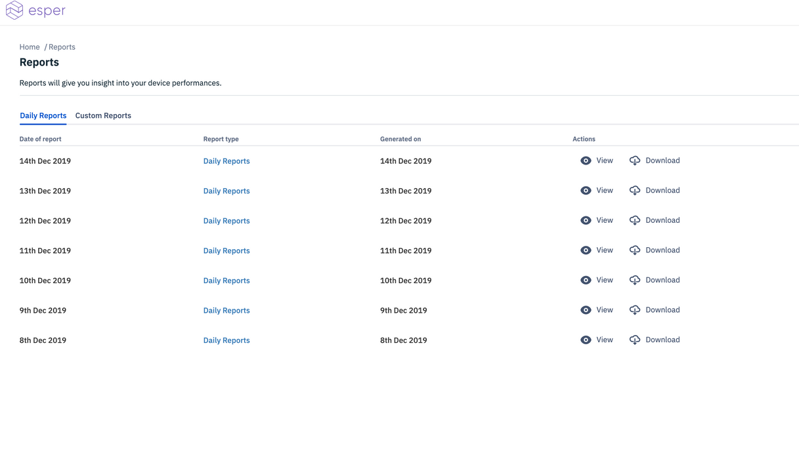

It generates the following information - 

- Date of the report
- Report type
- Option to View
- Option to download in pdf, excel or csv formats

Clicking on View or Report type will take user to a detailed view of the daily report - 

Here, the following information is shown - 
- Number of Registered Devices
- Peak number of active devices
- Newly provisioning devices

Additionally, you may see for each group - 
- Number of Registered devices
- Number of Active devices
- Number of Inactive devices
- Newly provisioned devices

on clicking the '>' sign, user can view devices wise details as shown below - 

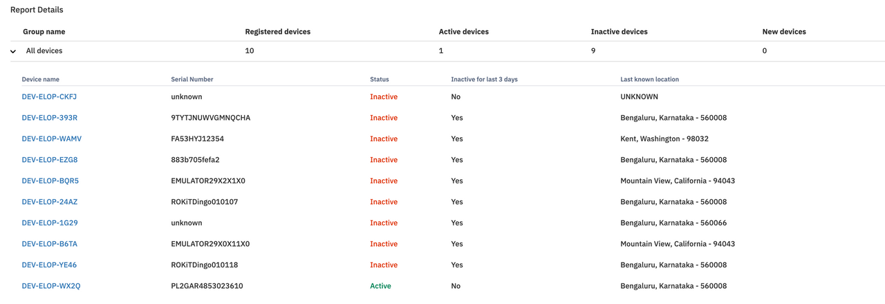

Listing the following details per device - 

- Device name
- Serial number
- Status
- Inactive from last 3 days (yes/no)
- Last known location

Here is a preview of a downloaded pdf version of daily report - 

This report lists all the information shown above for the chosen date in an easily downloadable format.

**Custom Report**

Dashboard admin user also has the option to generate a group wise custom report that is spread over a chosen period of time. Admin can choose start and end date to generate the report as shown below -

Following information is required- 

- Group name to be chosen from dropdown
- Start date
- End date

Finally, clicking on Generate report will bring up the custom report to the user as follows-

This report has the same information as daily report but for the specified dates and group.

## Geofence

Now in Esper - Geofences! Geofencing is a useful feature for some dedicated device deployment scenarios. With geofencing you use the device’s location typically generated by GPS to trigger an alert when the device enters or leaves a defined area. Common scenarios include making sure a fleet of delivery devices stay in their delivery zone, warehousing devices don’t stray far from the warehouse, and restaurant ordering devices don’t leave the restaurant.

In order for geofencing to work, the mobile device needs internet connectivity and location services enabled. Thus this is typically for cellular connected devices with high accuracy location services enabled - whether smartphones or tablets.

Setting up a geofence for a device is easy - it starts by selecting Geofence in Esper Console left navigation pane - this brings you up to a wizard for quickly defining the geofence. Click on `New Geofence`:

In the first screen you define the size of your geofence (meaning where you expect any devices to be for this geofence) - it is a circle that can be as small as 100m radius up to 10km. Note that GPS can drift and jump, thus a geofence smaller than 100m can cause false positives. To set it up at a location simply type the address for the center of the circle, or drag it in the map view to set it up. Give it a name and description, and then click `Next`:

Now you assign devices to this geofence - you can do as many as you need that fit the criteria for the geofence. In this case we are just doing one:

Now you define the action to be taken when any of the assigned devices leave the geofence - you can either lock them, have them beep, or both. In this case I went with beep!

If you chose to Lockdown the device, you will see the following screen if the device is taken outside the geofence boundary -

You can see for Geofence applied Devices if they have left or entered the Geofence in the Event Feed section: 

That’s it! It looks even easier in our [video](https://youtu.be/UkTwhFRTwgQ) Give it a try and let us know what you think, andi@esper.io.

:::tip
Note: The performance of Geofencing feature is dependent on accuracy of in-built GPS of devices. Additionally, ability to track location of the device is also dependent on WiFi, Bluetooth, cellular connectivity and internet of the device. This feature is not supported for Android version 4.x.
:::

## Pipeline

Introduction:

Esper Pipeline feature enables users to ensure smooth deployment of actions (including app installation) on large fleets of remote devices by defining stages constituting of operations, installations, tests, and wait time that are executed when a defined trigger occurs, such as when a new version of the app is uploaded. Only after succeeding in the above stages on test devices will the action get applied on production devices, hence ensuring a smooth deployment via a pipeline of stages. The initial version of the Esper Pipeline supports only the app installation operation and requires a 5 second or more break between the deletion of stages. 

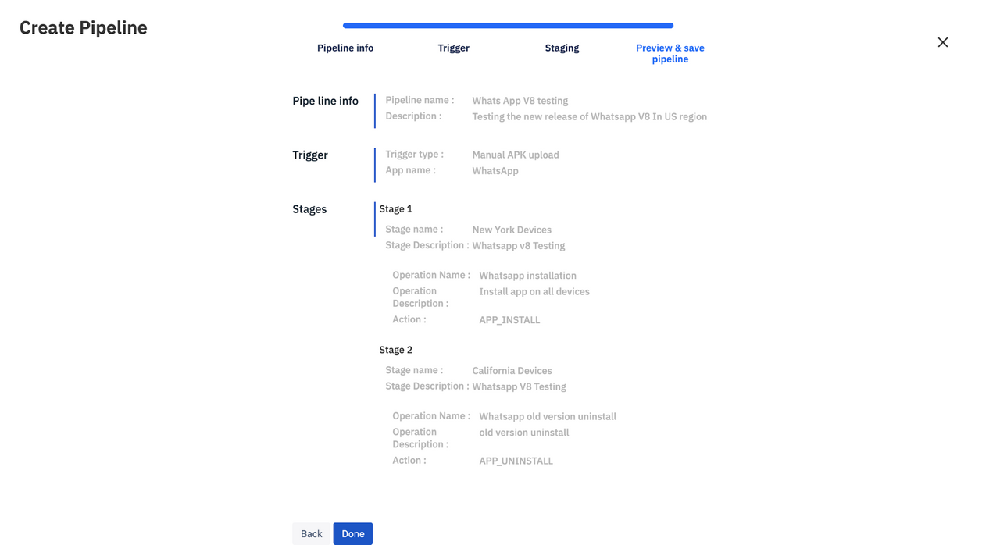

Pipeline has the capability to create n number of stages or operations for automating tasks. Different sets of tasks can be automated by creating pipelines & reduce the manual work to do it one by one.

V1 design, will do some limited operations & limited pipeline capabilities.  
 
Example use case: 
Let us consider a use case where enterprise wants to deploy app Ant v1.145 to their device fleet of 1000 devices deployed in Texas. It is very important to them that the deployment of the latest version of app Ant is smooth and without any errors. So they use pipelines to test this Ant v1.145 on various devices in different stages, they also ensure that it continues to run for a few hours on each set of devices and so on. Pipeline feature helps them easily plan the stages of tests and various operations that this app version has to succeed through before it is approved to be deployed on the fleet of production devices in Texas.

Steps Of Pipeline: 

Create A Pipeline

Pipeline info : Name a pipeline & give description if any.

Trigger: Define a trigger which is an operation that sets off the pipeline in motion. Any time the defined trigger occurs, either via dashboard or via an api call or cli command, the pipeline will automatically start running. For V1 we currently only support the trigger where a new app version is uploaded. 

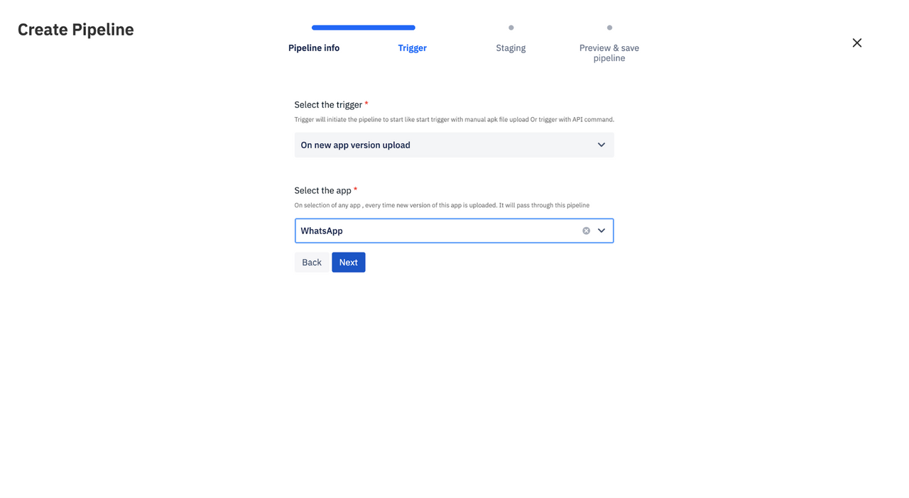

 Stages: Post trigger, you need to define stages of the pipeline. For each stage, a name & description is given first, then you have to add operations that are to take place. For each operation, define name & description, operation type and finally, select a group of devices on which the operation will occur. For now operation is Install app or uninstall app. Users can create any number of stages as per their use case.

 

 
 

Preview & Save : Once user is done with above three steps they see the final preview & saves the pipeline & the pipeline will be created.

Pipeline can be edited later at any moment as per the use case or we can add or remove stages .

 
## Company Settings

Learn about Esper's Company Settings.

- Company Settings enables you to set your company details by clicking on the **Edit profile** button on the top right hand corner:

- You are required to fill in your **company information** including:

1.  Registered name
2.  Location
3.  Name
4.  Zip code
5.  Email
6.  Address
7.  Phone number

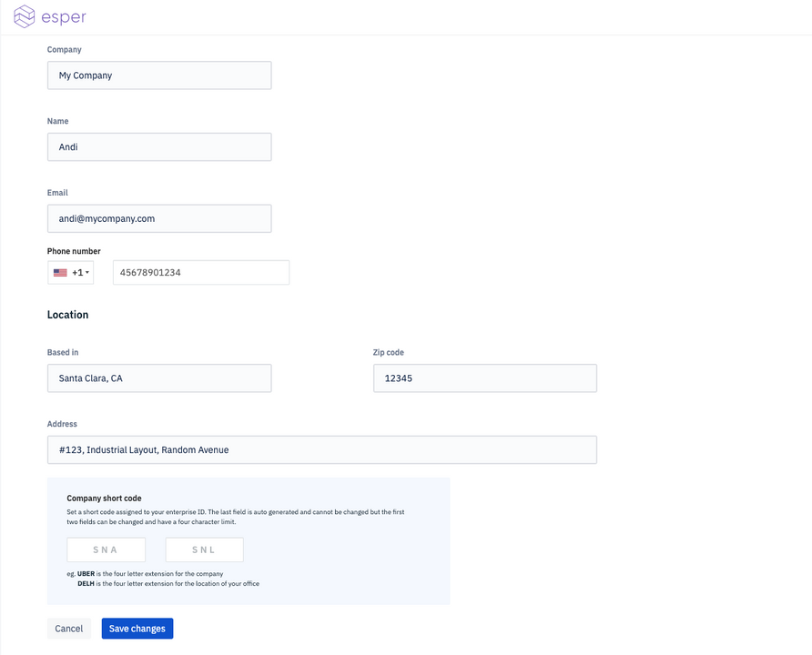

An important feature that allows you to have some control over your device name prefixes is present in this tab. The last section Company short code allows you enter 3 letter short codes for your company name and location/area for the devices. For example if I set my company short code as ESP-BNG, all my devices will have the prefix and will have names such as ESP-BNG-2345 etc. The ESP here signifies my company name and the BNG is the location.

**Important**: If you will be using apps from Google you will also need to enroll your company's Google Play account:

Know how to enroll into Google Play Services [here](./console/company-setting/index.md).

## OS Updates

### Over-the-air updates for Esper Enhanced Android.

You can update the Esper Enhanced Android version using our OTA functionality. Currently, we are only showing the number of devices the build version has been applied to; this also includes the publish date and size. To deploy a new available build on a group, the user can go to [Group->OS Update](./console/group-management/index.md). See the Group section for more details.

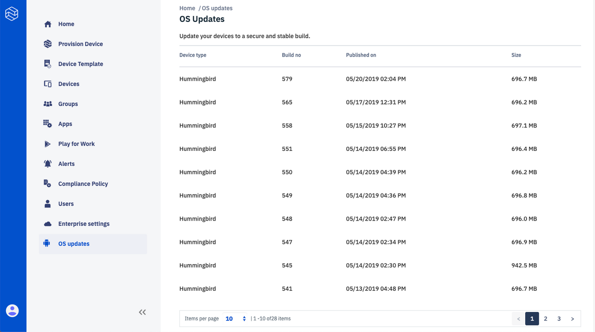

:::tip
Please note that currently only the latest 30 builds of Esper Enhanced Android updates will be visible to the user for deployment.
:::

## Developer Options

### Turn App and Device Management into Code

Esper is focused on helping Android app developers build, deliver, and maintain Dedicated Device applications - whether a restaurant kiosk, retail POS, or logistics hub. We have made our APIs available to Android developers worldwide so they can move rote app and device management actions into reusable code. Anyone can use our APIs to build, orchestrate, and integrate elegant solutions based on their business requirements. We do the heavy lifting by taking care of the infrastructure, so app developers can focus on building great solutions rather than being bogged down in app and device management. We help you procure efficient hardware along with the optional secure, optimized Esper Enhanced Android and our open source APIs and SDKs. We also offer the Esper Plugin for the Android Studio with tools improving the challenging task of app diagnostics - including working with deployed apps running on dedicated devices in the field. Check out [https://esper.io](https://esper.io) for more information about our rich feature set.

To kick things off, you need to generate an **API key** that you can tie to a specific application - it is your choice on how you want to manage your API keys. Do this by clicking the **"Register App"** button. You can also easily copy the Enterprise ID, necessary for API calls, by clicking on the copy icon next to Enterprise ID on top right of this section.

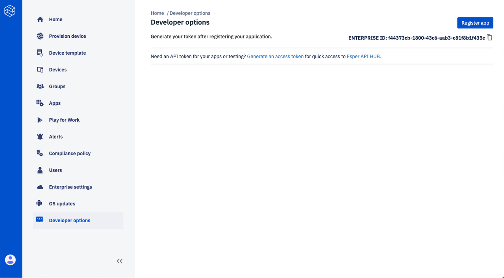

Next, you need to enter a unique app name and description(optional) and click **register application**.

Click Generate Token. This will generate a unique **OAuth-based API key**.

You can then copy (or renew if needed) your API key.

The **API key** and **Enterprise ID** can be copied from the dashboard as shown above and can be used to access our [CLI platform](https://github.com/esper-io/esper-cli) as well as to use the [SDK/API](https://api.esper.io) (api.esper.io) in your development and management systems.

Checkout the relevant documentation on the top right of this page by clicking on [Developer Hub](https://docs.esper.io/) and [API Documentation](https://api.esper.io/).

## Secure Remote ADB

Developer should be able to debug their devices remotely without even physical association with the device. ADB is android tool that help you to get take actions on the device, get the device or application logs and help you in resolving customer or in-field issues right by sitting remotely in your office.

This document tells you how you can remotely connect to device via secure adb channel. We will be using esper-cli command line tool which internally uses [esperSDK](./pythonsdk.md) [APIs](https://api.esper.io/) to provide the secure access between your host machine and device.

Remote access to the device can be done from anywhere in the world using espercli and doesn't have to be in the same network.

### Steps to connect to secure remote adb:

1.  On to Esper Dashboard `https://{{ esper_tenant_name }}.esper.cloud`, Go to `Devices` tab, then to your device and to `Actions`.

2.  At the bottom of the page, Click `enable adb`.

3.  On to your android device, connect via usb cable and enable adb over tcpip by following command:

        adb tcpip 5555

4.  Disconnect usb cable from the device. You should be able to connect adb via port 5555 over tcp

5.  Setup [esper-cli](./espercli.md) and configure for your environment on to the host machine.

    - Check your espercli version: espercli -v

            #espercli -v
            Esper CLI is Command line tool for the Esper APIs:  0.0.5
            Cement Framework 3.0.2
            Python 3.7.3
            Platform Darwin-18.0.0-x86_64-i386-64bit

    - Make sure it is >= 0.0.5 to use secure-adb feature.
    - Upgrade to the latest version of espercli using the following command:

            pip install -U espercli

6.  Copy your device id from esper dashboard information tab or from your device bottom left most. It looks like SNA-SNL-1234.

7.  Use espercli to connect to Device:

        #espercli secureadb connect -d SNA-SNL-1234
        Initiating Remote ADB Session. This may take a few seconds...
        Secure ADB Client
        Please connect ADB client to the following endpoint: 127.0.0.1 : 62945
        If adb-tools is installed, please run the command below:
        adb connect 127.0.0.1:62945

8.  Now connect your device via port number obtained above on localhost.

        adb connect 127.0.0.1:62945

9.  You are connected to adb.

:::warning
Now onwards until device is rebooted, You would be able to connect to the device remotely using espercli. Post reboot you have to do Step 1-8 again
:::
