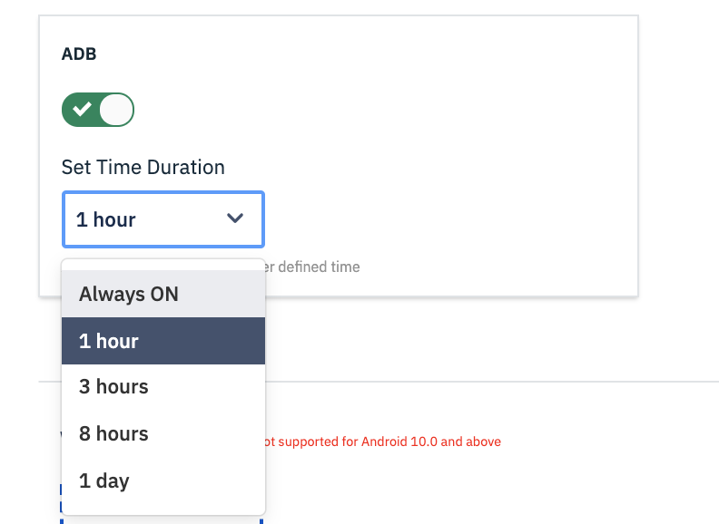
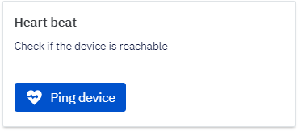
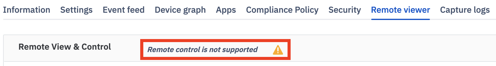
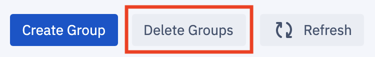
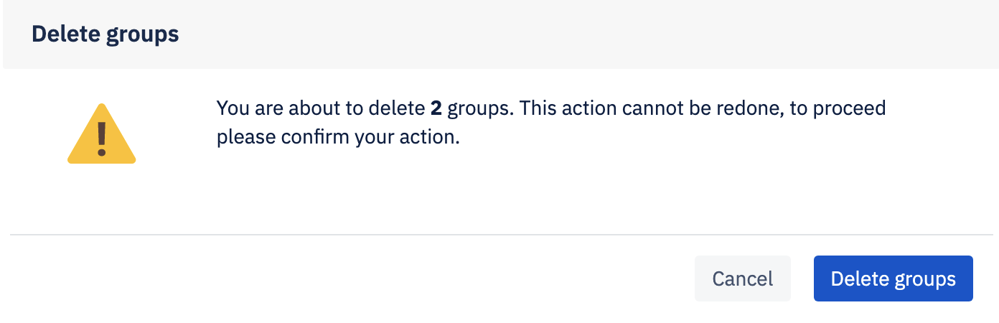
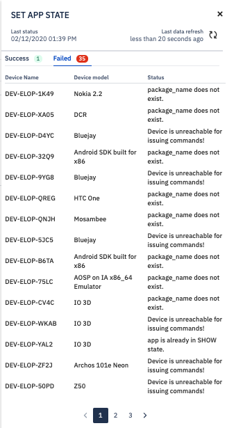
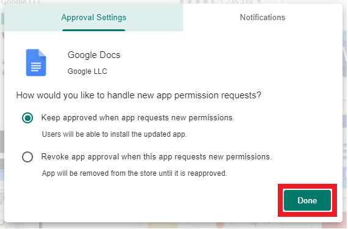
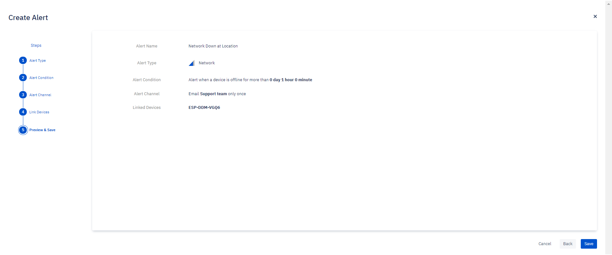
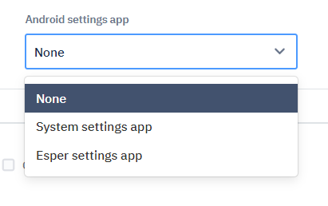
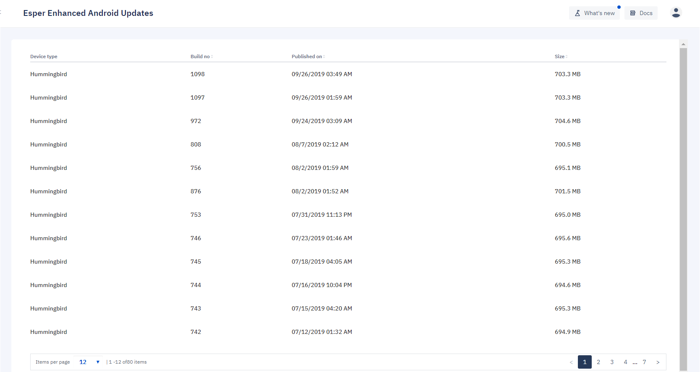

# Esper console

The Esper console is a feature-rich user interface for you to operate and manage your fleet of Android devices. Esper provides a range of options to deploy company‑owned devices at scale.

## Static Interface Elements

### Navigation Bar

No matter where you are in the Esper Console, there will be a navigation bar along the left side of the screen. This enables you to quickly navigate to each of the other sections in the Esper Console. These sections are:

   - Dashboard
   - Provisioning Methods
   - Provisioning Templates
   - Devices
   - Groups
   - Apps
   - Alerts
   - Compliance Policy
   - Reports
   - Geofence
   - Pipeline
   - Company Settings
   - Esper Enhanced Updates
   - API Key Management

At any time, you can collapse the full Navigation Bar displayed by clicking on the chevron ('<' icon) at the top left side of the console, directly to the right of the text that says, 'Dashboard.' After collapsing the Navigation Bar by clicking the chevron, the Console will display only graphical icons for each item listed in the Navigation Bar. Clicking on the chevron again will expand the navigation bar and display the names of each menu item again.

### Feedback Widget

No matter where you are in the Console, clicking the blue 'Feedback' button at the bottom right corner of the Console will allow you to share detailed feedback with the Esper engineering team. Clicking 'Feedback' also allows you to report any issues you may encounter while using Esper Console without leaving the screen.

Clicking **Feedback** brings up a screen with the following tools:

   * Box tool – Highlight a specific area of the page and comment on that area. If you prefer not to leave a comment, simply leave the box outline highlighting the Console area you would like to draw attention to.
   * Blackout tool – Blackout any sensitive information on the screen.
   * Pen tool – Draw anything you like! Circle and Point works great with a touch screen and pen.
   * Line tool – Underline, strikethrough, draw a straight line.
   * Line with arrow tool – Point to something.
   * Comment tool – Drop a pin and make a comment.
   

When you’re ready to submit your feedback, click on the checkmark to the right of the toolbar. This will bring up a pop-up box that will enable you to select a feedback category and fill in your comments. To submit your feedback or comment, click 'Send.' Your feedback will go directly directly to Esper’s engineering team, who will then add it to our feature and issue tracking system.

### What’s New Button

At the top right of the screen is the **What’s New** button.

When you click it, a panel will slide in from the right side of the screen. Scroll through it to learn more about updates and improvements to your Esper experience.

### Toast Notifications

Most notifications on your Esper console will appear as toast notifications at the bottom left corner of your screen. These notifications disappear after a few seconds. If you prefer, you can click on the 'X' to dismiss them. If there are multiple notifications queued, click the 'X' of the topmost notification to get to the next one in the queue.

***Tip: These types of notifications are called "toast notifications" because they pop up like toast from a toaster.***

### Informational Slider Screen and Dropdowns

Many actions in the Esper console can be carried out on multiple devices, and are applicable across a wide variety of situations. Some devices may be offline, or have poor internet connectivity. When these types of actions are taken, a status screen will slide out from the right side of the Console, showing the status of the action on each of the devices on which it is being executed.

You will encounter these slider screens frequently as you use your Esper console.

 
Some operations, for example, installing a new version of your app after hours across thousands of devices, can be performed in a matter of hours, while some may take days. Fortunately, you don’t need to watch the status screen the whole time an operation is running. To force an update to the overall status displayed on the slider, click the 'Refresh' button in the upper right hand corner. To exit a slider, click the 'X' next to the 'Refresh' button. You can then return to the slider by clicking on the link or button associated with that action. 

For certain operations performed on a set of devices in a group, a popdown will appear on the screen. This gives you a quick summary of the top level status, with an option to open up the accompanying detailed slider screen.

### Logging Out

To log out of the Console, click on the user icon at the top-right corner of the screen and select 'Log Out' from the drop down menu.

   
### Users

Esper’s user management functions can be reached by clicking on the user icon at the top-right of the screen, then selecting **User Management** from the dropdown menu.

Click on **User Management**.

***Tip: Access to this page is only available to those with Enterprise Admin roles, those with other roles will not see the User management option in the drop down.***

There are four main roles for Esper Console users: *Enterprise Administrator, Enterprise Viewer, Group Administrator*, and *Group Viewer*. When setting up a Group, be mindful that each role has different permissions. Enterprise Administators have the highest level of permissions, and are able to view or change anything, while a Group Viewer has far less permissions, and can only view tasks having to do with the devices and groups which they have been assigned permissions in.

The privileges and permissions for each role are as follows:

### Adding a New User

To add a new user, click on **New User**.

Enter the new user’s name, username, email, and password. Re-enter the password and click **Next**.

Select the new user’s role from the dropdown menu.

If you’re creating a Group Admin or Group Viewer, assign to the appropriate groups and click **Confirm**.

After adding a user, be sure to provide the user with their login credentials so that they can successfully log in.

### Editing a User

The User Management screen also enables you to edit the details of a user. To do so, click on the pencil icon in line with that user’s listing.

You will be able to change the username, email, full name, password, and role assigned to the user. If you modify a user's details, be sure to pass the changes on to the account owner so they can continue to access the Esper console.

### Deleting a User

To delete a user from the enterprise, click on the trash can icon in line with that user’s listing. That user will no longer be able to access their account.

## Dashboard

When you enter the Esper Console, the first page you encounter is the Dashboard. It acts as the homepage for the Console and provides useful, at-a-glance information about the status of your Android device fleet.

The first time you log in to a newly created Esper Console, a default screen will be displayed indicating you do not have any devices enrolled. From this screen, you will be presented with the option to create a cloud-based simulated Android device, called a Simulare:

 

If you’d like to simulate an Android device, click **Simulare Device**. A notification will appear, displaying a success message with the text, "You are all set!" A mock device will then be available for you to experiment with Esper to and learn how Esper interacts with devices. Feel free to make use of the Simulare until you’re ready to provision an actual device.

Capabilities such as Apps, Remote View, and Capture Log may not be available on a simulated device.

:::tip The Simulare feature is only available on accounts created after Friday, September 27, 2019. If you became an Esper client before then and would like access to a simulated device, [contact us](mailto:support@esper.io). :::

Once you enroll and provision your first device, this screen changes to the full Dashboard view.

### Status Panels

The main body of the Dashboard contains four status panels:

#### 1\. Deployment Status

The **Deployment status** panel shows the current deployment status of all your devices, with the number of devices in each of four possible statuses: online devices, offline devices, under provisioning, and recently added. Clicking one of these statuses will take you to the [Device Dashboard](./console.md#devices) section, filtered to show the devices currently in that status.

#### 2\. Security summary

The **Security summary** panel provides a snapshot of the security status of all your deployed devices, with four possible statuses available for a device: High risk, medium risk, low risk, or no risk. Clicking on one of these statuses will take you to the [Device Dashboard](./console.md#devices) section, filtered to show you the devices in the risk category indicated.

#### 3\. Where are your devices?

The **Where are your devices?** panel shows the physical location reported by each of your devices on a map. Immediately below the map is a summary of cities worldwide containing the highest number of devices.

#### 4\.Alerts status

The **Alerts status** panel provides a summary of alerts you’ve created, and the number of times each has fired. You can view the number of alerts fired by selecting that alert from the dropdown menu.

## Provisioning methods

Provisioning is the initial step of enrolling, configuring, and managing an Android device using the Esper platform and associated developer tools.
Esper provides several different methods for provisioning Android devices, depending on the capabilities of the device being configured:

   * Android for Work, part of Android for Enterprise
   * 6 Tap QR Code, part of Android for Enterprise
   * The Provisioner Tool
   * Seamless Provisioning
   
Additional provisioning methods may be available including Google Zero-Touch Enrollment, Samsung Knox Mobile Enrollment, IMEI/Serial Number-based, NFC-based, and in some specific cases using a downloaded APK. Please [contact Esper](mailto: support@esper.io) directly to find out if your account qualifies and your device is supported.

If you meet the prerequisites, you may provision your device using any of the above methods. To select one of the provisioning methods, or to view detailed steps for that method, hold your mouse over it and the **Provision** button will appear. Click on the **Provision** button and detailed steps for the selected method will be displayed.

### Selecting a Provisioning Method

Each of the four provisioning methods is best suited to different situations. Click the name of a method to get specific instructions. All provisioning methods require Internet connectivity.

**Android for Work (AFW) provisioning**

The AfW method is best used for:

      * Devices that have GMS (Google Mobile Services) support enabled
      * Devices with a camera for QR code scanning
      * Android 6.0 and above
      * Factory reset of device required
      
You can also use IMEI / Serial Numbers with the AfW provisioning method on some devices. This is useful when shipping a device directly to a customer so they can provision it themselves, or for devices without a camera. It also prevents users from repurposing the device by exploiting the ability to conduct a factory reset. To learn about how to provision devices using the IMEI or serial number method, please review [IMEI/Serial Number Based Provisioning](./console.md#imei-serial-number-based-provisioning). View the [Upload IMEI CSV](./console.md#actions-on-template-tiles) for more information on how to load IMEIs and Serial Numbers into a Provisioning Template.

Go [here](./console.md#) for detailed instructions to provision a device using AfW.

**Six Tap QR Code Provisioning**

6 Tap QR code provisioning is best used for:

      * Devices that have Google Mobile Services (GMS) support enabled
      * Devices with a camera for QR code scanning
      * Android 7.0 and above
      * Factory reset of device required
      
   Beginning with Android 9 you can include credentials for the Wi-Fi network to be used for provisioning in your template. They’ll be included in the QR code, eliminating the need to enter them on the device to establish the required Internet connectivity.

Go [here](./console.md#six-tap-qr-code-provisioning) for detailed instructions to provision a device using 6 Tap QR Code.

**Device Provisioner**

The Device Provisioner is a user-friendly provisioning tool by Esper that runs on Mac and Windows. You can conveniently use this to provision:

   All Android Devices—GMS and most Non-GMS—running Android 4.4 or newer
   Devices with or without camera
   Multiple devices at once
   Android Studio AVDs for development and test purposes
   
You’ll need a USB cable to connect the device to the computer you’re using for provisioning. There are both Ethernet-based and Wi-Fi-based methods you can use if the device is on the same subnet as the computer running the Device Provisioner.
Requires you on the device to turn on Developer Options and enable USB Debugging on the device.

The Device Provisioner does not support Google Single Sign-On (SSO). If you set up your Esper Console login using Google SSO, if you go to your account on the Esper Console, enter a password, and save it you will no longer be using Google SSO and can now sign in on the Device Provisioner and continue to use the login method on the Esper Console.

**Seamless Provisioning**
   
Seamless provisioning is only for devices running Esper Enhanced Android:

   IMEI/Serial Number method is use for bulk provisioning of devices
   Enables true no-touch provisioning using a predetermined Wi-Fi access point

[Contact Esper](mailto:support@esper.io) to find out more about Esper Enhanced Android and Seamless Provisioning.

### Need Help Choosing?

If you find choosing between these methods confusing, we have provided an easy way to find the best provisioning method: Fill the form on the right side. You’ll need to provide the following information:
   - **Android version** — Check the Android version on your device by navigating to Settings > About >  Android Version. Choose the correct version of Android for your device from the dropdown menu.
   - **Esper Enhanced** — Esper Enhanced Android is purpose-built Android OS, optimized for deployment under the Esper system. Esper provides Esper Enhanced devices on request from customers. Click YES, if your devices are Esper Enhanced.
   - **GMS support** — Click YES, if your Android device supports Google Mobile Services. If the Play Store app is included on your device, your device is likely a GMS device.
   - **Camera** —  Choose YES, if your device has a working camera.
   
Then click **Suggest Provisioning Method**. 

Based on your selections, the tool will suggest one of the four provisioning methods by highlighting it. Click on it to see the steps to provision your device.
If you still have trouble figuring the provisioning process, Esper support will be happy to assist you. Send an email to support@esper.io.

***Tip: If a device stalls during provisioning, there’s a way to exit out and factory reset the device. On any provisioning screen showing the Esper logo, tap the logo seven times; this will bring up the Factory Reset button. Simply touch the button to start the reset process.***

### How to Factory Reset your Device

Performing a factory reset before provisioning is typically required. Here are general instructions for how to do so on a typical Android device using a Pixel 3 running Android 9 as the example.

First open up the **Settings** app, and select **System**.

Next select **Advanced**.

Select **Reset options**.

Click or touch **Erase all data (factory reset)**.

Confirm your choice on the screen or screens that follow. 

Be patient, as it can take several minutes to complete a factory reset. Once the Setup 'Welcome,' screen is displayed, you are ready to enroll and provision your device.

### Android for Work (AfW) Provisioning

Android devices that have Google Mobile Services (GMS) support and a camera can be enrolled and provisioned onto Esper using the AfW provisioning method. The particular screens and flow varies across Android versions, noting AfW support was first delivered in Android 6.0. On some Android versions, primarily Android 9 and above, some of these screens may not appear at all. If you have any questions or issues with AfW-based provisioning please [email us](mailto:support@esper.io).

***Tip: Device makers and carriers customize the setup process, thus it is likely you’ll encounter unique setup screens specific to your device. Generally you can either skip or decline most of the options, noting there are a handful of system specific notifications called out in the instructions for which you’ll need to make the proper selections.***

From the Provisioning Methods screen, if you select **Android for Work** you will be taken step through instructions using the AfW provisioning process. You may follow through these steps easily by clicking **Next**.

The below steps are a more detailed version of the same steps provided in the Console. Be sure to have your [Provisioning Template](./console.md#provisioning-templates) created so you can access the QR code you will use to provision your device.

Begin by [factory resetting](./console.md#how-to-factory-reset-your-device) your device.

Once the factory reset is completed, in the first setup screen select **START** (the button title may be a variation of getting started, setting up your device, or let’s go).

If your device does not have an active cellular data network connection, you will next need to connect the device to the internet either using the cellular or Wi-Fi. 

If you have a cellular device without a SIM, you may encounter this screen first. Select **SKIP** if you plan to use Wi-Fi. Otherwise proceed to insert your SIM with cellular data support.

When presented with the *Copy apps & data screen* (noting on some devices this may appear after establishing a Wi-Fi connection), select Set up as new (may also be Don’t copy or another variant).

If you are using Wi-Fi complete the steps to connect to your desired access point. 

You will see a *Checking for updates…* screen that may change to *Just a sec…* and / or *Checking info…. Please be patient* as the device is prepared for enrollment.

It will take a few moments for the *Google Sign in* screen to appear. Once it does, in the Email or phone field enter **afw#esper** and then select **Next**. As a certified Google EMM partner, this is a special keyword used by the AfW provisioning process that will then start the process to enroll your device into Esper.

After the 'Checking info…' screen, you will typically need to give permission to install the Esper agent on your device to begin the enrollment process. Select **INSTALL**.

Next, the Esper agent will be downloaded to your device along, please be patient.

On some devices, you will need to click INSTALL again after the agent downloads.

A screen may display asking you to accept specific terms from Google regarding Esper managing your device. Click or touch 'ACCEPT & CONTINUE.'

The Esper agent will now start, and a series of screens will display as Esper prepares for the enrollment.

Now go to the Esper Console and click on **Provisioning Templates** in the left menu bar. Find the template you want to use, and click or tap on **View QR code**.

The QR code for the template will now appear on your screen.

If you are using the instructions provided in Provisioning Methods, you can also display the QR code in Step 6 by selecting the Provisioning Template from the **Select Template** drop down and then clicking **View QR code**.

The QR code scanner should appear on your device, hold up the device’s camera to your computer screen, centering it on the QR code.

Note that the QR code is densely populated. If your device’s camera has trouble scanning it, follow these tips:

   * Increasing brightness of your PC’s screen
   * Changing the distance between the camera and the screen - move your device closer or further from the QR code
   * Hold the device still for a few seconds once you have adjusted the distance

Once Esper has successfully read the QR code, provisioning will start and this screen will display:

***Tip: If you wish to exit the provisioning process for any reason, touch or click on the Esper logo 6 times to bring up the option to factory reset the device.***

If your Provisioning Template enables Google Play, Google Play Services will not be updated. Be aware that this is done by Google, and depends on their current quality of service.

Typically (but not always) you will need to resolve the permission for Esper to modify System settings, to do so touch or click on **RESOLVE** to open up the Android System settings app to provide the permission.

You are taken to the 'Can modify system settings,' screen where a list of Apps will be displayed. These are Apps that have been granted or are requesting permission to modify system settings - Esper Device Management will be set to 'No,' or 'Not Allowed.' Touch or click on **Esper Device Management**.

You will then be taken to *Modify system settings* for *Esper Device Management*. Turn on the switch located on the right side of the screen to Allow modify system settings.

Next, click the 'Back,' button in the upper left hand corner of the screen.

You will now be taken back to the 'Can modify system settings,' screen, noting Esper Device Management is now set to 'Yes' or 'Allowed' for modifying system settings. Now click the back button in the Navigation bar.

You will now return to the Esper agent. You will typically need to grant another permission to allow Esper to draw over other apps, we do this to ensure a smooth experience for Kiosk mode apps. Touch or click on **RESOLVE** to open up the Android system settings app to provide the permission.

You are taken to the 'Display Over Other Apps' or 'Draw Over Other Apps' screen where a list of apps will be shown that have been granted or are requesting permission to display over other apps - Esper Device Management will currently be set to 'No,' or 'Not Allowed.' Touch or click on **Esper Device Management**.

You will then be taken to *Display Over Other Apps* or *Draw Over Other Apps* for Esper Device Management. Tap or click on the toggle switch located on the right side of the screen to *Allow display over other apps* or *Permit Drawing Over Other Apps*.
  

Next, click or tap the back button in the upper left-hand corner of the screen.

You will now be taken back to the 'Display Over Other Apps' screen, noting Esper Device Management is now set to 'Yes' or 'Allowed' for drawing over other apps. Next, click or tap the back button in the Navigation bar. 

You will now return to the Esper agent to install any Esper Enterprise apps.

After this step, provisioning will be finished and your device will be set up according to your provisioning template. In this example, we’ve provisioned in multi-application mode with three Enterprise apps installed from the Esper Cloud, and managed Google Play enabled.

### Six Tap QR Code Provisioning

Android devices that have Google Mobile Services (GMS) support and a camera can be enrolled and provisioned onto Esper using the Android for Work (AfW) provisioning method. The particular provisioning screens and device provisioning flow vary across Android versions, noting 6 Tap QR Code support was first delivered in Android 7. On some Android versions, primarily Android 9 and above, some of these screens may not appear at all. If you have any questions or issues with 6 Tap QR Code-based provisioning, please [email us](mailto:support@esper.io).

***Tip: Device makers and carriers customize the setup process, thus it is likely you’ll encounter unique setup screens specific to your device. Generally, you can either skip or decline most of the options, noting there are a handful of system specific notifications called out in the instructions for which you’ll need to make the proper selections.***

From the Provisioning Methods screen, if you select **6 Tap QR Code** you will be taken step through instructions using the 6 Tap QR Code provisioning process. You can progress through these steps easily by clicking **Next**.

The steps outlined below are a more detailed version of the same steps provided in the Console. Be sure to have your [Provisioning Template](./console.md#provisioning-templates) created so you can access the QR code you will use to provision your device.

Begin by [factory resetting](./console.md#how-to-factory-reset-your-device) your device.

Once the factory reset is completed, in the first setup screen tap anywhere on the screen 6 times.

If your device first needs to download the QR code reader, next you’ll see the QR code setup screen. If you see this screen go to the [QR Code Reader Setup](./console.md#qr-code-reader-setup) section.

If your device has the QR code reader in ROM, instead you’ll see a QR code reader on your screen. Please go to the [QR Code Reader In ROM](./console.md#qr-code-reader-setup) section.

#### QR Code Reader In ROM

After tapping six times in the open space of the first set up screen, the QR code reader screen will be opened.

Next, go to the Esper Console and select 'Provisioning Templates' in the left menu bar. Find the template you want to use, and then select 'View QR code.'

The QR code for the template will now appear on your screen.

If you are using the instructions provided in 'Provisioning Methods,' you can also display the QR code listed in Step Three by selecting the Provisioning Template from the **Select Template** drop down menu, and then clicking **View QR Code**.

Hold up the device’s camera to your computer screen, centering it on the QR code.

Note that the QR code is densely populated. If your device’s camera has trouble scanning it, follow these tips:
   * Increasing brightness of your PC’s screen
   * Changing the distance between the camera and the screen - move your device closer or further from the QR code
   * Hold the device still for a few seconds once you have adjusted the distance
   
If your device does not have an active cellular data network connection, or isn’t set up to connect to a Wi-Fi access point specified in the QR code to use for provisioning, you will need to connect the device to the internet either using the cellular data, or via Wi-Fi. To do so, you will need to either enable your SIM or enter your Wi-Fi access point credentials. 

You may then see a screen to accept specific terms from Google regarding Esper managing your device. Click **ACCEPT & CONTINUE**.

Once the Esper agent has successfully downloaded and started, provisioning will start and you’ll see this screen.

***Tip:
If you wish to exit the provisioning process for any reason, touch or click on the Esper logo 6 times to bring up the option to factory reset the device.***

If your Provisioning Template enables Google Play, Google Play Services will not be updated. Be patient during this process, as it is conducted by Google and depends on their current quality of service.

Oftentimes, the device will complete provisioning without any permissions needing to be granted on the device. Occasionally, you will need to resolve permissions for Esper to modify System settings, and/or Esper to draw over other apps. Please grant these permissions if prompted.

You will now return to the Esper agent to install any Esper Enterprise apps, and complete the provisioning process.

After this step, provisioning will be complete, and you’ll see your device set up according to your provisioning template. In this example, we’ve provisioned in multi application mode with three Enterprise apps installed from the Esper Cloud, and managed Google Play enabled.

#### QR Code Reader Setup

On the QR code setup screen click **Next**.

If you have a cellular device without a SIM, you may encounter this screen first - If you plan to use Wi-Fi, click or tap on **SKIP**. Otherwise, proceed to insert your SIM with cellular data support.

If you are using Wi-Fi, complete the steps to connect to your desired access point. 

You will see a *Checking for Updates…* screen. Please be patient as the QR code reader is downloaded to the device.

The QR code reader will be installed.

Once installed, the QR code reader will be displayed on your screen.

Next, go to the Esper Console and click or tap on 'Provisioning Templates,' in the left menu bar. Find the template you want to use, and click or tap on 'View QR Code.'

The QR code for the template will now appear on your screen.

If you are using the instructions provided in Provisioning Methods, you can also display the QR code in Step 3 by selecting the Provisioning Template from the **Select Template** drop down menu, and then clicking **View QR code**.

Hold up the device’s camera to your computer screen, centering it on the QR code.

Note that the QR code is densely populated. If your device’s camera has trouble scanning it, follow these tips:
   * Increasing brightness of your PC’s screen
   * Changing the distance between the camera and the screen - move your device closer or further from the QR code
   * Hold the device still for a few seconds once you have adjusted the distance

Once Esper has successfully read the QR code, you’ll see the 'Set Up Your Device,' screen. Touch or Click **ACCEPT & CONTINUE**.

You’ll see the Setting up work device screen while the device is downloading the Esper agent.

Once the Esper agent has successfully downloaded and started, provisioning will start and a screen will display saying, 'Preparing Your Device, Step One of Three,' underneath an image of a woman standing at a chalkboard, which reads, 'Starting Provisioning, this may take a while.'

***Tip If you wish to exit the provisioning process for any reason, click on the Esper logo 6 times to bring up the option to factory reset the device.***

If your Provisioning Template enables Google Play, Google Play Services will not be updated. Be patient, as this is being done by Google and depends on their current quality of service.

Typically (but not always) you will need to resolve permission for Esper to modify your device's System settings. To do so, touch or click on **RESOLVE** to open up the Android System settings app to provide the necessary permissions.

You are then taken to the 'Can modify system settings,' screen where you will see a list of apps that have been granted or are requesting permission to modify system settings - you will see Esper Device Management currently set to 'No' or 'Not Allowed.' Touch or click on **Esper Device Management**.

You will then be taken to Modify system settings for Esper Device Management. Turn on the switch located on the right side of the screen to Allow modify system settings.

Next click the back button in the upper lefthand corner of the screen.

You will now be taken back to the Can modify system settings screen, noting Esper Device Management is now set to Yes or Allowed for modifying system settings. Now click the back button in the Nav bar.

You will now return to the Esper agent. You will typically need to grant another permission to allow Esper to draw over other apps, we do this to ensure a smooth experience for Kiosk mode apps. Touch or click on **RESOLVE** to open up the Android system settings app to provide the permission.

You are taken to the Display over other apps or Draw over other apps screen where you will see a list of apps that have been granted or are requesting permission to display over other apps - you will see Esper Device Management currently set to No or Not allowed. Touch or click on **Esper Device Management**.

You will then be taken to *Display over other apps* or *Draw over other apps* for *Esper Device Management*. Turn on the switch located on the right side of the screen to Allow display over other apps or *Permit drawing over other apps*.

Next, click the back button in the upper lefthand corner of the screen.

You will be taken back to the *Display over other apps screen*, noting *Esper Device Management* is now set to *Yes* or *Allowed* for drawing over other apps. Now click the back button in the Nav bar. 

You will then return to the Esper agent to install any Esper Enterprise apps.

After this step, your provisioning will be finished and you’ll see your device set up according to your provisioning template. In this example, we’ve provisioned in multi-application mode with three Enterprise apps installed from the Esper Cloud and managed Google Play enabled.

### Handling Other Notifications During Provisioning

If you plan to use the Esper Cloud to install your own Enterprise apps, we recommend not enabling Google Play Protect to prevent your apps from being blocked. You also don’t need to report the Esper agent app to Google Play Protect.

Occasionally, the device ships with a custom launcher app in ROM. In that case, you’ll get a popup to choose which app is used as the Home app. Choose **Esper**, select **Always**.

You may also encounter notifications to improve location accuracy. Agreeing to use these services means you are passing your location data to a third party. While you typically need to accept end user licensing agreements (EULAs) in order for the device to function, optional choices regarding diagnostic data and additional services are frequently presented. You should evaluate the tradeoff based on your specific use case and decide accordingly - we typically recommend declining these services.

### IMEI/Serial Number-Based Provisioning

Esper enables you to use IMEI and serial numbers to enroll and provision your devices using the Android for Work (AfW) method. Only Android GMS devices running Android 6.0 or above support AfW. It works by using the AfW provisioning process to pass the available IMEIs and serial number for the device to Esper which are then matched to a Provisioning Template that includes either the device's IMEI or serial number. That template is then used to provision the device.

You first need to prepare a Provisioning Template, and then go back to either edit the template to [add IMEI and/or serial numbers](./console.md#provisioning-templates) you wish to be provisioned by this template, or upload a CSV file from the Provisioning Template’s tile.

***Tip: A passcode is used to validate that the device’s end user has permission to enroll and provision the device. This passcode is the Dock and Esper Settings app password that is specified in the 'Compliance Policy' screen in your Provisioning Template. If you don’t want a passcode, just leave the 'Password' field blank. Note that doing so will impact accessing the Dock and Esper Settings app -- this is an important consideration if you are running your app in Kiosk mode.***

To begin the process of creating an IMEI and/or serial number enrolled provisioning template, you will need to first perform a [factory reset](./console.md#how-to-factory-reset-your-device) on your device.

Once the factory reset has completed, on the first setup screen, click or tap on **START** (Note that the button's title may be a variation of 'Getting Started,' 'Setting Up Your Device,' or 'Let’s Go').

If your device does not have an active cellular data network connection, you will need to connect the device to the internet using Wi-Fi. 

If you have a cellular device without a SIM card, you may encounter this screen first -- Click or tap **SKIP** if you plan to use Wi-Fi. Otherwise, proceed to insert your SIM card with cellular data support.

When presented with the *Copy apps & data* screen (Note: On some devices, this may appear after establishing a Wi-Fi connection), select 'Set Up as New' (This screen may also say 'Don’t Copy' or another variant).

If you are using Wi-Fi, complete the steps to connect to your desired access point. 

You will see a *Checking for updates…* screen that may change to *Just a sec…* and / or *Checking info…*. Please be patient as the device is prepared for enrollment.

It will take a few moments for the Google Sign-In screen to appear. Once it does, in the Email or phone field enter **afw#esper** and then click **Next**. As a certified Google EMM partner, this is a special keyword used by the AfW provisioning process that will then start the process to enroll your device into Esper.

After the 'Checking Info…' screen is displayed, you will typically need to give permission to install the Esper agent on your device to begin the enrollment process. Click **INSTALL**.

Next, the Esper agent will be downloaded to your device.

On some devices, you will need to click or tap **INSTALL** again after the agent downloads.

The Esper agent will now start. A series of loading screens will display as Esper prepares the device for enrollment.

The screen flow will stop on the Authentication screen. Enter the Passcode that you set up in the associated Provisioning Template. If you purposely did not set a passcode, leave the Passcode field blank. Once the device is ready, click or tap on **CONTINUE**.

Once Esper has successfully read the QR code, provisioning will start and the 'Starting Provisioning' screen will display.

***Tip: If you wish to exit the provisioning process for any reason, touch or click on the Esper logo 6 times to bring up the option to factory reset the device.***

If your Provisioning Template enables Google Play, Google Play Services will not be updated. Please be patient, as this process is managed by Google, and depends on their current quality of service.

Typically (but not always) you will need to allow permission for Esper to modify your device's System settings. To do so, touch or click on **RESOLVE** to open up the Android System settings app to grant permission.

You will then be taken to the 'Can Modify System Settings' screen, where a list of apps will be displayed that have been granted or are requesting permission to modify system settings. Esper Device Management will currently be set to 'No' or 'Not Allowed.' Touch or click on **Esper Device Management**.

You will then be taken to *Modify system settings* for *Esper Device Management*. Tap or click on the toggle switch located on the right side of the screen to *Allow modify system settings*.

Next, click or tap on the 'Back' button located in the upper left-hand corner of the screen.

You will now be taken back to the 'Can Modify System Settings' screen. Note that Esper Device Management is now set to, 'Yes' or 'Allowed' for modifying system settings. Next, click the 'Back' button in the Navigation bar.

You will now return to the Esper agent. You will typically need to grant a second permission to allow Esper to draw over other applications. We do this to ensure a smooth experience for Kiosk mode apps. Touch or click on **RESOLVE** to open up the Android System Settings application to grant this permission.

You are then taken to the, 'Display Over Other Apps' or, 'Draw Over Other Apps' screen. This is where a list of applications that have been granted or are requesting permission to display over other apps will be displayed. Note that Esper Device Management is currently set to 'No' or, 'Not Allowed.' Touch or click on **Esper Device Management**.

You will then be taken to 'Display Over Other Apps' or 'Draw Over Other Apps' for Esper Device Management. Tap or cick on the toggle switch located on the right side of the screen to, 'Allow Display Over Other Apps' or 'Permit Drawing Over Other Apps.'

Next, click the back button in the upper left-hand corner of the screen.

You will now be taken back to the 'Display over other apps' screen, noting Esper Device Management is now set to 'Yes' or 'Allowed' for drawing over other apps. Now, click the back button in the Navigation bar. 

You will now return to the Esper agent to install any Esper Enterprise apps.

After this step, your device provisioning will be finished and you’ll see your device set up according to your provisioning template. In this example, we’ve provisioned in multi-application mode with three Enterprise apps installed from the Esper Cloud and managed Google Play enabled.

## Provisioning Templates

Provisioning Templates give you a straightforward way to enroll and provision multiple devices. These allow you to create templates for devices in which you specify the compliance policy, applications, device settings, device group, and even the wallpapers you want to be added to your devices.

Provisioning Templates are shown as tiles with the most-recently created at the top. You can find templates by name using the **Search Templates** feature:

   
You can access the QR Code for a specific template during Android for Work or 6 Tap QR Code provisioning by clicking on **View QR Code**. 

**Note: Be careful sharing the QR code as in some cases Wi-Fi access point credentials are included, and anyone with it can enroll a supported Android device into your fleet.** In cases where distributing a QR code outside of your organization is required, consider using Android for Work IMEI/Serial Number provisioning with a passcode.

### Actions on Template Tiles

Clicking on the ellipses (...) at the top right of one of the template tiles opens a pop-up menu that enables you to take the following actions on that template:
   - Preview
   - Edit
   - Duplicate
   - Upload IMEI CSV
   - Download Config
   - Delete
   

**Preview**

Click **Preview** to preview the Provisioning Template. Click on the **+** sign to expand each section. 
   
**NOTE:** You can not edit the template using Preview.

**Edit**

To edit a template, click **Edit**. You can update the Policy, Apps, Branding, Settings, Group and Add Devices options as you wish. To save your changes, click on the **Update** button on the Preview page.

**Duplicate**

To copy a template, click **Duplicate**. You can then rename the template and update the Policy, Apps, Branding, Settings, Group, and Add Devices options as you wish. Note that any IMEI or Serial Numbers included in the original template will **not** be carried over to the duplicated template. To save your changes, click on the **Update** button on the Preview page.

### Upload IMEI CSV

To upload a set of IMEI/Serial Numbers for devices you want to provision using Android for Work, or for Esper Enhanced Android devices with this template, click **Upload IMEI CSV**. The CSV file containing the IMEI and serial numbers must adhere to the following conditions:

   - The CSV requires the first entry of "imei1, imei2, serial number".
   - Then on each cell below enter "[IMEI #], [IMEI #], [Serial Number]".
   - If you don’t want to add a second IMEI or serial number, leave the space blank between the commas
   - Thus if you are entering just IMEIs, you can make each row either "[IMEI #], [IMEI #]," or "[IMEI #], ," or ", [IMEI #],".
   - If you are entering just serial numbers, you can make each cell ", , [Serial #]".
   - The comma separation is required.
   - The IMEI numbers need to be valid 15-digit numbers; IMEIs are being validated through Luhn’s algorithm.
   - File should not be empty.
   - Don’t list more than three values in a single row.
   - Don’t upload duplicate IMEIs.
   - Don’t switch the order of IMEI and serial numbers.
   - Any time a CSV is uploaded, the previous IMEIs and Serial Numbers for that template will be deleted and replaced by the new additions from the CSV. This will not impact any devices that have already been provisioned.
   
Below is an example set of entries for a CSV file:
   - The required header
   - Two IMEIs and one Serial Number
   - Two IMEIs
   - One IMEI and one Serial Number
   - One IMEI as first entry
   - One IMEI as second entry
   - One Serial Number
   

You can use either the IMEI or serial number for a particular device. As cellular devices will have both an IMEI and serial number, or in some cases have two IMEIs (dual SIM) and a serial number, the Esper system follows a particular order when processing a new device for IMEI-based provisioning:

   * IMEI 1
   * IMEI 2
   * Serial Number
   
This means if you added IMEI 1 to Provisioning Template 1, IMEI 2 to Provisioning Template 2, and serial number to Provisioning Template 3, then Esper will provision the device according to Provisioning Template 1.

If you have already added an IMEI or serial number to a provisioning template and try to upload it again to another provisioning template, Esper will not use the uploaded CSV, and will return a toast error message in the lower left corner of your screen.

You can also upload a CSV or individually add IMEIs and Serial Numbers when [editing a template](./console.md#provisioning-templates).

**Download Config**

Clicking 'Download Config' will enable you to download the config.json file for use during Android Debug Bridge (ADB) and by IMEI-based provisioning methods. Please don't hesitate to [contact us](https://esper.io/contact-us) if you have any questions. 

**Delete**

Click on 'Delete' to delete a selected template. You will still be able to view the policy, apps, and settings of the template when viewing a device previously provisioned using that template.

### Creating a Provisioning Template

To create a provisioning template, then click or tap on **Create Template**.

   Enter a unique name and an optional description for the Provisioning Template, then click **Next**.
   

### Compliance Policy Section

A Compliance Policy is a set of configurations or permissions that will be applied to all the devices provisioned through the template. Each configuration determines particular system behavior, in some cases including whether the device user is able to change a configuration on the device using the Android Settings app. This section lets you set the Compliance Policy that will govern all the devices provisioned using this template. You can change this after provisioning by defining a new Compliance Policy and then applying it to a Device or a Group.

Hovering your mouse cursor over any item will give you a short explanation on-screen. Below is a detailed explanation of each of the configurations you can set in this section.

### Dropdown menus

**Lock Screen Password Rules**

  The **Lock Screen Password** rule specifies the conditions for the device unlock password, with the default being **None**. If you choose alphabetic or alphanumeric, you must set a minimum password length of at least 4 characters and up to a maximum length of 25 characters. Use the Up/Down arrows to set your required password length.
  

   
  **Alphabetic**: Restricts acceptable password to only upper and lowercase alphabetic characters (A to Z, and a to z).
  
  **Alphanumeric**: Expands acceptable password to include numbers, and special characters in addition to alphabetic characters.
   
  **None**: There is no password required to unlock the device.
  
The password for a device will be set up during the initial setup of the device by the user.

Note that the Lock Screen must be 'On' in order to set Lock Screen Password rules. If you select either Alphabetic or Alphanumeric password rules, then Lock screen will be set to 'On' by Esper if it is currently set to 'Off.'

**Default App Permission** 

    Default app permissions determine enforcement of the runtime-permission rule across all the applications on a device including Enterprise apps installed by Esper, in-ROM apps that are enabled, as well as any installed via Managed Google Play. This ensures you can control the user experience on the device regarding how run-time permissions are granted. There are three possible settings:

   **Allow Automatically**: This rule will grant all the permissions any app requests without showing a prompt to the user. This is the typical setting used for single-purpose solutions using a fully trusted, customer-supplied application.
   
   **Ask User**: This keeps the default behavior intact with regards to permission management. All apps on the device will show a prompt to the user to request permission. For example, by choosing this option then every app will ask the user each time before accessing a device module with a message such as "Allow app X to access Gallery? Allow/Deny". This may be unsuitable for some solutions, especially Kiosk-based apps. This setting can be useful for certain unusual situations dealing with App permissions. [contact us](mailto:support@esper.io) directly to find out more.
   
   **Deny Automatically**: This rule will deny any permission request from any app on the device. No notification will be shown to the user. You can [grant permissions to apps individually](./console.md#apps-tab) from the Esper Console.

**System Updates** 

    The System updates option allows you to enforce a system update policy on the device when a system update is available via the device’s over-the-air (OTA) update service. There are four possible settings:
    
   **Update automatically**: This option will install any over-the-air (OTA) updates automatically as soon as they become available without user interaction, and reboot the devices nwhen necessary.
   
   **Postpone installation**: This option postpones installation of an OTA update for 30 days. After 30 days, the system will prompt the device user to install the update. Subsequent updates will also follow the same 30-day postponement. This is ideal when you need time to validate your solution against new system updates before they are installed.
   
   **Windowed Installation**: This option allows you to define a window of time during which the OTA update will be installed without user interaction. This option is ideal for devices with a known down period. A drop-down menu will appear to enable you to set the start and end times for the maintenance window.
   
   **Disable Update**: This option allows you to disable updates on the device. It is available for a limited set of OTA services that support this feature. If the device does not support disabling updates, it will default to Postpone installation. Before setting this option please [contact Esper](mailto:support@esper.io) directly to make sure the devices you plan to provision support this configuration.

**Android Settings Application**

   The Android Settings App determines how device users can access the Android Device Settings. There are three possible settings:
   
   **System settings app**: This setting will display the icon for the default Android settings app on the Home screen. Clicking this icon will take the user to the default Android settings. Depending on the other configurations set by the Compliance Policy, some options may be disabled to the user. If an app is set up in Kiosk mode on the device, the System settings app will be inaccessible to the device user while the app is in Kiosk mode.
   
   **None**: No icon for any settings app will be available for the user to choose from the device’s Home screen.
   
   **Esper settings app**: Esper offers a custom settings app that gives device users access to a subset of the available Android settings when servicing a device. The Esper settings app is intended for use by technicians servicing a device locally. It is protected by the Dock & Esper Settings App password to prevent unauthorized access. This app offers a reduced number of settings. 
   
   - Wi-Fi: Change the Wi-Fi access point used by the device.
   - Torch: Turn on the Torch (AKA "flashlight") if the device has a camera flash LED.
   - Auto-Rotation: Turn auto-rotation on or off.
   - Factory Reset: Perform a factory reset of the device, regardless of the Compliance Policy applied. 
   - Kiosk App: Change the app that runs in kiosk mode. The device user can choose any installed app on the device to act as the kiosk app, with the Esper Console kept in sync on the configuration stats.
   - Esper Branding: Turn off the Esper logo on the Home screen.
   - About: Supplies information regarding the endpoint name the device is enrolled in, in case the customer has access to multiple Esper endpoints.
      

**Dock & Esper Settings App**: The dock is specifically for devices in Kiosk mode. When a device is in Kiosk mode, you can access the dock by tapping three times in the upper left corner of the screen, or by pressing the power button consecutively three times with a slight pause between each press. When you do so, an expander arrow will slide out of the upper right corner:

Tap the expander arrow; you’ll need to enter the password you set in the Compliance Policy.

Once you’ve entered the password, a dock will slide out that gives you three options.

   - Exit Kiosk mode. If the device is in multi-app mode, no action is taken.
   - Reboot the device.
   - Open the  Esper Settings app, selecting the Esper Settings app will require you to enter the password again to gain access.
      

To slide the dock back in, click on the expander arrow again; it will disappear after a few seconds.

***Tip: If you exit Kiosk mode into multi-app mode, you can still activate the expander arrow to ensure you can put the device back into Kiosk mode locally even if the Esper Settings app was not included on the Home screen.***

**Dock and Esper Settings App Password**

This password controls access to the hidden dock available in Kiosk Mode, the Esper Settings app, and serves as the PIN used for IMEI-based provisioning via Android for Work. The password is alphanumeric and can be from 1 to 10 characters.

The default password is 1234. It is possible to set up a template without a password for these features, or use the default password. Esper strongly recommends setting up a more complex password for stronger security. The same password will be set for all devices provisioned using the template.

***Tip: If your device is set up in Kiosk mode, the dock will be accessible even if you choose either no settings application or the Android settings application as part of your applied Compliance Policy. That means you should set an appropriate password for the Dock & Esper Settings app if you plan to deploy your devices in Kiosk mode.***

### Google Account Restrictions

This setting enables you to restrict the number of Google accounts that can be added on the device and used with Google apps like Gmail, Google Play Store, and YouTube. By default, any number of accounts can be added to a specific device; this setting restricts this number. For example, if you set this setting to two, only two accounts will be permitted on the device, further addition (or deletion) of accounts will not be possible unless a different Compliance policy is reapplied.

***Tip: If you don’t check the Google account restrictions box and plan to provision your device in [Multi-application mode](./console.md#kiosk-or-multi-app-mode), we recommend disabling Google Play Store to prevent installation of unapproved apps.***

***Tip: The Google Account Restriction feature is applicable only to Google Mobile Services (GMS) Android devices. If you include the Android Settings App and wish to prevent any Google accounts from being added, set **Number of accounts** to 0.***

### Factory Reset Protection 

Factory Reset Protection (FRP) enables you to lock a device if a user factory resets it via soft/hard keys on GMS devices. In case of a factory reset, the device will get locked and can only be unlocked by entering a pre-authorized google account ID. Additional information about how to get your Google Account ID is available in the Compliance Policy section.

When you turn on the FRP button, you’ll need to enter the Google ID of the account you want to use to authorize post factory resets on the devices provisioned with this template.

***Tip: This feature is only available on GMS devices running Android 5.1 and above.***

See [here](./console/policy-management/getgoogleaccount.md) to know how to get the Google account ID of your account and how FRP protects your device.

**Lock Screen**  If Lock Screen is on, it enables the default "lock screen" to be displayed upon a screen timeout interval as specified in the 'Settings' section. If this is on, the device user will have the option to set a password. If Lock Screen password rules are defined, the device user will be required to enter a password that conforms with these rules.  
**Safe-Mode Login**  When Safe-Mode login is on, users will be able to boot to Safe Mode on their device. When Safe-Mode login is off, users will be unable to boot to Safe Mode. 
**Factory Reset**  Factory Reset controls whether or not the user can perform a factory reset on the device using the Android Settings app. When Factory Reset is off, the user will not be able to perform a factory reset on the device. This does not prevent a hard-key factory reset, see Factory Reset Protection to prevent hard-key factory reset.  
**Notification Bar**  If you want device users to be able to swipe down to see the notification bar, set Notification Bar to 'On.' If you don’t, set it to 'Off.' You will typically want this off for Kiosk mode-based solutions. Conversely, in most cases a user is required to submit a Bug Report that was requested through Esper via the Notification Bar, which is inaccessible with the Notification Bar turned off.  
**Screenshot**  If you want device users to be able to take screenshots, set Screenshot to 'On.' If you don’t, set it to 'Off.' This will prevent users from initiating a screenshot using the appropriate hardkey sequence or available softkey on the device.  
**USB connectivity**  USB connectivity allows users to connect USB devices to their device. Examples of USB devices a user may connect include external hardware such as: Flash drives, digital cameras, mice, or keyboards. If you want device users to be able to connect other hardware to the device, set USB Connectivity to 'On.' If you don’t, set it to 'Off.' 
**SMS**  SMS controls the ability of the device to send or receive text messages via short-message service (SMS). If it is turned Off, the device will not send or receive text messages regardless of which SMS app is used. Set SMS to 'On' if you wish to enable the device to send and receive text messages via SMS.  
**Outgoing calls**   If you want device users to be able to make outgoing calls, set Outgoing Calls to 'On.' If you don’t, set it to 'Off.'  
**Camera Access**  If you want device users to be able to use the camera, set Camera Access to 'On.' If you don’t, set it to 'Off.' 

***Tip: Your app will still be able to access the camera if this setting is set to off.<**

**NFC**   If you want device users to be able to use near-field communication (NFC) on their devices (on those devices that support NFC) set NFC to 'On'; if you don’t, set it to 'Off.' If any of your applications require NFC, make sure this setting is set to 'On.'  
**Google PlayStore** If you want device users to have access to your Managed Google Play Store, set the Google Play Store setting to 'On'; if you don’t, set it to 'Off.' You’ll still be able to install any approved Google Play Store apps from Esper onto the device. This only applies to GMS devices, as AOSP devices do not include Google Play Store support. 
**USB Tethering** USB tethering specifies if the user is able to use their device to share a mobile connection to another device such as a laptop. If you’d like device users to let their devices share a mobile connection with other devices, set the USB tethering to 'On'; if you don’t, set it to 'Off.' 
**Edit Date and Time**  If you’d like device users to be able to set the date and time on the device, set the 'Edit Date and Time' setting to 'On'; if you don’t set it to 'Off'. 
**Application Uninstall**  Setting Application uninstall to 'Off' will block app uninstallation both locally on the device and using Esper. Set it to 'On' if you need to be able to uninstall applications remotely using Esper and locally on the device. 

***Tip: With this set to 'On' you will still be able to update your application installed on the device using Esper.***

**USB File transfer**  If you’d like device users to be able to transfer files to or from the device using a USB cable or flash drive, set USB file transfer to 'On'; if you don’t, set it to 'Off'. 
**Google Assistant**   If you’d like device users to be able to use voice command via Google Assistant on devices where this is supported, set Google Assistant to 'On'; if you don’t, set it to 'Off'.

***Tip:  On a few devices, this setting may need to be on if you wish to have Google Play Store show up on the device.**

**Local App Install** This feature allows installation of apps from unknown sources on the device. To enable this on the device, the user needs to follow these instructions. **Settings >Apps and Notifications > Special App Permissions> Install Unknown Apps** and choose the route they wish to install the apps from. For example, if the device user chooses Chrome, they will be able to download and install apps from the Chrome browser on the device. If turned off, the device user will not be allowed to install apps from any unknown sources. 

### Restrict Incoming and Outgoing calls

   Selecting the checkbox next to Restrict outgoing/incoming calls using customised dialer opens up two more checkboxes:
      * Restrict incoming calls to uploaded contacts only
      * Restrict outgoing calls to uploaded contacts only
      
Selecting either or both of these checkboxes will restrict incoming or outgoing calls to a specific list of telephone numbers, which you need to then upload to the device using a .csv file.

The .csv file format is one phone number per cell row using the first column, with each number preceded by the country code - see the example below.

Only one upload file is stored for each, if you upload a new file, the old entries are deleted and only the entries from the new file are used.
If you wish to enable outbound calls, be sure to include your device’s phone app as a package name for [Preloaded apps in Apps] if the phone app is preinstalled.

***Tip
Spreadsheets commonly interpret + as part of a mathematical formula. Use the appropriate method specific to that spreadsheet to indicate the number is not part of a formula. For example in Excel you prepend a ‘ to each entry. Remember to save the file as a .csv.***

### Android Debug Bridge

Android Debug Bridge (ADB) is a command-line tool that enables developers to use a Unix shell to communicate with an Android device. If the ADB option is checked in the device’s Compliance Policy, you may turn on ADB via Devices > Device > Settings for a configurable time period. If the ADB option is unchecked in the Compliance Policy, ADB can not be turned on from Settings. Most stock Android devices will require opening the port on the device for the Esper agent to set up a secure connection to the Esper Cloud for ADB debugging. You can find out more about using ADB with Esper [here](./console.md#connecting-to-a-device-using-secure-remote-adb).

***Tip: We never allow turning on ADB from the device on any Esper-provisioned device.***

### Resetting to Default Settings

You may reset these values to default at any time by clicking the **Reset to Defaults** button at the bottom of this panel. 
When you are satisfied with your Compliance Policy configurations, click **Next**.

### Apps section

The Apps section lets you choose the apps you would like to have installed on your device during provisioning. You may choose to install Enterprise apps uploaded via the [App Management](./console.md#apps) section of the Console or apps approved via [Play For Work](./console/play-work/index.md) from your Managed Google Play Store account.  

### Kiosk or Multi App Mode 

Begin by clicking a radio button to choose either Kiosk Mode or Multi-Application Mode.

**Kiosk Mode** pins a selected Enterprise or Google Play Store app to the device unless the user exits kiosk mode. This is useful for cases in which the device will be used for a single purpose (for example, as an airport kiosk) and only the selected app needs to run on it.

***Tip: For an optimal Kiosk Mode implementation, other Compliance Policy configurations need to be properly set. See this [technical article](https://blog.esper.io/kiosk-on-esper) for more details.***

In **Multi-Application Mode**, the device user is free to use any Enterprise or Google Play app approved and installed using Esper.

### Advanced Settings

Clicking on **Advanced Settings** will launch a dialog box in which you can select either the Esper DPC Launcher or the default Android launcher.

Most users will use the default setting: The Esper DPC Launcher. If you select **Esper DPC Launcher**, the Esper Device agent will take administrative control of the device, and only approved apps will be able to be installed or used. All the features of Esper Device agents will be functional. This gives you more control over the apps that can be used, and the actions that can be taken on the device.

If you select **Default Android Launcher**, the default Android launcher will be used. The device user will be able to exit the Esper Agent (DPC) as they would any other Android app. DPC will continue to run in the background and provide some device management, but many management features will not be available.

Specifically, the following features will be unavailable:
   * Capture Screenshot
   * Remote View and Remote Control
   * Over-the-Air OS updates for Esper Enhanced Android OS
   * Latest Device Agent updates for Devices running an Android version less than 6.0
   
The device screen will look and act much like a regular Android device, with the Esper Device Agent showing up as an app that can be opened and closed.

   
Even when the device user has exited Esper Device Agent, they‘ll be able to see it running in the background in the notification bar. This feature is for very specific use cases. If you are unsure whether you should use the Default Android Launcher please contact Esper.

There is also a checkbox that allows you to include or bypass Google Play setup during provisioning on GMS devices. If this is unchecked, the Google Play store will not be set up on the device, reducing provisioning time dramatically. If you have enrolled the device into a Managed Google Play account, the default value for this is set to On'; if the endpoint is not enrolled, then the default is 'Off'. It does not apply to Android Open Source Project devices that are non-GMS.
Once you have made your selection, click **Close**.

**Preloaded Apps**

Android devices normally come with a number of apps loaded onto them in ROM. This field enables you to select which of these will be available on the device after provisioning. Enter the package names of any preloaded apps you want to show up into this field. Package names must be separated by commas.

***Tip: One easy way to find the package names is to provision one of your devices and then view the Preloaded Apps on that device. The package name for each app will be listed. You can also use ADB as well. You currently cannot set a Preloaded App as the Kiosk mode app via a Provisioning Template, but you can do so at the Device level after the device has been provisioned.***

**Esper Cloud Apps**

The **Esper Cloud Apps** tab gives you the ability to load any Enterprise apps and approved Managed Google Play apps onto the device when it is provisioned. These apps must have been previously uploaded to Esper as an Enterprise app through Apps or previously approved through Managed Google Play.

***Tip: Before using a managed Google Play account, you need to set up a Managed Google Play account through Esper. Once an Enterprise app has been uploaded into your Esper Cloud Endpoint, select it from the dropdown menu, then select the version, and click on Add to add it to your template.***

 
**Play Store Apps**

The 'Play Store Apps' section of the 'Your Apps' tab gives you the ability to load approved apps from the Google Play Store onto the device as it is provisioned. This section will only appear if you have enrolled your endpoint in [Managed Google Play]. These apps must have been approved through Play for Work before they can be selected here. Click on the approved Play Store app you wish to install, and it will be added to the list of apps.

   
***Tip: If you include a Google Play Store app in your template but use it to provision a non-GMS device without support for Google Play, the app will not be installed when provisioned.***

**Play Store Tab**

For convenience, a **Play Store** tab has been provided on this page where you can approve Google apps you’d like to add to your template. This option is only available if you have set up a [Managed Google Play] account, and is mirrored in [Apps].

***Tip: Once you approve a Google Play Store app, you can add it from the list shown in the Provisioning Template under 'Your App.'***

When you are satisfied with your application's settings, click **Next**.

### Branding section

The Branding section lets you customize the devices you’re provisioning by uploading the wallpapers that will be displayed on the device once it’s provisioned. You can upload separate portrait and landscape wallpapers. If your device is fixed to a display orientation, you only need to upload the wallpaper for that orientation.

*Note: This does not apply to devices deployed in Kiosk mode.*

Supported image formats are JPEG, PNG, or JPG with a 25MB size limit. Be sure to crop the image to match the screen resolution of the devices you plan to provision with this template, otherwise they will be stretched to fit.

   
To preview the Portrait wallpaper you uploaded, click **See preview**.
When you are satisfied with your wallpaper, click **Next**.

### Settings section

The Settings section lets you determine levels for most of the device settings: These include things like screen brightness, alarm volume, and screen timeout. You can also set up devices with Wi-Fi credentials, along with determining the duration of an ADB session if ADB was enabled in the [Compliance Policy] section.

   
***Tip: If the **Android Settings App** is enabled for a device in Multi application mode, the device user can access these settings and change them on the device.***

**General Device Settings**

   * Turn Bluetooth on or off.
   * Turn Wi-Fi on or off
      * Note that if a device only uses Wi-Fi for Internet connectivity, that Esper requires the device to be connected to the Internet in order for the Esper system to work. 
      Esper will turn Wi-Fi on after 10 seconds to establish the required Internet connectivity.
   * Select GPS accuracy from the dropdown menu.
   * Set the brightness of the screen using a slider.
   * Set the alarm volume using a slider.
   * Set notification volume using a slider.
   * Set music volume using a slider.
   * Set ring volume using a slider.
   * Select screen orientation from the dropdown menu (Auto, Landscape, or Portrait)
      * Some device makers swap the settings for Landscape and Portrait. If your device was provisioned with a specific orientation but is locked into the other orientation, try swapping this setting to achieve the proper screen orientation setting.
   * Select screen timeout duration—the time after which the device screen will turn off if left idle—ranging from 15 seconds to Never (meaning the screen will always be on, important for Kiosk mode deployments.
   * Select the time zone in which the device will be deployed; after deployment, you will have the ability to change the device’s time zone remotely via dashboard. If you don’t specify a device time zone, the time zone set by the device will be used.
      * The Time Zone field has a robust search capability. As you begin to type, suggestions will be displayed. For example, typing "Pacific" will bring up all the time zones that start with "Pacific." Listings are by country, for example to find the timezones for the U.S.A., search for "America" or "US".

   
**ADB**

Android Debug Bridge (ADB) is a command-line tool that enables administrators to use a Unix shell to communicate with an android device. If ADB was checked in the Compliance Policy section, you can turn on ADB here for a configurable time period. If ADB wasn’t checked in the Compliance Policy section, ADB can not be turned on here.

   
***Tip: Keeping ADB set to "Always ON" is **NOT** recommended for security reasons.***

**WIFI Access Points**

You can pre-load preferred Wi-Fi networks to which the provisioned device will automatically connect as they become available.

   
The device will automatically connect to the given Wi-Fi access points as per the availability and network strength after provisioning.
 
***Tip: The Wi-Fi on/off and WiFi access points feature are not available for devices running Android 10.0 and above***

This section has four fields to configure: Wi-Fi SSID, Wi-Fi Password, Wi-Fi Security type, and whether the access point is hidden. The Wi-Fi SSID and Wi-Fi Password fields are text fields into which you enter the SSID and password for the access point. Select the security type from the dropdown menu. There are four possible choices:
   - NONE
   - WPA
   - WEP
   - EAP
If you select EAP, an extra dropdown menu will appear to enable you to select a Phase 2 Authorization protocol:
   - NONE
   - PAP
   - MSCHAP
   - MSCHAPV2
   - GTC
   - SIM
   - AKA
   - AKA_PRIME
   

***Tip: The Wi-Fi On/Off and Wi-Fi Access Points feature are not available for devices running Android 10.0 and above.***

**Add Wi-Fi Credentials to Be Used During Provisioning**

This feature gives you the capability to include the required Wi-Fi credentials in the QR code generated by a Provisioning Template. 
After reading the QR code, the provisioned device will automatically connect to these access points as they become available.

   
Like  Wi-Fi Access Points, this section has three fields: Wi-Fi SSID, Wi-Fi Password, and Wi-Fi Security type. 
The Wi-Fi SSID and Wi-Fi Password fields are text fields into which you enter the SSID and password for the access point. 
Select the security type from the dropdown menu. There are four possible choices:
   - NONE
   - WPA
   - WEP
   - EAP
If you select EAP, an extra dropdown menu will appear to enable you to select a Phase 2 Authorization protocol:
   - NONE
   - PAP
   - MSCHAP
   - MSCHAPV2
   - GTC
   - SIM
   - AKA
   - AKA_PRIME
   
Hidden access points are not supported for use during provisioning.
When you are satisfied with your settings, click **Next**.

### Group section

The Group section lets you assign devices provisioned using this template to an existing group, or to create a new group.

   
To select an existing group, click the radio button next to its name. If you’d like to create a new group, click **Create a new group**. 
Enter a unique name for the new group into the popup menu that appears. 
Once the new group is created, it will automatically be selected and used with this template.

When you are satisfied with your group selection, click **Next**.

**Add Devices (IMEI Provisioning)**

If you are editing a template rather than creating one, the next section will be 'Add Devices.'
 
The **Add Devices** section gives you the option to individually add or delete the International Mobile Equipment Identity (IMEI) or serial numbers of devices you want to provision with this template. You can also upload a CSV file containing IMEIs and Serial Numbers. Please format your CSV using the instructions in the **Upload IMEI CSV** section.

To manually add a device to be provisioned, enter either its serial number or its IMEI in the **Add IMEI/Serial Number** field and click on the **Add** button.

Within a few seconds, the IMEI or serial number will be registered with the backend. The newly added device’s IMEI or serial number will appear in the **IMEI/Serial Number** field, and a toast notification will appear in the bottom left corner of the Console:

***Tip: Esper validates all IMEI numbers entered. If you enter an IMEI that cannot be verified as an valid IMEI number, you’ll get an error. Additionally if the IMEI or Serial Number is already associated with another Provisioning Template, you’ll also get an error.***

Click **Next**.

### Preview

The Preview section gives you a preview of the entire Provisioning Template. If you wish to edit any settings, use the Back button to go back to the appropriate screen.

When you are satisfied with your template, click **Save**. You will see a pop-up to confirm your settings. Click **Okay**. If you are creating a new template and select **Cancel**, the system will discard the template you are creating; if you’re editing an existing template, the system will discard any changes made to the template.

   
**Template Tiles**

Your new Provisioning Template will now be visible as a tile on the Provisioning Templates page. You can search for it in the search bar. 
You can also sort the tiles using the sorting dropdown:
   - Recently Created
   - Recently Updated
   - Ascending (A to Z)
   - Descending (Z to A)
To preview your new template, click on it. To provision a device using your new template using a QR Code-based provisioning method, click on **View QR Code**.
When you have clicked **View QR Code**, you’ll also have the option to download the config.json file you can use during ADB and IMEI provisioning via Google Zero-Touch or Samsung Knox Mobile Enrollment. To do so, click on **Download Config**.

These templates will also be available for use via the Esper Device Provisioner.
You can delete a Provisioning Template by clicking on **Delete Template**. 
If you do so, the information about the Provisioning Template will be saved to display for any device that has been provisioned using the deleted template.
 

## Devices

The Devices section is where you manage your Esper provisioned devices after provisioning has completed.

### Getting Started

Upon logging in to your Console for the first time, you will see the following screen which gives you a choice to either provision a device or Simulate a device.

If you’d like to provision a real Android device, first create a [Provisioning Template](./console.md#provisioning-templates) and then use one of the available [Provisioning Methods](./console.md#provisioning-methods).

If you’d rather simulate an Android device, click **Simulare Device**. You will see a momentary “You are all set!” message after which a mock device will be available for you to experiment with and learn on until you’re ready to provision an actual device. You can also provision an Android Studio AVD using the Provisioner Tool.

Capabilities such as Apps, Remote View and Capture log may not be available on a Simulated device.

***Tip This feature is only available on accounts created after Friday, September 27, 2019. If you became an Esper client before then and would like access to a simulated device, [contact us](mailto:support@esper.io)***

### Device View

Once you’ve added actual or simulated devices to the Console, the **Devices** view will list all the devices under management. Every device enrolled into an Esper endpoint receives a Device ID, which uses a short code prefix followed by a four character identifier. For example, the below devices are all ESP-DDM. You can change this identifier in [Company Settings]. You can also assign a custom alias to each device to give it a friendly name in addition to the device name, noting the Device ID is often used as a parameter by the Esper API.

There are three ways to view the devices in your Console: Grid, List and Maps. The default is grid view, but you can click on list or maps to access the list view or the map view.

***Tip: If you want to remove a device from Esper, execute a 'Wipe Device' command from Settings. If you perform a factory reset locally on the device, it will still continue to show up in Esper, but will be offline. The only devices that can be directly deleted from the Esper Console without a 'Wipe Device' command are devices that are currently provisioning. If a device becomes inoperable and you wish to remove it from your Esper Endpoint, please [contact us](mailto:support@esper.io).***

#### Search Box

You can search device attributes from both the Grid and List views via the Search Box. This enables you to search for specific devices by the following parameters:

* Device ID 
* Alias 
* Tags
* Device Information 

To clear the search, simply refresh the page.

### Grid View 
Devices which are being managed by your Esper system, or that are undergoing provisioning and have started communicating with the backend, are displayed as device tiles in the grid view.

You can use Grid view by clicking on the grid icon under the Devices heading on the Devices page:

#### Filtering the Grid View Device List by Category

You can filter the list of devices managed by your console by category. To do so, check the boxes next to the categories you would like displayed. The available categories are:

   * Under provisioning — Devices currently provisioning 
   * Online devices — Currently online  
   * Offline devices — Currently offline
   * No risk devices — Device with security status secure
   * Low risk devices — Device with security status low
   * Medium risk devices — Devices with security status medium
   * High risk devices — Devices with security status high
   * Devices with low battery — Devices with battery level under 30% charge
   * Recently added devices — Devices provisioned within the last 3 days
   
You’ll find more information about how we determine the security status of a device in [Security](./console.md#security-tab).
You can also search for a specific device using the **Search Box** at the top of the screen. The device alias, Device ID, and any tags are all included in the search scope.

#### Grid View Drop Down Options
Clicking on the ellipsis button (...) on the top right corner of the device tile brings up the following options: 

#### View on Map

Click **View on Maps** to see the location of the device on a map:

#### Add or Edit tags

Click on **Add tags** to add tags to the device. Tags can make it easier to identify devices in a specific location, types of devices, Wi-Fi, SSID or any other information that would be useful. If a tag already exists for a device, the drop down choice changes to **Edit Tags**. You can also click on **+ ADD A TAG** on the tile itself to add or edit tags. *Note: This option only shows if one or more tags are available to be added to that device.*

When you click **Add Tags**, the following pop up will appear: 

Enter your tag in the text box and click **Add**. Continue to do so until you’ve entered your set of tags.

***Tip: You’re limited to three tags per device, and each tag is limited to 30 characters.***

If tags already exist for a device, you’ll also be able to edit or delete existing tags:

Click the pencil icon next to a tag to edit it; and click the garbage can icon to delete it. You may edit or delete the tags using actions. 

Upon clicking, the text box lets you edit and update the tag.

#### Remove from Group

**Remove from Group** will only appear if the device is part of a group other than the Default group. 
Clicking **Remove from Group** will remove the device from the group and make it a part of the Default Group. 
Use this if you wish to stage the device in the Default Group to move it to another Group.

#### Device Rename

Esper assigns a unique Device ID to every device enrolled on the Esper platform. 
This Device ID will be prominently displayed in the device tile and device lists. 
If you’d rather use your own naming convention, click **Device Rename**, enter a custom alias name in the text box provided, and click **Save Changes**.

The new device name will appear in all Console views, including the device home screen. 
This name is actually an alias; we’ll still continue to use the Device ID under the hood. 
You can revert it to its original Device ID at any time using this same technique.

### List View

Once you have enough devices under management, it can become cumbersome to view or sort them in 'Grid View.'

List View enables you to see a list of all devices available on the dashboard along with configurable device information columns 
including online/offline status, serial number, group name, Android version, and tags.

To switch to List View, simply click on the 'List View' icon underneath the 'Devices' heading.

Each Device Name is a link that will take you to the details of that device. 

By default, the list is sorted in descending order of device registration date (For example: The date the device was provisioned). 
Several of the columns are sortable, you can identify them by the arrows to the right of the name.
Simply click on the header for that column to use it as the sort criteria. 

Upon clicking, the currently used sort criteria will be highlighted. 
In this example, the sort criteria is from the most recently registered device.

#### Actions Button

To use the **Actions** button, check the box next to the device or devices you wish to take an action, then click the **Actions** button. 

If you have not selected a device, Actions will be greyed out and you will see a pop up advising you to select at least one device.

You’ll be able to do the following actions via the drop down menu, without having to navigate to other sections of the Console:

   * Ping
   * Reboot
   * App install
   * App uninstall
   * Apply policy

When you select an action, a sidebar appears. You will then need to click on the action to initiate it. 
For example, clicking 'Ping' will bring in a pane from the right side of the screen enabling you to ping the selected devices.

Click **Ping** to ping the selected devices; The pane will show you the progress for the Ping action.

You can click **View Results** for additional detail.

Clicking on **Reboot** will bring in a pane from the right side of the screen enabling you to reboot the selected devices. 
Rebooting can be done to online devices, and to offline devices once they come back online.

Click **Reboot** to reboot the selected devices; a new pane will slide in from the right showing progress.

You can click **View results** for additional detail.

Clicking on **App Install** will launch the 'App Install' sidebar:

Select an app from the dropdown menu, then click **Install**.

Hovering over the progress bar offers additional detail about the process, which in this case is application installation.

Hovering over the progress bar will provide additional detail about the process on any command status progress menu.

#### Table Settings Button

Clicking on the **Table Settings** button (the button with a gear on it in between the **Actions** and **Filter** buttons) 
will bring in a slide-in pane that allows you to add and remove columns, control the density of your table, 
and perform other customization activities to improve the look and function of your Device Lists.

   

To add or remove columns from this list, click the down arrow. 
Select any columns you wish to add; unselect any you wish to remove, and then click **Apply**. 

You can change the table density by clicking on any of the three options.

#### Filter Button

You can apply filters to your List View by clicking on the **Filter** button.

Currently, you can only filter by one value of each value. 
For example, you can choose **Group A, Policy B and Active** which will give you a filtered list of devices 
in **Group A** which are **Active** and have **Policy B** applied on them.

Once you select the filter parameters, click **Apply** to update the List View. 
Custom filters to Device List view are stored locally via browser caching. 
Your sort preferences will be applied automatically when you return to this page, 
unless you update your preferences or clear your cache. 

You can return to the unfiltered view by clicking **Reset**.

#### Download Devices List Button

Clicking the **Download Devices List** button enables you to download the device data for your current 
set of devices in List View to an CSV or Excel spreadsheet.

#### Activity Feed Button

Clicking the **Activity Feed** icon when no devices are selected brings a slide out from the right side of the screen,
listing the history of all commands fired by any user for the devices on the list.

Clicking **View Details** will show more details (including the current status) of each command. 
The pop-up box will then provide details of each command. 

This includes devices that are currently in an In Progress, Success, Queued, or Failed state.

If you’ve selected a single device, clicking the **Activity Feed** icon will show the details and activity for that device. 
The 'Activity' tab will show all activities done on that device. 
If you selected more than one device, no details will be shown.

### Map View

The Map view shows device locations on a map. 
This view can be filtered by selecting the types of devices from the dropdown menu.

To view the devices in a cluster, click on the 'Cluster' icon.

Click on an individual device to see information about that device.
Devices without location information will not be shown on the map. 
Clicking on a device pin will bring up the Device Tile for that device. 

To go to that device’s Information page, simply click on **View Details**.

**Tip: Keep in mind that some devices (such as Wi-Fi only or Ethernet connected devices) may not report an accurate geolocation. The view is currently limited to 100 devices. Once you exceed 100 provisioned devices, this view is no longer available.**

### Device Details

Clicking **View Details** at the bottom of a device tile enables you to see additional details about that device in either Grid View or Map View. 
You can also go to a device’s detail in List View by clicking on the Device Name in the list. 

### Information Tab

This is the first tab that comes in view when clicking on **View Details** on the **Device** tile. 
This section provides extensive information about the device, including:

   * Storage (total storage available, storage used, OS-occupied storage, and internal storage)
   * Memory Information (total, in-use, average used, free)
   * Battery information (status of charge, current temperature)
   * Information (device name, last seen on, registered on, GMS/Non-GMS, tags, Group name, applied Compliance Policy (Applied         policy), and applied Provisioning Template (Applied template))
   * Device’s Location (on a map)
   * Software Information (installed Esper client version, security patch level, device kernel version, bootloader version,           Android build number, supported ABI, Android API level, Android build date and Android version)
   * Hardware information (manufacturer, hardware chip set, brand, serial number, model, baseband version)
   * Network information (IMEI/MEID, Mac Address, DNS, Wi-Fi Mac ID, Cellular network status, Wi-Fi Access point, Connectivity duration, IP address, Ethernet status)
   * Display Information (resolution, refresh rate)
    

### Settings Tab

The **Settings** tab enables you to remotely adjust the settings on any of the devices you manage through the Console. 
By default, many of the options are collapsed. 
To expand an option, click on the drop down icon located on the right side of each option. 
The image below shows **Settings** with all the options expanded.
 

Some details for each action and setting include:

**Reboot**

Clicking **Reboot** and then **Confirm** will reboot the device. 
This can be useful when you’re having trouble communicating with the device, or when the system is unstable.

**Screen Lock**

Clicking **Screen Lock** and then **Confirm** will lock the screen on the device. 
The device user will then need to enter the device password (if a password has been set) to unlock the device. 
This can be used to avoid unwanted usage if the device were ever to fall into the wrong hands.

**Heart Beat**

Esper Managed devices are continuously communicating with our Cloud and updating their statuses every minute. 
If a device dozes off due to inactivity or a bad network connection, Esper Cloud will regularly wake them and ask for a status update.
Clicking **Ping Device** lets you accomplish the same task manually.

**Device Lockdown**

Clicking **Lockdown** triggers a complete lockdown of the device. This is useful to prevent unauthorized use or relocation.

When you click **Lockdown**, a custom message text box appears where you can enter the text you want the device user to see.

In this example, after the device has been locked down, the user will see the following screen.

After locking down a device, the button will change to Unlock to enable you to unlock the device from the Console.

**Wipe Device**

Click **Wipe Device** to perform a remote factory reset on the device. If you want to wipe the external storage also (if available), select the **Yes** radio button under **Wipe external data?**. Confirm by clicking **Confirm**.

This command is useful when a device needs to be reprovisioned using a different template. 
It can also be used if the device’s system has crashed and is unusable. 
Wiping the device will bring it back to its original factory settings so the device can be freshly 
configured, and the device will be removed from the Esper Cloud.

***Tip: If the device user executes a factory reset directly on the device, the device will still appear in your Esper Endpoint as an offline device. If you re-provision the same device on your Esper Endpoint, it will keep the same Device ID but you will need to re-enter the custom alias and any tags you previously added for the device.***

**Device Mode**

The Device mode function enables you to switch a device between multi-app mode and kiosk mode. 
When a device is in Multi-Application mode, the user can see and use all the approved apps.
When a device is in Kiosk mode, the device acts like a kiosk and users can only use the kiosk app. 
Oftentimes, users provision with additional apps useful for setup and diagnostics at customer sites. 
Device mode makes it easy to switch out of Kiosk mode to make those apps available for use by a field technician 
or customer, and then switch back into Kiosk mode when done.

To change a device to Kiosk mode, click **Switch to Kiosk Mode**. 
A panel will slide in from the right side; click the radio button for the mode you prefer. 
If you click the **Kiosk Mode** radio button, 
you will also need to choose the application that will be pinned to the device’s start screen as its primary app.
Select it from the searchable 'Select Kiosk App' dropdown, and then click **Save**.

To switch a device in Kiosk mode to Multi-Application mode,
 click on **Switch to Multi-Application mode** (you can also click on **Change**). 

The same panel will slide out, select the **Multi application mode** radio button, and then click **Save**.

***Tip: In some situations a device provisioned in Kiosk mode will be unable to connect to the Internet—if, for example, a Wi-Fi access point has changed credentials. In these cases the Esper Dock can be used to open the Esper Settings app giving access to Wi-Fi settings locally on the device.***

**Display**

This section lets you adjust the display settings of the device. 

Use the **Brightness** slider to increase or decrease the brightness of the screen.

Use the **Screen Orientation** buttons to select your preferred screen orientation: Auto, Landscape, or Portrait.

Select a time from the **Screen Timeout** dropdown menu.

Once all changes are made, click **Apply Changes** to push them out to the device, or **Cancel** if you wish to keep the current settings.

A toast message will appear in the bottom right section of the screen indicating success or failure for each change applied to the device:

   
           
**Sound**

This section lets you adjust the sound settings of the device. Use the sliders to adjust the:

   * Alarm volume
   * Notification volume
   * Music volume
   * Ring volume

Once all changes are made, click **Apply Changes** to push them out to the device, 
or **Cancel** if you wish to keep the current settings.

After applying any changes, individual toast messages will appear in the bottom left corner of the screen indicating success or error for each change made.

**Wi-Fi & Internet**

This section enables you to turn Wi-Fi off on the device and push new Wi-Fi access point credentials to the device.

You can toggle Wi-Fi for the device on or off. 
This can be done if the device has an alternative connection available such as cellular network via SIM card or Ethernet. 
You will need to confirm turning it off before this action is pushed to the device:

After turning Wi-Fi off (or back on if the device has another means to connect to the internet), 
a toast message will appear in the bottom right corner of the screen indicating success or error.

***Tip: If you switch off Wi-Fi when no other connection is available, Esper will turn Wi-Fi back on after 10 seconds if no other internet connection is available so Esper can maintain communication with the cloud backend.***

To pre-define a preferred Wi-Fi network, click on **Add new Wi-Fi access point**. 

Enter the details for the new access point, including the Wi-Fi SSID, Wi-Fi Security Type, Wi-Fi Password, 
and whether it’s a “Hidden” network and click **Save**.

After clicking **Save**, a toast message will appear in the bottom left corner of the screen
indicating success or error for adding the new access point.

The device will now automatically connect to the specified Wi-Fi access points as they become available.
Additional detail on configuring Wi-Fi security can be found [here](./console.md#settings-section).

To delete an access point, click on the ellipses and then **Delete**.

***Tip: The Wi-Fi on/off and Wi-Fi access points features are not available for Android 10.0 and above.***

**Location** 

This section lets you adjust the use of Global Positioning System (GPS) by the device.

There are four GPS accuracy settings:

- **High Accuracy** — Optimizes for accuracy using extra inferences and heuristics for quicker location resolution.
- **Device Only** — Uses just the GPS chipset of device and not any extra inferences or heuristics. This can slow location resolution.
- **Battery Saver** — Optimizes for longer battery life at the cost of location accuracy.
- **Off** — Turns off device GPS.

Once a change is made, a toast message will appear in the bottom right corner of the screen 
indicating success or error for changing the GPS settings.

***Tip: For devices that run Android 9 or above, the only two options available will be to turn GPS on or off.***

**Bluetooth & Devices**

This feature allows you to control any Bluetooth connections to the device. 
Turning off the toggle button turns the device’s Bluetooth off. When you turn the toggle button on, 
the information under “Paired Devices” will show the Bluetooth devices paired with the Android device and whether they are currently connected.

For example when no Bluetooth device has been paired with an Android device:

When a Bluetooth device has paired with the Android device and is currently connected:

When a Bluetooth device is connected, the Console will show the device name as well as its IP address. 
If the Bluetooth device is disconnected, it will continue to show in the **Paired Devices** list, but the connection status will change to “Disconnected.”

Once a change is made, a toast message will appear in the bottom right corner of the screen indicating success or error for turning Bluetooth on or off.

Until the device user removes the device by choosing to “Forget Device” from the list of paired bluetooth devices, 
it will continue to show in the **Paired Devices** list.

**Time and Date**

This area enables you to manually select the time zone in which your device is deployed.

The Time Zone field has a robust search capability. 
As you begin to type, suggestions will be displayed. For example, typing “Pacific” 
will bring up all the time zones that start with “Pacific.”

Select the time zone you wish to change the device’s time to, and it will immediately be applied to the device.
Once a change is made, a toast message will appear in the bottom right corner of the screen,
indicating success or failure for changing the time zone.

***Tip: The Time and Date feature is only available for devices which are running Esper Enhanced Android or the devices for which Esper's supervisor plugin has been signed by the manufacturer of the device.***

**ADB Access**

Android Debug Bridge (ADB) is a command-line tool that lets you communicate with Android devices using a Unix shell. 
With that connection up and running, you can run a variety of commands on the device.

On a managed device, you can turn on ADB using the toggle switch to enable a secure remote ADB session using Esper. 
When you turn on ADB, you must set the duration of the ADB session:

   * Always On
   * 1 hour
   * 3 hours
   * 8 hours
   * 1 day
   
After the completion of this time period from the point of provisioning, ADB will automatically turn off for the device.

You can choose the **Always On** option to keep ADB on, but Esper does not recommend this practice; 
as ADB is a gateway to communication with the core of the device and should be used in a highly secure manner. 
You can find out more about using ADB with Esper [here](./console.md#connecting-to-a-device-using-secure-remote-adb).

***Tip: We never allow turning on ADB from the device on any Esper-provisioned device.***

### Event Feed Tab

The Event Feed tab lists all the interactions the device has had with the Console. 
It displays each command taken on the device, and includes the Esper use that initiated the command with a date and time stamp.

### Device Graphs Tab

This section provides a graphic representation of various telemetry for a specific device over the last 24 hour period. 

Fourteen metrics are displayed:

   * Battery Capacity Total
   * Battery Capacity Count
   * Battery Current Average
   * Battery Level
   * Battery Voltage
   * Battery Temperature
   * Available RAM
   * Available Internal Storage
   * Battery Current
   * Data Usage
   * Wi-Fi Signal Strength
   * OS Occupied Storage
   * Wi-Fi Frequency
   * Wi-Fi Link Speed

If a device stays inactive for more than seven days, you will see an alert asking that you activate the device:

### Apps Tab

This section lists the Apps that are installed on the device. 
Each lists the App Name, App Type, Version Code, Package Name, App State, and Actions. 

You can search for a particular application by entering part or all of the application name. 

The applications that are already installed on the device are specified in this list with the following filters:

   - **All Apps** installed on the device
   - **Enterprise Apps** which are private apps that have installed using the [Esper Cloud](./console.md#uploading-enterprise-apps-to-the-esper-cloud).
   - **Google Apps** installed using your managed Google Play account.
   - **Preloaded Apps** which were pre-installed by the device maker in ROM.

An App can have 3 App States: Show, Hide, and Disable.

For all installed apps you have the option to Show or Hide the app from the device home screen. 
If an app is set to 'Hide', it can still run in the background. 

If you want to prevent an app from running at all, use Disable. 

This is useful for apps such as in-ROM apps that cannot be uninstalled but need to be prevented 
from running to avoid impacting your user experience or to ensure they do not needlessly consume data. 

This list can be filtered by App State by selecting the drop down list. 

Select the appropriate option to filter the list to show **All** apps, apps set to Show, apps set to Hide, or Disabled apps. 
You can refresh the list of apps and corresponding data by clicking the **Refresh** icon. 

The **New App Install** button lets you install new apps on the device. 

A dialog box will slide in from the left:

 
Select the app from the list of all approved Google apps and all uploaded Enterprise apps. 
Then, select the app version number and click **Install**.

The app installation screen also includes an estimated total time required for the installation. 
If an error occurs, the console will display an error message.

#### Actions Column

The Actions column enables you to uninstall an app, clear its data, set its permissions, and set the app state. 
To take one of these actions, click the ellipsis (...) in line with its listing.

#### Uninstall

Selecting **Uninstall** removes the app from the device. When you click **Uninstall**, a panel will slide in from the right side of the screen.

Click **Yes, Uninstall**. The panel will show a progress bar.

Once the progress bar is filled, the Console will display the message “Successfully uninstalled the app.” Click **Close**.

***Tip: Some in-ROM apps cannot be uninstalled.***

#### Clear Data

Selecting **Clear Data** clears the application's data from the device. A panel will slide in from the right side of the screen. 
Click on **Yes, Clear**.

The panel will show a progress bar. Once the progress bar is filled, the Console will display the message 
“Successfully uninstalled the app.” Click **Close**.

#### Set App Permission

This lets you define detailed app permission such as location granularity, access to camera, 
read phone state and writing to external storage.

Upon clicking this, a dialogue box will appear.

Choosing the options from the dropdown will execute the command. 
The permissions that are available to choose are dependent on the type of in-ROM app that is being looked at.

#### Set App State

An app can have 3 states: Show, Hide, and Disable. 
This action gives you control over the app’s state. Clicking **Set App State** brings up a dialog box:

Click the button for the state you want this app to be in and click **Save Changes**.

***Tip: Please note that some in-ROM (preloaded) apps are designed to be uninstallable by the device manufacturers so they can be hidden but can not be uninstalled.***

#### Activity Feed 

Click on the info icon to the far right of the screen to view a history of app installation and uninstall events performed on the device. 

This includes: 

* Timestamp
* Application name 
* Application version
* Package name 
* Application type and status of the event (Success, In Progress, Failure, or Cancelled).

### Compliance Policy Tab

You can change the Compliance Policy applied to a device. This can only be done on an online device. 
To install a new Compliance Policy on the device, first select the policy from the dropdown menu. 
You need to first create a Compliance Policy to have it available in the dropdown. 
You’ll find more information on compliance policies in the [Compliance Policy section](./console.md#compliance-policy-tab).

Once selected the policy is selected, you will be able to see a preview of the policy to review it before applying. 
To apply, click on 'Apply policy.' A progress bar will then appear to show your the status of the policy being applied to the device.

### Security Tab

The Security tab shows the security risks faced by the device, if any. 
If there are risks, it will show the threat level, cause of the threat, and provide recommendations to secure the device.

#### Security Criteria

The following criteria is the basis on which security risks are calculated:

**BasicIntegrity**

BasicIntegrity gives you a signal about the general integrity of the device and its API. 

Rooted devices fail basicIntegrity, as do emulators, virtual devices, and devices with signs of tampering, such as API hooks.

**CtsProfileMatch**

CtsProfileMatch gives you a much stricter signal about the compatibility of the device. 
Only unmodified devices that have been certified by Google can pass ctsProfileMatch. 
Devices that will fail ctsProfileMatch include the following:
  
   * Devices that fail basicIntegrity
   * Devices with an unlocked bootloader.
   * Devices with a custom system image (custom ROM)
   * Devices for which the manufactured didn’t apply for, or pass, Google certification
   * Devices with a system image built directly from Android Open Source Program source files
   * Devices with a system image distributed as part of a beta or developer preview program (including the Android Beta Program)

When this alarm is thrown, the advice parameter will provide additional information which is then displayed by Esper. 

**Security Patch Version**

The last updated security patch version is used to determine if the device is up-to-date on Android security patches.

**Calculating the Security Score**

Your Esper console will receive the above values and calculate the security state as follows:

   * If basicIntegrity is false, then the device is a high risk device (<=5 points)
   * If basicIntegrity is true, the Console gives a little more weight to ctsProfile (3) and to Security Patch (2). if both are    false (= 5 points), the device is considered medium risk.
   * If basicIntegrity is true, ctsProfileMatch is also true, and the patch version is greater than three months old, the          device is considered low risk.

The points table works out as follows:

   * 0-5 points → High Risk
   * 5-7 points → Medium Risk
   * 8-9 points → Low Risk
   * 9-10 points → Secure
   
**Security Check Frequency**

BasicIntegrity and CtsProfileMatch are calculated on three instances:

   * During provisioning
   * Every five hours thereafter
   * When requested from the Esper Console

### Remote Viewer Tab

The 'Remote Viewer' section enables you to remotely view a device and take screenshots. 
To remotely view a device, click on **Start Session**.

On devices using Android 9.0 and above, the Esper Console will establish a secure connection with the device, 
and the device’s screen will be streamed to the Console. On devices Android 8.1 and earlier, 
users would see a permission prompt requesting permission for the remote session unless the device is Supervisor enabled.  

Once the remote view request is allowed, a secure connection will be established, and the device’s screen will be streamed to the Console.

***Tip: If your device is running with an app in Kiosk mode and a permission is required to initiate a remote view session, the notification will not display over the pinned Kiosk mode app. To get around this some customers exit Kiosk mode after provisioning and Always accept the notification part of their preparation process. Alternatively if the device is already in the field it can be done at the deployment site by a local device user.***

The session will end automatically after 15 minutes. To end the session earlier, click **Stop Session**.

Click the **Take Screenshot** button to capture the current device screen. 
There is a recorded history of all screenshots captured per device at the bottom of the **Remote Viewer** section.

The **Portrait** button allows you to rotate the screen to portrait as well as landscape mode.

Only a single device-to-cloud session is allowed at a time.

The **Full Screen** button allows you to remotely view the device in full screen mode.

While in **Full Screen** mode using Remote Control, a widget at the lower right corner of the screen 
will enable navigation on a remote device that has hard keys. 

If the control widget happens to overlap with the frame, grab and move it to a clear space on the Console screen.

To enter **Full screen** mode click the button below the device screen.

To exit the full screen view, simply press **esc** on your PC’s keyboard.

#### Remote Control

On Esper-Enhanced Android Devices, or devices that have a manufacturer signed Esper agent in the system, 
there is an option to Remote Control the device. 

This means you may interact with the remote device using your mouse as though you were physically touching the screen.

Since Esper has obtained membership in SEAP (Samsung Enterprise Alliance Program), 
our platform now supports Samsung Knox-specific extensions and as a result can now provide the Remote Control 
feature available for any Esper provisioned Samsung devices running Knox 3.x or newer.

If remote control is not supported for your device, we display a message in Remote view.

You can use remote control in both view modes: Full screen and non-full screen. 

Note that the widget is only available in full screen mode.

#### Hardware Keys and Keyboard Events

Some devices do not have soft keys for home, back and recent, using physical keys on the device itself instead. 

On such devices, a virtual set of keys appear at the bottom right corner of the Remote Control screen.

When in Full screen mode, the widget includes the hard keys. 

You can grab and move the widget to a different location on your screen as you wish.

Additionally, we have enabled keyboard events so users can use the keyboard on their system to type,
and are not forced to use the keyboard on the device by clicking on each character using the mouse pointer. 

This makes the experience of remote control more convenient.

### Capture Logs Tab

This feature enables you to capture a bug report from the device. To do so, click on **Capture logs** then click on **Start**. 

As the report is gathered, the status will change from Requesting Report to Permission Granted to Download. 

The Download status is actually a live link; clicking **Download** will download the bug report with date and timestamp 
from the device to help your technical staff debug any issues.

When you request a capture log from a specific device, a notification will pop up on that device asking permission to share the report. 

The device user will need to swipe down the notification bar, tap the bug report line, and tap **Share**. 

If the device user taps **Decline**, the report will not be shared and the status will change to Permission Denied by User.

***Tip: If the target device is in Kiosk mode or the notification bar has not been enabled, you will be unable to capture a bug report. Kiosk mode prevents the notification bar from being displayed and the device user will not be able to grant permission for the report. To get around this you can temporarily apply a Compliance Policy with notification bar enabled.***

### Connecting to a Device Using Secure Remote ADB

Android Debug Bridge (ABD) is a command-line tool that lets you communicate with Android devices using a Unix shell. With that connection up and running, you can run a variety of commands on the device.

#### Esper-Provisioned Android Devices

To connect with an Esper-provisioned Android device, navigate to **Devices > Settings**.

At the bottom of the page, click **ADB Access**.

To start you simply need to switch **ADB** to on:

For security reasons, sessions are limited to 30 minutes. Simply establish a new session if you need more than 30 minutes.

#### Stock Android Devices

For stock Android devices, you will also need to open the device port for the Esper Agent running on the device to set up the secure connection to the Esper Platform.

You will need a PC running some form of terminal with Android Debug Bridge (ADB)—approving the permissions asked for on the device—and the Esper Command-Line Interface (CLI) installed on the PC you plan to use for your remote debugging session.

Connect the Android device to the PC using a USB cable and run the following command to enable ADB over TCP/IP:

***adb tcpip 5555***

The Android device should return the following:

***restarting in TCP mode port: 5555***

Enter the espercli command secureadb giving it the device ID for your debugging target. In this case the device ID is ESP-DMO-AZ40:

***espercli secureadb connect -d ESP-DMO-AZ40***

:::tip 
Be sure to first have the Esper CLI configured for your Esper Endpoint with the required Enterprise ID and a valid API key.
:::

The Android device should return the following:

***Initiating Remote ADB Session. This may take a few seconds…***

After a few seconds, the Android device should return the following. The endpoint address shown below will likely be different for your session:
 
*Secure ADB Client
Please connect ADB client to the following endpoint: 127.0.0.1 : 51556
If adb-tools is installed, please run the command below:
Adb connect 127.0.0.1:51556
Press Ctrl+C to quit!*
 
Switch to a new terminal window and start up your ADB connection using the IP address supplied by the secureadb command from the espercli:
 
***adb connect 127.0.0.1:51556***

You’ll get this message back:

***Connected to 127.0.0.1:51556***

You now have a secure remote ADB session with that device.

:::warning
Until the device is rebooted, you’ll be able to connect to the device remotely using Esper CLI. After rebooting, you’ll need to re-establish the ADB connection.
:::

## Groups

The **Groups** section enables you to assign devices to groups. Once devices are assigned to groups, you can use a single command to perform an action on all the devices in the group. You can, for example, apply a Compliance Policy to all the devices in the group at once.

There is a "Default" group called where devices are automatically added unless otherwise specified during provisioning via template. It is also used as the collection point when devices are moved between groups.

### Creating a Group

You can create a Group by clicking **Create Group**. 

Enter a unique name in the text box and click **Create**. 

The next step is to add devices to the group from the *Default group *(in this screen called *All devices*). This means you first have to remove any devices you want in the new group from any other group they are in to put them in the Default group. To move devices into your new group from the Default group, click the checkbox to the left of the names of the devices that need to be moved and click **Add Selected**, or for a single device once it is selected click on the + button that appears to the right.

Devices can be moved back to the Default Group by selecting the checkbox next to the device name and clicking on **Remove Selected**.

Once the desired devices have been moved to the Group, click **Save**.

You can also create a new group when creating a new [Provisioning Template](./console.md#provisioning-templates). In the Group section on the new template, you can create a group such that any device provisioned using the said template will fall in the newly created and selected group.

### Moving Devices Between Groups

Moving devices from one group to another group requires two steps:

   - First remove the device or devices from the group they are in. This will move them to the Default group.
   - Navigate to the destination group and add the devices from the Default group.

To remove one or more devices from a group, first click **View Details** for that group in the group’s tile:

Then click the ellipses on the left side of the screen and select **Remove device**.

Your screen is now in multi-select mode. Click on each device you wish to remove from the group.

Click on the **Remove selected devices** button in the bottom right hand corner. The following dialog will appear asking you to confirm the deletion.

You will then see a success toast message in the bottom left corner of your screen. The devices are now in the Default group.

You can also remove individual devices by clicking on the ellipses on the device’s tile and click on **Remove from group**. This is also available in the [Devices view](./console.md#devices).

Now click **View Details** for the group you want to move these devices to. Click on the **Add device** button.

Now use the same process to add the desired devices to move to the group from the Default Group as described in [Creating a Group](./console.md#creating-a-group).

### Deleting a Group

To remove one or more groups, first click on **Delete Groups**.

Then select the tiles for the groups you want to delete by clicking on each one. Now click **Delete Selected Groups** at the bottom right of the screen. 

A dialog box will appear to confirm the action. Click on **Delete groups** to complete the deletion.

Once the group or groups are deleted, you will see a success toast message in the lower left corner of your screen. Any devices that were part of the deleted group will be moved to the Default group.

### Searching for a Group

You can search for a group by typing the group name in the search box and clicking the magnifying glass icon. Note once you view the devices in the group, the search context changes from *Groups to Devices*.

### Viewing Group Details 

Clicking **More actions** - **Properties** on a group will take you to the details view.

The Group Details view has six tabs that provide access to different actions you can take on the devices in the group.

#### The Manage Tab

The Manage tab is the default view for Groups. It shows the device tiles for all the devices in the group.

You will find more information about individual devices in the [Devices](./console.md#devices) section of this document.

You can filter the list of devices using one or more of six filters:

   - Under provisioning — Devices in the group that are currently undergoing provisioning
   - Online devices — Devices in the group that are currently active (online)
   - Offline devices — Devices in the group that are currently inactive (offline)
   - Devices at risk — Devices in the group that are at high, medium or low security risk
   - Devices with low battery — Devices in the group with less than 15% charge in their batteries
   - Recently added devices — Devices in this group which were provisioned in the last 3 days
   
You may click on “Clear all filters” (extreme right) to view the complete list of devices again. 

You may click on “Info Button” (extreme right) to view the Group activity feed. 

#### The Settings Tab

The Settings tab enables you to change the settings on all the devices in a group as a mass action. This includes taking actions like rebooting, locking the screens, and requesting a heartbeat.

:::tip 
Any actions initiated to a group are immediate, they are not queued. Devices that are offline (inactive) will be unable to receive the command for these actions. Esper employs a combination of popdowns and slide outs to give you both status and summary of an action taken with a group of devices.
:::

**Reboot**

When you click **Reboot**, the Esper Console will send the command to reboot all the active devices in the group. A popdown will show the progress of the action, indicating the number of successful and unsuccessful attempts. 

Click on **See details** to see the status of each of the devices in the group.

Once the set of reboot commands are sent, a success toast notification will appear in the bottom left corner of the screen.

**Screen Lock**

When you click **Screen lock**, the Esper Console will send the command to lock screen to all the active devices in the group. A popdown will show the progress of the action, indicating the number of successful and unsuccessful attempts.

Click on **See details** to see the status of each of the devices in the group.

Once the set of screen lock commands are sent, a success toast will appear in the bottom left hand corner of the screen.

**Heart Beat**  

When you click **Heart beat**, the Esper Console will attempt to ping all the devices in the group. A popdown will show the progress of the action, indicating the number of successful and unsuccessful attempts. 

Click on **See details** and a slide out will appear.

Once the set of ping commands are sent, a success toast will appear in the bottom left hand corner of the screen.

**Remove/Factory Reset**

The Wipe Command has been renamed to“Remove/Factory Reset,” providing additional capability. Users will have an option to ‘Remove Devices’ from the Esper Dashboard. 

When you click **Remove/Factory Reset**, the Esper Console will send a command to all the devices in the group to Factory Reset  For online devices, factory reset will be enabled always. 

A popdown will show the progress of the action, indicating the number of successful and unsuccessful attempts.

Click on **See details** and a slide out will appear.

Once the set of wipe commands are sent, a success toast will appear in the bottom left hand corner of the screen.

**Push a Wi-Fi Access Point**

When you push a Wi-Fi access point to a group, you’ll be asked to enter the details of the Wi-Fi access point.

When you click **Save** all the active devices will receive the command to connect to the new Wi-Fi access point. As with the other action commands in this section, a popdown will show the progress of the action, indicating the number of successful and unsuccessful attempts on active devices as well as the number of inactive devices.

**Display**

This section lets you adjust the display settings of the device. 

Use the **Brightness** slider to Increase or decrease the brightness of the screen.

Use the **Screen Orientation** buttons to select your preferred screen orientation, whether auto, landscape, or portrait.

Select a time from the **Screen Timeout** dropdown menu.

Once all changes are made, click **Apply changes** to push them out to the group, or **Cancel** if you wish to keep the current settings.

A popdown will show the progress of the action or actions, indicating the number of successful and unsuccessful attempts.. In this example we changed settings for brightness, screen orientation, and screen timeout for the group.

Click on **See details** for any of the popdowns and a slide out will appear specific to that setting.

A toast message or messages will appear in the bottom right section of the screen indicating success for executing the command or commands to the group of devices.

**Sound**

This section lets you adjust the sound settings of the devices in the group. Use the sliders to adjust the:

   - Alarm volume
   - Notification volume
   - Music volume
   - Ring volume

Once all changes are made, click **Apply changes** to push them out to the device, or **Cancel** if you wish to keep the current settings.

A popdown will show the progress of the action or actions, indicating the number of successful and unsuccessful attempts. In this example we changed settings for alarm volume, notification volume, music volume, and ring volume for the group.

Click on **See details** for any of the popdowns and a slide out will appear specific to that setting.

After applying any changes, individual toast messages will appear in the bottom right corner of the screen indicating success or error for each change made.

**Wi-Fi & Internet**

Wi-Fi & Internet enables you to turn Wi-Fi connectivity on or off for all devices in the group. 

This can be done if the device has an alternative connection available such as cellular network via SIM card or Ethernet. You will need to Confirm turning it off before this action is pushed to the group.

A popdown will show the progress of the action or actions, indicating the number of successful and unsuccessful attempts.

Click on **See details** and a slide out will appear.

Once the set of Wi-Fi commands are sent, a success toast message will appear at the bottom left corner of the screen.

:::tip
If you switch off Wi-Fi when no other connection is available, Esper will turn Wi-Fi back on after 10 seconds if no other internet connection is available so Esper can maintain communication with the cloud backend.
:::

**Location**

Location enables you to adjust the location settings for all the devices in the group. Choose a location mode from the drop down, and once selected the command will immediately be sent to the devices in the group.

A popdown will show the progress of the action, indicating the number of successful and unsuccessful attempts.

Click on **See details** and a slide out will appear.

Once the set of location commands are sent, a success toast message will appear at the bottom left corner of the screen.

**Bluetooth & Devices**

Bluetooth & Devices enables you to turn Bluetooth connectivity on or off for all the devices in the group. Immediately upon switching either on or off, the command will be fired to the devices.

A popdown will show the progress of the action, indicating the number of successful and unsuccessful attempts.

Click on **See details** and a slide out will appear.

Once the set of Bluetooth commands are sent, a success toast message will appear at the bottom left corner of the screen.

**ADB Access**

ADB Access enables you to turn Android Debug Bridge on or off for all the devices in the group.

Clicking **ON** will then open a drop down menu to select the desired session duration. Once selected, click **Apply changes(( to push the command to the devices, or **Cancel** if you wish to keep the current settings.

A popdown will show the progress of the action, indicating the number of successful and unsuccessful attempts.

Click on **See details** and a slide out will appear.

Once the set of commands are sent, a success toast message will appear at the bottom left corner of the screen.

### The Event Feed Tab

The **Event Feed** tab provides a record of all the actions taken on the group, including details about each event. This is very useful for viewing the status of any queued commands for offline devices.

Clicking on **More Details** next to one of the events listed will cause a sidebar to slide in from the right showing the status of the installation.

### The Compliance Policy Tab

**Compliance Policy** lets you apply an existing compliance policy to all the devices in your group. You have two choices for how a Compliance Policy is applied to a Group: apply only to online devices, or queue them for offline devices to apply if they come online for 24 hours after the new policy has been applied.

Select a previously created compliance policy from the **Select Policy** drop down, you can also search for policies by typing in the box. 

A preview of the chosen policy will appear below the box.

When you apply a Compliance Policy to a group, all the online devices will receive a command to comply with the policy. If you select the checkbox next to, “Queue requests for offline devices,” the system will queue policy updates to be pushed to all offline devices that come back online within the next 24 hours. 

Click **Apply policy** to push the Compliance Policy out to the group. A slide out appears displaying the status of applying the new policy to the devices in the group.

If you selected Queue requests for offline devices, then any offline devices will be displayed under the Queued tab.

If you closed out of the slide out and wish to return later to check the status of the queued devices, simply go to the **Event Feed** and select **More details** for the event where you applied, this will take you back to the slide out and you can view the status.

### The Apps Tab

The **Apps** tab lets you manage the apps on all the devices in the group. This includes installing new apps, uninstalling apps, scheduling an app installation, and approving apps for the group.

:::tip 
If you wish to update a currently installed app to a new version, you install that new version using any of the available means.
:::

:::tip
You cannot uninstall in-ROM apps (called Preloaded apps). Instead you can **Disable** these apps using **Approvals**.
:::

#### Install/Uninstall

The Apps section lets you install or uninstall both privately uploaded apps—also known as Enterprise Apps—and Google Play apps to the groups immediately. The action will only be performed on online devices. 

To install an app on all the devices in the group first select **Install/Uninstall**, then select **Install** from the **Select App Action** dropdown. 

Then select the app you’d like to install from the **Select App** dropdown. You can also type the first few letters of the app’s name into the search box to quickly find the app.

Once you’ve selected an app, its details will appear in the **App Details Preview** section, including the app’s version, package name, and app type—that is, whether it’s an Enterprise app or a Google app.

Select a version from the **Select Version** dropdown and click **Install**. A sidebar will slide in from the right showing the status of the installation.

Group Uninstall works much the same. Simply select **Uninstall** rather than **Install** from the **Select App Action** dropdown. 

#### Scheduled Install

This section lets you schedule an app installation or uninstallation for a specific point in the future. To schedule an install or uninstall, first select **Schedule install**.

To schedule an app installation or uninstallation, click on the **Create scheduled install** button. You will be taken to a new screen where you enter the schedule details.

Enter a unique name for the scheduled installation or uninstallation in the **Name** field. Names cannot be reused. Select **Install** or **Uninstall** from the **Select App** Action dropdown.

Select the app you want to install or uninstall from the **Select App** dropdown.

Use the radio buttons to choose between using the device’s time or your console’s time when scheduling an application installation or uninstallation for a group. If you select **Device time** when you schedule an app installation, the installation (or uninstallation) will be performed on the devices in that group whenever it’s the specified time on each device.

You also have the option to define a recurring schedule by selecting **Recurring schedule** — for instance, to schedule an application installation every Monday between 2:00 AM and 5:00 AM from May 1st to May 10th.

Select start and end dates from the **Start Date** and **End Date** dropdowns and start and stop times from the **Start Time** and **End Time** dropdowns. The click **Create Schedule**.

After the scheduled installation has been completed, you can see the status of the action by clicking **View Results** next to the entry for the installation.

#### App State

The **App State** section enables you to show, hide or disable in-ROM apps (also referred to as Preloaded apps) on all the devices in the group.

To change the app state status of an app, enter its package name in the box and click **Show**, **Hide**, or **Disable**.

Click **Apply**. The console will display the group command status.

Clicking **See Details** will cause a sidebar to slide in from the right showing the status of the installation.

:::tip 
You will need to enter the exact package name of any in-ROM apps you wish to show, hide, or delete. For example, Chrome’s package name is “com.android.chrome;” just entering “Chrome” or “Google Chrome” will not work.
:::

**Finding Package Names**

The best way to get the exact package name of an in-ROM app is to use an Android Debug Bridge (ADB) command to retrieve the names of all the packages.

Physically connect to the device using a USB cable and authorize ADB usage on the device by going to **Device > Settings**. Once ADB usage is authorized, the following command will retrieve the names of all the package names:
 
***adb shell pm list packages***
 
ADB will return a list of all the apps running on the device:

You can also view the package names for any apps installed on a device by viewing the [device’s details and selecting Apps](./console.md#devices). The package name for each app is displayed in the resulting list view.

### OS Updates

The **OS Updates** section enables you to push operating-system updates to all the devices in the group that run Esper Enhanced Android.

:::tip
The OS Updates section is only relevant for groups containing only Esper Enhanced Android devices.  
:::

To deploy an OS update to all the devices in a group, click **Deploy OS Updates**.

Click **Select Build** to select one of the available builds.

Click the radio button next to the build you want to deploy.

:::tip
Only the latest 30 builds of the Esper Enhanced Android updates will be available for deployment.
:::

The **Number of Devices** field will populate with the devices in the group on which this update is applicable; that is, the number of devices that have an OS build version lower than the selected version for the deployment. Add the installation name and any pertinent notes and click **Save**.

## Apps

This section enables you to manage the applications used on the Android devices you manage. The devices you manage will only be able to install and use those apps you authorize. In most cases, device users won’t even be able to see anything else.

There are two different types of Apps you can authorize on your Android devices:

   - Enterprise Apps (APK files)
   
      You can upload Android Packages (APKs) for Enterprise apps to the Esper cloud; (APK is the package file format used by       the Android operating system for distribution and installation of mobile apps).
      
   - Google Play Apps
   
      You can authorize—or disallow—apps from your managed Google Play store.
      
:::tip
You may approve in-ROM apps or Preloaded apps in a device from a Provisioning Template during provisioning by [entering the package name in the Apps screen](./console.md#provisioning-templates). You can also do so after provisioning using [**Groups > Apps > Approvals**](./console.md#groups).
:::

### Uploading Enterprise Apps to the Esper Cloud

To upload an APK for a Enterprise app to the Esper cloud, click on **Upload Apps** in the top right corner of the screen. A popup box will appear into which you can drag the APK file for your Enterprise app; to select the file from your computer, click on **Select APK**.

On clicking select APK, the system will allow you to browse and choose the apk version. Once you open the version, a screen similar to the following will be displayed when the app upload is in progress:

When the progress bar completes, you will notice an automatically generated release tag as well as an option to add description:

On clicking add description, a user can add text describing the app:

On clicking the edit icon next to the purple release tag, user will get an option to edit the release tag:

You may choose to add a description and edit the release tag. Once you are done, click Close or click outside of the window to exit the app upload screen. This will complete the app upload.
Once uploaded, your Enterprise app will be shown under the “Uploaded Apps” section.

All app APK files must adhere to certain conditions to succeed uploading and provisioning:

   - The APK must have a unique version name and number.
   - The APK cannot be larger than 500 MB.
   - The APK file itself must have the .apk extension.
   - The APK file must include signature verification.
   - The app cannot set itself as the default launcher; this will cause conflict with the Esper Agent (DPC).
   - The app must adhere to the latest Android APK standards (currently we allow APKs without icons).		
   
If you attempt to upload an APK file that has a V2 or V3 signature, but not a V1 signature, it will be rejected. Older Android platforms—those running Marshmallow (6.0) and earlier—require v1 signatures.

Clicking on **View Details** on an app tile will show details for the app:

   - App name
   - Package name
   - App icon
   - Version code (for each version). Note that the same app can have various versions.
   - App installed on - the number of devices the app is installed on
   - Build number
   - Size of the app
   - Compatibility with SDK version
   - Uploaded on — the date and time the app was uploaded to the Esper Cloud
   - App description — an optional field for you to add a description or release notes
   

Clicking on the number of devices on which the app is installed will launch a popup window that provides a quick overview of the devices onto which the app has been installed and app version for each installation. Clicking on any device in the list will open a new tab with the device details for that device. 

There is an ellipsis (...) under **Actions**. Clicking the ellipsis enables you to to:

   - Delete the app version from the Esper Cloud
   - Edit the description — You can add and edit description or release notes per version of the app
   - Download the app version locally to your PC

If you delete an app version from the Esper Cloud and the app is currently installed on a device or devices managed by Esper, the app will remain installed on the device or devices. However if the app version is included in one or more Provisioning Templates, it will be removed from each template when the app is deleted. If this is the case, you will need to confirm deletion of the app and it will then be removed from any associated Provisioning Templates.

A success toast will appear in the bottom left corner of your screen upon successful completion.

### Google Play

The Esper Console gives you access to Play for Work, the enterprise version of Google Play. Within Play for Work you can approve apps, which can then be downloaded onto your GMS devices (AOSP devices are not supported by Google Play). If you give device users access to the Google Play Store app on the device, you can limit installable apps from the Play Store to only to those approved through Esper. Note that Google Play is a service provided by Google, Esper does not control the user experience for Google Play.

#### Signing Up for Play for Work

If you have not signed up for Play for Work to create a managed Google Play account for your Esper Endpoint, you’ll see the following when you click on **Apps > Google Play**.

:::danger
You will need a Gmail account to create your managed Google Play account. You can not use a G Suite account. A best practice is to use a dedicated Gmail account for this purpose.
:::

Click on the enroll button and you’ll be taken to a Google’s managed Google Play sign up page. Click **SIGN IN**.

Sign into the Gmail account you intend to use for enrollment.

:::tip
If you are already signed into a G-suite account you will see a slightly different screen telling you to choose a non-G Suite account to continue. Just copy the URL, open a new Incognito window, and go to the URL. You should now see the **SIGN IN** button. You can then use an existing Gmail account or create a new one as needed.
:::

Fill in the information requested by Google, including your company name. Provide the contact information for your Data Protection Officer and / or EU Representative, or leave blank if they don’t apply. Check the box for the agreement, and click **Confirm**.

Click **Complete Registration**.

You’ll be taken back to your Esper Endpoint. If you used an Incognito window, you’ll need to log into your Endpoint. If you’re already logged in, you’ll see a screen in Esper indicating enrollment is in process.

Once the process completes, you’ll have Play Store apps available to use with your GMS devices on Esper.

#### Approving a Google Play Store App

The Esper Console gives you access to Play for Work, the enterprise version of Google Play. Within Play for Work you can approve apps, which can then be downloaded onto your devices. You can also unapprove apps, which will then cease to be visible or available in the Google Play store on your devices.
To approve a Google Play app, click on **Play Store**. 

Enter the name of the App into the Google Play search box and click on the magnifying glass.

Click on the tile for the app.

Click on **Approve**.

In the popup box that appears, click on **Approve**.

Select the radio button next to the way you would like to handle new app permission requests. Selecting **Keep approved** results in the best user experience as the user will not have to grant any new permissions on the device, however you need to be sure you trust the app provider if you choose this option. If  you’d like to receive email notification whenever an app requests new permissions, click on the **Notifications** tab and add your email address in the space provided. Then click **Done**.

:::tip
Be sure the app supports the appropriate minimum API level for the GMS devices you wish to deploy the app to, and that you are in a supported country for the app. If either of these are mismatched, Google Play will prevent installation of the app onto non-conforming devices either during provisioning or while installing from Esper.
:::

#### Controlling Which Apps Show Up on the Google Play Store

You have control over the apps that appear in the Google Play Store on the devices you manage.
In the Esper Console, click **Apps** in the navigation sidebar.

Click the **Play Store** button.

Hover over the sidebar within the Google Play screen and click on **Organize Apps** from the popup menu.

Any app listed in the collections on this page will show up in the Google Play Store app on the device.

To remove an app from the collection displayed, click the (x) icon above and to the right of its icon.

To add an app to this collection, click **+ Add Apps**.

#### Unapproving Apps

You can unapprove an app from all devices. To unapprove an app, click on the tile for the app.

On the detail screen for the app, click **Unapprove**.

:::tip
Unapproving an app does not mean uninstalling it. If the app was approved earlier, it will remain on any devices on which it was installed until it is explicitly uninstalled. After uninstalling it, if it has been unapproved, the device user will not be able to reinstall it on the device.
:::

## Alerts

Alerts enable you to monitor the performance of your devices and have the system notify you when one of your devices exceeds certain thresholds. Currently supported alerts cover battery level, network connectivity, and Bluetooth.

The **Alerts** section displays all the alerts you have created, indicating the name, alert type, alert condition, linked groups, and total number of times the alert has fired. The ellipses (...) at the far right of each alert listing enables you to view details about the alert, edit the alert, or delete the alert.

Clicking the name of an alert brings up details about that alert.

### Creating an Alert
To create a new alert, click on **New Alert**.

**Select an Alert Type**

Enter a name for your new alert in the **Alert Name** field; select an alert type by clicking on the icon for the alert type you want. Then click **Next**.

Battery Alert Type 

Network Alert Type

Bluetooth Alert Type

**Set the Alert Condition**

Set the alert condition which is specific to the alert type, then click **Next**.

Battery Alert Condition

Network Alert Condition

Bluetooth Alert Condition

**Set the Alert Channel**

You can have alerts sent to a single email address or to a channel. This same panel lets you set alert notification frequency and interval.

A channel lets you create a list of contact information and then use that list to subscribe to alerts. It’s an enter once and use again and again solution.

If you have a channel you’d like to use for this alert, select it from the dropdown menu and click **Next**.

If you need to create a new channel, click on **Create New Channel**.

Enter a name for your new channel in the **Channel Name** field and click **Next**.

Add email addresses in the field provided, the click **Save**.

**Link Devices**

Select devices on which you’d like to see alerts by clicking the plus symbol next to their names from the list displayed. To add a group rather than an individual device, click **Groups**, then select the group for which you’d like to see alerts, then click **Next**.

:::tip
An alert cannot be linked to a combination of devices and groups. It needs to be either only devices, or only groups.
:::

**Preview and Save**

Preview your alert. If everything is as it should be, click **Save**. If not, click **Back** until you get to the panel that needs changing.

**Deleting an Alert**
To delete an alert, click on the ellipsis (...) next to its listing on the Alerts page and select Delete Alert from the popup menu that appears.

## Compliance Policy

A Compliance Policy is a set of rules or permissions related to the device configurations that can be applied to devices managed by Esper. The Compliance Policy section enables you to create a policy that sets these parameters. 

The **Compliance Policy** section lists all the policies that have already been created. 
You have four options with these, indicated by the four icons to the right of each compliance policy listing.

The options are:

   - **Duplicate the Policy** (two pages icon)
      Clicking this icon duplicates an existing compliance policy so you can use it as the basis for a new policy.
   - **View the Policy** (eye icon)
      Clicking this icon lets you view an existing compliance policy.
   - **Edit the Policy** (pencil icon)
      Clicking this icon lets you make changes to an existing compliance policy. Once the policy has been applied to a device       or devices, it cannot be changed and this option will be greyed out.
   - **Delete the Policy** (garbage can icon)
      Clicking this icon deletes a policy.
   
Use **Search** to find an already created Compliance Policy by Policy name.

### Creating a New Compliance Policy

To create a new Compliance Policy, click New Policy. This will bring up a screen in which you can set all the configurations of the new Compliance Policy. The layout is the same as when you [define a Compliance Policy in a Provisioning Template](./console.md#provisioning-templates), but uniquely includes the name and description.

**Enter a Policy Name and Description**

Enter a unique name for your new compliance policy in the **Policy Name** field; enter an optional description in the **Description** field.

**Lock Screen Password Rules**

The Lock screen password rule specifies the conditions for the device unlock password, with the default being **None**.

If you choose alphabetic or alphanumeric, you must set a minimum password length of at least 4 characters and up to 25—use the small up/down arrows to set your required password length:

- **Alphabetic**: Restricts acceptable password to only upper and lowercase alphabetic characters (A to Z, and a to z).
- **Alphanumeric**: Expands acceptable password to include numbers, and special characters in addition to alphabetic characters.
- **None**: There is no password required to unlock the device.

The password for a device will be set up during the initial setup of the device by the user.

Lock screen must be on in order to set Lock screen password rules. If you select either Alphabetic or Alphanumeric password rules, then Lock screen will be set to On by Esper if it is currently Off.

**Default App Permission**

Default app permissions determine enforcement of the runtime-permission rule across all the apps on a device including Enterprise apps installed by Esper, in-ROM apps that are enabled, as well as any installed via Managed Google Play. This ensures you can control the user experience on the device regarding how run-time permissions are granted.

There are three possible settings:

- **Allow Automatically**: This rule will grant all the permissions any app requests without showing a prompt to the user. This is the typical setting used for single-purpose solutions using a fully trusted, customer-supplied application.

- **Ask User**: This keeps the default behavior intact with regards to permission management. All apps on the device will show a prompt to the user to request permission. For example, by choosing this option then every app will ask the user each time before accessing a device module with a message such as “Allow app X to access Gallery? Allow/Deny”. This may be unsuitable for some solutions, especially Kiosk-based apps. It can be useful for certain unusual situations dealing with App permissions— [contact us](mailto:support@esper.io) directly to find out more.

- **Deny Automatically**: This rule will deny any permission request from any app on the device. No notification will be shown to the user. You can [grant permissions to apps individually](./console.md#apps-tab) from the Esper Console.

**System Updates**

The System updates option allows you to enforce a system update policy on the device when a system update is available via the device’s over-the-air (OTA) update service.

There are four possible settings:

- **Update automatically**: This option will install any over-the-air (OTA) updates automatically as soon as they become available without user interaction,  and reboot the devices when necessary.
- **Postpone installation**: This option postpones installation of an OTA update for 30 days. After 30 days, the system will prompt the device user to install the update. Subsequent updates will also follow the same 30-day postponement. This is ideal when you need time to validate your solution against new system updates before they are installed.
- **Windowed Installation**: This option allows you to define a window of time during which the OTA update will be installed without user interaction. This option is ideal for devices with a known down period. A drop-down will appear to enable you to set the start and end times for the maintenance window.
- **Disable Update**: This option allows you to disable updates on the device. It is available for a limited set of OTA services that support this feature. If the device does not support disabling updates, it will default to Postpone installation. Before setting this option please [contact Esper](mailto:support@esper.io) directly to make sure the devices you plan to provision support this configuration.

**Android Settings App**

Android settings app determines how users can access the Android device settings.

There are three possible settings:

- **System settings app**: This setting will display the icon for the default Android settings app on the Home screen. Clicking this icon will take the user to the default Android settings. Depending on the other configurations set by the Compliance Policy, some options may be disabled to the user. If an app is set up in Kiosk mode on the device, the System settings app will be inaccessible to the device user while the app is in Kiosk mode.

- **None**: No icon for any settings app will be available for the user to choose from the device’s Home screen.

- **Esper settings app**: Esper offers a custom settings app that gives device users access to a subset of the available Android settings when servicing a device. The Esper settings app is intended for use by technicians servicing a device locally. It’s protected by the Dock & Esper Settings App password to prevent unauthorized access. This app offers a reduced number of settings:

   - **Wi-Fi**: Change the Wi-Fi access point used by the device.
   - **Torch**: Turn on the Torch (AKA “flashlight”) if the device has a camera flash LED.
   - **Auto-Rotation**: Turn auto-rotation on or off.
   - **Factory Reset**: Perform a factory reset of the device, regardless of the Compliance Policy applied. 
   - **Kiosk App**: Change the app that runs in kiosk mode. The device user can choose any installed app on the device to act as the kiosk app, with the Esper Console kept in sync on the configuration stats.
   - **Esper Branding**: Turn off the Esper logo on the Home screen.
   - **About**: Supplies information regarding the endpoint name the device is enrolled in, in case the customer has access to multiple Esper endpoints.
   
   
    
**Dock & Empty Settings App Password**

The dock is specifically for devices in Kiosk mode. When a device is in kiosk mode, you can access the dock by tapping 3 times in the upper left corner of the screen, or by pressing the power button consecutively 3 times with a slight pause between each press. When you do so, an expander arrow will slide out of the upper right corner:

Tap the expander arrow; you’ll need to enter the password you set in the Compliance Policy.

Once you’ve entered the password, a dock will slide out that gives you three options:

   - Exit Kiosk mode. If the device is in multi-app mode, no action is taken.
   - Reboot the device.
   - Open the  Esper Settings app; selecting the Esper Settings app will require you to enter the password again to gain access.

To slide the dock back in, click on the expander arrow again; it will disappear after a few seconds.

:::tip
If you exit Kiosk mode into multi-app mode, you can still activate the expander arrow by pressing the power button 3 times to ensure you can put the device back into Kiosk mode locally even if the Esper Settings app was not included on the Home screen.
:::

**Dock and Esper Settings App Password**

 This password controls access to the hidden dock available in kiosk mode, the Esper Settings app, and serves as the PIN used for IMEI-based provisioning via AfW. The password is alphanumeric and can be from 1 to 10 characters.

The default password is 1234. It is possible to set up a template without a password for these features, or just leave the default password; Esper strongly recommends setting up a more complex password for stronger security. The same password will be set for all devices provisioned using the template.

:::tip 
If your device is set up in Kiosk mode, the dock will be accessible even if you choose either no settings app or the Android settings app as part of your applied Compliance Policy. That means you should set an appropriate password for the Dock & Esper Settings app if you plan to deploy your devices in Kiosk mode.
:::

**Google Account Restrictions**

This setting enables you to restrict the number of Google accounts that can be added on the device and used with Google apps like Gmail, Google Play Store, and YouTube. By default, any number of accounts can be added to a specific device; this setting restricts this number. For example, if you set this setting to two, only two accounts will be permitted on the device, further addition (or deletion) of accounts will not be possible unless a different Compliance policy is reapplied.

**NOTE**: If you don’t check the Google account restrictions box and plan to provision your device in Multi application mode, we recommend disabling Google Play Store to prevent installation of unapproved apps.

:::tip
The Google Account Restriction feature is applicable only to Google Mobile Services (GMS) Android devices. If you include the Android Settings App and wish to prevent any Google accounts from being added, set **Number of accounts** to 0.
:::

**Factory Reset Protection** 

Factory Reset Protection (FRP) places an auto-lock on a GMS-certified device if a user factory resets it with soft or hard keys. FRP will auto-lock the device and keep it locked until a pre-authorized Google account ID is entered. Additional information about getting your Google Account ID can be found in the [Compliance Policy section](./console.md#compliance-policy).

When you turn on the FRP button in the provisioning template, you’ll need to pick a Google account to authorize future device unlocks. Your chosen Google account ID will reverse any future auto-lock events triggered by user factory resets for all devices provisioned with this template.  

***Tip:
Factory reset protection is only available on GMS devices running Android 5.1 and above.***

**Lock Screen**

The lock screen template setting enables the default lock screen to be displayed whenever a device screen times out, according to the default time out specified in the Settings section. If this is on, the device user will have the option to set the password. If [Lock screen password](./console.md#creating-a-new-compliance-policy) rules are defined, users must enter a password that conforms with these rules.

**Safe-Mode Login**

When Safe-Mode login is on, users will be able to boot to Safe Mode on the device; when Safe-Mode login is off, users will be unable to boot to Safe Mode.

**Factory Reset**

Factory Reset controls if users can perform a factory reset using the Android Settings app. When Factory Reset is off, the user will not be able to perform a factory reset on the device. This does not prevent a hard-key factory reset, see [Factory Reset Protection](./console.md# to prevent hard-key factory reset.

**Notification Bar**

If you want device users to be able to swipe down to see the notification bar, set Notification Bar to on. If you don’t, set it to off. You will typically want notification bar turned off for Android kiosk mode. 
But, you may choose to leave this setting on if you will request bug report submissions from device users. User bug report requests from Esper generally must be sent via notification bar. 

**Screenshot**

If you want device users to be able to take screenshots, set Screenshot to on. If you don’t, set it to off. Turning this setting off blocks users from taking a screenshot using hardkey sequence or available softkeys.

**USB Connectivity**

USB connectivity allows users to connect USB devices, such as flash drives, digital cameras, mice, or keyboards, to the device. If you want device users to be able to connect other hardware to the device, set USB Connectivity to on. If you don’t, set it to off.

**SMS**

SMS controls sending and receiving of SMS, or text, messages. If SMS is turned off, the device will not send or receive text messages from any SMS app. Set SMS to on if you wish to enable sending and receiving of text messages.

**Outgoing Calls**

If you want device users to be able to make outgoing calls, set Outgoing Calls to on. If you don’t, set it to off.

**Camera Access**

If you want device users to be able to use the camera, set Camera Access to on. If you don’t, set it to off.

***Tip
Your app can still access the camera if this setting is set to off.***

**NFC**

If you want device users to use near-field communication (NFC) on their devices when supported, set NFC to on; if you don’t, set it to off. If any of your apps require NFC, make sure this setting is on.

**Google Play Store**

If you want device users to have access to your Managed Google Play Store, set the Google Play Store setting to **On**; if you don’t, set it to **Off**. 

You’ll still be able to install any approved Google Play Store apps from Esper on if Play Store is turned off. This only applies to GMS devices, as AOSP devices do not include Google Play Store support.

**USB Tethering**

USB tethering specifies if the user can share a mobile connection to another device such as a laptop. If you’d like device users to share a mobile connection with other devices, set the USB tethering to **On**; if you don’t, set it to **Off**.

**Edit Date and Time**
If you’d like device users to be able to set device date and time, set the Edit Date and Time setting to **On**; if you don’t set it to **Off**.

**Application Uninstall**

Setting Application Uninstall to **On** will block app uninstalls locally on the device and via Esper's cloud console. Set it to **off** if you need to uninstall apps remotely. 

***Tip:
You can update your application installed on the device using Esper if Application Uninstall is set to ON.***

**USB File Transfer**

If you’d like device users to be able to transfer files from the device using a USB cable or flash drive, set USB file transfer to **On**; if you don’t, set it to **Off**.

**Google Assistant**

If you’d like device users to be able to use voice command via Google Assistant on supported devices, set Google Assistant to **On**; if you don’t, set it to **Off**.

***Tip:
On some devices, this setting may need to be on if you wish to have Google Play Store show up on the device.***

**Local App Install**

This feature allows installation of apps from unknown sources on the device. To enable this on the device, the user needs to follow these instructions. **Settings >Apps and Notifications > Special App Permissions> Install Unknown Apps** and choose the route they wish to install the apps from. 

For example, if the device user chooses Chrome, they will be able to download and install apps from the Chrome browser on the device. If turned off, the device user will not be allowed to install apps from any unknown sources.

**Restrict Incoming and Outgoing Calls**

Selecting the checkbox next to Restrict outgoing/incoming calls using customised dialer opens up two checkboxes:

   - Restrict incoming calls to uploaded contacts only
   - Restrict outgoing calls to uploaded contacts only
   

Selecting one or both checkboxes will restrict incoming or outgoing calls to a specific list of telephone numbers, which you need to upload to the device using a .csv file.

***Tip:
All numbers must be preceded by +country code (for example, +1 for US). All numbers must be separated by comma.***

### ADB

Android Debug Bridge (ADB) is a command-line tool that provides a Unix shell to communicate with an Android device. If the ADB option is checked in the device’s Compliance Policy, you may turn on ADB via **Devices > Device > Settings** for a configurable time period. If the ADB option is unchecked in the Compliance Policy, ADB cannot be turned on from Settings. 

Opening the device ADB port is required on most stock Android devices before the Esper agent can securely connect to the Esper Cloud for ADB debugging. Learn more about using ADB with Esper [here](./console.md#connecting-to-a-device-using-secure-remote-adb).

***Tip
Turning on ADB from the device is never allowed on any Esper-provisioned device.***

### Resetting to Default Settings

You may reset these values to default at any time by clicking the **Reset to Default** button at the bottom of this panel.
When you are satisfied with your compliance settings, click **Next**.

### Duplicating a Compliance Policy

If you’d like to base a new Compliance Policy on an existing Compliance Policy, click on the copy icon (two boxes) in the Compliance Policy list view. You can then edit, rename, and modify the duplicate policy.

### Editing a Compliance Policy

If you’d like to edit an existing Compliance Policy, click on the **Edit** icon (pencil) in the Compliance Policy list view.

**NOTE**: When a Compliance Policy is applied to devices, it can’t be edited. The icon will be displayed in gray on the menu.

## Reports
Your Esper Console provides reports on device and device group performance. The Reports section explains how these reports work and how to customize your reporting.

### Daily Reports

Esper automatically generates a daily report for your fleet. The **Reports** section lists available **Daily Reports**. The most recent reports are filed at the top of the list. To view a Daily Report, click the **View** icon  or click **Daily Reports** under **Report type**. 

This information can also be downloaded as a .pdf file, an Excel spreadsheet, or a .csv file by clicking the **Download** icon in line with its listing and selecting a file format from the dropdown menu.

The Daily Report lists the following information:

   - Number of Registered devices, or devices provisioned on your endpoint
   - Peak number of active devices
   - Number of newly provisioned devices, or devices provisioned within the last 3 days

For each device group, it also lists: 

   - Number of Registered devices
   - Number of Online devices
   - Number of Offline devices
   - Newly provisioned devices

Clicking > next to one of the groups will give you additional detail about the devices in that group: 

The additional details view offers the following data for each device:

   - Device name
   - Serial number
   - Status
   - Registration date
   - Location on the report date
   - Recent changes to device location
   - Brand
   - Model
   - Any tags assigned to the device
   
This information can also be downloaded as a .pdf file, an Excel spreadsheet, or a .csv file by clicking **Download** and selecting a file format from the dropdown menu.

### Custom Reports

You can generate custom reports to cover a specific period of time. To generate a custom report, click the **Custom Reports** tab.

Select the device group you want included in your report from the **Select Device Group** dropdown menu. Click the **Start Date** box to enter the beginning of the reporting period. Click the **End Date** box to enter the end of the reporting period. Click **Generate Report**.

This Custom Report will contain the same information as the Daily Report, but it will cover the time period and groups you specified.

### Subscribing to Reports

You can subscribe via email to automatically generated system reports. To subscribe, click the **Email subscription** button at the top right of the Reports window.

The **Email subscription** pane slides in from the right. Enter user email addresses in the **Enter your email ID** field. You can enter multiple email addresses into this field, just use commas to separate them. Click **Subscribe**.

To unsubscribe users from the daily report email, click on the checkboxes next to the email address in the **Subscribers** list and click **Unsubscribe**. You can unsubscribe all email addresses by selecting the **Subscribers** checkbox at the top of the list and clicking **Unsubscribe**.

There are some limitations to the report email subscription service:
   
   - A maximum of ten subscriptions can be created for each endpoint.
   - Duplicate email addresses are not allowed.
 
 All subscriptions will be subject to an automated check for invalid email address format and invalid domain.

## Geofence

Geofencing lets you use a device’s location — generated by GPS — to trigger an alert when the device enters or leaves a defined area. Geofencing can offer protection against theft, loss, and unauthorized use. 

In order for geofencing to work, you must enable device internet connectivity and location service. Geofencing is typically used for cellular-connected devices with high accuracy location services enabled, such as  smartphones or tablets.

Any geofencing you set up is included in list view. If you prefer to see geofences as tiles, click on the **Tile View** icon.

To look at an existing geofence, click on its name in the list. This will bring up an overview of the geofence.

To view the devices in relationship to your geofence, click **Devices on Fence**.

To unassign devices from the Geofence, click the ellipsis (...) next to that device’s entry on the list and click **Unapply** from the pop-up box. Devices that haven't been successfully assigned to the group can be assigned using the same method.

### Setting Up a Geofence

To set up a geofence, click on **New Geofence**.

Enter the address for the center of the circle in the **Location** field; the map will adjust to center the address. 

Next, use the slider to set the geofence radius. The geofence is a circle; its radius can be as small as 100 meters and as large as 10 kilometers. Note that GPS can drift and jump, thus a geofence smaller than 100m can cause false positives. Enter a geofence name and description and click **Next**.

Click the check box next to each device you’d like to assign to this geofence and click **Next**.

To define the action when a device leaves the geofence, click **Lock Devices**, **Beep**, or click both and click **Create**.

If you chose to Lockdown the device, a lock screen will be displayed if the device is taken outside the geofence boundary:

***Tip
Geofencing performance depends on the quality of GPS built into the devices. Also, your ability to track device location is dependent on Wi-Fi, Bluetooth, cellular connectivity, and internet connectivity. Geofencing is not supported for Android version 4.x.***

## Pipeline

Esper Pipeline enables you to ensure smooth completion of actions on large fleets of devices by providing a way to automate them. Using a pipeline you define the stages through which the actions must go and the events that trigger each of those stages, providing an effective way to control complex or large processes.

Esper Pipeline currently only supports app installation and requires the user to manually promote to the next stage. Clicking on a new pipeline will create a default pipeline for you, with three stages. You only need to update the target device(s) or group(s) to make it ready to use. You can create one or more jobs for each pipeline and select the corresponding operation. In this case, Application Installation is the operation and the particular application version. 

Key Terminologies (for reference)

Pipeline - A chain of processes/functions connected in serial manner.

Operation - An operation is defined as the action to be performed. Installation of an application is an operation. 

Stage - Logical separation to perform any checks between execution of an operation. 

Target - Destination intended for a specific operation in each stage. For instance, if operation is installation of an application, target is the device/list of devices the application is to be installed in.

Job - A job defines the action to be done (operation) as part of a pipeline. For instance, a pipeline could have two separate jobs - one for application installation, another for DPC updates. 

Run - An instance of pipeline in execution. 

Trigger - A prompt to force execution of a pipeline stage. This could be manual (prompted by a user) or automatic (prompted as result of a successful criteria like an online device).

*A new pipeline (base) can be created with three default stages. Update targets (list of devices/groups) for each stage.
*Create a new Job that will indicate the operation (App Install in this case) and corresponding application/version. 
*Start a new Run to initiate execution of a pipeline - the user can choose to update the app version to be installed before starting a new run. A Run can be started, paused, resumed or terminated.
*Any pipeline could have multiple jobs created and each job could have multiple runs (only one active at a time) associated with it.

### Creating a Pipeline

To create a new pipeline, click **New Pipeline**.

You will see a default pipeline created with three stages. 

You can choose to add a suitable name and description for the newly created pipeline. 

Also, you will be able to view the pipeline on the main page now. Your pipeline can be edited later as necessary.

### Creating a Job

Click on “Create Job” to create a new job for the selected pipeline. App Installation will be selected by default. Select the application version and click on either:

1. Create and Run - This will create the job and start a new run.
2. Create - This will only create the job. Users can choose to start a run at a later time. 

There is no option to delete a job. If a job is not required any more, the user can cease to start new runs and create a new job instead.

### Starting a Run

Users can start a new run by selecting an application version for a specific job at any time. Please note that there can only be one active run at any point in time. 

For a run in progress, the user can only pause or terminate. For a paused run, the user can only resume or terminate. For a completed run, no actions allowed.

### Editing a Pipeline

To edit an existing pipeline, click the ellipsis (...) on its tile and select Edit from the popup. This will allow the user to edit name or description, change the number of stages (between 1-3) and update the target groups or devices.

### Deleting a Pipeline

To delete a pipeline, click the ellipsis (...) on its tile and select **Delete** from the popup.

## Company Settings

The Company Settings section displays your company’s information. You can edit your company’s information by clicking the **Edit Profile** button at the top right of the screen.

Please enter the following company information to complete all fields:
   
   - Registered name
   - Location
   - Name
   - Zip code
   - Primary Email
   - Address
   - Phone number

### Company Short Code for Device ID

You can enter two 3-letter codes called short code in the Company Settings tab. Short codes can be an abbreviation for your company name and location. But, you can also customize these codes. Your short codes become a prefix to the name of all devices you control in Esper.

In this example, ESP is a three-letter abbreviation for our company, Esper. DOC signifies the documentation team.

Once you’ve entered all the information, click **Save**.

***Tip:
If you change your short code after you’ve provisioned devices, those devices will display the old short code prefix. But, the new short code will be displayed in the Esper Console and used for API, SDK, and CLI calls. It's a best practice to make changes to short code before you provision any devices.***

## Esper Enhanced Updates

Esper Enhanced Android devices are shipped with custom Android OS for improved security, faster deployments, and superior debugging. Esper's custom Android OS creates a better user experience on single-purpose devices.

If you’re using Esper Enhanced Android, you can update device operating systems remotely, or over-the-air (OTA). To deploy an Esper Enhanced Android update OTA, navigate to **Group > OS Update**. Head to [Group section](./console.md#groups) for more details.

***Tip:
Only the latest thirty build versions of Esper Enhanced Android are listed for deployment.***

## API Key Management

Esper offers a complete set of open APIs to empower devs to build, deploy, and manage single-purpose Android experiences for any use case - including restaurant kiosks, retail POS, and smart fitness gear. Our APIs are available to help Android product devs turn repetitive app and device management tasks into reusable code. 

You'll need an API key and Enterprise ID to use Esper's Cloud API, Device SDK, Python SDK, and CLI. We also offer a Plugin for the Android Studio. The plugin simplifies app diagnostics from the Android Studio IDE, so you can remotely fine-tune apps deployed to field devices. 

### Generating an API Key

The first step in interacting with our API is to generate an API key you can tie to it. Do this by clicking **Create Key**.

You can also copy the Enterprise ID, necessary for API calls, by clicking on the copy icon next to Enterprise ID on top right of this section.

Enter a unique app name and description (optional) and click Create Key.

Click Generate Token. This will generate a unique OAuth-based API key.

You can then copy (or renew if needed) your API key. API keys need to be renewed every 3 months.

You will need your API key and Enterprise ID to access our [CLI platform](https://github.com/esper-io/esper-cli) as well as to use the SDK/API in your development and management systems.
You can find additional information about this process by clicking on [Developer Hub](https://docs.esper.io/) and [API Documentation](https://api.esper.io/).

***Tip: An API key is tied to the user account used to create the key. If you delete a user via User management, then any API keys associated with that user will also be deleted and will be immediately invalidated for API, SDK, and CLI use. 
To avoid the situation where API keys are unintendedly deleted when a user account is deleted, a best practice is to create a specific user account just for API key management. The Enterprise ID is specific to your endpoint and does not change.***

