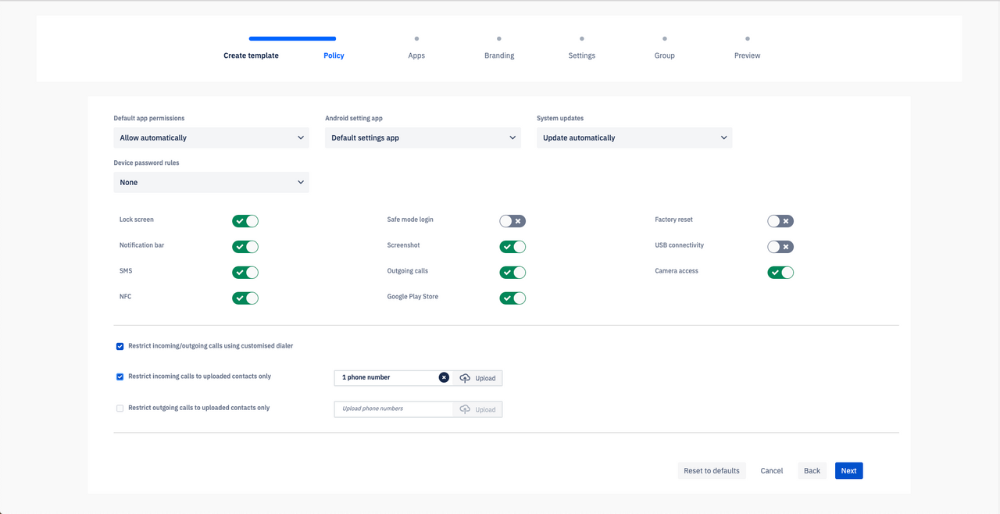
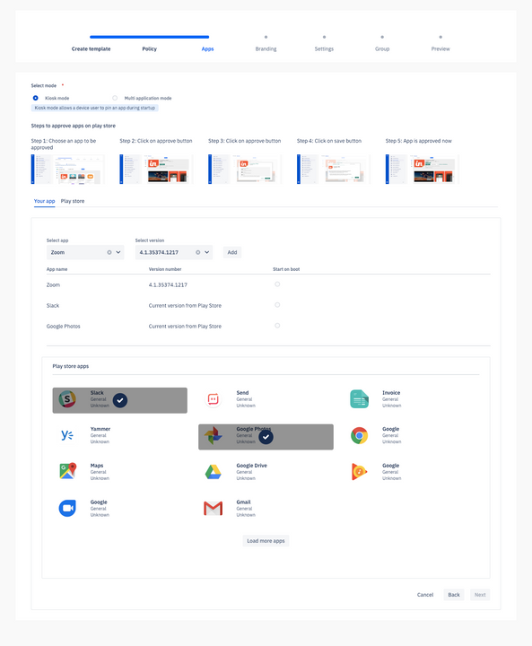
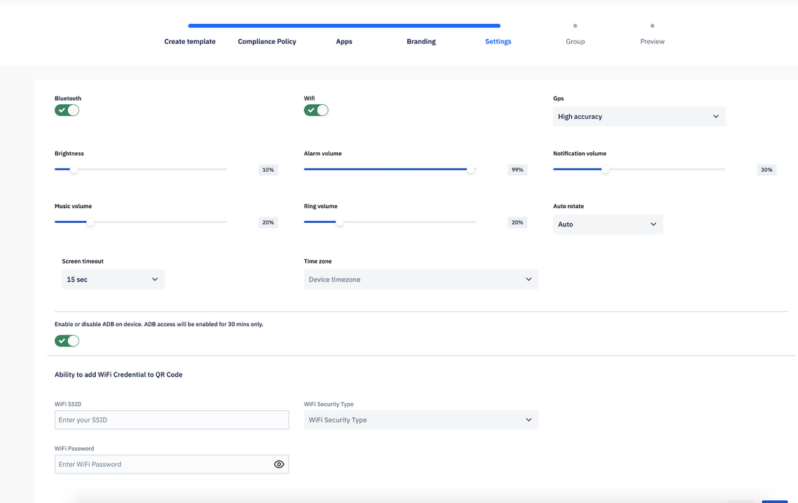
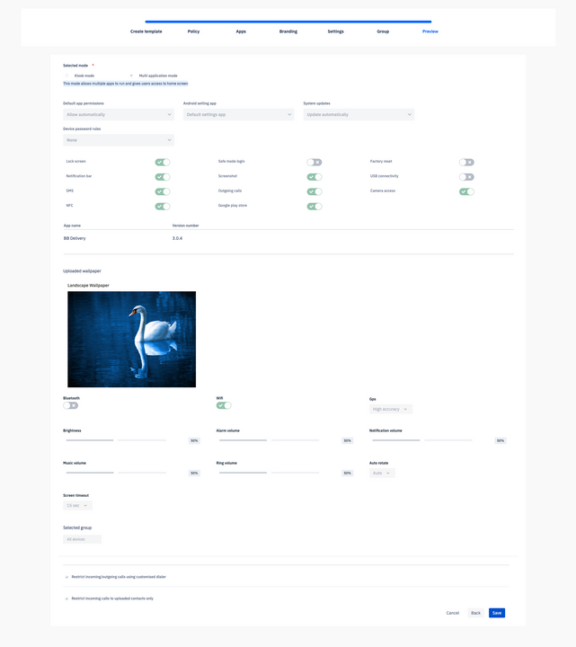
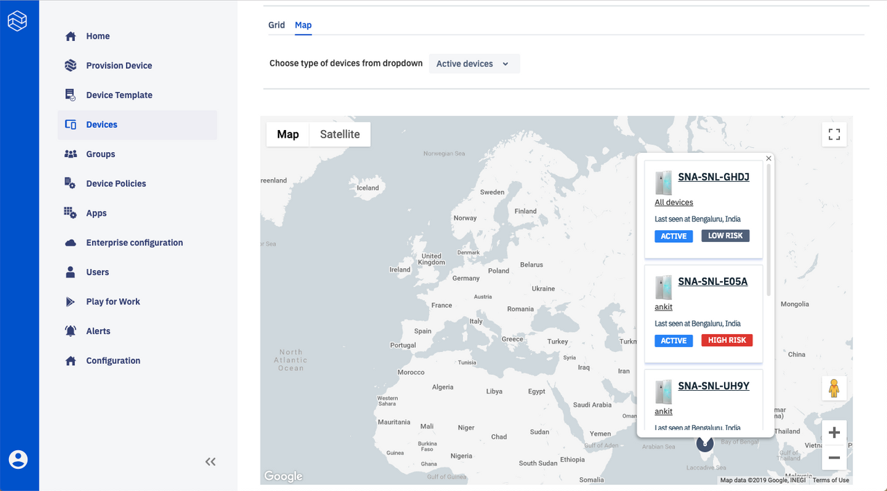
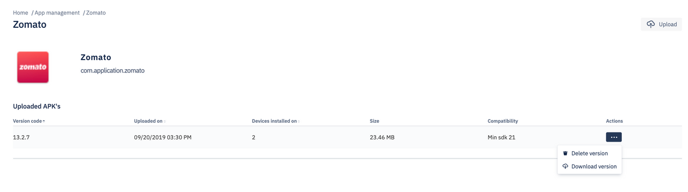

# Console


Click on Below Links to read about various sections of the Esper Dashboard
<br />

##  Manage Home

<div class="avg-reading-time" style="margin-top: 0rem;">Average reading time : {{ $page.readingTime.text.replace(' read', '') }}s</div>

This page explains the functionality of the Esper Home Dashboard.

There are four tile sections on the Home Dashboard page:

### 1\.  Deployment Status

This tile shows the current deployment status of the devices for the current customer environment and includes a clickable link to number of Active, Inactive, Under Provisioning and Recently Added devices. Clicking on each takes the user to the [Device Dashboard](./console/device-management/index.md) showing the corresponding category of devices.

### 2\. Security Summary

The Security Summary tile shows a summary of security status of the deployed devices. It shows how many of them are at High Risk, Medium Risk, Low Risk and No Risk. Clicking on each takes the user to the [Device Dashboard](./console/device-management/index.md) showing the corresponding category of devices.

### 3\. Where are your Devices?

This section gives an overview of the location where all the devices are deployed. You can see a world map showing locations of all the devices in Map and Satellite View. It can be made full screen and user has options to zoom in and zoom out. There is also a summary of cities worldwide containing the highest number of devices.

### 4\. Alerts Status

The Alerts Status tile gives a summary of Alerts you've created and Alerts that have been fired for each of the created Alerts. The Alert name can be selected from the dropdown and the number of Alerts fired will then be shown.
##  Dev Home

Read about the Developer Tools and Documentation here - 

Esper API Keys - Get API Key and Enterprise ID to be able to access Esper APIs to integrate in your app development code. See here - https://{{ esper_tenant_name }}.esper.cloud/developer-console/ <br />
<br />
Esper API Reference - Checkout all APIs that you can use to manage your dedicated devices at https://api.esper.io using HTTP/REST framework. <br />
<br />
Esper SDK For Python - Install SDK for python using instructions here - https://docs.esper.io/home/pythonsdk.html <br />
<br />
Esper CLI - Quickly execute CLI commands to install/uninstall/manage deployment on your provisioned devices <br />
<br />
Esper Plugin For Android Studio - Use Esper Plugin to easily deploy new versions of your app onto Esper dashboard and to your dedicated devices. This plugin enables you to remotely view/control your devices on Android studio as well. <br />
<br />
Esper Docs With Quick Starts - This is one stop for all documentation regarding API, CLI, SDK, Plugin and Console. <br />


##  Provision Device


Provisioning is the initial step to configuring and managing your Android device using the Esper Management Console and associated developer tools.

Esper provides multiple methods of provisioning a device, which involves downloading the Esper Agent onto the device and configuring it according to the provisioning settings used for a Device Template. The supported provisioning methods are:

1.  [AFW provisioning](./console/device-provisioning/afw-provisioning/index.md) - AFW (Android for Work) method is best used for:
    - Devices that have GMS (Google Mobile Services) enabled 
    - Devices with a camera for QR code scanning

2.  [ADB provisioning](./console/device-provisioning/adb-provisioning/index.md) - ADB (Android Debug Bridge) method is best used for:
    - Devices with No Google Services 
    - Devices with No camera
    - Devices running  Android 6.0, 5.1 or 4.4

3.  [IMEI (or Serial Number) based provisioning](./console/device-provisioning/imei-or-serial-number-based-provisioning/index.md) 
    - IMEI/Serial Number method is use for Bulk provisioning of devices
    - Enables zero touch provisioning

4.  [QR Code Provisioning ](./console/device-provisioning/qr-code-provisioning/index.md)
    - QR Method like AFW is used for devices that have both GMS (Google Mobile Services) and Camera enabled 

##  Device Template

### How to use Esper's Device Template.

Device Template is a one stop means for you to quickly provision your device. It lets you create a profile for the device where you may choose the policy, apps, device settings, Device Group, and the wallpapers that you want to be provisioned on the device. Device Templates can be created, saved, and used to provision at a later point.

### Steps to create a Device Template.

1.  Click on 'Device Template'.
2.  Click on 'Create Template'.
3.  Enter a name for the Device Template. Click 'Next'.


### In the Policy section

Policy is a standard set of rules or permissions that are related to security of the devices and apps that admin can apply on the devices to be provisioned via template. Admin may set default app permissions, Android setting app, system updates, password rules, and turn on the toggle buttons for the settings he/she wishes to enable on the devices. 

Below is a list of features you can turn on or off in the policy section. These are part of our standard Compliance policy that can be configured and reapplied as per requirements of the customer after provisioning.

*Drop Down menus*-
1. Device Password Rules - If you choose alphabetic or alphanumeric, a minimum passowrd length can be entered. The default minimum password length is 4. <br> </br>
2. Default App Permission<br> </br>
3. System Updates<br> </br>
4. Android Settings App<br> </br>

*Toggle Buttons*-<br> </br>
1. Lock Screen<br> </br>
2. Safe-Mode Login<br> </br>
3. Factory Reset<br> </br>
4. Notification bar<br> </br>
5. Screenshot<br> </br>
6. USB connectivity<br> </br>
7. SMS<br> </br>
8. Outgoing calls <br> </br>
9. Camera Access<br> </br>
10. NFC <br> </br>
11. Google PlayStore<br> </br>
12. USB tethering<br> </br>
13. Edit date and time<br> </br>
14. Application uninstall<br> </br>
15. USB File transfer <br> </br>

For example - If you wish to have Google Play Store show up on the device, you may turn on the toggle button. <br> </br>

*Checkbox*-<br> </br>
Restrict outgoing/incoming calls using customised dialer. <br> </br>

If clicked, this opens up two more checkboxes-<br> </br>

1. Restrict incoming calls to uploaded contacts only <upload a csv file of allowed contacts><br> </br>
2. Restrict outgoing calls to uploaded contacts only <upload a csv file of allowed contacts><br> </br>

In order to restrict phone numbers that can make or receive calls to the device, upload a .csv file with the allowed phone numbers.<br> </br>

<i>All numbers must be preceded by +country code (for example +1 for US)</i>
<i>All numbers must be separated by comma </i>
<br> </br>

<br> </br>
You may reset these values to default at any time by clicking 'Reset to Default' button at the bottom.
<br> </br>
Click 'Next'.
<br> </br>
### In the Apps section

Select 'Kiosk mode' to pin an app during startup or 'Multi application mode' to give users access to the Home screen. Choose the apps that you would like to have installed on your device during provisioning. You may choose from install apps you uploaded via [App Management](./console/app-management/index.md) or install apps from Google Play Store that you approved via [Play For Work](./console/play-work/index.md).

*   To add your app, upload APK files on App Management - click on the app from the dropdown, select the version and click on Add:


*   To add app from Play Store list - click on the apps to add from the list of available apps. 
:::tip
Please note that only once you [Approve a Google Play Store App](./console/how-approve-google-play-store-app/index.md), you may add it from the list shown in the Device Template.
:::



Click 'Next'.

### In the Branding section

Upload landscape and/or portrait wallpaper.


There is an option to Preview the uploaded wallpapers:


Click 'Next'.

### In the Settings section

Choose the device settings you would like to have on your provisioned devices such as Bluetooth, Wi-Fi, volume, screen rotation, GPS, and screen timeout. Click 'Next':



### In the Group section

Select an existing Group or create a Group. The devices provisioned using this device profile will be a part of the selected Group. Click 'Next':


### On the Preview screen
 You will see a preview of the entire device template. If you wish to edit your settings, use the 'Back' button to go back to the appropriate screen:



Click 'Save'. You will see a pop-up to confirm your settings. Click 'Okay':


The Device Template you just created will now be visible on the Device Template page. You can search for it in the search bar. Click on it to view the Device Template. Click on 'View QR code' to provision a device using this template directly from your Device Template.

On clicking the View QR code, there is also an option to download the config.json file that can be used during ADB and IMEI provisioning:


  
You can also Preview, Edit, Duplicate & Delete the template:


Click on the ellipsis (...) on the template tile to preview, edit, duplicate or delete a template.

*   **Preview Template**


Click on the Preview option to preview the device template. Click on the + sign to expand and then check selected individual components.

*   **Edit Template**

To edit any template, click on the 'Edit Template' option. Policy, Apps, Branding, Settings, Group and Add devices options can be updated as required. To save the changes, click on the 'Update' button on the Preview page.

*   **Add Devices (IMEI Provisioning)**


While editing a template, you also have the option to add IMEI/Serial numbers of devices you want to provision with this template. There is a section 'Add devices' that appears if you click on Edit Template. Using this section, user can upload IMEI and Serial numbers. See details on IMEI Provisioning via Template [here](imei-provisioning-template/index.html).

*   **Delete Template**


Click on the 'Delete Template' option on top right to delete a selected template.

  
##  Devices

Manage your provisioned devices here.

You may view all your device details on the Devices dashboard.


### Categories

There are checkboxes on the top of the page with categories such as Active, Inactive, Under provisioning, Devices with low battery, etc. that can be checked to view devices in each particular state.

### Search

Search is provided on the top right where you can search for devices in Devices using the Esper assigned device code which is displayed on the device's home page wallpaper.

### Device Tile

The default view is Grid, but the user can click on Maps to access the map view. Under the Grid view each device will be represented as tiles in the ‘Device management’ tab with a summary of all device information such as location, network, health, and risk status of the device. Click on [View More](./console/device-management/-/index.md) on the tile for any individual device to see further actions and changes that can be made for this device:


Devices listed 'Under Provisioning' refer to devices where Google Play apps are getting updated:


Devices under 'Applying Policy' refer to devices on which device templates are being implemented:


Devices which have been enrolled on to your Esper Cloud are provisioned devices:


### Map View

Under the Map view, the types of devices can be chosen from the dropdown. Once selected, the device locations are show:.


Once you click on the cluster icon, devices in the cluster will appear. Upon clicking on the individual devices, device information will be displayed:



##  Groups

Learn about Esper's Group Management.

Using Groups devices can be sectioned into groups and mass actions can be performed on a group of devices. You can create a Group by entering a unique name. Once you create a Group, you have the option to add from all existing provisioned devices which exist in the **"All devices"** group. Users can also create a Group during [template creation](./console/device-template/index.md).

You can delete a Group by selecting one or many Groups using the top right button **'Delete group'**. There is also an option to refresh. Additionally, a search capability for search via group name has been provided. The Group tile will show the name and number of devices in the Group:


On clicking **'View more>'**, you can take actions such as reboot, lock, ping, and wipe for the devices in the Group:


You can change a policy for all the devices in a Group:


You can install apps to all the devices in a Group:


You can also schedule app installation for the Group:


You can click on **'View Results'** to see the number of successful and unsuccessful device installations:


If your devices are using Esper Enhanced Android, you will also see a tab for **"OS updates"**.

Here you can see a list of the Esper Enhanced Android updates that have been made on the current group with details such as build number, device type, number of devices, and date deployed along with an option to view the details:


By clicking on the **'Deploy OS Updates'** button you may choose any available Build number by then clicking on **'Select Build'**. 
:::tip
Please note that currently only the latest 30 builds of the Esper Enhanced Android updates will be visible to the user for deployment
:::


The **'Number of devices'** will populate with the devices in the group on which this update is applicable; this pertains to those that have an OS build version lower than the selected version for the deployment:


You may add the installation name, any pertinent notes, and after that click **'Save'**:


In a future update we will give users the option to choose the time window for their OS update installation.

##  Apps

Learn about Esper's App Management.

This section enables you to manage your applications. You may add the following type of apps to your device:

1.  Upload Private Apps (APK files) to the Esper Cloud.
2.  Install Google Play Apps after [approving](./console/device-template/how-approve-google-play-store-app/index.md) them.

<i>To approve In-ROM apps or Preloaded apps in a device, you may do so from template during provisioning or post provisioning from Groups->Apps->Approvals section. See [FAQ](https://docs.esper.io/home/faq.html) </i>


### Upload Private Apps (APK files) to Esper Cloud:

*   You can upload your own mobile app through an APK file using the upload button on the top right hand corner.
*   There are some rules that the uploaded app must adhere to inorder to succeed upload and provisioning - 
    1. The APK has to have a version name and number.
    2. Max size - 500 MB
    3. Extension - .apk [only]
    4. APK Signature verification 
    5. Latest Android APK standards (currently we allow apks without icons)

*   You can upload your own android app APK file using the upload button on the top right hand corner
*   The uploaded apps will be shown under the 'Uploaded apps' section:


When you click on any private app, it will open the details of the same. For example in the below screen, you may see details of the Zomato (uploaded) app. It shows the following details - 
1. Name of the app
2. Package name
3. App icon (if parsable)
4. Version number (for each version). Note that the same app can have various versions.
5. Number of devices the app is installed on
6. The date the app was uploaded on
7. Size of the app
8. Compatibility with SDK version
9. App description (coming soon!)
10. Build number (coming soon!)



In the above image, you can see ellipsis (3 dots) under Actions. On clicking the ellipsis, user has options to:
1. Download the app version
2. Delete the app version

### Install Google Play Apps after [approving](./console/device-template/how-approve-google-play-store-app/index.md) them:

*   You can also allow a user to download apps from Google Play Store.
*   This requires approving a specific app from the Play Store to allow a user to download the app on their device:


*   You also have the option to handle new 'App Permission Requests' for the approved apps. You can:

1.  Approve the requests for new app permissions so that users can update the installed app.
2.  Revoke the requests for new app permissions so that users cannot update the installed apps.


3\. You can set the option to receive email notification whenever an app requests new permissions by adding the appropriate email address or addresses in the notification settings:


*   You can then select the device you want the app to be installed on by clicking on the 'Select option' and then 'Select the Device':


*   Once the app is installed on the device, a notification shows up indicating the app was successfully installed:


*   You also have the option to update or uninstall the app from a specific device:


*   You can unapprove the app from all the installed devices by clicking the 'UNAPPROVE' button. 
<i> Note: Unapproving an app does NOT mean uninstalling it. If the app was approved earlier, it will continue to stay installed in your device until it is explicitly uninstalled. Post uninstallation, if it has been unapproved, user/admin will not be able to uninstall it on the device.</i>


*   You can also see all the approved Google Play Store apps under Play Store section:


##  Play for Work

Learn about setting up Play for Work apps using Esper.

*   Play for Work gives you access to the Enterprise version of Google Play.
*   Here you can either APPROVE or UNAPPROVE applications that can be downloaded onto your dedicated devices. After an app is approved it be visible on Google Play for device installation:


### Approve an app

* Approve an app by clicking **APPROVE** button.


*   Upon clicking APPROVE a pop-up will appear:


*   Via the pop-up you can set app permission requests:


*   Upon clicking SAVE, your settings will be applied to the app. The dedicated device user can then access it from the Play Store within the given app permission requests:


### Unapprove an app
*   Once you click UNAPPROVE, the access to the application is removed from user’s Google Play account:


*   Click the OK button to remove the application from user’s Google Play account:


*   After clicking OK you will get a message indicating that it was successfully UNAPPROVED:


### Approval settings
   Upon clicking OK you will see a pop-up showing the APPROVAL SETTINGS tab and NOTIFICATIONS tab. Choose the desired APPROVAL SETTINGS:


###   Notifications 
sets up email notifications for anyone requesting new permissions to the specified email address or addresses:


##  Alerts

Learn about available Alerts.

User Alerts to monitor the performance of your devices. You can create a device alert that watches a single metric:


*   The alert performs one or more actions based on the value of the metric relative to a threshold over a selected time period.
*   Choose an alert, the **set condition**, the **name** for the alert and then click on **'Create alert'**:


**Delete icon**

*   Use this to delete an alert:


##  Compliance Policy

Learn about Esper's Policy Management.

*   A policy is a set of rules closely related to privacy and security that a device follows.
*   Policies can be viewed, edited, and deleted.
*   To create a new policy, click on the **'New Policy'** button:


*   Enter the policy details and click on **'Create policy'**:

Below is a list of features you can turn on or off in the policy section. These are part of our standard Compliance policy that can be configured and reapplied as per requirements of the customer after provisioning. Hover your mouse over these policies to know more about them.

Drop Down menus- 

Device Password Rules - If you choose alphabetic or alphanumeric, a minimum passowrd length can be entered. The default minimum password length is 4.<br> </br>
Default App Permission <br> </br>
System Updates <br> </br>
Android Settings App <br> </br>
Toggle Buttons- <br> </br>

Lock Screen <br> </br>
Safe-Mode Login <br> </br>
Factory Reset<br> </br>
Notification bar<br> </br>
Screenshot<br> </br>
USB connectivity
SMS
Outgoing calls
Camera Access
NFC
Google PlayStore
USB tethering
Edit date and time
Application uninstall
USB File transfer
For example - If you wish to have Google Play Store show up on the device, you may turn on the toggle button.

Checkbox- Restrict outgoing/incoming calls using customised dialer.

If clicked, this opens up two more checkboxes-

Restrict incoming calls to uploaded contacts only Restrict outgoing calls to uploaded contacts only

In order to restrict phone numbers that can make or receive calls to the device, upload a .csv file with the allowed phone numbers.

All numbers must be preceded by +country code (for example +1 for US) All numbers must be separated by comma


*   A new policy is created and can be deployed on any device.
*   The new policy gets listed on the **'Compliance Policy'** page which can be edited or deleted as required:


##  Users

Learn about Esper's User Management.

Under the Users tab you are able to view all registered users in your enterprise. Here you can add, delete, and edit users:


New User

*   To add a new user, click on 'New User' and fill in details of the user in the form:


*   Upon creating a new user, you will get a confirmation pop-up:


Edit icon

*   Here you can edit the details of a user.
*   You will be able to change the username, email, full name, password, and role assigned to the user:


Delete icon

*   Click on the Delete icon to delete a user from the enterprise. That user will no longer be able to access their account:


##  Geofence <Badge text="New" type="tip"/>


Now in Esper - Geofences!
Geofencing is a useful feature for some dedicated device deployment scenarios. With geofencing you use the device’s location typically generated by GPS to trigger an alert when the device enters or leaves a defined area. Common scenarios include making sure a fleet of delivery devices stay in their delivery zone, warehousing devices don’t stray far from the warehouse, and restaurant ordering devices don’t leave the restaurant.

In order for geofencing to work, the mobile device needs Internet connectivity and location services enabled. Thus this is typically for cellular connected devices with high accuracy location services enabled - whether smartphones or tablets. 

Setting up a geofence for a device is easy - it starts by selecting Geofence in Esper Console left navigation pane - this brings you up to a wizard for quickly defining the geofence. Click on New Geofence:


In the first screen you define the size of your geofence (meaning where you expect any devices to be for this geofence) - it is a circle that can be as small as 100m radius up to 10km. Note that GPS can drift and jump, thus a geofence smaller than 100m can cause false positives. To set it up at a location simply type the address for the center of the circle, or drag it in the map view to set it up. Give it a name and description, and then click Next:


Now you assign devices to this geofence - you can do as many as you need that fit the criteria for the geofence. In this case we are just doing one:


Now you define the action to be taken when any of the assigned devices leave the geofence - you can either lock them, have them beep, or both. In this case I went with beep!


If you chose to Lockdown the device, you will see the following screen if the device is taken outside the geofence boundary - 


You can see for Geofence applied Devices if they have left or entered the Geofence in the Event Feed section:


That’s it! It looks even easier in our video:
https://youtu.be/UkTwhFRTwgQ                       
	
Give it a try and let us know what you think, andi@esper.io.


<i> Note: The performance of Geofencing feature is dependent on accuracy of in-built GPS of devices. Additionally, ability to track location of the device is also dependent on WiFi, Bluetooth, cellular connectivity and internet of the device.  </i>


##  Company Settings

Learn about Esper's Company Settings.

*   Company Settings enables you to set your company details by clicking on the **'Edit profile'** button on the top right hand corner:


*   You are required to fill in your **company information** including:

1.  Registered name
2.  Location
3.  Name
4.  Zip code
5.  Email
6.  Address
7.  Phone number


*   If you will be using apps from Google you will also need to enroll your company's Google Play account:


##  OS Updates

### Over-the-air updates for Esper Enhanced Android.

You can update the Esper Enhanced Android version using our OTA functionality. Currently, we are only showing the number of devices the build version has been applied to; this also includes the publish date and size. To deploy a new available build on a group, the user can go to [Group->OS Update](./console/group-management/index.md). See the Group section for more details.


:::tip
Please note that currently only the latest 30 builds of Esper Enhanced Android updates will be visible to the user for deployment.
:::

##  Developer Options


**Turn App and Device Management into Code**

Esper is focused on helping Android app developers build, deliver, and maintain Dedicated Device applications - whether a restaurant kiosk, retail POS, or logistics hub. We have made our APIs available to Android developers worldwide so they can move rote app and device management actions into reusable code. Anyone can use our APIs to build, orchestrate, and integrate elegant solutions based on their business requirements. We do the heavy lifting by taking care of the infrastructure, so app developers can focus on building great solutions rather than being bogged down in app and device management. We help you procure efficient hardware along with the optional secure, optimized Esper Enhanced Android and our open source APIs and SDKs. We also offer the Esper Plugin for the Android Studio with tools improving the challenging task of app diagnostics - including working with deployed apps running on dedicated devices in the field. Check out [esper.io](http://esper.io) for more information about our rich feature set.

To kick things off, you need to generate an **API key** that you can tie to a specific application - it is your choice on how you want to manage your API keys. Do this by clicking the **"Register App"** button. You can also easily copy the Enterprise ID, necessary for API calls, by clicking on the copy icon next to Enterprise ID on top right of this section.


Next, you need to enter a unique app name and description(optional) and click **register application**.


Click Generate Token. This will generate a unique **OAuth-based API key**.


You can then copy (or renew if needed) your API key.


The **API key** and **Enterprise ID** can be copied from the dashboard as shown above and can be used to access our [CLI platform](https://github.com/esper-io/esper-cli) (https://github.com/esper-io/esper-cli) as well as to use the [SDK/API](http://api.esper.io) (api.esper.io) in your development and management systems.

Checkout the relevant documentation on the top right of this page by clicking on [Developer Hub](https://docs.esper.io/) and [API Documentation](https://api.esper.io/).

##  Secure Remote ADB

Developer should be able to debug their devices remotely without even physial association with the device. ADB is android tool that help you to get take actions on the device, get the device or application logs and help you in resolving customer or in-field issues right by sitting remotely in your office.

This document tells you how you can remotely connect to device via secure adb channel. We will be using esper-cli command line tool which internally uses [esperSDK](https://docs.esper.io/home/pythonsdk.html)  [APIs](https://api.esper.io/) to provide the secure access between your host machine and device.

Remote access to the device can be done from anywhere in the world using espercli and doesn't have to be in the same network.

### Steps to connect to secure remote adb:

1. On to Esper Dashboard https://{{ esper_tenant_name }}.esper.cloud, Go to  `Devices` tab, then to your device  and to `Actions`.

2. At the bottom of the page, Click `enable adb`.

3. On to your android device, connect via usb cable and enable adb over tcpip by following command:
   ```sh
   adb tcpip 5555
    ```
4. Disconnect usb cable from the device. You should be able to connect adb via port 5555 over tcp

5. Setup [esper-cli](https://docs.esper.io/home/espercli.html) and configure for your enviornment on to the host machine.
   - Check your espercli version: espercli -v
   ```sh
   #espercli -v
   Esper CLI is Command line tool for the Esper APIs:  0.0.5
   Cement Framework 3.0.2
   Python 3.7.3
   Platform Darwin-18.0.0-x86_64-i386-64bit
   ```
   - Make sure it is >= 0.0.5 to use secure-adb feature.
   - Upgrade to the latest version of espercli using the following command:
   ```sh
   pip install -U espercli 
   ```
6. Copy your device id from esper dashboard information tab or from your device bottom left most. It looks like SNA-SNL-1234.
   
7. Use espercli to connect to Device:
   ```sh
   #espercli secureadb connect -d SNA-SNL-1234
    Initiating Remote ADB Session. This may take a few seconds...
    Secure ADB Client
    Please connect ADB client to the following endpoint: 127.0.0.1 : 62945
    If adb-tools is installed, please run the command below:
    adb connect 127.0.0.1:62945
    ```
8. Now connect your device via port number obtained above on localhost.
   ```sh
   adb connect 127.0.0.1:62945
   ```
9. You are connected to adb.

::: warning
 Now onwards until device is rebooted, You would be able to connect to the device remotely using espercli.  Post reboot you have to do Step 1-8 again
:::
