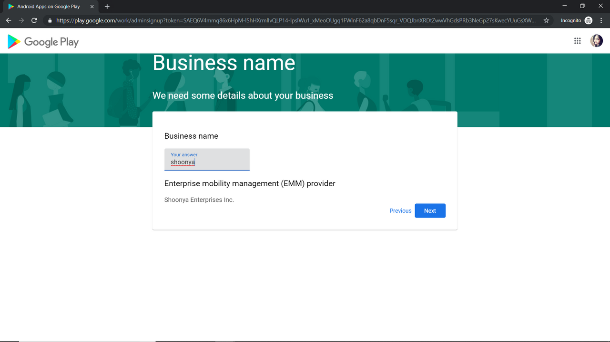

# Company setting

1. On Esper Dashboard go to Company Settings, Click On “ENROLL”

    

2. A pop up will come up. Click OKAY, It will take you to “Google Play Page”,

    

3. Copy the url of that page

    

4. Click on vertical ellipsis on the right top corner and choose “New Incognito Window”. It will open a new window in incognito mode. This step is necessary as if you are currently signed in with a g-suite account emm enrollment will not be allowed for the same.

    

5. Paste the url in the incognito window and click enter.

    

6. You will see Google Android enrollment page with title "Bring Android to Work". Click on “SIGN IN”.

    

7. Enter login credentials of Gmail account you wish to associate Android for Work account with.

    

8. Click on ‘Get Started’.

    

9. Enter Your ‘Business name’ and click on 'Next'

    

10. Enter the details for Data Protection Officer and EU Representative and click Confirm. This step is optional.

    

11. Click on ‘Complete Registration’ it will redirect you to the login page of esper 
 
    

12. Login to esper by entering your esper credentials that you received while signing up.

    

13. Now Your tenant is enrolling to Enterprise Mobility Management(EMM)

    

14. Now Your tenant is enrolled with EMM. 

    You should now see a new section in sidebar for 'Play For Work'. Your environment is now successfully enrolled in Google Enterprise Mobile Management services.

    

