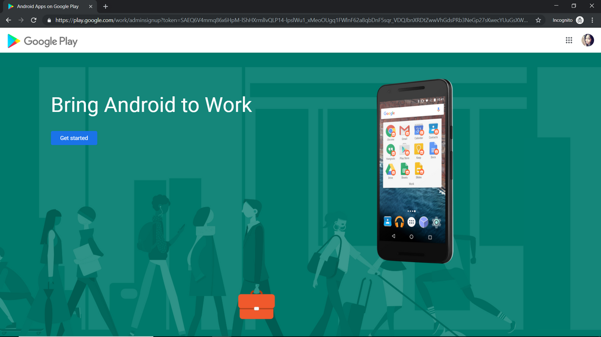
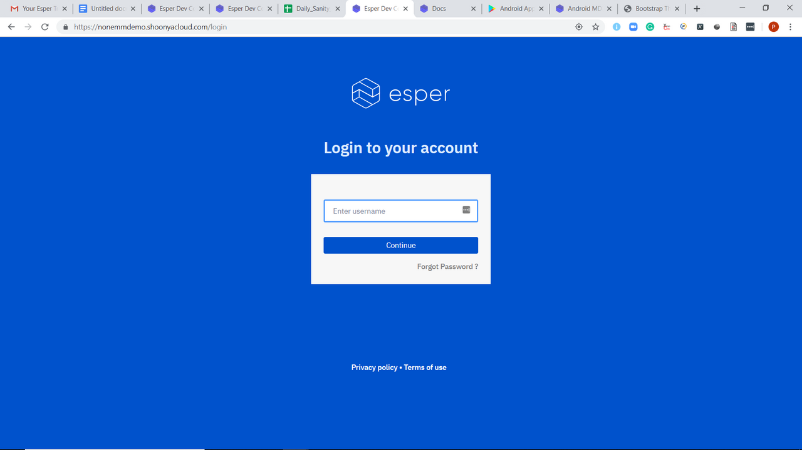

# Company Settings

1. On the Esper Dashboard, navigate to Company Settings, then click on 'Enroll'

    

2. A pop up will then display on-screen. Click 'Okay,' which will then take you to the Google Play Page.

    

3. Copy the Google Play Page URL

    

4. Click on the vertical ellipsis in the right top corner and choose “New Incognito Window.” This will open a new window in Incognito Mode. **Note: This step is necessary. If you are currently signed in with a G-Suite account, EMM enrollment will not be allowed for the same account.**

    

5. Paste the URL in the Incognito window and click 'Enter'

    

6. You will then see the Google Android enrollment page display the text "Bring Android to Work." Click on “Sign In."

    

7. Enter the login credentials of the GMail account you wish to associate your Android for Work account with.

    

8. Click on ‘Get Started’

    

9. Enter your ‘Business Name’ and click on 'Next'

    

10. Enter the details for Data Protection Officer and EU Representative and click 'Confirm.' **Note: This step is optional.**

    

11. After clicking on ‘Complete Registration,’ you will then be redirected to the Esper login page 
 
    

12. Login to Esper by entering your Esper credentials that you received when signing up.

    

13. Your tenant is now enrolling in Enterprise Mobility Management (EMM)

    

14. Congratulations! Your tenant is now enrolled in EMM. 

    There will be a new section in your device's sidebar titled for 'Play For Work'. Your environment is now successfully enrolled in Google Enterprise Mobile Management services.

    

