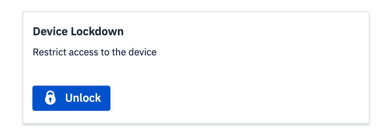
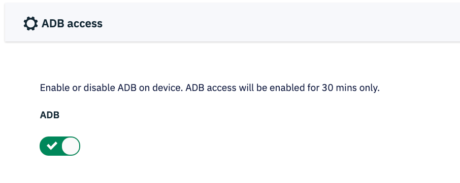

[Introduction](../../../../console.md) / [Devices](../../index.md) / [View More](../index.md) / Actions

# Actions

Actions that can be performed on the device from cloud portal

## Device Actions

All the device actions that can be performed are shown.

Select a particular action to perform on the active device.

**1\. Reboot**

Click on the ‘Reboot’ option and then confirm to reboot the device remotely.

**2\. Screen Lock**

To lock the device screen , click on ‘Lock device’ and confirm the same. In this case, Device user will need to enter device password (if it has been set) inorder to use device again.

**3\. Heart beat**

If the device has been inactive for a while, it means the device has entered Doze mode during which network activity is disabled.

The Ping device command forces the device to come out of Doze mode and tell the Dashboard it is active.

**4. Wipe device**

In order to wipe or factory reset the device, click on ‘Wipe device’ tile. Toggle the external storage to ON if you want to wipe the external storage also.

Confirm by clicking ‘Wipe’ and the device will be automatically Wiped.

**5. Device Mode**

If your device was provisioned in kiosk mode, you may use this button to exit out of the kiosk mode or enter back in. When you exit the kiosk mode, the kiosk mode app (selected during provisioning) will get unpinned and device user will be able to use the device in multi-application mode. When you click this button again, it will re-enter kiosk mode and the same app will again get pinned to the device screen.

**6. Device Lockdown** <Badge text="New" type="tip"/>   This feature is introduced to completely lockdown the device in case of unauthorized usage or relocation etc. For example if a user takes device outside of the authorized area, or a company decides to prohobit user from using the device, they can do a complete lockdown. In this case, a custom message can be entered which will show on screen, for example a contact number to call or email.

When you click `Lockdown`, a custom message text box appears where user can enter the text they want the device user to see.

As a result, when the device is locked down, the user sees the following screen -

After locking down a device, the button will change to `Unlock` to give admin access to unlock the said device.

**7. ADB access**

Turn on ADB of your Esper Managed Device with easy by turning on the ADB toggle button. This only works for physically connected devices via USB.

**8. Device Settings**

Change Device settings from Esper Dashboard. Following are features available -

* Turn on/off bluetooth  
* Select screen timeout duration  
* Select screen orientation  
* Select GPS accuracy  
* Increase/decrease Brightness, Volume (alarm, notification, ring and music)  
* Timezone <Badge text="New" type="tip"/> - With our supervisor plugin, we have enabled you to change timezone of device remotely via dashboard.

 
Below is screenshot of the Device Actions page which is also inclusive of local adb and device settings -

[Return to View More](../index.md)
