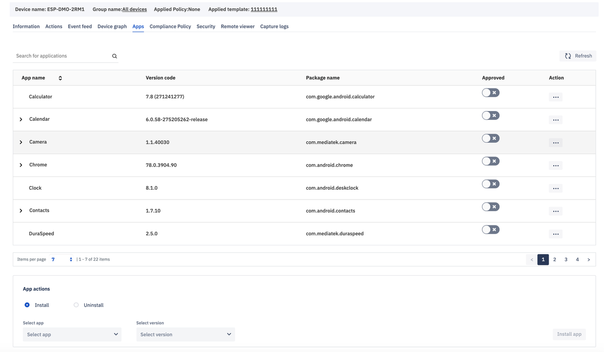

[Introduction](../../../../console.md) / [Devices](../../index.md) / [View More](../index.md) / App Management

# App Management

Average reading time : {{ $page.readingTime.text.replace(' read', '') }}

Manage apps on the device

The apps that are already installed in the device are specified here. There are many ways to install apps on the device -

*   You may toggle ON in the default apps listed in device->view more->apps.
*   You may install the app from the drop down menu by selecting install radio button. The apps shown in this menu are the [APK files that are uploaded by the user](../../../app-management/index.md) or the apps that are [approved in google play](../../../device-template/how-approve-google-play-store-app/index.md).

[Return to View More](../index.md)
