# Device Features (for individual devices)

## Information

This is the first tab that comes in view when clicking on `Details` on the Device Tile. This section consists of extensive amount of information regarding the device such as - 

* Battery information (Status of charge, current temperature)

* Storage (Total available, used, internal and OS occupied storage) 

* Memory (Total, in-use, average used, free)

* Location on map - It might take time sometimes to show up as its an external Google EMM api call for GMS devices. If the device does not show its location, it can helpful to reboot the device. In most cases, for GMS as well as non-GMS devices, location should start showing after staying connected to a network for 30 minutes or so.

* Device code, Registered on, Template name, GMS/Non-GMS

* Software information (installed esper client version, security patch level, device kernel version, bootloader version, android build number, supported ABI, Android API level, Android build date and Android version)

* Hardware information (Manufacturer, Hardware chip set, Brand, Serial number, Model, Baseband version)

* Network information (IMEI/MEID, Mac Address, DNS, Wifi Mac ID, Cellular network status, Wifi Access point, Connectivity duration, IP address, Ethernet status)
    
* Display Information - Resolution, Refresh rate

Additionally, on the top under breadcrumbs, Device name, Group name (that it belongs to), Applied Policy and Applied template are shown.

### Device Information View 

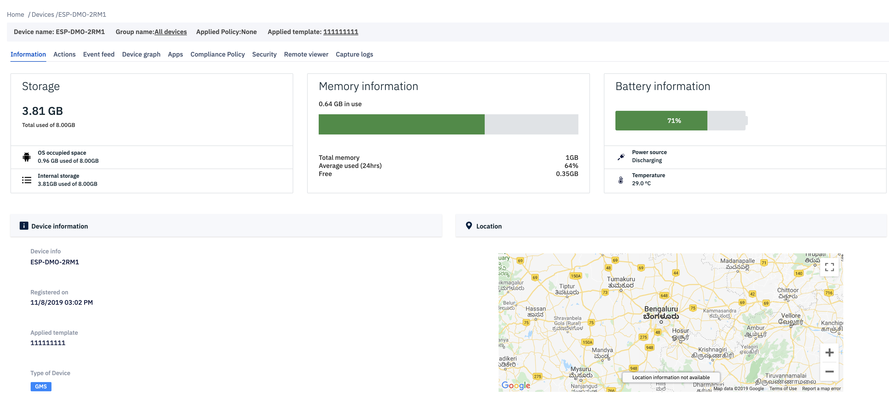
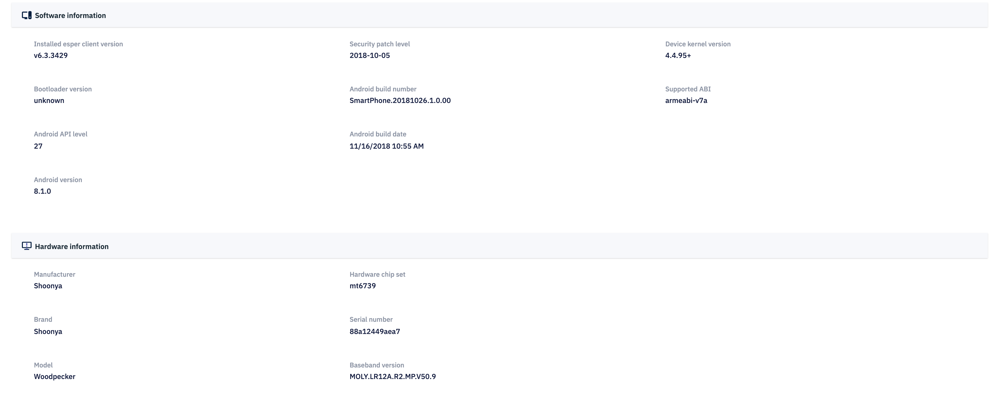
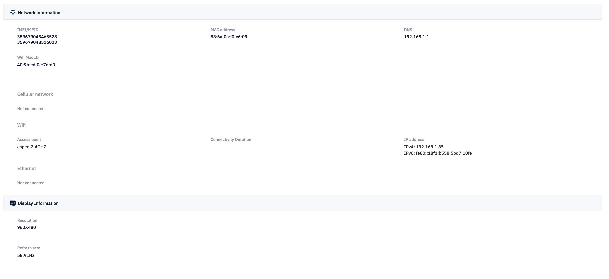

## Device Actions

The second section consists of the `Actions` that can be performed on the device from cloud portal.

All the device actions that can be performed on active devices are listed below.

### Reboot

Click on the ‘Reboot’ option and then confirm to reboot the device remotely. This action is available for devices with Android version 6.0 and above.

### Screen Lock

To lock the device screen , click on ‘Lock device’ and confirm the same. In this case, Device user will need to enter device password (if it has been set) in-order to use device again. 

### Heart beat

If the device has been inactive for a while, it means the device has entered Doze mode during which network activity is disabled.

The Ping device command forces the device to come out of Doze mode and tell the Dashboard it is active.

### Wipe device

In order to wipe or factory reset the device, click on ‘Wipe device’ tile. Toggle the external storage to ON if you want to wipe the external storage also.

Confirm by clicking ‘Wipe’ and the device will be automatically Wiped.

### Device Mode

If your device was provisioned in kiosk mode, you may use this button to exit out of the kiosk mode or enter back in. When you exit the kiosk mode, the kiosk mode app (selected during provisioning) will get unpinned and device user will be able to use the device in multi-application mode. When you click this button again, it will re-enter kiosk mode and the same app will again get pinned to the device screen.

### Device Lockdown <Badge text="New" type="tip"/>

This feature is introduced to completely lockdown the device in case of unauthorized usage or relocation etc. For example if a user takes device outside of the authorized area, or a company decides to prohibit user from using the device, they can do a complete lockdown. In this case, a custom message can be entered which will show on screen, for example a contact number to call or email.

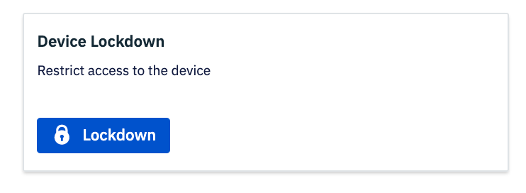

When you click `Lockdown`, a custom message text box appears where user can enter the text they want the device user to see.

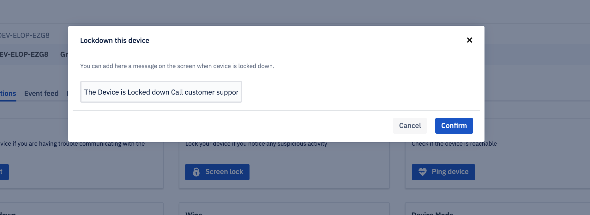

As a result, when the device is locked down, the user sees the following screen - 

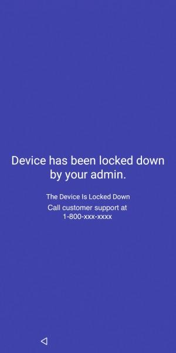

After locking down a device, the button will change to `Unlock` to give admin access to unlock the said device. 

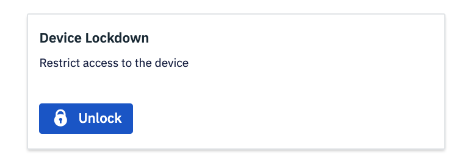

:::tip
It is possible that some devices might restart on receiving the lockdown command before they go in the lockdown state.
:::

### ADB access

Turn on ADB of your Esper Managed Device with easy by turning on the ADB toggle button. This only works for physically connected devices via USB.

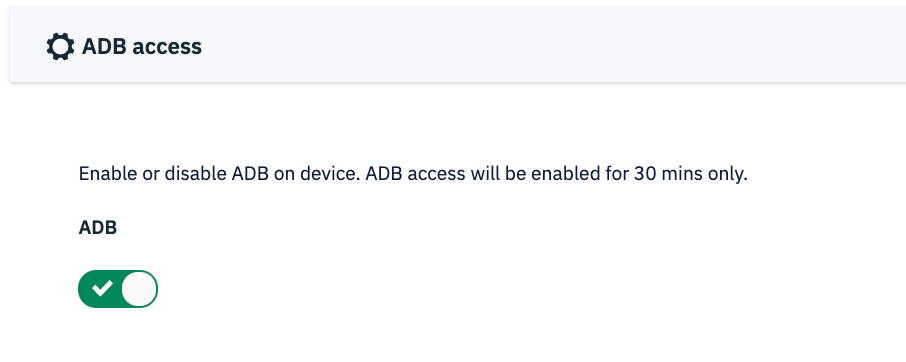

### Device Settings

Change Device settings from Esper Dashboard. Following are features available -

 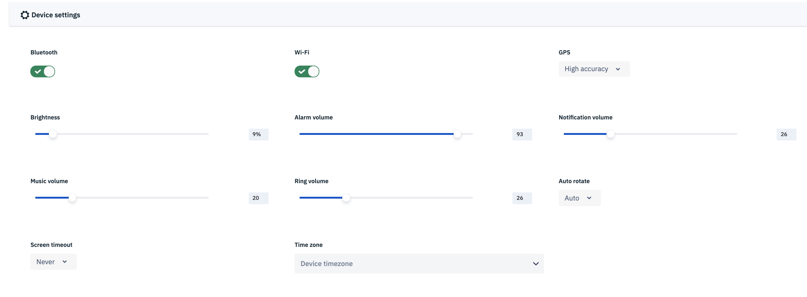

* Turn on/off bluetooth   
* Select screen timeout duration   
* Select screen orientation   
* Select GPS accuracy   
* Increase/decrease Brightness, Volume (alarm, notification, ring and music)   
* Timezone <Badge text="New" type="tip"/> - With our supervisor plugin, we have enabled you to change timezone of device remotely via dashboard.  

 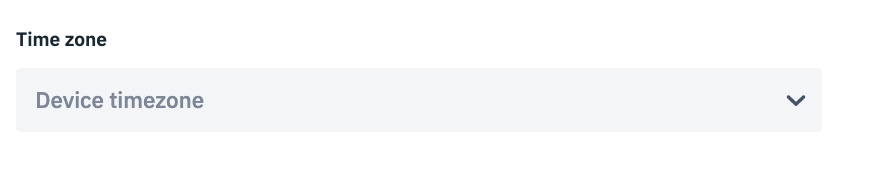

 
Below is screenshot of the Device Actions page which is also inclusive of local adb and device settings - 

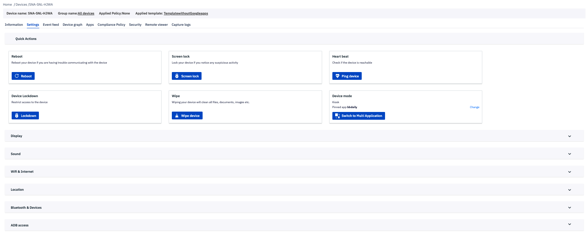

## Event Feed

This section shows the logs of event feedback received from the active devices. In the future, it will be used to read any anomaly in data behaviour to predict security issues.

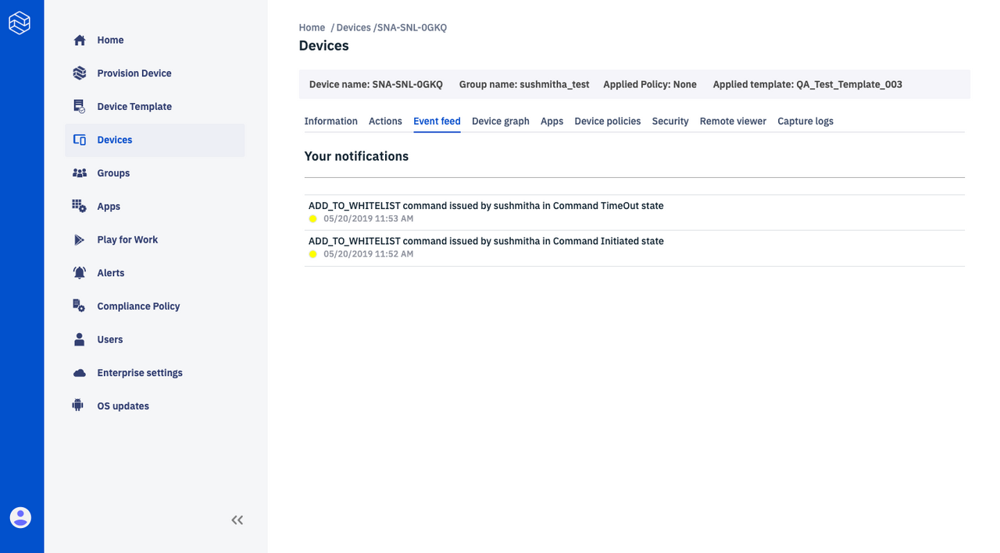

## Device Graphs

This section represents the graphical representation of the various attributes of a particular device whose ID is displayed at the top. The values that can be monitored includes information related to battery, memory, WiFi, and their usage over time.

With the new Telemetry Cloud infrastructure in place, Esper Device metrics have now increased to 15 metrics that can be accessed via Device graphs:
1. Battery Current 
2. Wifi Signal Strength
3. Available Internal Storage
4. Wifi Link Speed
5. Data Usage (Download) 
6. Data Usage (Upload)
7. Battery Capacity Total
8. OS Occupied Storage
9. Battery Current Average
10. Battery Capacity Count
11. Available RAM
12. Battery Level
13. Battery Voltage
14. Wifi Frequency
15. Battery Temperature

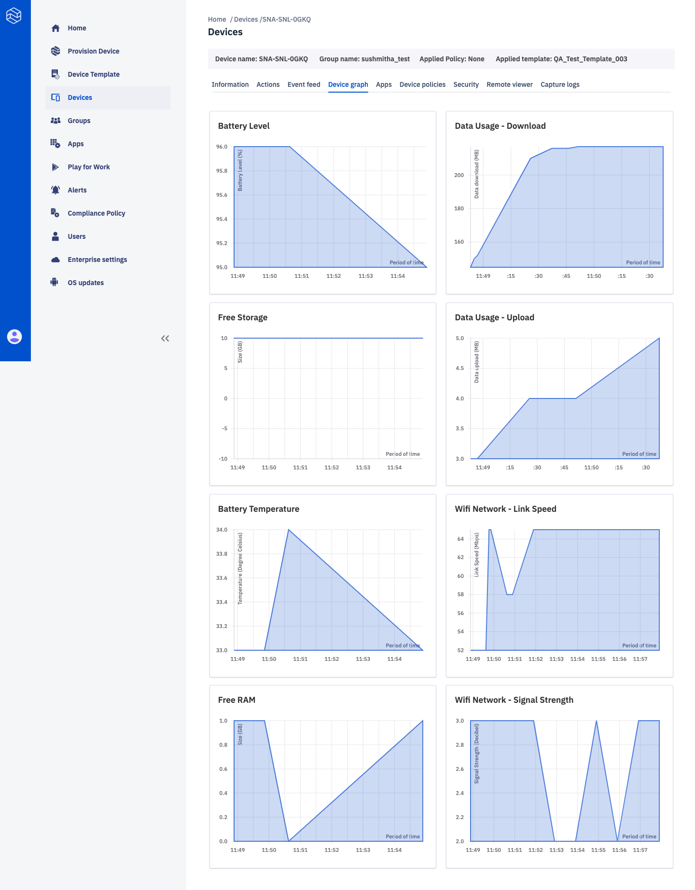

However, if a device stays inactive for more than 7 days, you will see an empty state requesting to activate the device: 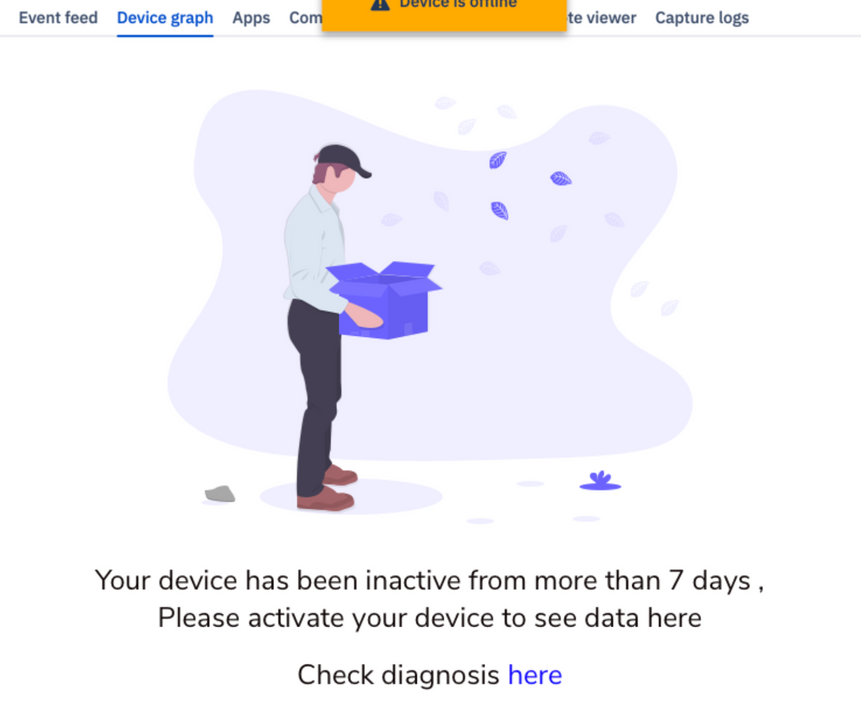

## Apps

This sections lists the Apps that are installed on the device along with the Version code, Package Name, Approval status (On/Off toggle button) and Available Actions. The apps that are already installed in the device are specified in this list including Private, Preloaded (In-ROM) and Google Apps. Toggling the button On will un-hide the app and toggling it back to Off wil hide the app.

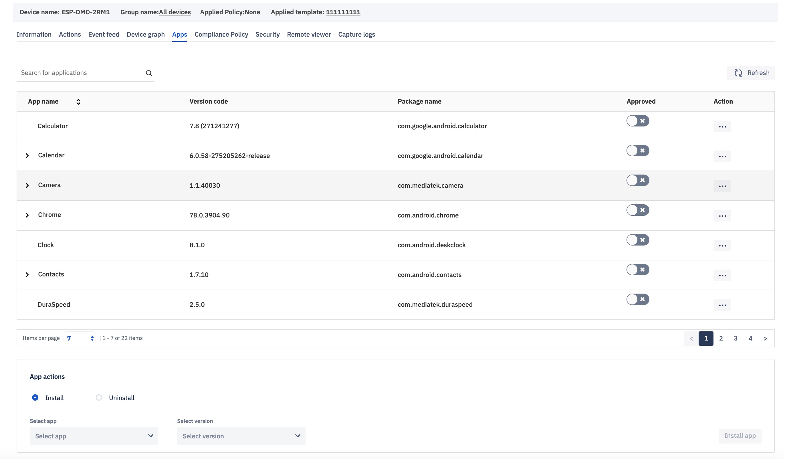

There are also radio buttons at the bottom end where user can choose to `Install` or `Uninstall` a private app on the device which is previously uploaded in the `Apps` section of the Dashboard.

There are many different ways to install various type of apps on a device as listed below - 

### Installing an App in a Single Device - 

#### Private Apps

These are company apps or privately owned app versions that can be uploaded on the dashboard from the `Apps` section. In-order to install this app on the device, click on the radio button in Device->Details->Apps section for Install, choose the app and click Install.

#### Google Apps

1. Go to Play For Work
2. Click on the app (Make sure its approved
3. Click Select
4. Select the device you wish to install it on from the dropdown on top left
5. Click Install

#### Preloaded Apps

Approve a preloaded app to show in the device from the list of apps in Device-Apps section by turning **on** the toggle button.

### Uninstalling an App on a Single Device 
 
#### Private Apps

Select the 'uninstall' radio button and choose the app to be uninstalled from the drop down menu. Click Uninstall.

#### Google Apps

 1. Go to Play For Work
 2. Click on the app 
 3. Click Select
 4. Select the device you wish to uninstall it on from the dropdown on top left
 5. Click Uninstall

#### Preloaded Apps

Turn off the toggle button from the app list for the preloaded app. It does not uninstall the app but hides it. 
 
 

:::tip 
 Please note that some preloaded apps are designed to be uninstallable by the device manufacturers so they can be hidden but can not be uninstalled. 
:::

## Compliance Policy

If user wants to switch to a new policy, they can select from the drop down menu and apply it. To create a new policy, click [here](../../../../home/console/device-management/-/index.md#compliance-policy).

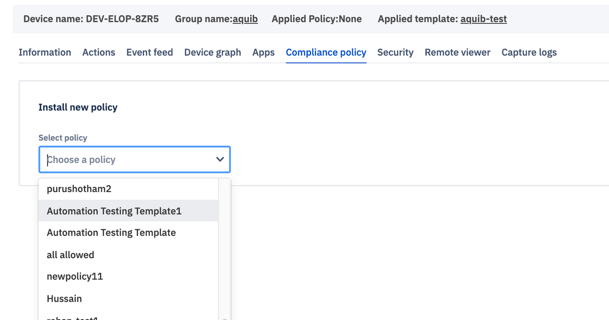

## Security

This page will inform user of security risks that device is facing. If there are any risks, it will show the threat level, cause of the threat, and advise user to secure the device.

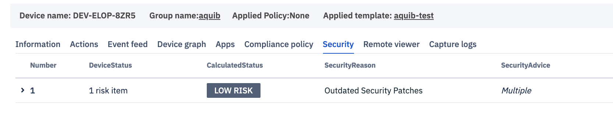

The security risk calculation and advise is done on basis of whether the devices that show signs of tampering or having been rooted. A device that has been tampered with for example, will be considered High Risk. An emulator or virtual device will also fall in High Risk category. 

Following are the criterion and details based on which the security risks are calculated - 

1. **BasicIntegrity** - BasicIntegrity gives you a signal about the general integrity of the device and its API. Rooted devices fail basicIntegrity, as do emulators, virtual devices, and devices with signs of tampering, such as API hooks.

2. **CtsProfileMatch** - CtsProfileMatch gives you a much stricter signal about the compatibility of the device. Only unmodified devices that have been certified by Google can pass ctsProfileMatch. Devices that will fail ctsProfileMatch include the following:

    a. Devices that fail basicIntegrity

    b. Devices with an unlocked bootloader.

    c. Devices with a custom system image (custom ROM)
    
    d. Devices for which the manufactured didn't apply for, or pass, Google certification

    e. Devices with a system image built directly from the Android Open Source Program source files

    f. Devices with a system image distributed as part of a beta or developer preview program (including the Android Beta Program)

    When present, the advice parameter provides information to help explain why the SafetyNet Attestation API set either ctsProfileMatch or basicIntegrity to false in a particular result. The parameter's value contains a list of strings, such as the        ones in the following example:

        {"advice": "LOCK_BOOTLOADER,RESTORE_TO_FACTORY_ROM"}

3. Security Patch Version - Last updated security patch version 

Device:
Device will send the above 3 fields in DeviceStatus and Device API. BasicIntegrity and CtsProfileMatch will be calculated on 3 instances:

1. During provisioning
2. When Requested from Dashboard
3. After every 5 hrs.

### Security Dashboard

Cloud will receive the above values and figure out the the security state, reason and advise.

* If Basic Integrity is false, then its a high risk device(<=5 points)
* If Basic Integrity is true, little more weightage to ctsProfile(3) then Security patch(2) out of 5 points. if both are false (= 5 points), consider medium risk.
* If Basic Integrity is true, Ctsprofile is also true and patch version is > 3 months old, then consider as a low risk.

### Points Table:

* 0-5 points   → High Risk
* 5-7 points   → Medium Risk
* 8-9 points   → Low Risk
* 9-10 points → Secure

## Remote Viewer

The remote viewer section lets the user remotely view the device and take screenshots of a remote device.

How to remotely view your device

*   Remote viewer is a feature which allows one to observe the device remotely and allow Admin (Dashboard user) to monitor the device live.

*   The ‘Capture screenshot’ button will capture the current screen of the device. There is a recorded history of all screenshots captured per device under the screenshots section.

*   For remote viewing of the device we need to click on the ‘Start session’ icon. Once the user allows the remote view request, a secure connection will get established and device screen will be streamed on the dashboard. 

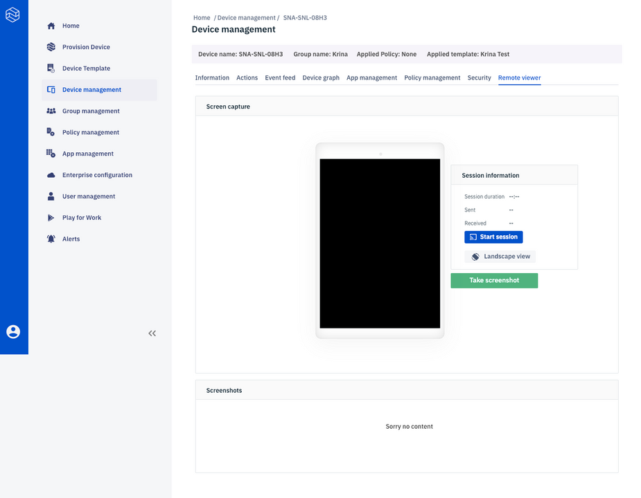

*   The session automatically ends after 15 minutes. You can also stop it by clicking the ‘Stop session’.

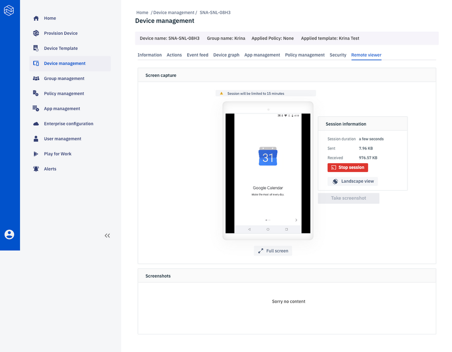

*   The ‘Portrait’ button allows you to turn the screen to portrait as well as landscape mode.
*   Single Device to Cloud session is allowed at a time.

### Remote Control

On Esper Enhanced Devices, or devices that have manufacture signed supervisor plugin in the system, there is an option to `Remote Control` the device. This means that any action such as click performed on the dashboard will result in remote action on the device. 

Through Esper obtaining membership in SEAP (Samsung Enterprise Alliance Program), our platform now supports Samsung Knox specific extensions and as a result can now provide the Remote Control feature available for any Esper provisioned Samsung devices running Knox 3.x.

### Capture Logs

This section lets the user capture bug report from the device in question. You can select the bug report radio button and press the 'Start' button. The status will change from `Requesting Report` to `Permission Granted` to `Download`. The last status 'Download' is a link that will download the bug report with date and time stamp from the device to help your technical staff debug any issues. If device user denies the permission to share the logs, the status will change to `Permission Denied by User`.

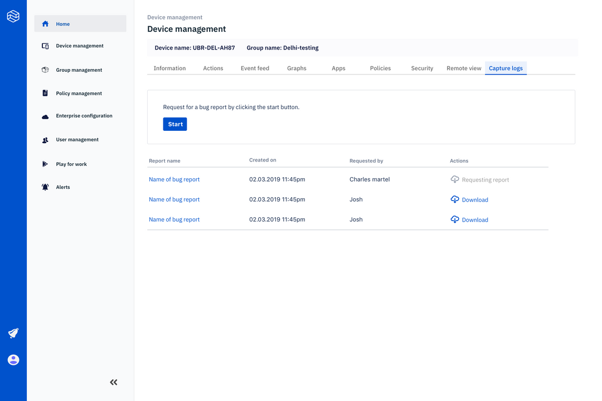

:::tip
Please note that the user on the device side needs to swipe down the notification bar and click on the bug report line. On being prompted, the device user needs to choose `Share`. If they choose `Decline` the Bug Report will not be shared.
:::
