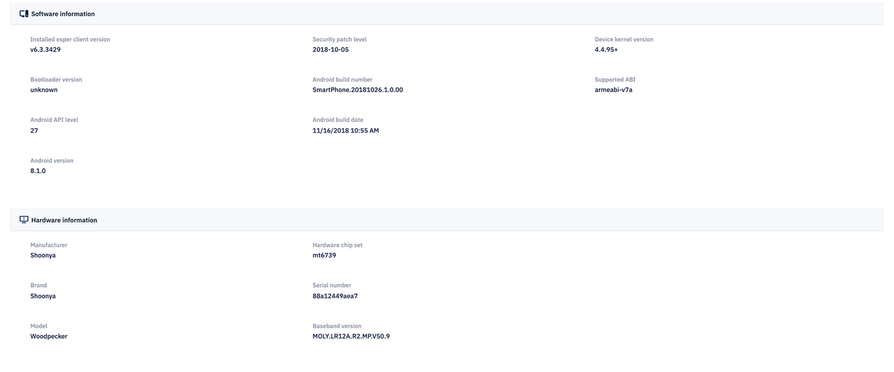
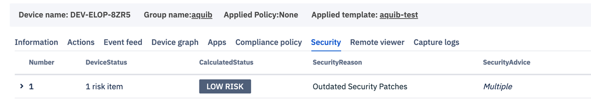

# Device Features (for individual devices)

## Information

This is the first tab that comes in view when clicking on `Details` on the Device Tile. This section consists of extensive amount of information regarding the device such as -

- Battery information (Status of charge, current temperature)

- Storage (Total available, used, internal and OS occupied storage)

- Memory (Total, in-use, average used, free)

- Location on map - It might take time sometimes to show up as its an external Google EMM api call for GMS devices. If the device does not show its location, it can helpful to reboot the device. In most cases, for GMS as well as non-GMS devices, location should start showing after staying connected to a network for 30 minutes or so.

- Device code, Registered on, Template name, GMS/Non-GMS

- Software information (installed esper client version, security patch level, device kernel version, bootloader version, android build number, supported ABI, Android API level, Android build date and Android version)

- Hardware information (Manufacturer, Hardware chip set, Brand, Serial number, Model, Baseband version)

- Network information (IMEI/MEID, Mac Address, DNS, Wifi Mac ID, Cellular network status, Wifi Access point, Connectivity duration, IP address, Ethernet status)
- Display Information - Resolution, Refresh rate

Additionally, on the top under breadcrumbs, Device name, Group name (that it belongs to), Applied Policy and Applied template are shown.

### Device Information View

    

## Device Settings

Device actions or setting changes to be performed on a device from dashboard can be done from this section. There are capabilities such as Reboot, Screen lock, Heart beat, Device Lockdown, Wipe, Device mode, increase or decrease brightness, volume, change screen orientation, screen timeout settings, wifi settings, GPS, Bluetooth and ADB settings that can be changed from this section.
Below is screenshot of the complete Device Settings page with tabs closed -
 

 
Another view with all tabs open -
 

 

 
Let's get into details of each action and setting below -
 
### 1. Reboot
 
Click on the ‘Reboot’ option and then confirm to reboot the device remotely. This can help in case there is trouble communicating with the device.
 
### 2. Screen Lock
 
To lock the device screen , click on ‘Lock device’ and confirm the same. In this case, Device user will need to enter device password (if it has been set) in-order to use device again. This can be used to avoid unwanted usage if device falls in wrong hands.
 
### 3. Heart beat
 
Esper Managed devices are continuously talking to our Cloud and updating their statuses every minute. If they are dozing off due to inactivity or bad network connection, our Cloud will internally wake them and ask for a status update.
 
The Hear beat or Ping command is used to do the same task manually. It request device to send the freshest status update to the cloud dashboard. It can also be used to check whether the device is online.
 
 
### 4. Device Lockdown <Badge text="New" type="tip"/>

This feature is introduced to completely lockdown the device in case of unauthorized usage or relocation etc. For example if a user takes device outside of the authorized area, or a company decides to prohibit user from using the device, they can do a complete lockdown. In this case, a custom message can be entered which will show on screen, for example a contact number to call or email.
 

 
When you click `Lockdown`, a custom message text box appears where user can enter the text they want the device user to see.
 

 
As a result, when the device is locked down, the user sees the following screen -
 

 
After locking down a device, the button will change to `Unlock` to give admin access to unlock the said device.
 

 
 
 
 
### 5.Wipe device
 
In order to wipe or factory reset the device, click on ‘Wipe device’ tile. Toggle the external storage to ON if you want to wipe the external storage also.
Confirm by clicking ‘Wipe’ and the device will be automatically Wiped.
 
This command can be used if the device needs to be reprovisioned with a different template. It can also be used if device system has crashed and is unusable currently. Factory reset will bring it back to original factory settings which can be freshly configured for company purpose.
 
### 6. Switch Device Mode

Now you can remotely change the device mode between Multi app and Kiosk as well as change the Kiosk mode app using the Esper Console.

To give some more background, Multi-app mode is device mode in which user sees the all approved apps on the home screen and can use any of these apps as per their requirement.

However, the Kiosk mode is device mode where the device acts like a "kiosk" such that user may only use the kiosk app for one primary functionality.

We have not made it possible for the dashboard users to easily and remotely switch between the two modes. It is also remotely possible to switch the app that you wish to act as Kiosk app in the Kiosk mode.

Just go to Devices > Details for the device you wish to change. Then go to Settings > Device mode > Change.

In the screen above you see that the device is in Kiosk mode and the app pinned acting as Kiosk app is bbdaily. If you wish to change the Kiosk app, simply click on 'Change.'

This brings up a dialog box that enables you to choose a different apk for Kiosk mode. Note: This apk could be any Private apk that was previously installed on the device

In this dialog box that appears on the right side, you may choose the mode you wish to run on your device. If you choose Kiosk mode, you have the option to choose any of the apps that show up in drop down.

Click Save.

The Device Mode will now show Pinned app as the one you selected. In this example, it shows Candy Crush Saga.

If you wish to change the mode, for example to Multiapp, simply click the radio button on the dialog box -

Click Save.

Now the Device will be in Multi-App mode and you will see an option to switch to Kiosk Mode on the Device Settings screen. Clicking on this will again bring up the same dialog box where you may choose the mode and app as per your requirement.

### 7.Display

This section is related to the display settings of the device. Following settings for the device can be controlled from this section -

1. Increase or decrease the brightness of the screen.
2. Change the screen orientation to -   -auto rotate - Screen will change orientation as per the orientation of the device.   -landscape - Screen will always stay in landscape mode.   -portrait - Screen will always stay in portrait mode.  
3. Select screen timeout duration - User can choose a configurable timing after which the device will lock the screen. 

### 8. Sound 

This section is related to the sound settings of the device. Following settings for the device can be controlled from this section -

1. Alarm volume
2. Notification volume
3. Music volume
4. Ring volume

### 9. WiFi & Internet

This section is related to the Wifi and Internet settings of the device.

WiFi - User can toggle on/off the Wifi for the device. This can be done if the device has an alternative connection available such as cellular network via sim card.

:::tip In case the dashboard user tries to switch off WiFi when no other connection is available, in-order to maintain communication with the cloud backend, the device will turn WiFi on automatically after attempting to find alternative internet connection for 10s. :::

WiFi access points - User can predefine preferred WiFi networks by entering WiFi access point details such as WiFi SSID, WiFi Security Type, WiFi Password and whether its a "Hidden" network.

The device will automatically connect to the given WiFi access points as per the availability and network strength.

:::tip The WiFi on/off and WiFi access points feature are not available for android 10.0 and above :::

### 10. Location

This section relates to the settings pertaining to the GPS accuracy of the device.

There are 4 GPS accuracy settings -

1. High Accuracy - Choosing this option will optimize for accuracy using extra inferences and heuristics for quicker location resolution.

2. Device Only - Choosing this option will just use GPS chipset of device and will not use any extra inferences or heuristics. This can slow down location resolution.

3. Battery Saver - This option will optimize for longer battery life at the cost of accuracy of location.

4. Off - Turns of Device GPS.

### 11. Bluetooth & Devices

This feature will allow user control over bluetooth connection of the device. Turning off the toggle button turns Off the bluetooth on device. When on, the information under "Paired devices" will show the number of devices paired and whether they are connected.

For example when no device is connected -

When a device is paired as well as connected -

Here, the device name as well as its IP address and connection status is shown. If the device gets disconnected, it will continue to show in the Paired list but the connection status will shows as "Disconnected."

Until the device user removes the device by choosing to "Forget Device" from the list of paired bluetooth devices, it will continue to show in the "Paired devices" list on Dashboard.

### 12. ADB access

Google defines ADB as “Android Debug Bridge (adb) is a versatile command-line tool that provides access to Unix shell to communicate with an android device.

Turn on ADB of your Esper Managed Device with easy by turning on the ADB toggle button. Use the drop down menu to turn on adb for a configurable time period.

You may also choose the Always On option to keep ADB on. However, Esper does not recommend this practice as ADB is a gateway to communication with core of device and should be used in a highly secure manner.

In case dashboard user needs to turn on the adb for communication to device for purpose of debugging or run external tools, they may choose to enable it from here. Below are the time configurations for which adb can be turned on-

- Always On
- 1 hour
- 3 hour
- 8 hour
- 1 day

After the completion of this time period from the point of provisioning, the ADB will automatically turn off for the device.  

### 13. Timezone

With our supervisor plugin, we have enabled you to change timezone of device remotely via dashboard.

:::tip Timezone feature is only available for devices which are running Esper Enhanced Android or the devices for which Esper's supervisor plugin has been signed by the manufacturer of the device. :::

[Return to View More](../../../console.md)

## Device Graphs

This section represents the graphical representation of the various attributes of a particular device whose ID is displayed at the top. The values that can be monitored includes information related to battery, memory, WiFi, and their usage over time.

With the new Telemetry Cloud infrastructure in place, Esper Device metrics have now increased to 15 metrics that can be accessed via Device graphs:

1. Battery Current
2. Wifi Signal Strength
3. Available Internal Storage
4. Wifi Link Speed
5. Data Usage (Download)
6. Data Usage (Upload)
7. Battery Capacity Total
8. OS Occupied Storage
9. Battery Current Average
10. Battery Capacity Count
11. Available RAM
12. Battery Level
13. Battery Voltage
14. Wifi Frequency
15. Battery Temperature

However, if a device stays inactive for more than 7 days, you will see an empty state requesting to activate the device:

## Apps

This sections lists the Apps that are installed on the device along with the App name, App type, Version code, Package Name, App state and Actions. The apps that are already installed in the device are specified in this list including Private, Preloaded (In-ROM) and Google Apps.

An App can have 3 states - Show, Hide and Disable. This is useful for apps such as IN-ROM apps that sometimes can not be uninstalled but can be disabled. For all installed apps also, there is an option to Show or Hide from the device home screen.

On the left side, you can choose between All apps, or to filter the list to just Enterprise (or privately uploaded) apps, Google apps, or Preloaded (IN-ROM) apps.

Additionally, there is a New App Install button, search bar and filter on top left and top right corners -

The filter lets you view apps with app state in Show/Hide or Disable.

The New App Install button lets you install new apps on the device. A dialog box appears as below -

You may select the app from the list of all approved google apps and all uploaded private apps. Then you may select the app version number.

Finally click 'Install'.

A progress bar is seen with a final message informing of app installation success. If an error occurs, user will be informed of the same. Please do not hesitate to reach out to us at support@esper.io for any issues.

Additionally, there is a search bar available on top left corner of app list that lets us search for apps via its name-

The app list is paginated as can be viewed at the bottom.

**Actions**

The Actions column is where it gets interesting. On clicking the ellipsis button on the right end, you will see actions such as -

1. Uninstall - uninstalls the apps. Note that some IN-ROM apps can not be uninstalled. When you click 'Uninstall', a dialog box appears on right collapsible sidebar such as this -

    

    Click on 'Yes, Uninstall' to uninstall the app. The following progress bar will show -

    

    

    Click Close and the app gets uninstalled from device and disappears from the device.

2. Clear Data - clears app data. Similar pop up and progress bar show up as uninstall action -

    

    

3. Set App Permission - This lets user define detailed app permission such as location granularity, access to camera, read phone state and writing to external storage.

    On clicking this, a dialogue box appears such as below -

    

    Simply choosing the options from the dropdown will execute the command. The permissions which are available to choose are dependent on the type on IN-ROM app that is being looked at.

4. Set App State - As stated above, an app can have 3 states - show, hide and disable. This action give us control over the apps state.

Clicking on this brings up this dialog box -

Show - installed and visible on home screen.

Hide - installed but not visible on home screen.

Disable - installed but can not be used.

Here you may click on any of 3 states to choose the state for the app selected. Click Save changes.

:::tip Please note that some In-ROM (preloaded) apps are designed to be uninstallable by the device manufacturers so they can be hidden but can not be uninstalled. :::

## Compliance Policy

If user wants to switch to a new policy, they can select from the drop down menu and apply it. To create a new policy, click [here](../../../../home/console/device-management/-/index.md#compliance-policy).

## Security

This page will inform user of security risks that device is facing. If there are any risks, it will show the threat level, cause of the threat, and advise user to secure the device.

The security risk calculation and advise is done on basis of whether the devices that show signs of tampering or having been rooted. A device that has been tampered with for example, will be considered High Risk. An emulator or virtual device will also fall in High Risk category.

Following are the criterion and details based on which the security risks are calculated -

1.  **BasicIntegrity** - BasicIntegrity gives you a signal about the general integrity of the device and its API. Rooted devices fail basicIntegrity, as do emulators, virtual devices, and devices with signs of tampering, such as API hooks.

2.  **CtsProfileMatch** - CtsProfileMatch gives you a much stricter signal about the compatibility of the device. Only unmodified devices that have been certified by Google can pass ctsProfileMatch. Devices that will fail ctsProfileMatch include the following:

    a. Devices that fail basicIntegrity

    b. Devices with an unlocked bootloader.

    c. Devices with a custom system image (custom ROM)

    d. Devices for which the manufactured didn't apply for, or pass, Google certification

    e. Devices with a system image built directly from the Android Open Source Program source files

    f. Devices with a system image distributed as part of a beta or developer preview program (including the Android Beta Program)

    When present, the advice parameter provides information to help explain why the SafetyNet Attestation API set either ctsProfileMatch or basicIntegrity to false in a particular result. The parameter's value contains a list of strings, such as the ones in the following example:

        {"advice": "LOCK_BOOTLOADER,RESTORE_TO_FACTORY_ROM"}

3.  Security Patch Version - Last updated security patch version

Device: Device will send the above 3 fields in DeviceStatus and Device API. BasicIntegrity and CtsProfileMatch will be calculated on 3 instances:

1. During provisioning
2. When Requested from Dashboard
3. After every 5 hrs.

### Security Dashboard

Cloud will receive the above values and figure out the the security state, reason and advise.

- If Basic Integrity is false, then its a high risk device(<=5 points)
- If Basic Integrity is true, little more weightage to ctsProfile(3) then Security patch(2) out of 5 points. if both are false (= 5 points), consider medium risk.
- If Basic Integrity is true, Ctsprofile is also true and patch version is > 3 months old, then consider as a low risk.

### Points Table:

- 0-5 points → High Risk
- 5-7 points → Medium Risk
- 8-9 points → Low Risk
- 9-10 points → Secure

## Remote Viewer

The remote viewer section lets the user remotely view the device and take screenshots of a remote device.

To remotely view a device:

- Click on "Remote viewer."

- Click on the ‘Start session’ button. On devices using Android 9.0 and above, a secure connection will get established and device screen will be streamed on the dashboard. On devices Android 8.1 and earlier, users would see a permission prompt informing them of the remote session. Once the remote view request is allowed, a secure connection will get established and device screen will be streamed on the dashboard.

- The session automatically ends after 15 minutes. You can also stop it by clicking the ‘Stop session’.

- The ‘Capture screenshot’ button will capture the current screen of the device. There is a recorded history of all screenshots captured per device under the screenshots section.

- The ‘Portrait’ button allows you to turn the screen to portrait as well as landscape mode.
- Only a single device-to-cloud session is allowed at a time.
- The ‘Full Screen’ button allows you to remotely view the device in full screen mode.

While in Full Screen mode using Remote Control, a widget at the lower right corner of the screen will enable navigation on a remote device that has hard keys. If the control widget happens to overlap with the frame, grab and move it to a clear space on the Console screen.

### Remote Control

On Esper Enhanced Devices, or devices that have manufacture signed supervisor plugin in the system, there is an option to `Remote Control` the device. This means that any action such as click performed on the dashboard will result in remote action on the device.

You may interact with the remote device using your mouse as though you were touching the screen locally. 

Through Esper obtaining membership in SEAP (Samsung Enterprise Alliance Program), our platform now supports Samsung Knox specific extensions and as a result can now provide the Remote Control feature available for any Esper provisioned Samsung devices running Knox 3.x.

#### Hardware Keys and Keyboard Events

This feature is an enhancement that allows you to click on the device screen while remotely viewing the device on the dashboard and getting the response from the device as though it was actually clicked on.

Some devices do not have soft keys for home, back and recent instead, they are hard keys physically on the device itself. As a result, the Remote Control view of the device was not allowing users to be able to navigate the device.

We have enabled the hardware keys and keyboard events so that a virtual set of keys are represented on the Remote Control screen even for devices that have only hardware keys for this purpose. Additionally, we have enabled keyboard events so users can use the keyboard on their system to type and are not forced to use the keyboard on the device by clicking on each character using the mouse pointer. This makes the experience of remote control more convenient as we continue to improve.

Note that Remote Control is only enabled on devices where Esper’s locally installed agent has been signed by the device maker’s platform key. As we are a Samsung Knox partner, the remote control is typically available on Samsung models. Contact us if your device is not supported as of now, we can work with the device maker to get the necessary signing done.

### Capture Logs

This section lets the user capture bug report from the device in question. You can select the bug report radio button and press the 'Start' button. The status will change from `Requesting Report` to `Permission Granted` to `Download`. The last status 'Download' is a link that will download the bug report with date and time stamp from the device to help your technical staff debug any issues. If device user denies the permission to share the logs, the status will change to `Permission Denied by User`.

:::tip Please note that the user on the device side needs to swipe down the notification bar and click on the bug report line. On being prompted, the device user needs to choose `Share`. If they choose `Decline` the Bug Report will not be shared. :::
