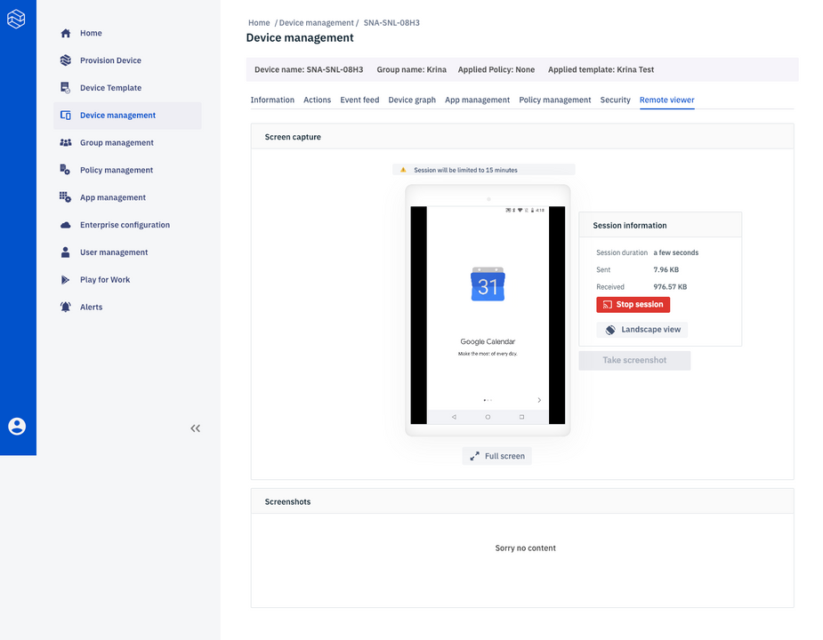

[Introduction](../../../../console.md) / [Devices](../../index.md) / [View More](../index.md) / Remote Viewer

# Remote Viewer

Average reading time : {{ $page.readingTime.text.replace(' read', '') }}

How to remotely view your device

*   Remote viewer is a feature which allows one to observe the device remotely. Whatever happens in the device can be monitored live.
*   The ‘Capture screenshot’ icon will capture the current screen of the device and can be viewed below along with other screenshots taken earlier.

*   For remote viewing of the device we need to click on the ‘Start session’ icon. This will establish a secure connection with the device and can be viewed in the screen on the side.

*   The session automatically ends after 15 minutes. You can also stop it by clicking the ‘Stop session’.

*   The ‘Portrait’ button allows you to turn the screen to portrait as well as landscape mode.
*   Single Device to Cloud session is allowed at a time.

[Return to View More](../index.md)
