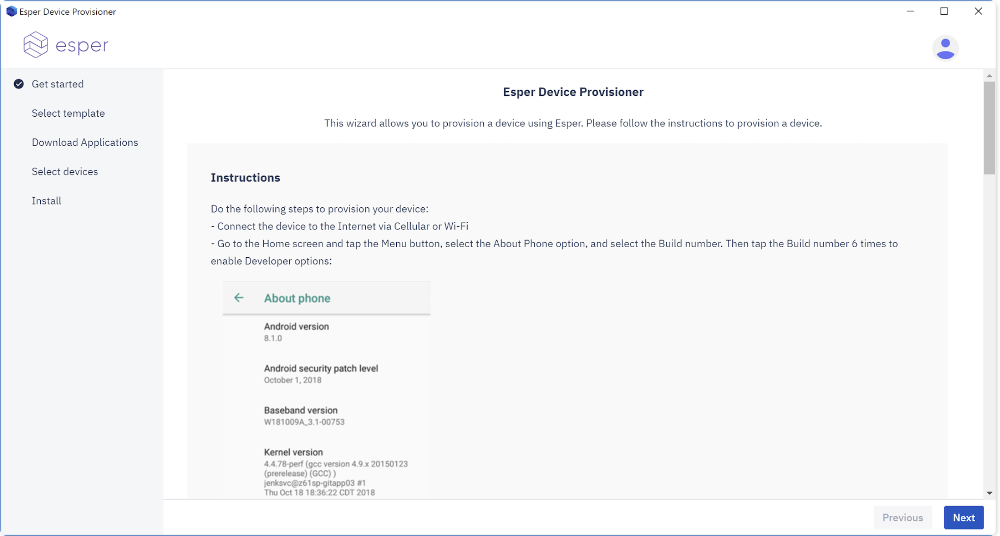

# Provisioner Tool

For the ease of our customers, we have created a tool for Provisioning which uses internally the ADB (Android Debugging Tool) and works for both Non-GMS and GMS devices.

This method can be used to provision most android devices regardless of whether they are -

- GMS or Non GMS
- Have a camera or camera-less
- All Android versions including 4.x and 5.x

We have made it super user friendly and it takes the user step by step indicating the progress in mini log seen on screen.

Pre-req - Admin needs to have an Esper endpoint access, create a device template and have the device physically available and connected to the computer via USB.

Download the compatible version for Windows and Mac system and follow the steps to provision via Provisioner Tool from [here](../../../provisioner.md).

[Return to Provision Device](../index.md)
