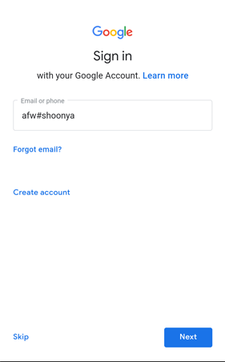

# AFW (Android for Work) Provisioning

Android devices that have Google Mobile Services (Gmail, Google Account ) can be provisioned into Esper management console using AFW provisioning method. To being provisioning device needs to be factory reset.   <mark> <i> Note: AfW Provisioning method is NOT available for Android devices with Android version below 6.0.\* </i> </mark>  

In the Esper Console, a device template needs to be created

* Go to **"Provision device"** tab.
* Choose the "Device template". If you do not have a saved **"Device template"**, create a [Device Template](../../../device-template/index.md). 

* Generate a QR Code.

Next the device needs to be setup the device to scan the QR Code generated by the Console.

* [Factory Reset your device](../../howtofactoryreset.md),

In the boot up screen click on **"Start"**:

* Device needs to be connected to the Internet either using the Mobile network or WiFi

* When presented with the **"Copy apps & data"** screen, select **"Set up as new"**:

* Enter **afw#shoonya** in the Google Sign in screen, then click **"Next"**:

* Click **"Install"** for Esper Device Management:

* Then for Esper Device Management, click **"Install"**:

* On **"Set up your device"**, click **"ACCEPT & CONTINUE"**:

* For **"Esper Device Management"**, make sure the toggle to **"Allow display over other apps"** is turned on:

* When the QR Code scanner appears, scan the QR generated that you have generated using the Esper Console:

* The **"Google check activity for security problems"** dialog box pops up. Click **"Accept"** as this allows the required app installations:

* Now give permission to allow app modification and continued provisioning by clicking **"Resolve"**:

* Grant permission to Esper Device Management to modify system settings:

* The device is now provisioned:

[Return to Provision Device](../index.md)
