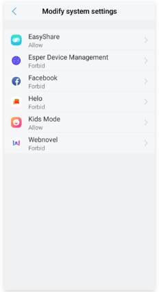
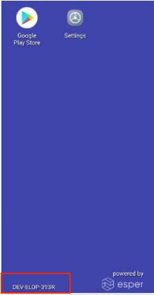

# AfW (Android for Work) Provisioning

Android devices that have Google Mobile Services support (Playstore can be found on such devices) can be provisioned into Esper management console using AfW provisioning method. To begin provisioning, device needs to be factory reset.   

Prerequisites for this method - 

- Devices that have GMS (Google Mobile Services) support enabled
- Devices with a camera for QR code scanning
- Android 6.0 and above
- Factory reset required

The console will take you step by step through the process of AfW provisioning. You may follow through these steps easily by clicking Next.

The below steps are a more detailed version of the same steps for provision via AfW method. It is more or less the same as the console guidelines however, it has some extra screenshots - 

Step 1.  [Factory Reset your device](../howtofactoryreset.md),

Step 2. Once the factory reset is completed, in the boot up screen click on **Start** (Sometimes the yellow button will say **Setup Your Phone**)

Step 3. Device needs to be connected to the internet either using the Mobile network or WiFi

Step 4.  When presented with the **"Copy apps & data"** screen, select **"Set up as new"**:

Step 5.  Enter **afw#esper** in the Google Sign in screen, then click **"Next"**. afw#esper is the keyword with which Google (our certified EMM partner) will recognize that this device is to be registered with Esper.  

Scan the QR code using device scanner

Step 6.  Click **"Install"** for Esper Device Management:

Step 7. On being prompted if you want to install Esper Device Management, click **"Install"**

Step 8. On the screen where you see **"Set up your device"**, click **"ACCEPT & CONTINUE"**

Step 9. For **"Esper Device Management"**, make sure the toggle to **"Allow display over other apps"** is turned on.

Step 10. A QR Code scanner will appear on your device once Esper agent is downloaded.

Step 11. Now you need to bring up QR code of the template you wish to provision your device with. This can be done either from the Device Template section by clicking on the 'View QR code' link at the bottom of tile for the desired template as shown below - 

Or it can be done by choosing the template from drop down shown in step 6 of the guidelines given in Esper console for AfW provisioning method as shown below- 

In both cases, a QR code will appear on the Esper console that should be  scanned via the QR code scanner which appears on the device in the previous step.

Step 12. Bring the template QR code as shown above in the square QR code scanner of the device. You may need to move the device closer or further from the QR code screen and click on the scanner to capture the QR code. 

The QR code is heavy with information so in case the device camera has trouble scanning it, use the below tips for help in scanning - 

- Increasing brightness of QR code screen
- Changing the distance from screen ie move your device closer or further from the QR code.
- Hold the device still for a few seconds once you have adjusted the distance.

Step 13. You might see a pop up from Google security as shown below.  Click **"Accept"** as this allows the required app installations:

Step 14. Give permission to allow app modification and continued provisioning by clicking **"Resolve"**

Step 15. Select Esper Device Management from the list

Step 16. Grant permission to Esper Device Management to modify system settings

Step 17. Wait for few more moments and your device is now provisioned:

Step 18. This is how a device with basic template and no apps will look like. The device code is shown highlighted in the image below -

[Return to Provision Device](../index.md)
