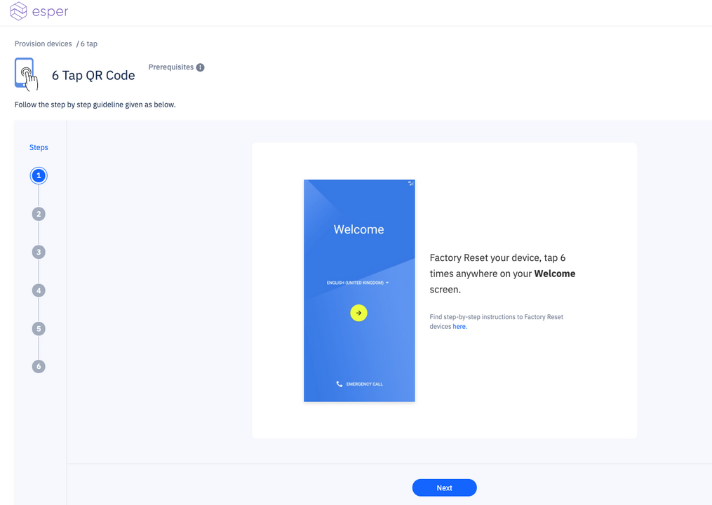
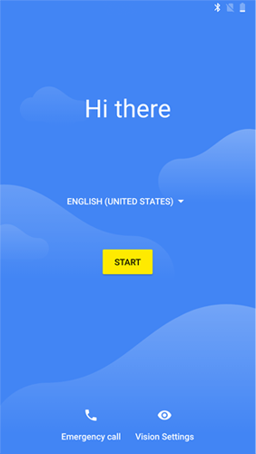
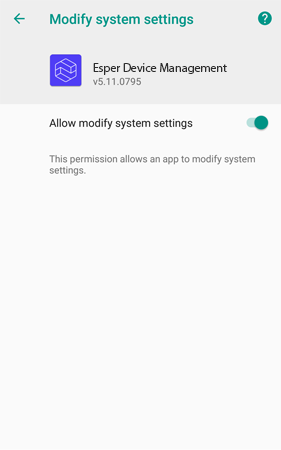

# QR Code Provisioning

This page describes how user can provision their devices using the **QR Code** Method.

Similar to the AfW method, the device needs to be prepared for provisioning by bringing up the QR code scanner.

A QR code is generated in the Esper Console using a [Device Template](../../device-template/index.md). It is scanned using the device to complete the provisioning.

Follow the below steps to provision a device using the 6 Tap QR code method-

## Steps to take for 6-Tap QR code Provisioning

Android devices that have Google Mobile Services support (GMS devices that support Play Store) can be provisioned into Esper management console using 6 Tap QR code provisioning method. To begin provisioning, device needs to be factory reset.   

Prerequisites for this method - 

- Devices that have GMS (Google Mobile Services) support enabled
- Devices with a camera for QR code scanning
- Android 7.0 and above
- Factory reset required

The console will take you step by step through the process of 6 Tap QR code provisioning. You may follow through these steps easily by clicking Next.

The below steps are a more detailed version of the same steps for provision via AfW method. It is more or less the same as the console guidelines however, it has some extra screenshots - 

The device to be provisioned needs to be prepared via the following steps:

Step 1. [Factory Reset your device](../howtofactoryreset.md), choose your **language**, and then **tap 6 times** anywhere on the screen

Step 2. You will now see the **QR code setup** screen, continue by clicking **'Next'**.

Step 3. Connect to your Wi-Fi network:

Step 4. A QR code scanner will appear on your screen -

On the dashboard, go to Device Template, choose the template you wish to provision your device with and click View QR code to see below-

This QR code can also be generated by following provisioning guideline for 6 Tap QR code method step 3.

Scan the QR code generated on the dashboard.

- On **'Set up your device'**, click **'ACCEPT & CONTINUE'**:

- On the **"Google check activity for security problems"** screen, click **'ACCEPT'**:

- Give permission to allow app modification by clicking **'RESOLVE'**:

- Grant permission to Esper Device Management under **'Modify system settings'**:

- The device is provisioned:

[Return to 6-Tap Provisioning](../index.md)

[Return to Provision Device](../index.md)
