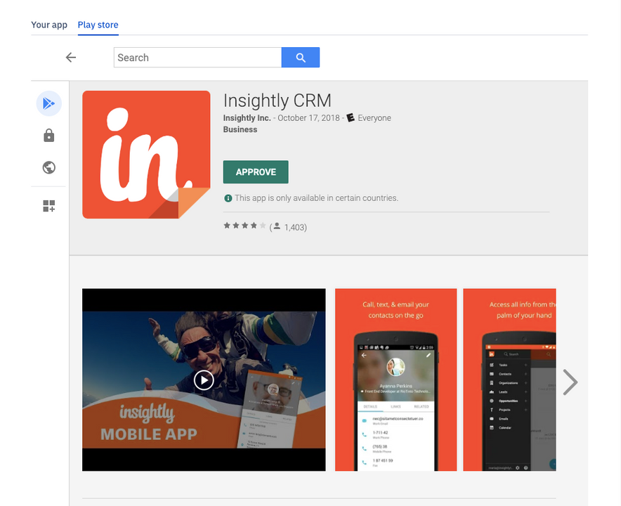
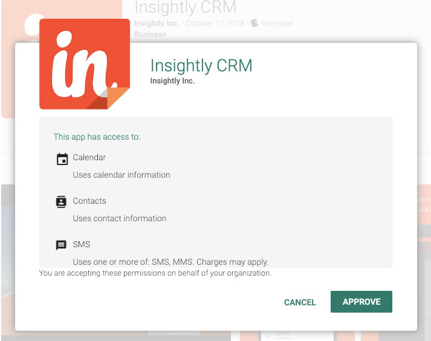
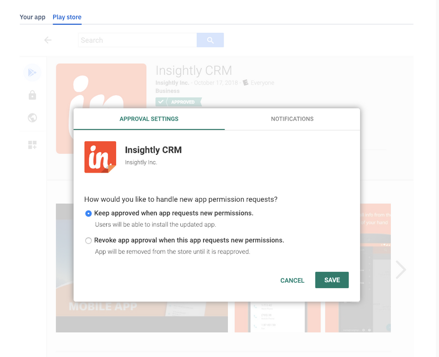
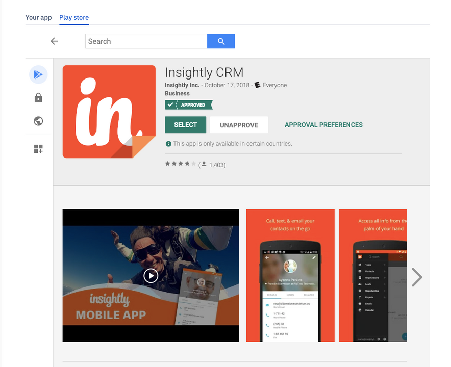

[Introduction](../../../console.md) / [Device Template](../index.md) / How to Approve a Google Play Store App

# How to Approve a Google Play Store App

### Steps to approve an app

The second tab **"PlayStore"** is a view to Google Play Store on our website. You may **approve** apps on the Play Store. The **approved apps** will then show in the list of Steps to approve an app from the play store:

**Step 1**: On play store tab choose your **app** to be approved

**Step 2**: Click on **Approve**

**Step 3**: Click on **Approve**

**Step 4**: Click on **Save**

**Step 5**: Your app is approved now click on **"Your app"** tab and select the app you approved. Click **Next**.

[Return to Device Template](../index.md)
