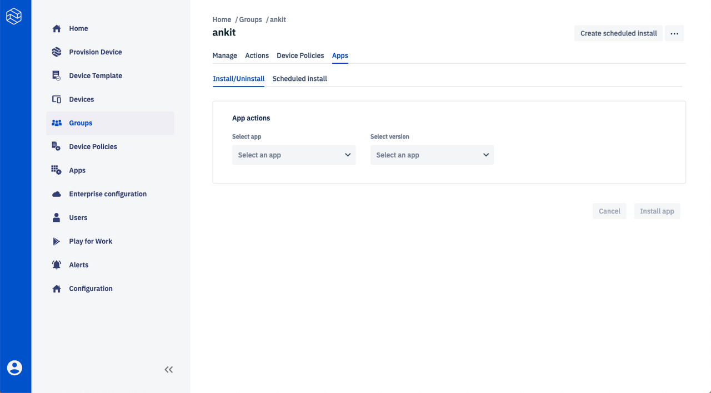
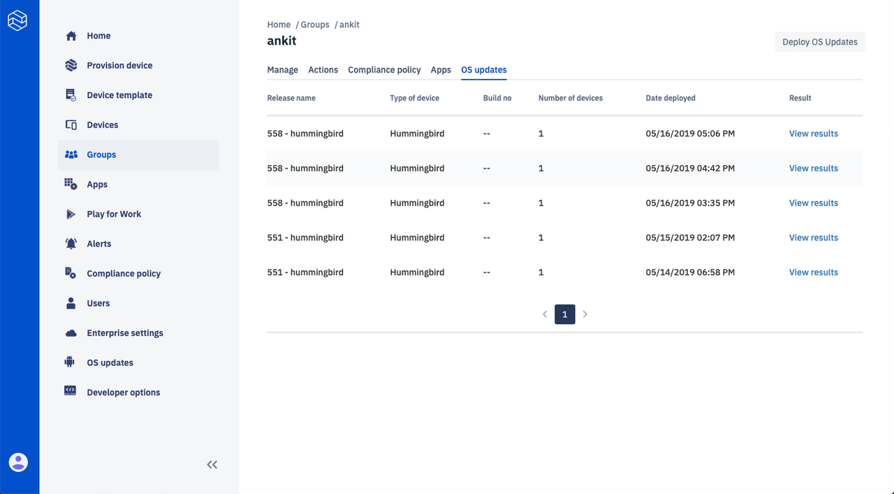
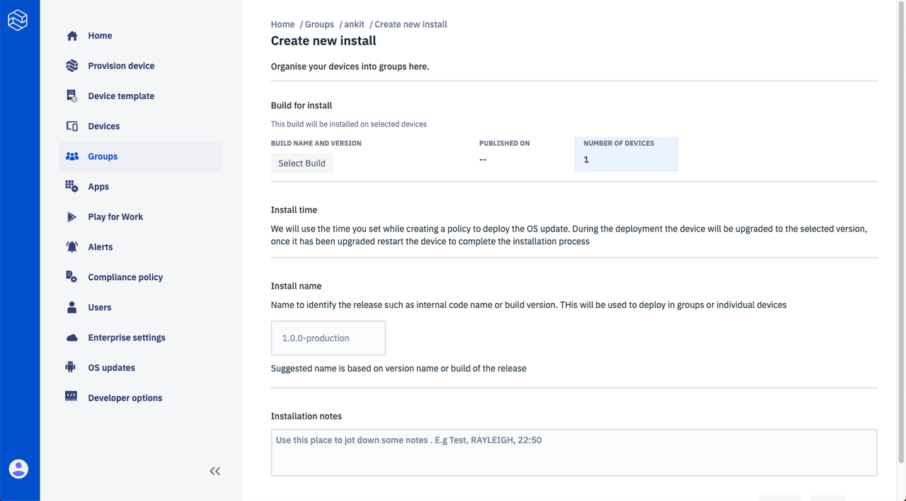
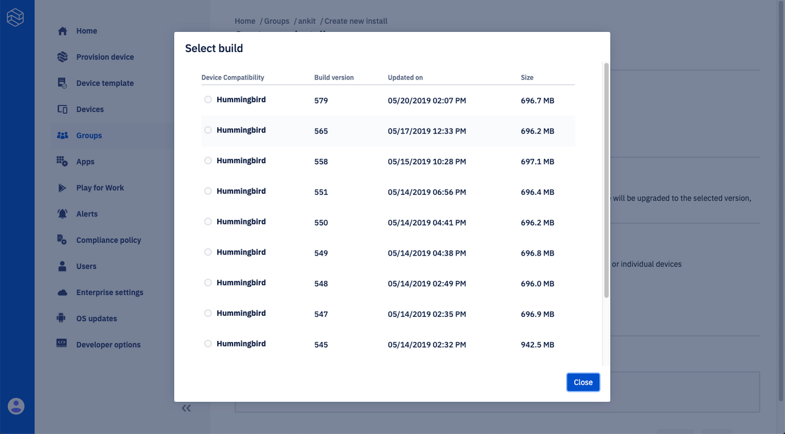

# Groups

Learn about Esper's Group Management.

Using Groups devices can be sectioned into groups and mass actions can be performed on a group of devices. You can create a Group by entering a unique name. Once you create a Group, you have the option to add from all existing provisioned devices which exist in the **"All devices"** group. Users can also create a Group during [template creation](../device-template/index.md).

You can delete a Group by selecting one or many Groups using the top right button **'Delete group'**. There is also an option to refresh. Additionally, a search capability for search via group name has been provided. The Group tile will show the name and number of devices in the Group:

On clicking **'View more>'**, you can take actions such as reboot, lock, ping, and wipe for the devices in the Group:

You can change a policy for all the devices in a Group:

You can install apps to all the devices in a Group:

You can also schedule app installation for the Group:

You can click on **'View Results'** to see the number of successful and unsuccessful device installations:

If your devices are using Esper Enhanced Android, you will also see a tab for **"OS updates"**.

Here you can see a list of the Esper Enhanced Android updates that have been made on the current group with details such as build number, device type, number of devices, and date deployed along with an option to view the details:

By clicking on the **'Deploy OS Updates'** button you may choose any available Build number by then clicking on **'Select Build'**. 

:::tip
Please note that currently only the latest 30 builds of the Esper Enhanced Android updates will be visible to the user for deployment 
:::

The **'Number of devices'** will populate with the devices in the group on which this update is applicable; this pertains to those that have an OS build version lower than the selected version for the deployment:

You may add the installation name, any pertinent notes, and after that click **'Save'**:

In a future update we will give users the option to choose the time window for their OS update installation.

[Return to Introduction](../index.md)
