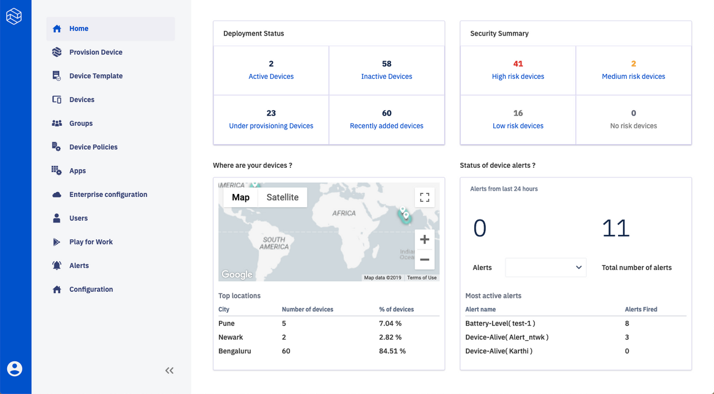

# Home (Dashboard)

This page explains the functionality of the Esper Home Dashboard.

## Getting Started

If you are logging in to your endpoint for the very first time you will see the following screen which gives you a choice to either provision a device or Simulate a device.

You can choose to provision a device the details to which are provided in the Provision Device section of this documentation. Or you may choose to Simulate a Device. You will see a momentary "You are all set!" message post which a mock device will be available for you to experiment and play around with till you provision an actual device.

Simulare helps you explore the Esper platform without using a real device. We provide this simulated device to act as an actual device to help you experience the capabilities of our platform.

Capabilities such as Apps, Remote View and Capture log might not be available on the Simulated device.

This device is only available for new signups currently.

## Once you have provisioned a Device, you can use the four main sections on the Home Dashboard page:

### 1. Deployment Status

This tile shows the current deployment status of the devices for the current customer environment and includes a clickable link to number of Active, Inactive, Under Provisioning and Recently Added devices. Clicking on each takes the user to the [Device Dashboard](../../console.md#devices) showing the corresponding category of devices.

### 2. Security Summary

The Security Summary tile shows a summary of security status of the deployed devices. It shows how many of them are at High Risk, Medium Risk, Low Risk and No Risk. Clicking on each takes the user to the [Device Dashboard](../device-management/index.md) showing the corresponding category of devices.

### 3. Where are your Devices?

This section gives an overview of the location where all the devices are deployed. You can see a world map showing locations of all the devices in Map and Satellite View. It can be made full screen and user has options to zoom in and zoom out. There is also a summary of cities worldwide containing the highest number of devices.

### 4. Alerts Status

The Alerts Status tile gives a summary of Alerts you've created and Alerts that have been fired for each of the created Alerts. The Alert name can be selected from the dropdown and the number of Alerts fired will then be shown.

[Return to Introduction](../index.md)
