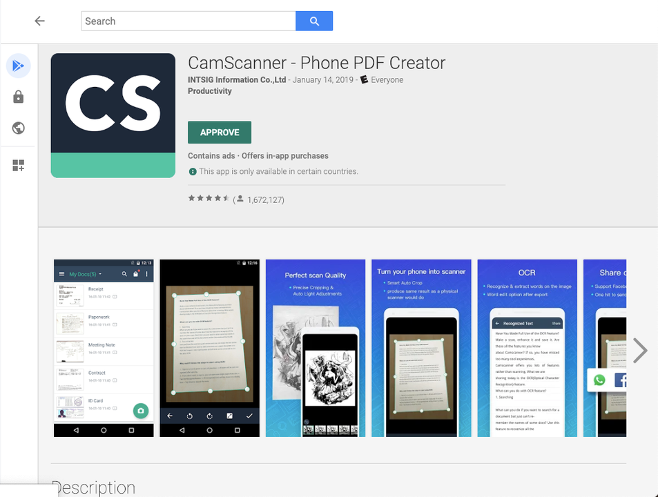
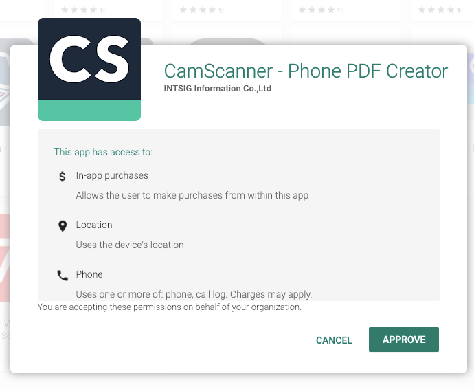
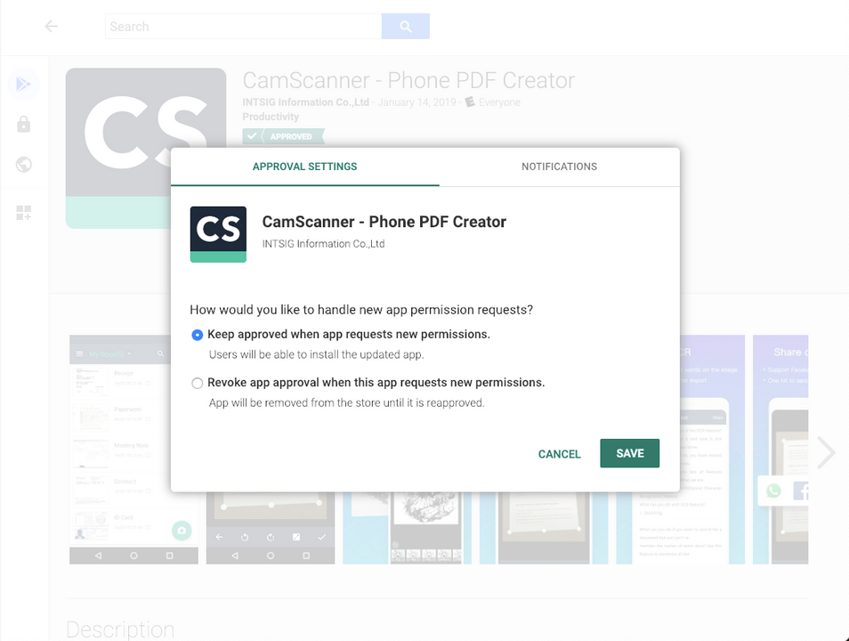
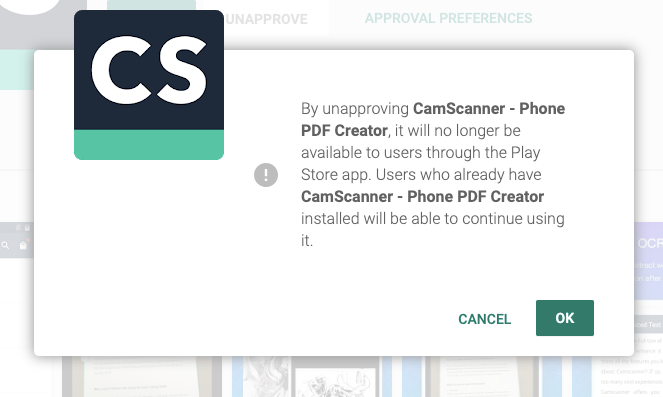

# Play for Work

Learn about setting up Play for Work apps using Esper.

* Play for Work gives you access to the Enterprise version of Google Play.
* Here you can either APPROVE or UNAPPROVE applications that can be downloaded onto your dedicated devices. After an app is approved it be visible on Google Play for device installation:

## Approve an app

* Approve an app by clicking **APPROVE** button.

* Upon clicking APPROVE a pop-up will appear:

* Via the pop-up you can set app permission requests:

* Upon clicking SAVE, your settings will be applied to the app. The dedicated device user can then access it from the Play Store within the given app permission requests:

## Unapprove an app

* Once you click UNAPPROVE, the access to the application is removed from user’s Google Play account:

* Click the OK button to remove the application from user’s Google Play account:

* After clicking OK you will get a message indicating that it was successfully UNAPPROVED:

## Approval settings

Upon clicking OK you will see a pop-up showing the APPROVAL SETTINGS tab and NOTIFICATIONS tab. Choose the desired APPROVAL SETTINGS:

## Notifications

sets up email notifications for anyone requesting new permissions to the specified email address or addresses:

[Return to Introduction](../../console.md)
