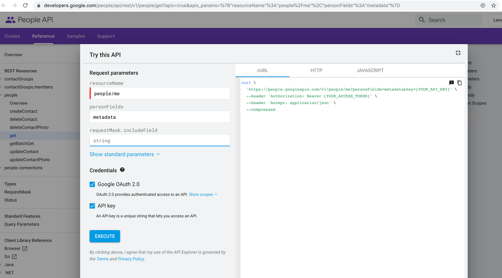
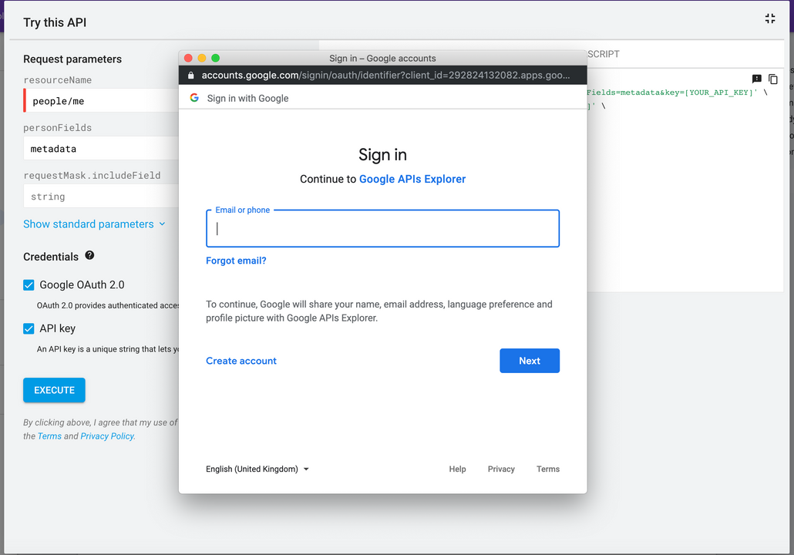
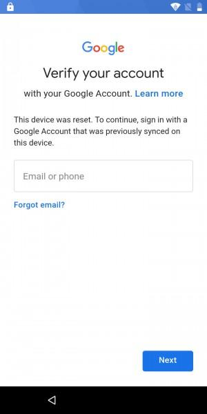

# How To Get Google ID and use FRP (Factory Reset Protection) feature?

In order to get the google account id, please visit [this](https://developers.google.com/people/api/rest/v1/people/get?apix=true&apix_params=%7B%22resourceName%22%3A%22people%2Fme%22%2C%22personFields%22%3A%22metadata%22%7D) page

Click `Execute` button as shown in the image above.

Sign in to you email account or choose the account you wish to sign in with as shown below-

Click `Allow` on this screen-

A pop up will appear on lower right corner. Copy the `id` from this response. This "id" is the Google Account Id that you need to enter on Esper Dashboard under the Factory Reset Protection button on Policy page.

Entering this ID under the Factory Reset Toggle button on Policy (or Template-Policy) will authorize the user to unlock the device post factory reset.

As a result, an unauthorized user can not simply factory reset your device and use it against your permission.

## On the Device

Once your device is factory reset, you will see the following screen on boot. Enter the email account corresponding to the Google Account ID entered in policy and the device will get unlocked!

An unauthorized user can not get through this security feature which protects the device against unauthorized factory reset.

If you forget your google account id or are unable to use this feature and have more questions, email us at andi@esper.io.
