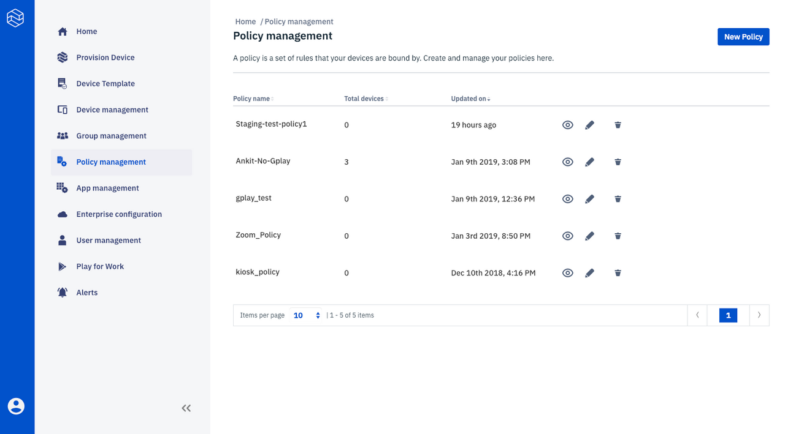
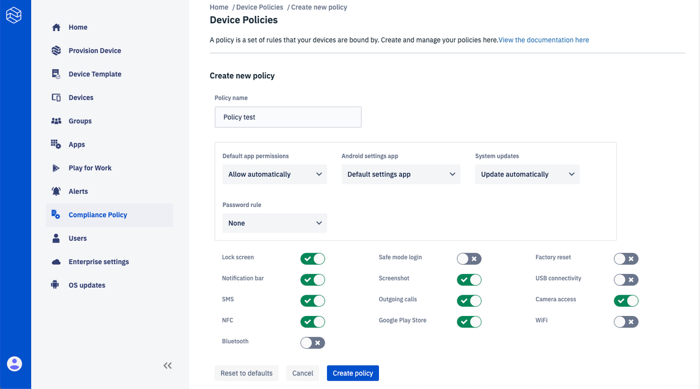
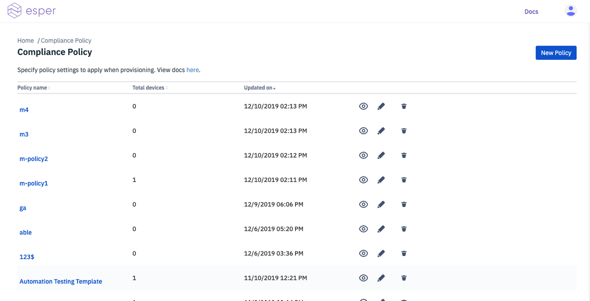

# Compliance Policy

Learn about Esper's Policy Management.

* A policy is a set of rules closely related to privacy and security that a device follows.
* Policies can be viewed, edited, and deleted.
* To create a new policy, click on the **'New Policy'** button:

* Enter the policy details and click on **'Create policy'**:

* A new policy is created and can be deployed on any device.
* The new policy gets listed on the **'Compliance Policy'** page:

[Return to Introduction](../../console.md)
