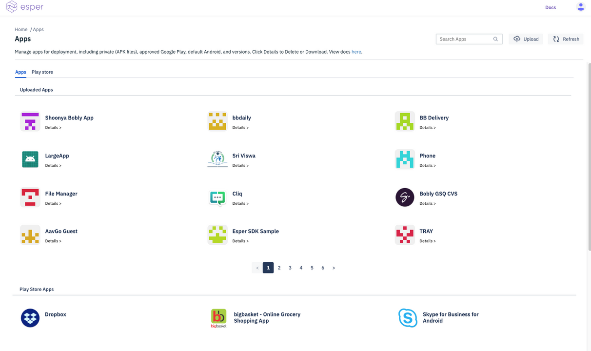
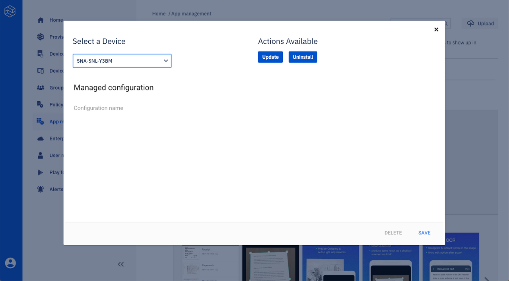

[Introduction](../index.md) / Apps

# Apps

Average reading time : {{ $page.readingTime.text.replace(' read', '') }}s

Learn about Esper's App Management.

This section enables you to manage your applications. You may add the following type of apps to your device:

1.  Upload Private Apps (APK files) to the Esper Cloud.
2.  Install Google Play Apps after [approving](../device-template/how-approve-google-play-store-app/index.md) them.
3.  Install default Android apps.

## Upload Private Apps (APK files) to Esper Cloud:

*   You can upload your own mobile app through an APK file using the upload button on the top right hand corner.
*   There are some rules that the uploaded app must adhere to inorder to succeed upload and provisioning - 
    1. The APK has to have a version name and number.
    2. Max size - 500 MB
    3. Extension - .apk [only]
    4. APK Signature verification 
    5. Latest Android APK standards (currently we allow apks without icons)

*   You can upload your own android app APK file using the upload button on the top right hand corner
*   The uploaded apps will be shown under the 'Uploaded apps' section:

## Install Google Play Apps after [approving](../device-template/how-approve-google-play-store-app/index.md) them:

*   You can also allow a user to download apps from Google Play Store.
*   This requires approving a specific app from the Play Store to allow a user to download the app on their device:

*   You also have the option to handle new 'App Permission Requests' for the approved apps. You can:

1.  Approve the requests for new app permissions so that users can update the installed app.
2.  Revoke the requests for new app permissions so that users cannot update the installed apps.

3\. You can set the option to receive email notification whenever an app requests new permissions by adding the appropriate email address or addresses in the notification settings:

*   You can then select the device you want the app to be installed on by clicking on the 'Select option' and then 'Select the Device':

*   Once the app is installed on the device, a notification shows up indicating the app was successfully installed:

*   You also have the option to update or uninstall the app from a specific device:

*   You can unapprove the app from all the installed devices by clicking the 'UNAPPROVE' button:

*   You can also see all the approved Google Play Store apps under Play Store section:

[Return to Introduction](../index.md)
