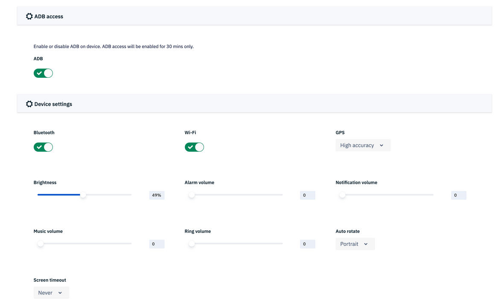

[Introduction](../../../index.md) / [Devices](../../index.md) / [View More](../index.md) / Actions
# Actions

Average reading time : {{ $page.readingTime.text.replace(' read', '') }}

Actions that can be performed on the device from cloud portal

## Device Actions

All the device actions that can be performed are shown.

Select a particular action to perform on the active device.

**1\. Reboot**

Click on the ‘Reboot’ option and then confirm to reboot the device remotely.

**2\. Lock**

To lock the device, click on ‘Lock device’ and confirm the same.

**3\. Heart beat**

If the device has been inactive for a while, it means the device has entered Doze mode during which network activity is disabled.

The Ping device command forces the device to come out of Doze mode and tell the Dashboard it is active.

**4.** **Wipe device**

In order to wipe or factory reset the device, click on ‘Wipe device’ tile. Toggle the external storage to ON if you want to wipe the external storage also.

Confirm by clicking ‘Wipe’ and the device will be automatically Wiped.

## Device Settings

The Device Settings section below Actions lets user choose to make changes in the device settings such as turning on adb, increasing/decreasing volume, brightness, turning on or off bluetooth, choosing portrait or landscape mode for device etc. 
  <mark> <i> Note: Portrait and landscape mode for various devices might be interswitched based on the device manufacturer and OS image installed.  </i> </mark>  

[Return to View More](../index.md)
