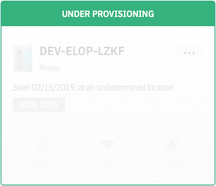

[Introduction](../index.md) / Devices
# Devices

Average reading time : {{ $page.readingTime.text.replace(' read', '') }}s

Manage your provisioned devices here.

You may view all your device details on the Devices dashboard.

### Categories

There are checkboxes on the top of the page with categories such as Active, Inactive, Under provisioning, Devices with low battery, etc. that can be checked to view devices in each particular state.

### Search

Search is provided on the top right where you can search for devices in Devices using the Esper assigned device code which is displayed on the device's home page wallpaper.

## Getting Started

If you are logging in to your endpoint for the very first time you will see the following screen which gives you a choice to either provision a device or Simulate a device.

You can choose to provision a device the details to which are provided in the Provision Device section of this documentation. Or you may choose to Simulate a Device. You will see a momentary "You are all set!" message post which a mock device will be available for you to experiment and play around with till you provision an actual device.

Simulare helps you explore the Esper platform without using a real device. We provide this simulated device to act as an actual device to help you experience the capabilities of our platform. 

Capabilities such as Apps, Remote View and Capture log might not be available on the Simulated device. 

This device is only available for new signups currently.

### Device Tile

The default view is Grid, but the user can click on Maps to access the map view. Under the Grid view each device will be represented as tiles in the ‘Device management’ tab with a summary of all device information such as location, network, health, and risk status of the device. Click on [View More](-/index.md) on the tile for any individual device to see further actions and changes that can be made for this device:

Devices listed 'Under Provisioning' refer to devices where Google Play apps are getting updated:

Devices under 'Applying Policy' refer to devices on which device templates are being implemented:

Devices which have been enrolled on to your Esper Cloud are provisioned devices:

### Map View

Under the Map view, the types of devices can be chosen from the dropdown. Once selected, the device locations are show:.

Once you click on the cluster icon, devices in the cluster will appear. Upon clicking on the individual devices, device information will be displayed:

[Return to Introduction](../index.md)
