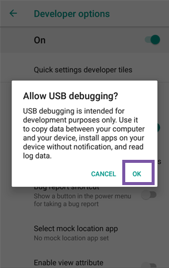

[Provision Device](../index.md) / ADB Provisioning

#### ADB Provisioning

ADB Provisioning for Non-GMS and GMS devices

Please set up a Device Template before performing the provisioning process.

The steps for ADB Provisioning are as follows:

#### Steps on your Device

Do the following steps on the device:

a. Connect to the device to the Internet via either Cellular or Wi-Fi

b. Go to the Home screen and tap the Menu button, select the About Phone option, and select the Build number. Then tap the build number 6 times to enable developer options.

c. Now go back to Settings, and under the Developer options entry select turn on Debugging and then USB debugging.

  

d. Connect your Android™ device to your development computer via USB.

e. Click on the Authorization Dialog box on Android™ device.

 
     
     
#### On your Laptop

[Download and run the esper-provisioner](downloadexecutable.md) executable on your computer. This will first download the ADB tools from the Internet, then download the Esper Device Management app (DPC) from the Esper Cloud
     
   
#### More steps on Device
 f. The Esper Device Management app will then install on the device and assign any permissions required
     
 g. After installation, the QR Code Scanner will be opened up on the device
     
 
     
     
#### Steps on Cloud Portal

Choose a Device Template to generate a QR code. If there are no saved Device Templates, create a Device Template
 
 

6. Scan the QR code generated from the cloud portal

 
 
If you don't have a camera or you don't want to use QR code, Download the config.json file from Template. Place it in the same folder as Executable. Run the executable again. 

7. Give permission for the Esper Device Manage app to modify system settings and continue provisioning, click RESOLVE

8. Grant permission for the Esper Device Management app to modify system settings by navigating to the Settings app, Apps & notifications, 
Permissions. Choose Esper Device Management and move the slider switch to Allow modify system settings.

9. The Esper Device Manage app (DPC) will be installed.

The device is now provisioned according to the selected Device Template
     
     
     
If you are still facing issues with ADB Provisioning, please contact us at help@esper.io.

[Return to Provision Device](../index.md)
