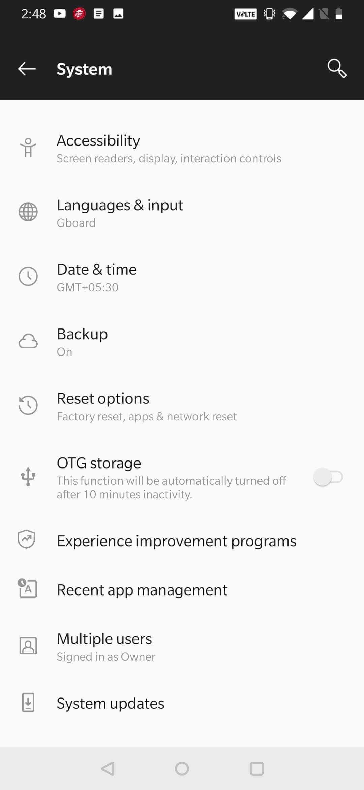

1. Go to Settings Menu
  
 
2. Select System
 
 
3. Select Advanced (Backup, Reset options, Multiple users...)

4. Select Reset Options
 
 
5. Click on Erase all data (factory reset)
 
 
6. Be patient as it takes a bit to complete factory reset depending on device.
