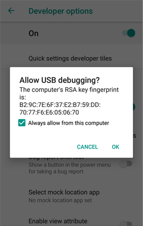
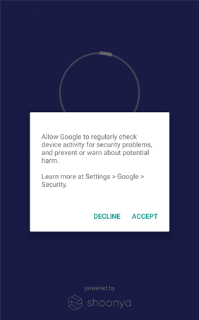

[Introduction](../../../index.md) / [Provision Device](../../index.md) / [IMEI Provisioning](../index.md) / Android
# IMEI Provisioning - Android

For devices not using Esper Enhanced Android™ (e.g. stock Android), take the following steps to use IMEI based provisioning.

In the Esper Console, create a new Device template then **'Edit'** the template and go to **‘Add devices’**. Upload the IMEI csv file you have previously prepared. Update the template. See more details below:

[Creating a Template with IMEI](../../../device-template/imei-provisioning-template/index.md)

## Steps on device:

1.  Boot the device.
2.  Go to **'System'** then select **'About phone'**:

3\. Tap **‘Build number’** 6 times:

You will see the toast message **‘You are now a developer!'**:

4\. Navigate back to **'System'**, then open **‘Developer options’**:

5\. Turn **'Debugging'** to on, then confirm that **'USB debugging'** is also turned on and click **'OK'** on the resulting pop-up:

6\. Connect your Android™ device to your development computer via USB.

7\. Open a command prompt on your development computer.

8\. [Download the esper-provisioner](../../adb-provisioning/downloadexecutable.md) executable on your computer. This will first download the ADB tools from the Internet, then download the Esper Device Management app (DPC) from the Esper Cloud. The config file for IMEI will need to be placed in the same folder as the executable.

9\. The permission to **allow USB debugging** on the device might pop up again. Click **OK**, and then the DPC will start getting installed.

10\. Connect to an available Wi-Fi or data network on the device.

11\. You might see a google message as follows. Click OK.

12\. Give permission to DPC to change system settings by Clicking **Resolve**.

13\. Turn on the toggle button to **Allow changes to System Settings**.

14\. The device will then be provisioned to the parameters set in the template that includes the device's IMEI previously uploaded to Esper.

[Return to IMEI (or Serial number) based Provisioning](../index.md)
