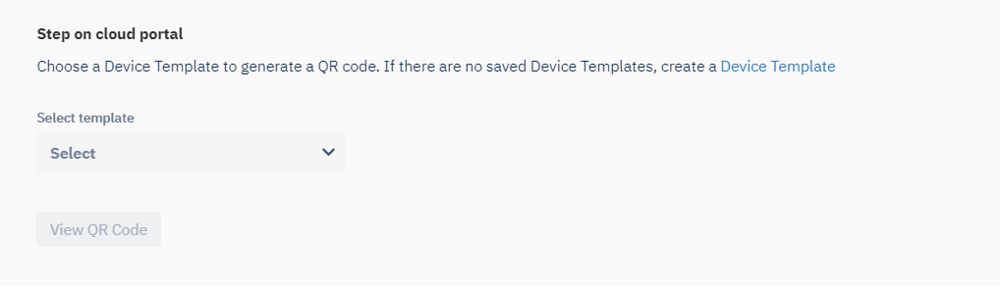

[Introduction](../../../index.md) / [Provision Device](../../index.md) / [QR Code Provisioning](../index.md) / Steps to take on Esper Console for 6-Tap Provisioning

# Steps to take on Esper Console for 6-Tap Provisioning

Average reading time : {{ $page.readingTime.text.replace(' read', '') }}

Steps on the Esper Console to provision using the 6-tap method.

On the the Esper Console, you provision a device using the 6-tap method by:

*   Going to the to **"Provision device"** tab.
*   Choose the **'Device template'** in 'Step 1'. If you do not have a saved **"Device template"**, create a [Device Template](../../../device-template/index.md).

*   Generate the **QR Code**.
*   Follow the steps to scan this QR code [using the device](../../afw-provisioning/steps-provision-device/index.md)

[Return to 6-Tap Provisioning](../index.md)
