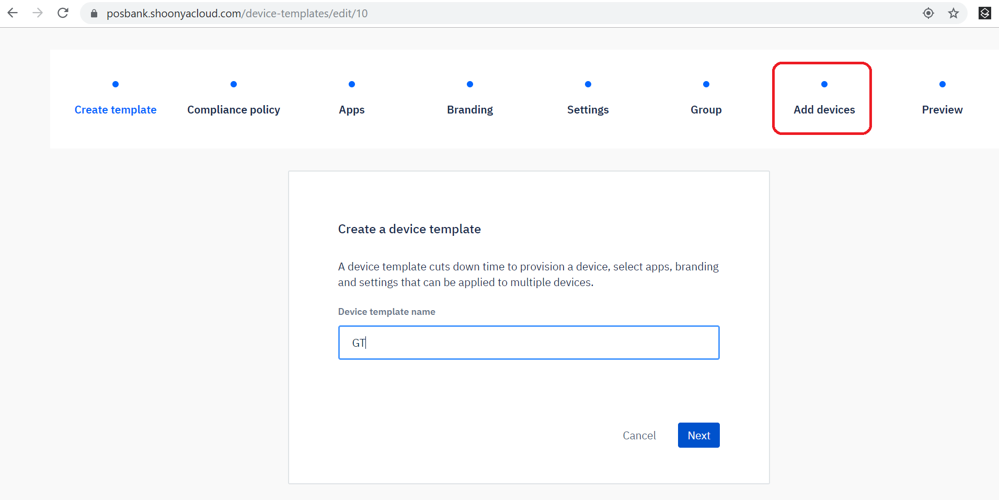
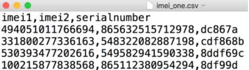
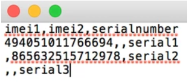

[Introduction](../../index.md) / [Device Template](../index.md) / IMEI Provisioning via Template

# IMEI Provisioning via Template

Average reading time : {{ $page.readingTime.text.replace(' read', '') }}s

IMEI or Serial number of devices to be provisioned need to be added to the relevant template

See steps on how to [create a template](../index.md).

1. On the template which you want your devices to provision against, click on the … and then select Edit

2. On the page that pops up, click on Add devices:

3. Then grab the serial number of the device which will be seamlessly provisioned, and enter it as shown. Then click on the Add button:

4. Within a few seconds, the serial number will be registered with the backend, and a message will appear in the bottom left corner:

5. Hit cancel to exit the above dialog.

6. To view all serial numbers associated with a template, simply click on the Preview option of the template:

Then on the resulting dialog expand the IMEI/Serial section, and then you can see the serial numbers associated with the template.

7. To delete a serial number from a template, simply follow steps 1 to 4, and click on the trash-can icon to delete a serial number from the template.

All this means that during manufacturing, we will need to get a list of serial numbers for all Kiosks, and the serial number should ideally be listed somewhere on the unit, so that it can be easily identified. Serial numbers can be added in bulk using CSV files.

The user can upload IMEI/Serial numbers with a Csv file in the following way -

The csv file containing the IMEI's and serial numbers should adhere to the below conditions-

*   The IMEI numbers and serial numbers can be entered separated by comma in the csv file
*   The IMEI numbers should be valid 15 digits. Serial numbers do not have any validation.
*   File should not be empty
*   The first line and column of the excel file should be exactly- "imei1, imei2, serialnumber"
*   For any line imei1 , imei2 , serial number all the three should not be empty
*   Invalid IMEI will not be accepted. IMEIs are being validated through Luhn's algorithm.
*   There should not be more than 3 values for a row
*   Duplicate IMEIs should not be uploaded.
*   IMEI and serial number should not be switched.
*   If user does not want to add a second IMEI or serial number, they should leave the space blank between the commas

**Examples for csv , where a serial number or an IMEI number could be missing**

[Return to Device Template](../index.md)
