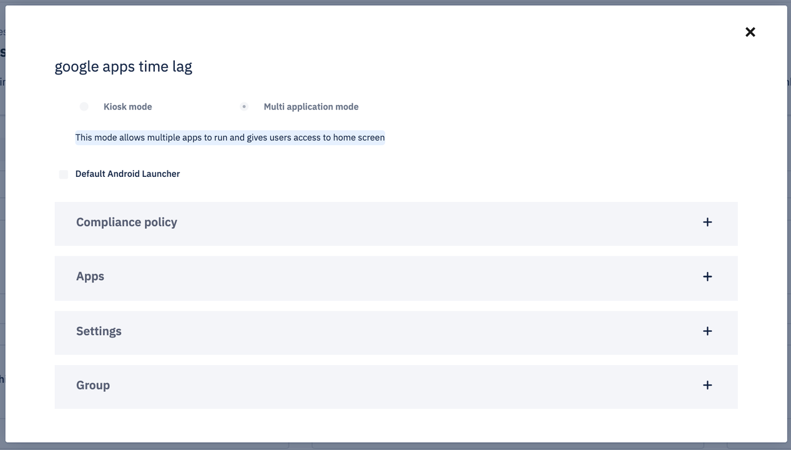
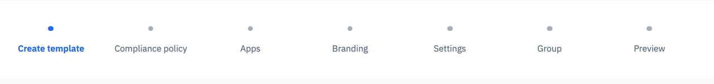
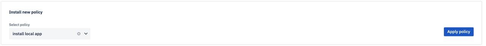
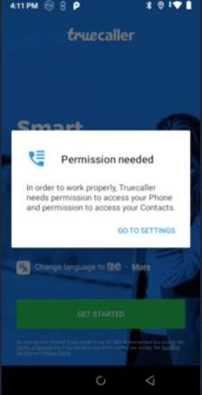
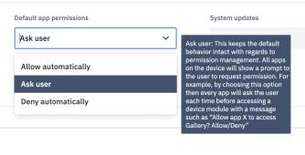
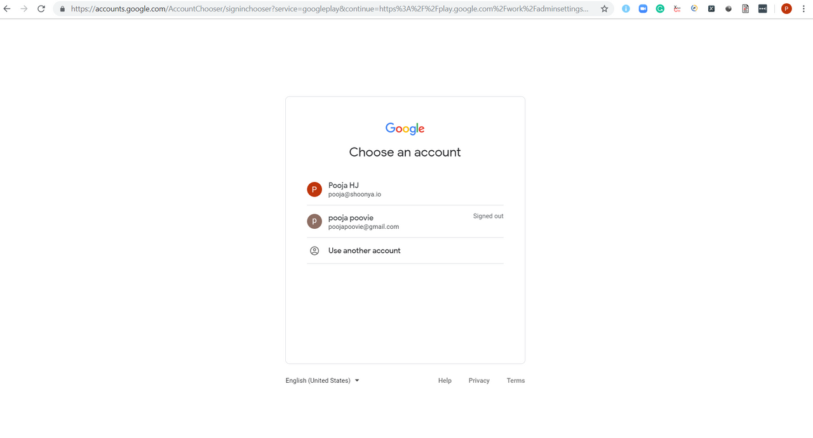
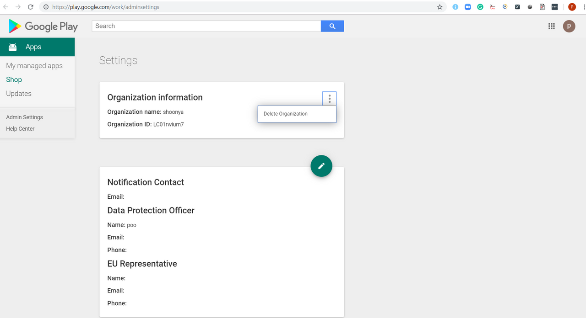
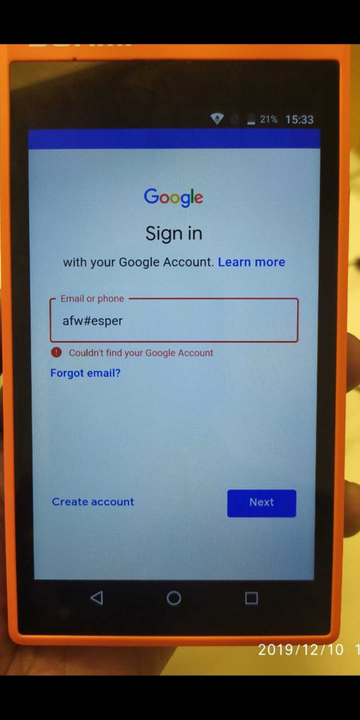
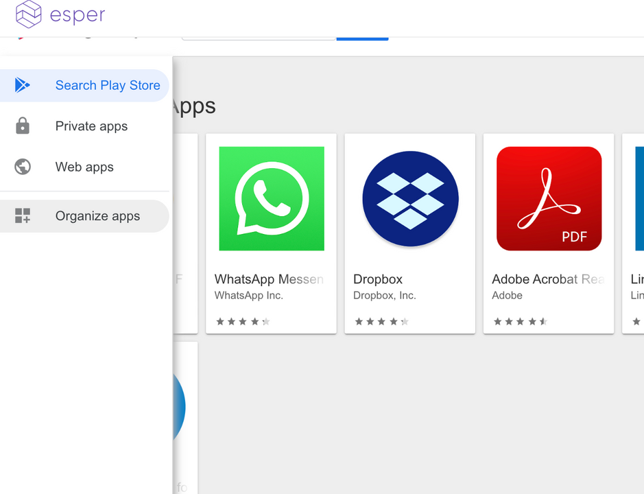
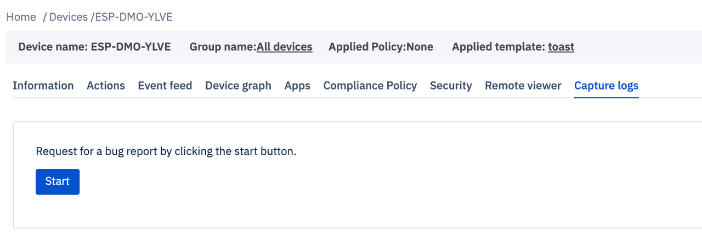

# FAQs

## How can I try out Esper?

Sign up for the free Esper Trial! Create an endpoint for your company to run all of your Esper services, and get access to the Esper Console. Developers can generate API keys and use them with the APIs, SDK, CLI, and Android Tools.

## How long does the Esper Trial last?

The Esper Starter Plan is free forever once your endpoint is created, and is intended for development and evaluation use - not for commercial deployments. Contact Esper if you have any further questions about the Trial, we’d be happy to help.

## Can I invite other members of my team to use the Esper Trial?

Yes! If you have created an Esper Trial Endpoint you can simply add additional users in the User Management section. Each user has access to all the templates created for the endpoint and all the devices provisioned through the Endpoint. Additionally each user can create their own set of API Keys, noting all users of the Endpoint will have the same Enterprise ID

## If I like Esper, can I convert my Trial Endpoint to use ongoing or do I need to start with a new Endpoint?

You can continue to use your same endpoint if you decide to adopt Esper. And we hope you do end up liking Esper!

## Can I change the name of the Trial Endpoint as I did not use my company’s name?

Unfortunately once the endpoint name is chosen, it can’t be changed. But let us know and we’ll figure something out.

## Do I have to be a developer to use Esper?

No, Esper has a full Console with a Dashboard available for non-developer users. It provides the full capabilities of Esper in a convenient to use Web Portal. Create templates, provision and manage devices, set alerts, monitor your fleet - it's all there for you and your team.

## Do I need to use the Esper Console to use Esper?

No, Esper has a rich set of APIs that can be called directly via REST/HTTP, via our SDK for Python, or using our CLI. Additionally we have a set of tools for Android Studio, including an app uploader that lets you upload your APKs directly from Android Studio to Esper. There are a few actions that currently can only be done through the Console, like creating Device Templates. Over time we’ll increasingly add capabilities to the API moving beyond the Console.

## Does Esper support Kiosk mode?

Yes, Esper supports a locked-down Kiosk mode applicable for many usage scenarios beyond Kiosk in restaurants, POS, and delivery. It is easily set up through the Esper Console or using our APIs.

## What provisioning means does Esper support?

Esper supports multiple provisioning methods. Developers find ADB to be most convenient, but field-based provisioning can be accomplished using the system generated QR codes. For large numbers of devices, Esper provides provisioning using IMEI or serial numbers - combined with Esper Enhanced Android customers can apply Zero touch enrollment for their device fleet. Android for Work (AfW) is also available as an additional option. Note the Android version you run impacts both the availability and the method you need to follow to provision, this is one reason why we set our minimum Android OS at Nougat/7.0.

## What is Esper Enhanced Android? Do I need to have it on my device to use Esper?

Esper Enhanced Android is a hardened version built and maintained by Esper specifically for use on dedicated devices. With Esper Enhanced Android customers receive the benefit of Zero touch enrollment and secure remote diagnostics of deployed devices running in the field including debugging, profiling, and viewing. You do NOT need it to use Esper Enhanced Android in order to use Esper. Esper works with “stock” Android, however, you do not receive the additional features enabled by Esper Enhanced Android. Esper Enhanced Android is available for select devices, please contact us in you’d like to find out more.

## What Android releases are supported by Esper?

To obtain the set of Esper features, we require Android Nougat/7.0 or above. If you are running an older version, contact us so we can discuss the available feature set.

## Is Esper an MDM system?

Esper’s roots are in MDM, but typical MDM doesn’t deliver everything needed across the lifecycle of apps running on dedicated devices. Developers play a lead role for these solutions, yet incumbents provide very little by way of tools and enablement. MDM doesn’t fit the bill - instead we will deliver on our vision of Device Orchestration.

## How does Esper compare to available MDM, EMM, or UEM solutions?

We are the only company providing Device Orchestration and we do it just for Android-based dedicated devices spanning developers and admins by providing a full API set, an SDK, a CLI, tools for Android Studio, and a web-based Console. No other vendor does this.

## How much does Esper cost?

Esper has several pricing models and tiers available, either purely per device or a blend of device and consumption. Contact us at andi@esper.io to find out more.

## Do you support Zero touch enrollment?

Yes! By using Esper Enhanced Android you can perform scaled Zero touch enrollment using Esper across your entire device fleet.

## What is Device Orchestration?

Device Orchestration is moving beyond MDM to bring the management of dedicated devices into DevOps. MDM is the antiquated approach to device management established in a pre-cloud computing world. Additionally, MDM does not factor in building and maintaining dedicated device fleets - it appeared to service BYOD. Esper was conceived for the DevOps world with CI/CD - we expose the Esper platform via a set of APIs that can be integrated into Cloud-based backend systems for automating the device management process, hence orchestrating. We also robustly address the app developers’ needs to work with dedicated devices during the early phases of app development and testing using our Android Tools, the SDK, and the CLI.

## Where is Esper based?

We are based in Seattle with offices in Silicon Valley. We are ex-Amazon and Microsoft with deep experience in Android, Windows CE, and Windows Phone.

## What does Esper offer for customer support?

We provide free support within reason during the Trial period. After or beyond that we provide paid support plans with the choice of email, telephone, chat, or Zoom.

## Does Esper support iOS devices and/or PC-based systems?

No, we do not. We are not a general device management company. We are hyper-focused on Android-based dedicated devices. That’s what we do!

## Does Esper support BYOD?

We do not support BYOD scenarios. We do support bringing your own dedicated devices.

## How does one get out of Kiosk Mode in an Esper Managed Device?  

Check out below video using a Samsung device on how to do the same.  

Steps are as follows

- Tap 3 times on the right top corner of the device
- Esper Menu will show up
- Please note that Settings app can be chosen via Compliance policy from Template during provisioning and from Compliance Policy post provisioning.
- if Esper settings app was chosen via Template or Compliance policy - Enter the Authentication code (This Esper Settings App password can be obtained from your Esper Customer Support contact)
- if Default settings app was chosen via Template or Compliance policy - no password needs to be entered.
- Click Continue
- Click the square button for exit kiosk
- You can click on any installed app showing on the home screen of device to use it as kiosk mode app.

 

Here is another video with a Lenovo Tablet -    

## Why is landscape and portrait mode reversed in my device?

This is a device specific behaviour and depends on the device manufacturer and OS image installed on the device. The same system would be landscape for some devices and portrait for others.

## How to install apps on Esper devices using the Dashboard after provisioning?

### Individual Device App Install

#### Private Apps

1.  Click on Devices on the left navigation bar
2.  Click on the Device tile -> Details
3.  Click on the Apps tab
4.  Choose the App you wish you install from the dropdown menu and click Install

#### Google Apps

1.  Go to Play For Work
2.  Click on the app (it must be approved)
3.  Click Select
4.  Select the device you wish to install it on from the dropdown on top left
5.  Click Install

#### Preloaded Apps

Approve a preloaded app to show in the device from the list of apps in Device-Apps section by turning **on** the toggle button.

### Group App install

#### Private Apps

1.  Click on Group on the left navigation bar
2.  Click on the Group tile -> Details
3.  Click on the Apps tab (see image below)
4.  Choose the App you wish you install from the dropdown menu and click Install app.

This should work for installing the apks that you have uploaded in the system. You can upload your apks from the [Apps section](https://console-docs.esper.io/apps/).

#### Google Apps

Run a script provided by Esper support (support@esper.io) to install google apps on groups

#### Preloaded Apps

Run a script provided by Esper support (support@esper.io) to approve (unhide) Google Play apps on groups

#### Preloaded Apps

Run a script provided by Esper support (support@esper.io) to approve (unhide) Google Play apps on groups

## How to uninstall apps on Esper devices using the Dashboard after provisioning?  

### Individual Device App Uninstall

#### Private Apps

1.  Click on Devices on the left navigation bar
2.  Click on the Device tile -> Details
3.  Click on the Apps tab
4.  Choose the App you wish you uninstall from the dropdown menu and click Uninstall app button OR unapprove the apps from the list of apps by turning **off** the toggle button.

#### Google Apps

1.  Go to Play For Work
2.  Click on the app
3.  Click Select
4.  Select the device you wish to uninstall it on from the dropdown on top left
5.  Click Uninstall

#### Preloaded Apps

1.  Click on Devices on the left navigation bar
2.  Click on the Device tile -> Details
3.  Click on the Apps tab
4.  Unapprove the apps from the list of apps by turning **off** the toggle button.

### Groups App Uninstall

#### Private Apps

If you want to uninstall private apps in a Group of enrolled Devices, do the following -

1.  Click on Group on the left navigation bar
2.  Click on the Group tile -> Details
3.  Click on the Apps tab (see image below)
4.  Choose the App you wish you uninstall from the dropdown menu and click Uninstall app.

#### Google Apps

If you want to uninstall a google play store app in the group after provisioning, that feature is still coming soon. For now, you can run a script provided by Esper support (support@esper.io) to uninstall apps on groups.

#### Preloaded Apps

If you want to uninstall a preloaded app in the group after provisioning, that feature is still coming soon. For now, you can run a script provided by Esper support (support@esper.io) to uninstall apps on groups.

**Please note that some preloaded apps are designed to be uninstallable by the device manufacturers so they can be hidden but can not be uninstalled.**

## What is the difference between Template and Policy?

Customers often ask us the difference between Device Template and Compliance policy which are both applied on devices. The main and most basic difference between Device Template and Compliance policy is that Device Template, (which has multiple sections inclusive of compliance policy as well as apps, groups, branding, settings), is used to apply on devices <i>during</i> provisioning and NEVER after that. Compliance policy on the other hand is applied on Esper Managed devices once they have already been provisioned.

Preview of a Template 

The concept of Device Template is to make it easy for our customers to define how they want their devices to behave once they provision and become managed by Esper. The dashboard admin can define for a newly provisioned device the following - apps they want installed, compliance policy applied, background wallpapers, device settings and the group that they want the device to fall in -----<b>All in One place!</b> Dashboard admin can create the one-stop-for-all Device Template and push this on devices <i>when provisioning them</i>. As a result once the device is provisioned with the said template, device will comply by the chosen options in following sections-

1.  Compliance policy
2.  Settings
3.  Wallpaper
4.  Apps
5.  Groups

Post provisioning, the device will be set and ready to use in production as defined by the template.

:::tip
The template is not meant for any other purpose except for provisioning devices.
:::

Now, after provisioning, if the admin changes their mind and wants to apply changes to individual devices or groups of devices, they have options to do in the Esper Dashboard. These are categorised by Devices and Groups.

Devices - If a user wants to make change to an individual (Esper Managed) device, (let's call them 'Esper Managed Devices' post provisioning), they need to go to the Devices section on the sidebar menu. Here is a device dashboard where user can view tiles of all provisioned devices. They may click on 'Details' to take actions on that individual device such as change the compliance policy or install a new app or lockdown the device. Find more about individual devices by clicking below.

[

Groups - If a user wants to make change to an entire group of (Esper Managed) devices, they need to go to Groups section on the sidebar menu. Here users can see Group tiles. Here also, on clicking 'Details' user can see various available Group functionalities under various menus. Find out more about Group functionalities by clicking below.

[

In the Devices & Groups section, user will see a 'Compliance Policy' tab under which they can choose and apply a new Compliance policy for the individual device or the group. In order to apply a policy, user needs to create a new Compliance policy or choose an existing one.

[Know more about Compliance Policy](https://console-docs.esper.io/compliance-policy/).

## I am not able to open my app (for example - true caller) as permissions are not provided to the app and I am getting a message that ths is controlled by admin?

Sometimes customers are not able to use their apps that require extra permissions. They get the message such as "Permission needed" and "Action Not Allowed" when trying to change Settings or open the app. 

There is a simple solution to this problem. Simply create a Compliance Policy and choose the option of `Ask User` from `App Permissions` drop down. This will allow the device user to give the required permission to the app from Settings -> App Permissions.  

Once you apply the compliance policy on the device/group, you should be able to make the required permission changes from the Settings on the device.

## My device is not adhering to the expected behavior when I take an action on the dashboard.

There is a big market of android manufacturers that have deployed various Android versions ranging from 4.x to 10.x. Often times these devices display unique behaviors that is manufacturer and OS specific. In such cases these devices might not comply by certain dashboard actions as expected due to device-specific issues. For example notification bar might show up in lenovo devices during lockdown or an older version of samsung device does not comply by password policy.  Contact esper support at support@esper.io to get help with device specific issues. 

## I am unable to push any of the apps/apk I uploaded to the Esper Console to the device.

This is an issue with Google PlayProtect interference. You need to decline the Google Play Protect prompt that pops up during provisioning. Alternatively you may use Play For Work to deploy apps, or simply appeal the the [PlayProtect folks](https://support.google.com/googleplay/android-developer/answer/2992033?hl=en).

## Can I use G-Suite account during EMM enrollment?

No. Currently Esper supports only Gmail accounts for enrollment with Google EMM services. Support for G-suite account is coming up soon. Contact support@esper.io to know the latest in this regard.

## Is it Possible to Enroll for EMM with an e-mail id which is currently already enrolled in EMM?

No, it is not  possible. Either you need to use a new email id which has never been enrolled. Or you need to un-enroll your previously used gmail id from EMM and then re-enroll with the same email id.

## How to un-enroll from EMM with your email ID? 

:::tip
If you delete you organization from google EMM enrollment, Esper does not get this information from Google and hence it will cause failure of provisioning when Esper will try to reach Google for setting up the device. It is highly advised that admin does NOT unenroll their gmail ids from Google without consulting Esper support at support@esper.io.
:::

If you still wish to unenroll your email from Google Android for Work, get in touch with esper support at support@esper.io and follow these steps -

1. Go to  [Google Play Admin Settings page](https://play.google.com/work/adminsettings). If you are already signed in, you will see an option to 'SWITCH ACCOUNTS'. Click on the same to switch to the gmail id that you had enrolled with.

    

2. Select your account or give login credentials 

    

3. Under Settings you will see Organization information section. Click on the vertical ellipsis on the right. You will see an option to “Delete Organization”. Clicking this will disassociate your email with the said organization.

## On entering afw#esper why do I see "Couldn't find your google account?

A possible cause for this error message is that the pre-configured Google account has not been removed from the device before the factory reset.
In order to solve this problem, provide the previously configured Google Account credentials and reset the device. Remove the Google Account from the device and carry out the factory reset again.

## Can I control which apps show up on my device Google Play Store app?

Yes, you have the option to decide which of the apps are to appear on the device Google Play Store. Go to the Play For Work section and choose the option Organize App-

Any app added in the collections on this page will show up on the Google Play Store app on the device - 

## How to capture log when my device is in Kiosk mode?

Click on below image to view video instructions to easily  capture log for a device which is in Kiosk mode-

   

Steps to take

1. Go to the Devices section, and search for your device via the Device ID. Click on Details.
2. Go to Actions tab and click "Unpin app". This will unpin the kiosk app from your device. 
3. Usually the Compliance Policy for Kiosk mode is set such that Notification bar is blocked. Since we need notification bar for getting bug report, in order to change this we need a new policy to be set on the device. 
4. Open the Compliance Policy section in new tab.
5. Create a new Compliance Policy that is identical to the policy currently applied on the device except for the notification bar. Alternatively, you may duplicate existing policies via the vertical ellipsis and make the change. Turn on the toggle button for notification bar and save the policy with a unique name, for example NotificationEnabledPolicy. 
6. Apply this new policy on the device by going to Device-> Compliance Policy section. 
7. You will see a notification on device "Policy Switch successful."
8. Now you may drag down finger from top to see the notification bar on phone.
9. On the Console, go to Device-> Capture log and click Start.
10. On the device notification bar, you will see that system is capturing bug report. At the end of this process, click on small arrow down next to the question "Share bug report?" and click on 'Share' on the request seen in notification bar. 
11. The console will now show a downloadable link for bugreport.
12. Go to Device->Compliance policy and switch it back to the old policy with notification bar off.
13. Go to Device->Actions and click on Pin app to go back to kiosk mode.

