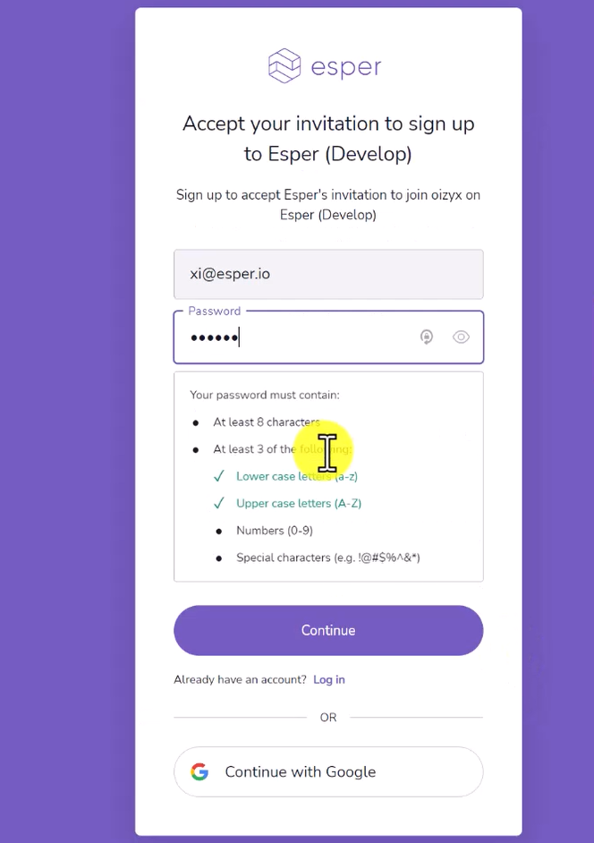

<!-- Starting November 2022, Esper will begin transitioning tenants to our new security service, Auth0. During this process, Esper users will need to set up their authentication details to log in to the Esper console. 

Once this process starts, you should receive an email with a sign-up link. 

Click on the link to sign on to the Esper console. The link is active for 7 days. 

**Step 1**
Look for an email sent by Esper. Click on the link in the email to get started.

**Step 2**
Choose a method: email & password or Google. Going forward, you will only be able to log in using that method.
If you choose email & password, you may use your previous password or set a new one. 

**Step 3**
Sign on to Esper as you normally would. 

**Why do I need to do this?**

We’ve migrated to the industry-standard Auth0 service to better protect your information. As part of the security upgrade process, you’ll need to sign up for a new Esper account.

**How long is the invitation period?**

The invitation link is active for 7 days after it is sent. After those 7 days, another email will be sent out with a different link that will also be active for 7 days. 

**What happens if I don’t accept the invitation or if I let the invitation expire?**

If you don’t accept the invitation, administrators have the ability to send new invitation links (valid for 24 hours). However, if all users miss the invitation period, they’ll need to reach out to [support](mailto:support@esper.io). 

**What will change with the new authentication system?**

There will be two major changes: 
If you used both the email/password and Google Sign-on to log into Esper, this will no longer be possible. You will need to choose one method.
You will no longer be asked to sign up with a username, first name, and last name. We’ve streamlined this process so that now only the name field (first and last name) will be used in the console. 

**What if I’m already using SSO to sign in to Esper?**

You should have already received an email to sign up for the new system. If you did not receive an email, and you use SSO to currently sign in to Esper, please reach out to [support](mailto:support@esper.io). 

**Should I set up SSO and how do I do that?**

Not every organization will need SSO. However, if you already have an identity provider such as Okta, it may make sense to implement it in Esper. 
 -->