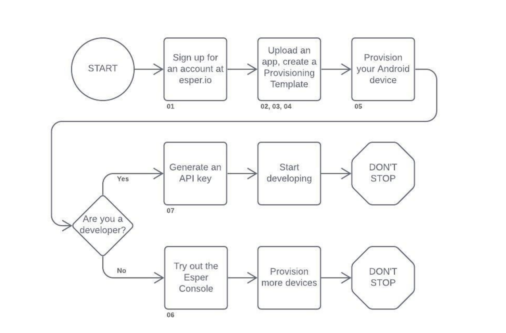
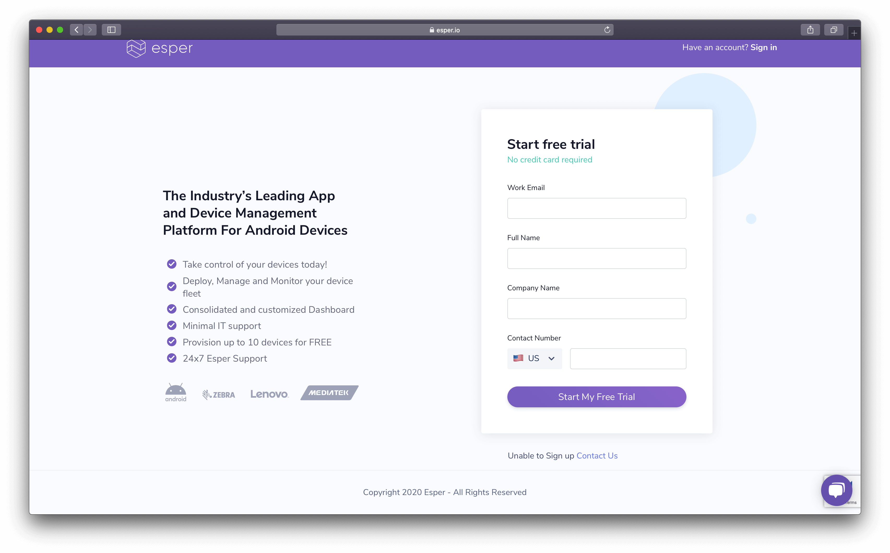
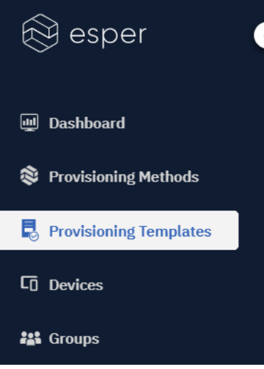
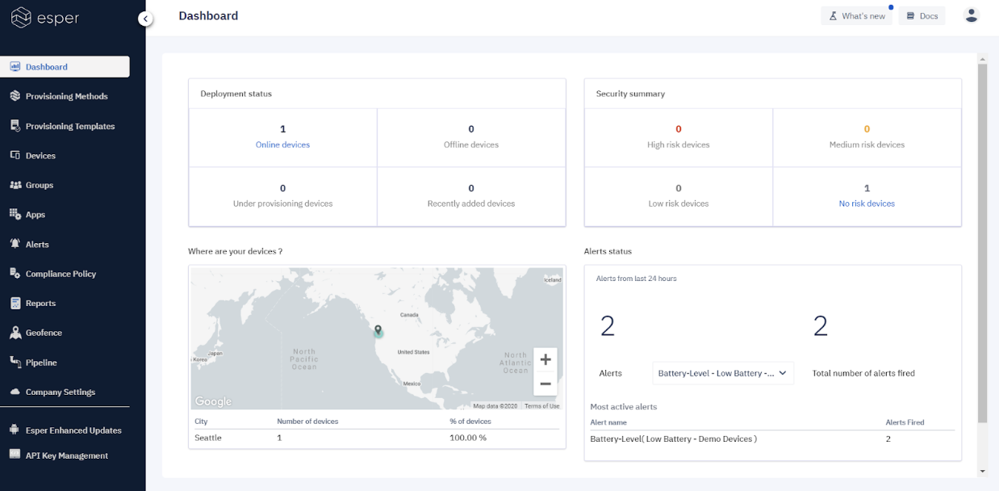

# Getting Started

## Overview

The following figure illustrates the process of getting started with Esper.

Each of these steps is described in detail below:

### 1. Sign Up for an Account

Your first step is to [sign up for a free trial account](https://esper.io/signup). During the signup process you will will be asked to enter a few quick details to set up your environment:

Once you click **Start My Free Trial**, you'll be automatically logged into your new environment’s Console. You’ll also get an email with your temporary login credentials, along with the URL of your console. (It will be something like *foooo*.esper.cloud, where “foooo” is the randomly generated 5 letter name of your environment).

**Note: Please change your password when you are redirected to your endpoint!**

### 2. Esper Password Security

All users are responsible for taking appropriate steps to ensure password security. We recommend that you follow best practices for password construction:

* Avoid dictionary words or proper names.
* Use at least eight (8) characters
* Don’t use your User ID as a password.
* Expire within a maximum of 90 calendar days.
* Use both numeric and alphabetic characters in your password
* Avoid reusing your previous four passwords

Esper users are responsible for making sure their policy and practice reflect security and compliance.  This includes changing your password periodically, especially if you hold administrative access to your Esper endpoint or you suspect your password may have been compromised.

### 3. Upload Your App to the Esper Cloud

When you first enter your Esper Console, there are no apps available. If you want to include your app to include it when you provision your first device, upload it to your Esper Endpoint as an Enterprise App stored in the Esper Cloud. This works with both AOSP and GMS devices. Be sure that your APK is signed with the V1 signature as that’s the signature we check for when apps are uploaded. Upload your app by going to Apps in your left sidebar, and then click the Upload Apps button. Learn more about uploading apps to the Esper Cloud [here.](https://console-docs.esper.io/apps/)

If you're feeling adventurous, upload several versions of your app so you can try out pushing new versions to your device to try out Esper’s app management capabilities.

Alternatively, if you are provisioning a GMS device you can use Google Play apps by setting up a managed Google Play account—you need to first do the account setup before Google Play apps will be available for approval to be used in your Endpoint and for installation on your provisioned devices. Go to Apps, and then click **Google Play** to get started. Find out more about enrolling in managed Google Play [here.](https://console-docs.esper.io/apps/appactions.html#how-to-sign-up-for-google-play-for-work-emm-enrollment)

This is an optional step, you don’t have to include any apps when you start—but depending on your use case you may wish to have your Enterprise App available, a desired Play Store app, or any combination of the two.

### 4. Modify Company Shortcode

We use a Device Name to reference devices that are provisioned in Esper. They are mapped to a GUID-based Device ID we use at the API level. The Device Name is displayed on the Home screen of provisioned devices (noting it is possible to remove the Device Name for certain use cases).

We create a system-generated Device Name prefix consisting of 6 characters. If you are unhappy with the system-generated prefix, feel free to change it by going to **Company Settings** on your left sidebar and then click **Edit Profile**, the company short code will be at the bottom. Or you can just go with the default prefix. Find out more about Company Settings and the short code [here.](https://console-docs.esper.io/getting-started/shortcode.html#what-is-the-company-shortcode)

### 5. Create a Provisioning Template

Now that you have your very own endpoint, the next step is to create a Provisioning Template. A Provisioning Template enables you to define the initial profile for your devices by specifying the configuration, apps to be loaded, and unique settings you wish to apply. Once you’ve created a template, you can use it to provision as many devices as you need.

To start creating a template, click on the **Provisioning Templates** link that appears in the left sidebar of your endpoint:

Please read [Steps to Create a Device Template](https://console-docs.esper.io/provisioning-template/) for more information on this process.

### 6. Provision a Dedicated Android Device

You can use any Android device that meets Esper’s [requirements](./requirements.md) as a target device for your applications and can be provisioned by the Esper Console. Once provisioned, you’ll be able to communicate with your device, and to deploy and test apps on it. During the process of provisioning, an Esper Device Agent will be installed on the device. Please see [Provisioning Your Device](https://console-docs.esper.io/provisioning-methods/) and follow the process best suited to your device and workflow.

If you are an Android developer and wish to use an AVD, you can easily provision your AVD using the Esper Device Provisioner tool. Simply install the Device Provisioner on your development PC, create an AVD in Android Studio, then run the Device Provisioner to provision the AVD. Find out more [here](./provisioner.html#provisioning-an-avd).

You can also create a cloud-based device to try out called a Simulare—this is only available on brand new Esper endpoints. It gives you limited capabilities, but if you have nothing else to try it is an option. We recommend using an actual device or an Android Studio AVD. Once you provision your first Android device or AVD, the option to create a Simulare device is removed.

### 7. Start Using the Web Console

One way to explore and interact with your devices is to use Esper’s Web Console. Once your device is provisioned, you’ll start seeing it on your Console:

Here are some of the interesting things you can try out:

* Define a [Compliance Policy](https://console-docs.esper.io/compliance-policy/) and then apply it.
* Update an app you installed on your device to a newer version.
* Initiate a [remote view (or remote control if supported)](https://console-docs.esper.io/devices-groups/remote-viewer.html#how-to-access-a-device-using-the-remote-viewer-and-control) session.
* Experiment with a [Kiosk mode](https://console-docs.esper.io/devices-groups/device-settings.html) application,

Once you get the fundamentals of Esper down, you can move on to Esper’s Group management capabilities by provisioning additional devices and adding them into the created groups.
Please visit Esper Console Docs for more information.

### 8. Start Developing

The first step to Developing with Esper is to generate an API key and obtain the Enterprise ID of your endpoint. The process of acquiring these two has been described in our [API Key Management Page](https://console-docs.esper.io/API/). With this information, you can start using the [Esper REST Application Programming Interfaces (APIs)](https://api.esper.io/), [Esper Python Software Developer Kit (SDK)](./pythonsdk.md), or the [Esper Command-Line Interface (CLI)](./espercli.md).

When you begin your app development in Android Studio, you can use the [Esper Android Plugin](./esperplugin.md). This will help you leverage the Esper APIs to develop, deploy, and test apps on your target devices.

**Note: API keys are tied to individual accounts. Esper's recommended best practice is to create a dedicated account for API keys with the credentials securely stored.**

### 9. Get Your Team Involved!

Esper makes it easy to add team members to your endpoint enabling you to give them specific roles down to the Group level.

Feel free to add accounts for additional team members and pass them their credentials so they can join the fun.

## Quick Links

Below are quick links to guide you on how to perform specific actions on the Esper platform:

* [Signing up for an Esper Account](https://esper.io/signup)
* [Provisioning Your Device](https://console-docs.esper.io/provisioning-methods/)
* [Getting an API Key](https://console-docs.esper.io/API/)
* [Esper SDK for Python](./pythonsdk.md)
* [Getting started with Esper CLI](./espercli.md)
