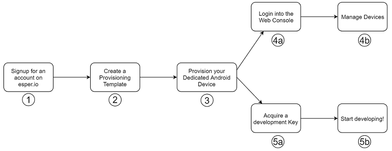
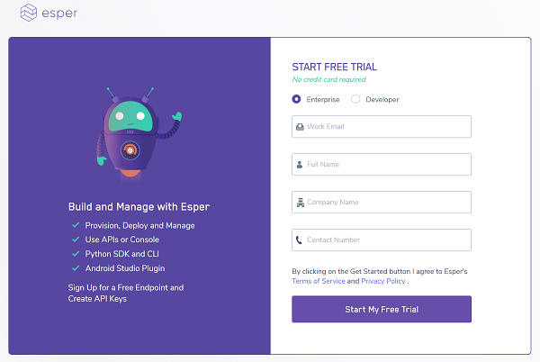

# Getting Started

## Overview

The following figure illustrates the process of getting started with Esper.

Each of these parts are described in detail below:

### 1. Signup for an Account

The first step to start developing with Esper is to create a developer account. [Signup for a trial account](https://esper.io/signup). During the signup process you will will be asked to enter a few, quick details to set up your environment:

Once you click in the `Start My Free Trial` button, you'll be automatically logged in, and redirected to your very own environment's endpoint. At the same time, you'll get an email with your temporary login credentials, along with the URL of your endpoint (it will be something like `{{ esper_tenant_name }}.esper.cloud`, where "{{ esper_tenant_name }}" is the randomly chosen name of your environment). If you would like a customized endpoint name, like `acme.esper.cloud`, please email us at <mailto:support@esper.io>, and we'll be glad to help you change it.

> Please change your password when you are redirected to your endpoint!

### 2. Create a Provisioning Template

Now that you have your very own endpoint, the next step is to create an Esper Device Template. A Device Template is where you define the initial profile for your device by specifying the configuration, apps to be loaded, and unique settings you wish to apply to devices that will be provisioned. Once the template is created, a device is then provisioned using the Device Template settings.

You can start the template-creation process by clicking on the `Device Template` link that appears in the left sidebar of your endpoint:

Please see the [Creating a Device Template](./console/device-template/index.md) section for more information on this process.

### 3. Provision your Dedicated Android Device

Any Android device that meets Esper [requirements](./requirements.md) can act as a target device for your applications and can be provisioned against an Esper endpoint. Once provisioned, Esper enables developers to communicate with their target device so they can deploy and test the application on them. During the process of provisioning, an Esper Device Agent is installed on the device. Please see the Instructions for [Provisioning a device](./console/device-provisioning/index.md) to follow the process most suited for your device and workflow.

> Esper ships with an [Esper-Enhanced Android Virtual Device](./esperplugin.md#esper-android-virtual-device), which you can use to try Esper without the need for any hardware! This virtual device can be installed via our Android Studio plugin. Esper also has some pre-approved Developer Kits which you can acquire from us for your applications. Simply email us at <mailto:support@esper.io> if you'd like one.

### 4. Using the Web Console

One way to explore and interact with your devices is to use Esper's Web Console. Once your device is provisioned, you can start seeing it on the web console. A sample screenshot of how this may look has been shown below:

Please read more details regarding [interacting with Web Console](./console.md) for exploring Esper via the Console.

### 5. Developing with Esper

The first step to Developing with Esper is to acquire an API key and the environment ID of your endpoint. The process of acquiring these two has been described in our [Developer Options page](./console.md#developer-options). With this information, you can start using the Esper [REST APIs](https://api.esper.io), [Esper Python SDK](./pythonsdk.md), or the [Esper CLI](./espercli.md).

As you begin your application development on Android Studio, be sure to leverage the freely available [Esper Android Plugin](./esperplugin.md). This will help you in leveraging the Esper APIs to develop, deploy and test applications running on your target devices.

Lastly, check out some wonderful [Tutorials](./tutorials.md) to get you started!

## Quick links

Below are the quick links to the guide for specific actions on the Esper platform.

- [Signup for an Esper Account.](https://esper.io/signup)
- [Provision an Android Device to Esper.](./console/device-provisioning/index.md)
- [Get yourself an API Key.](./console.md#developer-options)
- [Getting started with Esper SDK.](./pythonsdk.md)
- [Getting started with Esper CLI.](./espercli.md)
- [Checkout our tutorials.](./tutorials.md)
