# Esper Device Provisioner

Average reading time : {{ $page.readingTime.text.replace(' read', '') }}s

## Instructions for Windows 10

1. Download the Esper Device Provisioner from [here]

(http://downloads.esper.io/esper-provisioner/windows/Esper%20Device%20Provisioner
%20Setup%201.0.0-beta.exe)

2. Open File Explorer (you can use the Windows Key + E shortcut), and go to where you have downloaded the file. Most probably, it will be in your Downloads’ folder:

3. (Optional Step): Move the downloaded file to a temporary location, such as C:\temp\provisioning, so it’s easier to find the next time you need it:

4. Double-click on the file, and you will see a dialog that shows the app being installed locally on your PC:

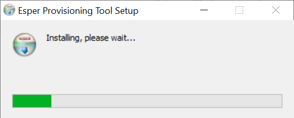

5. Once it’s done you will be greeted by the following dialog:

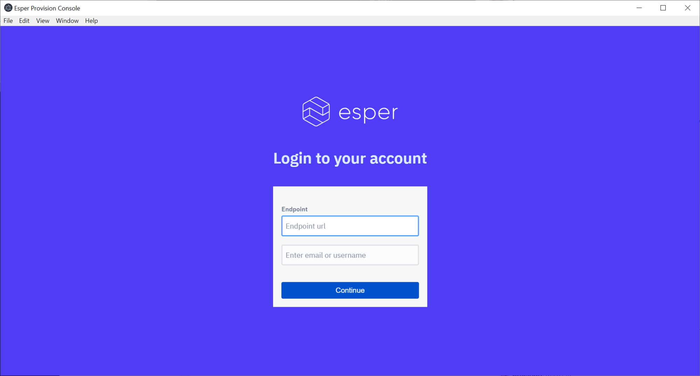

6. Enter your endpoint credentials in this dialog-the endpoint name, followed by your endpoint username and then click Continue:

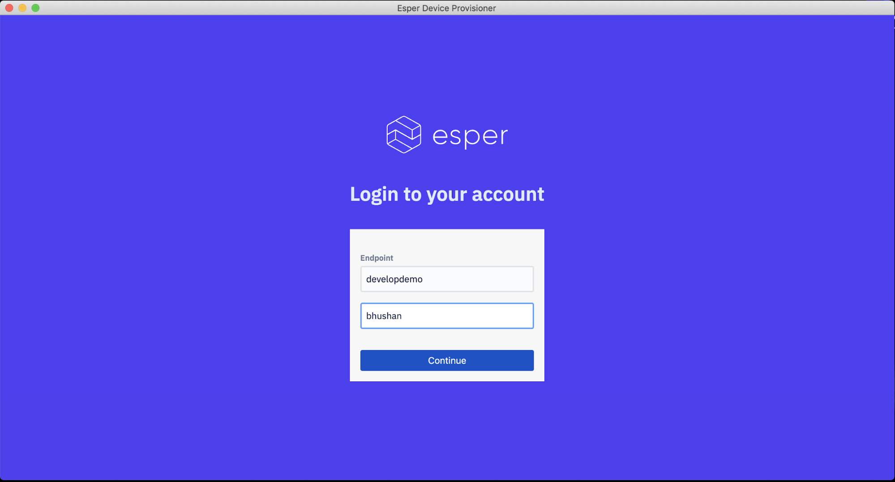

7. Now enter your password for your endpoint and click on Login:

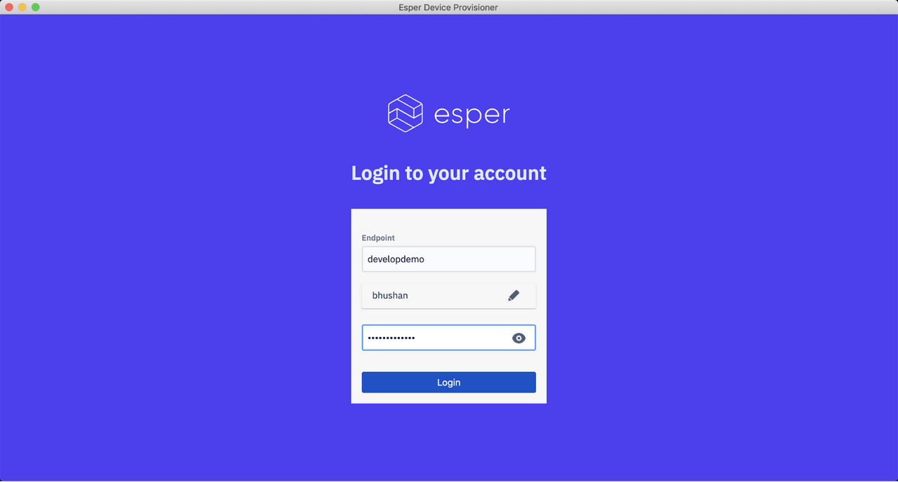

8. You will now be greeted by the following screen:

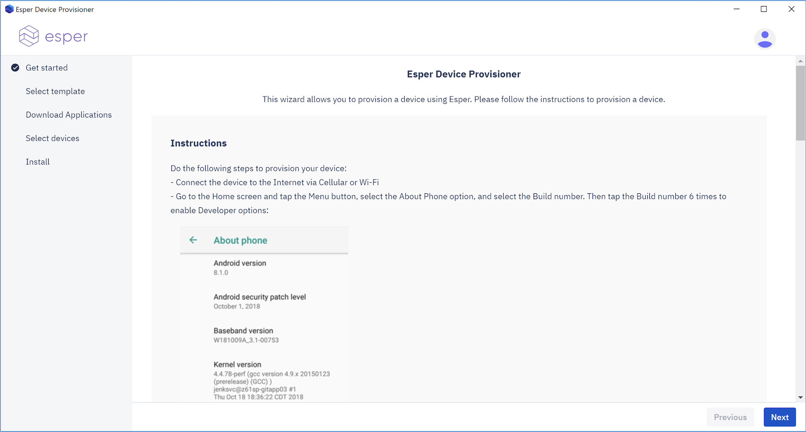
Click on Next on this screen.

9. The next screen will show you your endpoint’s templates. If you don’t have any templates, please login to your endpoint, and create a template for Provisioning. Select the template that you want to provision your device with, and click Next:

10. You will now be greeted by a screen where all Uploaded Apps associated with the template will be listed. Note that these are only the apps that are uploaded to your Esper endpoint and not PlayForWork apps. So if there’s a PlayForWork app associated with your template, they will not be shown here.

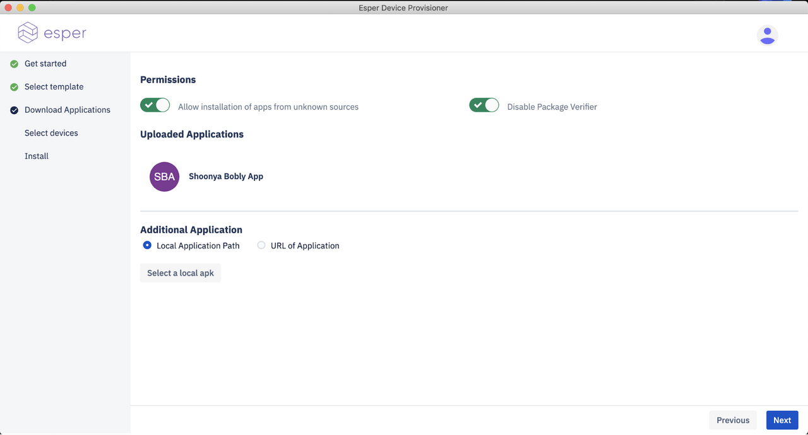

Apps that appear under the Uploaded Apps section will be downloaded locally to your PC and installed to your device in the next step. This makes the device skip the step to fetch the app from your endpoint during provisioning. This is especially helpful when you have multiple devices to provision, and want to save on the device’s bandwidth.

Some devices require that some apps be side-loaded in addition to the ones listed in the template. These apps can be listed in the Additional APKs section. You can list the paths either by their remote URL or take then from your local computer.

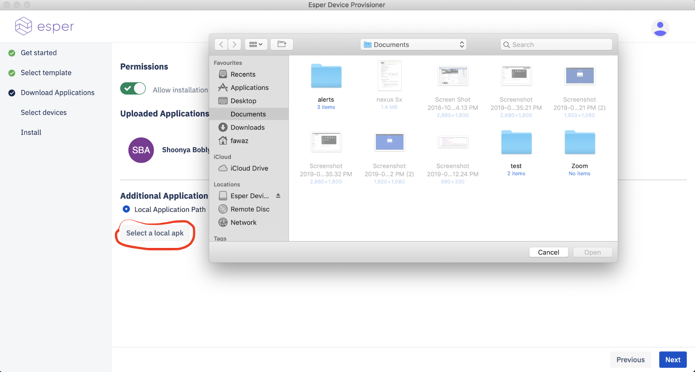

Note: Additional APKs always get installed before Uploaded Apps onto the device.

11. Before you click Next on the above dialog, ensure that device is connected by any of the methods:

a. USB Mode:

    i. Do the following steps to connect your device:

    ii. Connect the device to the Internet via Cellular or Wi-Fi

    iii. Go to the Home screen and tap the Menu button, select the About Phone option, and select the Build number. Then tap the Build number 6 times to enable Developer options:
    

      iv.  Now go back to Settings, and under the Developer options entry select turn on Debugging and then USB debugging

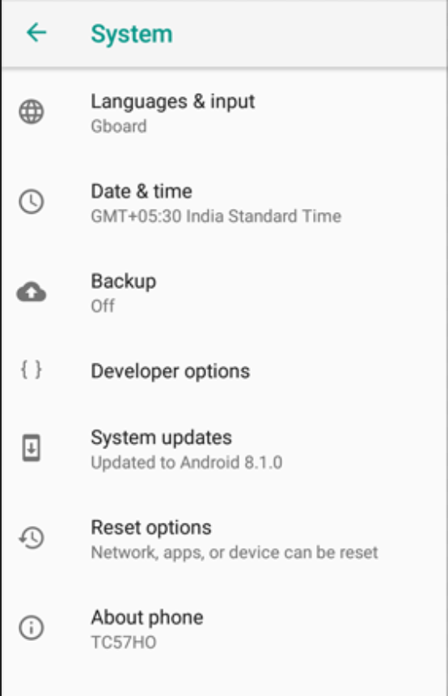

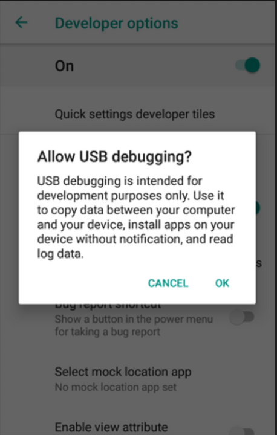

    v. Connect your Android device to your development computer via USB 

    vi. Click on the Authorization Dialog box on the Android device

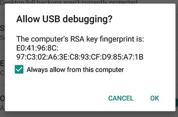

   vii. Now you can see your connected device here:

   
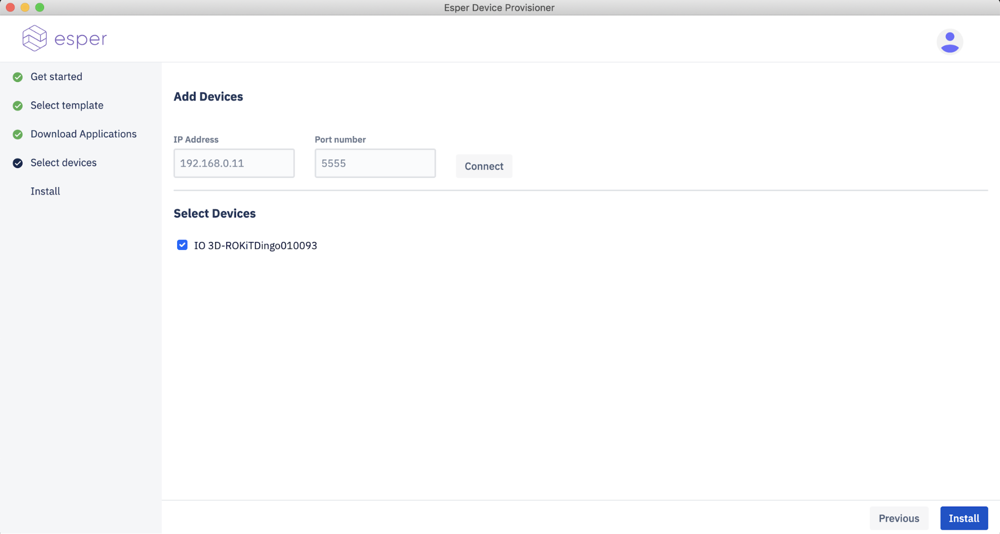

   
   
b. Over tcp-ip:

    i. If your device is running over tcp-ip mode, connect your system to the same wifi to which your device is connected.

    ii. Get the ip address of the wifi for eg: 192.168.1.23

    iii. Get the port number of the device in which the tcp-ip mode is open.

    iv. Paste the ip address and port number in appropriate fields and click connect.

    
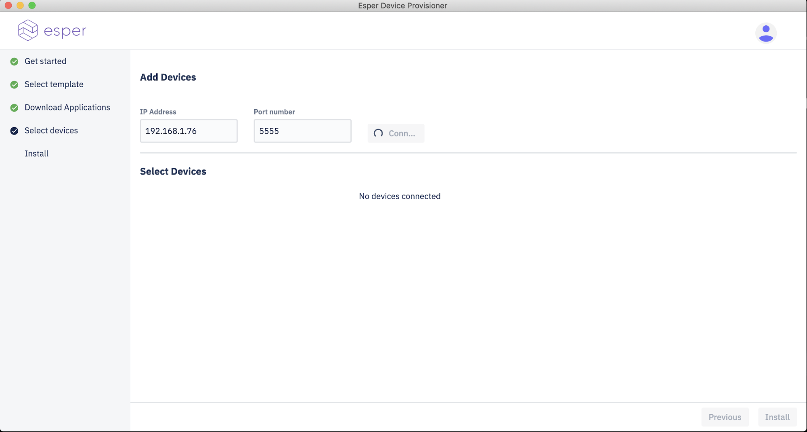

    
    
    v. Tool will try to connect to that ip and port.

    vi. And you can see your device in here:

    

12. Now select your device or multiple devices if you have multiple devices connected, and click on the Install button.

13. You will now see a dialog with the installation progress:

If you click on the little carat icon to the right, you can see the details of the provisioning:

It will look like something shown below:

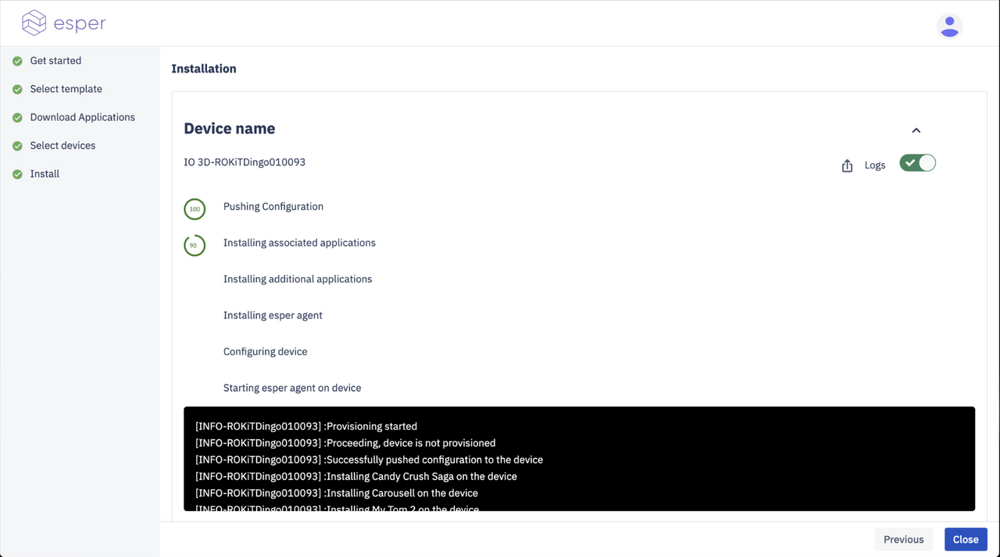

14. You can see logs of provisioner just by toggling Logs.

a. So when you toggle ‘on’ , you’ll be able to see the detailed logs of all the steps happening during provisioning of individual devices.

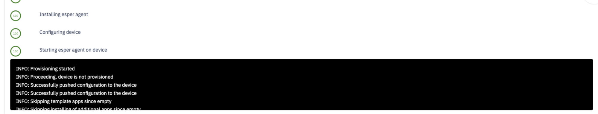

15. Also you can download logs just by clicking on this button:

16. During provisioning if you see a prompt like the one shown below, select Decline.

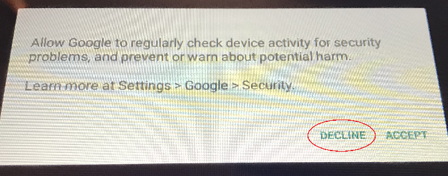

17. When provisioning is complete, you will see this in the dialog:

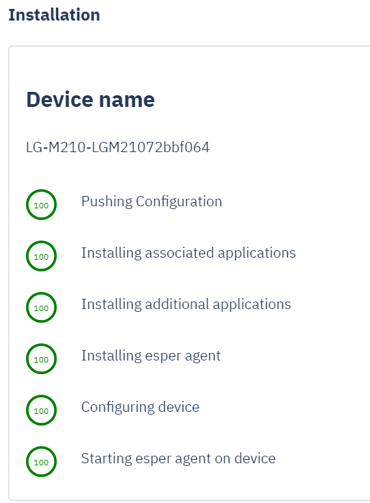

18. Now you can click on the Prev button and repeat the steps for more devices. Once you are done, simply exit the application using the Close button or the X icon at the top right.

## Instructions for MacOS

1. Download the Esper Device Provisioner from [here](http://downloads.esper.io/esper-provisioner/mac/Esper%20Device%20Provisioner-1.0.0
-beta.dmg)

2. Open Finder and go to where you have downloaded the file. Most probably, it will be in your Downloads’ folder

:

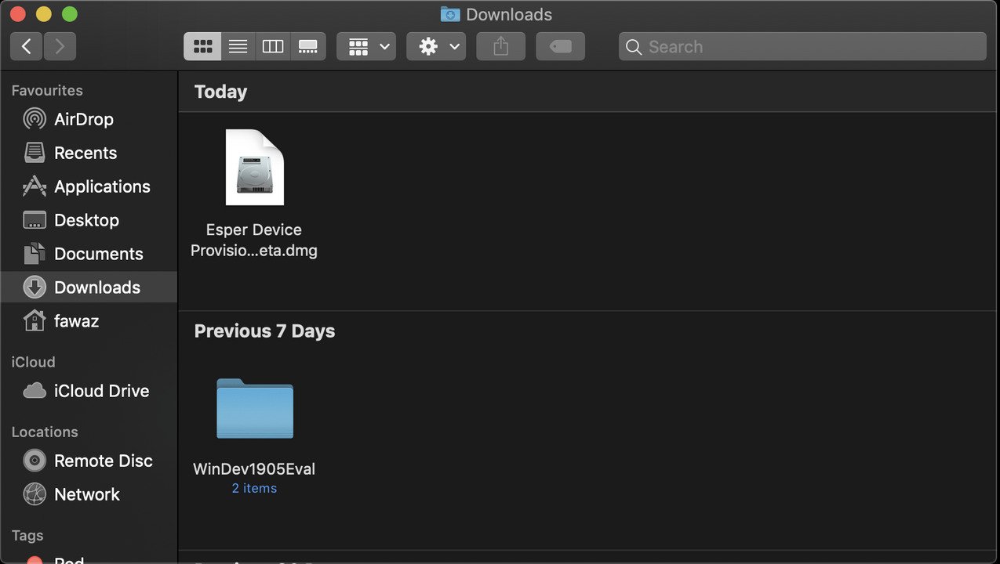

3. Move the Esper Device Provisioner to Applications folder:

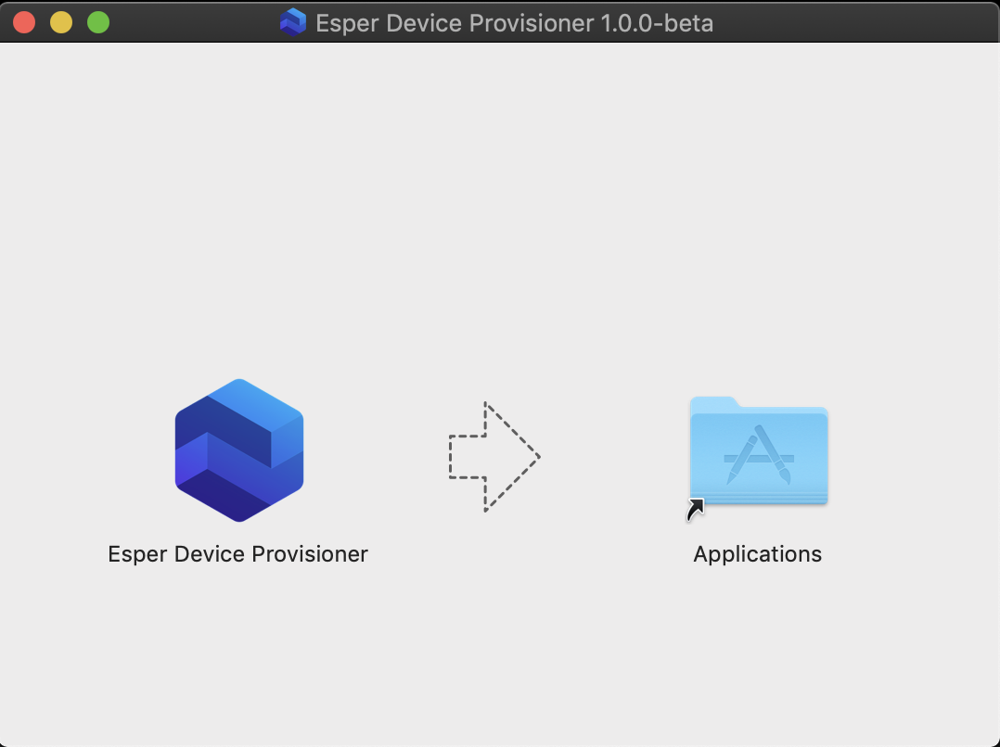

4. Executable files downloaded from the internet are rightly not trusted by MacOs by default. As a result, you have to tell MacOs that it is safe to execute the file, as you’ve downloaded it from Esper. To do so, go to System Preferences, and click on Security & Privacy:

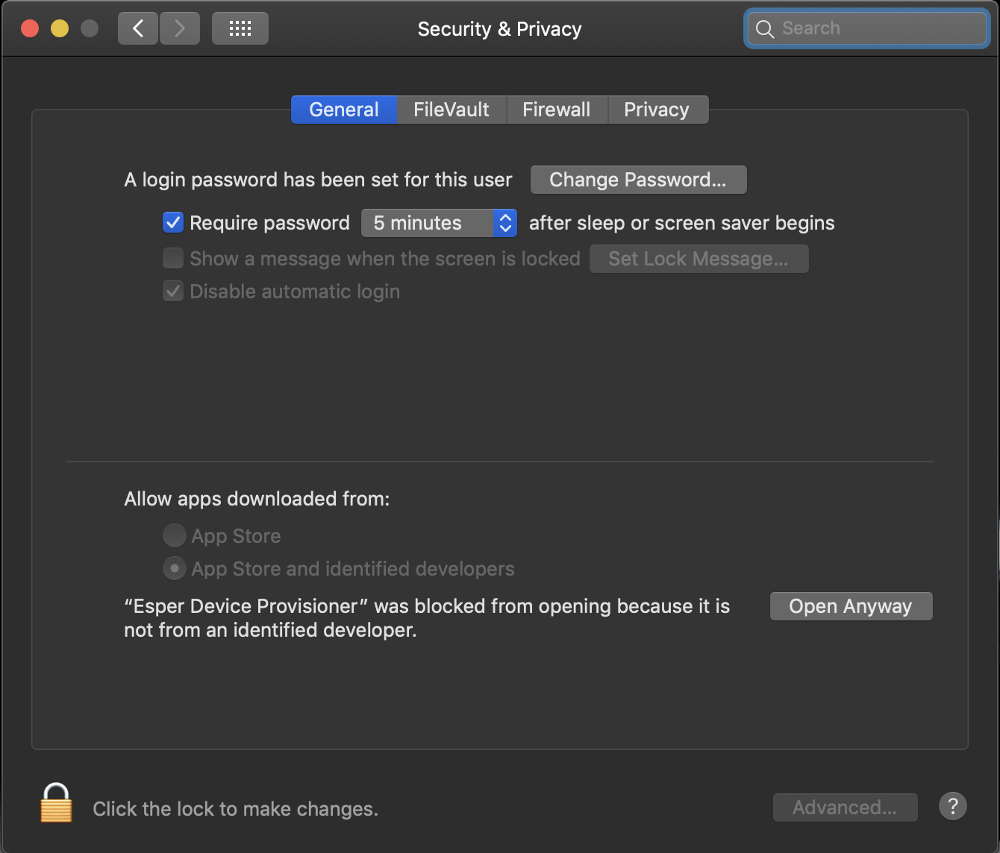

5. In the resulting dialog, click the Open Anyway button. In the resulting dialog click on Open:

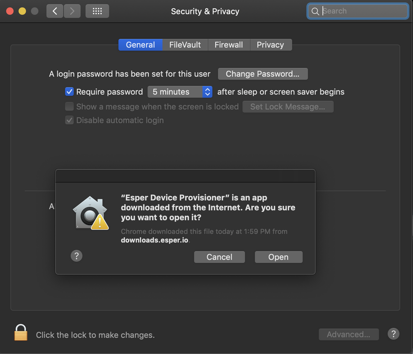

6. Once it’s done you will be greeted by the following dialog:

7. Enter your endpoint credentials in this dialog--the endpoint name, followed by your endpoint username and then click Continue:

8. Now enter your password for your endpoint and click on Login:

9. You will now be greeted by the following screen:

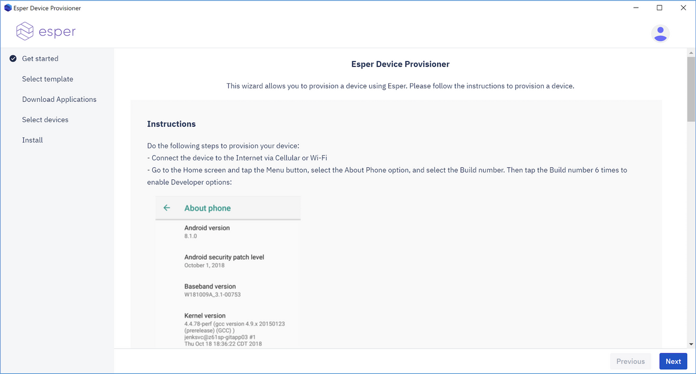

Click on Next on this screen.

10. The next screen will show you your endpoint’s templates. If you don’t have any templates, please login to your endpoint, and create a template for Provisioning. Select the template that you want to provision your device with, and click Next:

11. You will now be greeted by a screen where all Uploaded Apps associated with the template will be listed. Note that these are only the apps that are uploaded to your Esper endpoint and not PlayForWork apps. So if there’s a PlayForWork app associated with your template, they will not be shown here.

Apps that appear under the Uploaded Apps section will be downloaded locally to your PC and installed to your device in the next step. This makes the device skip the step to fetch the app from your endpoint during provisioning. This is especially helpful when you have multiple devices to provision, and want to save on the device’s bandwidth.

Some devices require that some apps be side-loaded in addition to the ones listed in the template. These apps can be listed in the Additional APKs section. You can list the paths either by their remote URL or take then from your local computer.

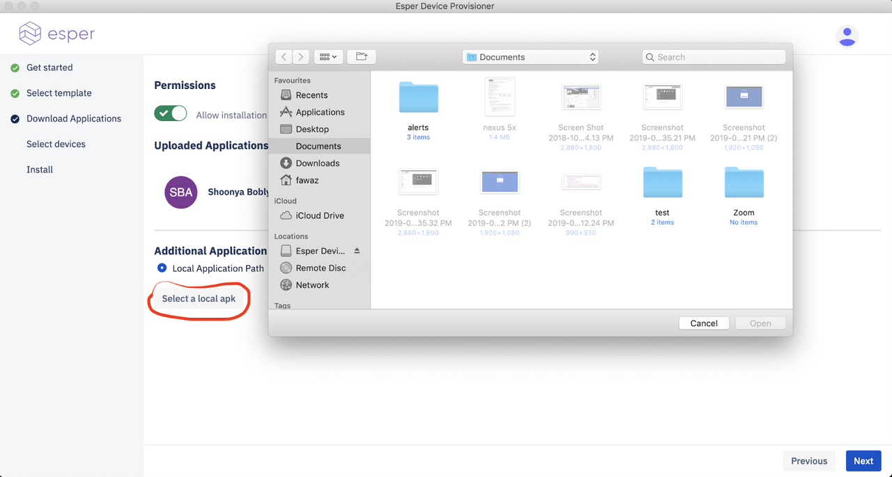

Note: Additional APKs always get installed before Uploaded Apps onto the device.

12. Before you click Next on the above dialog, ensure that device is connected by any of the methods:

a. USB Mode:

i. Do the following steps to provision your device.

ii. Connect the device to the internet via Cellular or Wi-Fi

iii. Go to Home Screen and tap the Menu button, select the About Phone option, and select the Build Number. Then tap the Build number 6 times to enable Developer options:

iv. Now go back to Settings, and under the Developer options entry select turn on Debugging and then USB debugging

v. Connect your Android device to your development computer via USB

vi. Click on the Authorization Dialog box on the Android device

vii.Now you can see your connected device here:

b. Over tcp-ip:

i. If your device is running over tcp-ip mode, connect your system to the same wifi to which your device is connected.

ii. Get the ip address of the wifi for eg: 192.168.1.23

iii. Get the port number of the device in which the tcp-ip mode is open.

iv. Paste the ip address and port number in appropriate fields and click connect.

v. Tool will try to connect to that ip and port.

vi. And you can see your device in here:

13. Now select your device or multiple devices if you have multiple devices connected, and click on the Install button.

14. You will now see a dialog with the installation progress:

If you click on the little carat icon to the right, you can see the details of the provisioning:

It will look like something shown below:

15. You can see logs of provisioner just by toggling Logs.

a. So when you toggle ‘on’ , you’ll be able to see the detailed logs of all the steps happening during provisioning of individual devices.

16. Also you can download logs just by clicking on this button:

17. During provisioning if you see a prompt like the one shown below, select Decline.

18. When provisioning is complete, you will see this in the dialog:

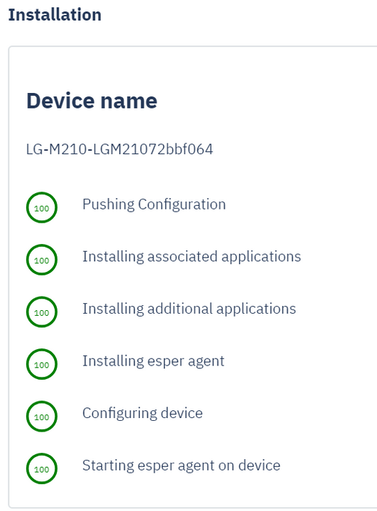

19. Now you can click on the Prev button and repeat the steps for more devices. Once you are done, simply exit the application using the Close button or the X icon at the top right.

Thank You!
