# Esper Device Provisioner

The Esper Device Provisioner is designed to make provisioning single or multiple AOSP devices an easy task in concert with the Esper Cloud. Essentially the Device Provisioner uses adb under the hood communicating with the Esper Cloud to pull in configuration instructions and the apps to install upon enrollmentto provision devices while providing a great user experience so you can avoid the multiple command line steps otherwise required.

While intended for AOSP devices that don’t have the Android Enterprise enrollment methods available, it can also provision GMS devices, useful for specialized GMS devices without a camera thus unable to read a QR code used with the 6-Tap and AfW provisioning methods. Android Studio AVDs can also be provisioned using this tool.

This tool is supported on Windows 10, macOS, and Linux; a development PC running either of these operating systems is required. You generally do not have to install adb yourself on your PC, the Device Provisioner takes care of that for you. However if you wish to use Wi-Fi or Ethernet for your provisioning means, in some cases you will need to execute an adb command from your own adb installation.

The means to provision multiple devices in series using the Device Provisioner depends on the provisioning method you use across USB, Wi-Fi, or Ethernet choices. If you use USB, and wish to provision multiple devices from one development PC, you will need a USB hub. With Wi-Fi, devices need to be connected to the same access point as your development PC, noting with many devices you first need to run an adb command via USB for adb via Wi-Fi to work. For Ethernet you need to have all devices connected to the same subnet as your development PC. You can provision up to 16 devices at once using the Device Provisioner.

:::warning
In order to use the Esper Device Provisioner, you must have created at least one Provisioning Template in the Esper Console. You will find instructions for doing so in [Provisioning Templates](https://console-docs.esper.io/provisioning-template/).
:::

## Windows 10 Installation

First download the [Esper Device Provisioner](https://downloads.esper.io/esper-provisioner/windows/EsperDeviceProvisioner.exe) to your Windows development PC.

Now open *File Explorer* and navigate to where you have downloaded the file. If you haven’t specified otherwise, it will probably be in your **Downloads** folder.

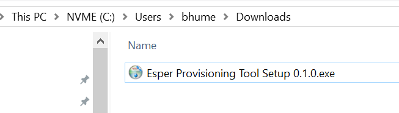

Double-click on the file to start installation. A dialog box will show the installation progress.

Once installed, the Device Provisioner is ready to be configured.

## MacOS Installation

First download [Esper Device Provisioner](https://downloads.esper.io/esper-provisioner/mac/EsperDeviceProvisioner.dmg) to your MacOS development PC.

Now open Finder and navigate to where you have downloaded the file. If you haven’t specified otherwise, it will probably be in your **Downloads** folder.

Move the *Esper Device Provisioner* to *Applications* folder.

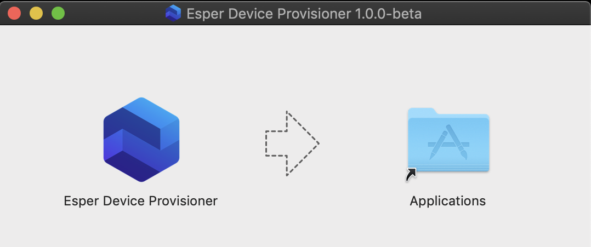

By default, MacOS doesn’t trust executable files downloaded from the Internet. As a result, you have to allow MacOS to download and install the Device Provisioner file. Navigate to **System Preferences > Security & Privacy** and click **Open Anyway**.

Click **Open** in the dialog box that pops up.

Once installed, the Device Provisioner is ready to be configured.

## Linux Installation

First, download the  corresponding version of the  Device Provisioner  to your Linux development PC.

*   [AppImage](https://downloads.esper.io/esper-provisioner/linux/EsperDeviceProvisioner.AppImage)
*   [deb](https://downloads.esper.io/esper-provisioner/linux/EsperDeviceProvisioner.deb)
*   [pacman](https://downloads.esper.io/esper-provisioner/linux/EsperDeviceProvisioner.pacman)
*   [snap](https://downloads.esper.io/esper-provisioner/linux/EsperDeviceProvisioner.snap)
    

Navigate to the downloaded file. Double-click on the file to start the installation.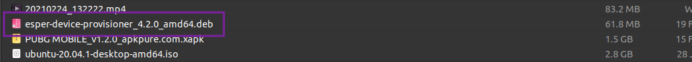

The following screen will be displayed once the installation is complete.

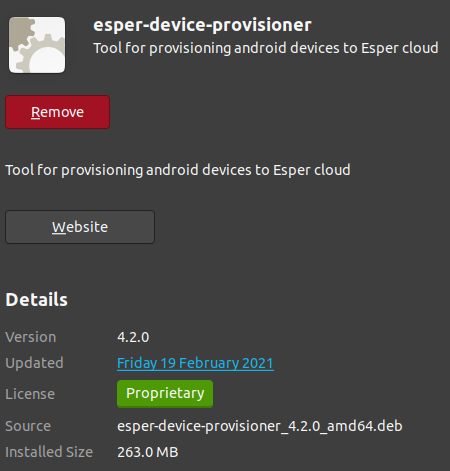

The Device Provisioner is ready to be configured. Double click on the Device Provisioner icon to start provisioning the devices.

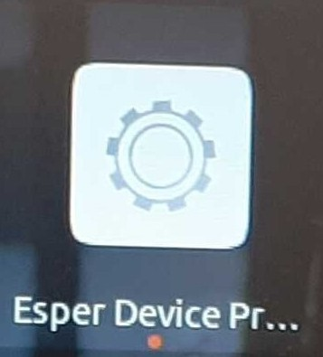

## Configuring the Device Provisioner Upon First Use

Once the Device Provisioner is installed, start it to set up using it with your Esper Endpoint.

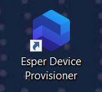
 
:::warning
The Device Provisioner does not support Google Single Sign-on (SSO). If you set up your Esper Console login using Google SSO, simply go to your account on the Esper Console, enter in a password, and save it—you will no longer be using Google SSO and can now sign in on the Device Provisioner and continue to use the login method on the Esper Console.
:::

Enter the name or URL of your Esper endpoint in the **Endpoint** box. For example if your endpoint URL is *foooo.esper.cloud*, you can either enter in *foooo* for the Endpoint name or *foooo.esper.cloud* for the URL.

Then enter your username in the **Username** box; click **Continue**.

Enter your password and click **Login**.

:::tip
If you enter the wrong username or password more than five times, you will be locked out for 5 minutes. A timer on the screen will display minutes, after which you can retry. 
:::

The device provisioner will perform any required set up immediately after first login. After that you will now be on the Get started screen. Device Provisioner is now set up to be used with your Endpoint.

The Device Provisioner supports Dark Mode, and is automatically set based on your system theme. You can also manually switch the Device Provisioner to Dark Mode on the **Get Started* screen.

## Preparing a Device for Provisioning

On the top right corner of your Esper Device Provisioner tool, you will see a toggle button to switch between dark and light mode.

  

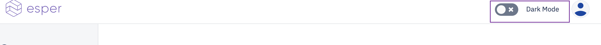

  
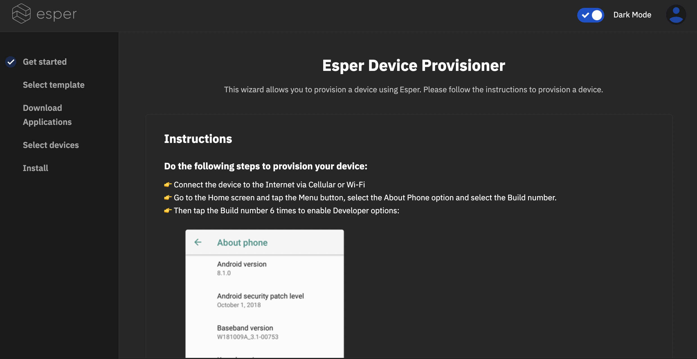 
Dark Mode 

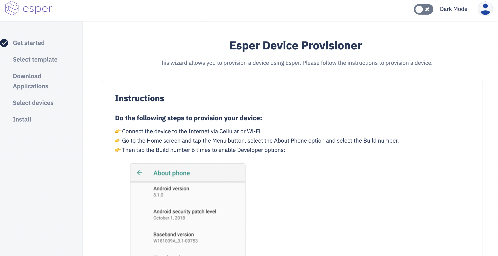

Light Mode

  

When you click on the profile icon at the top right corner, you will see all your Esper endpoints.

  

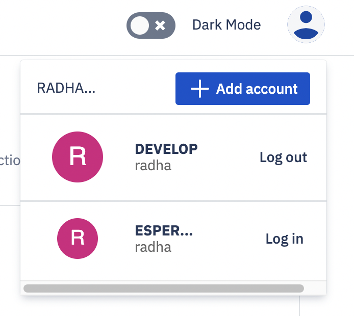

  
**Note:** It will also show the endpoint you are signed in to.

You need to prepare your device before it can be provisioned using the Device Provisioner.

The full instructions are provided on the *Get started* screen.

For your convenience, the same instructions are provided below.

The device will first need to be connected to the Internet via Wi-Fi, cellular, or Ethernet. 

Next you need to enable Developer options on the device if they are not already enabled. Navigate to **Menu > About** Phone, then tap the **Build Number** six times. 

:::tip
Some AOSP devices ship with Developer options already enabled by default - if that’s the case for your device you can skip this step.
:::

Developer options should now appear in Settings (it can take a few moments for these options to become available in the Settings menu).

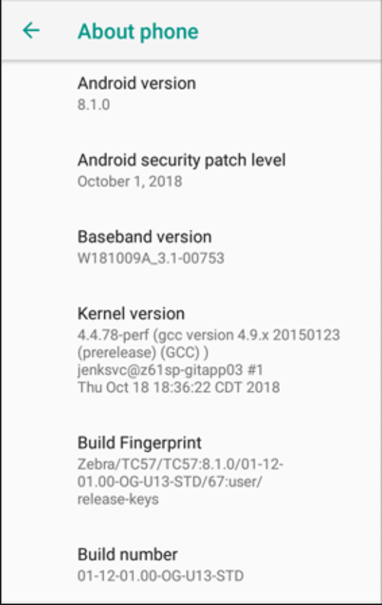

On the device, navigate to **Settings > Developer** options.

Scroll down to the DEBUGGING section, and then turn on **USB debugging**. A popup will appear, click **OK** to *Allow USB Debugging*.

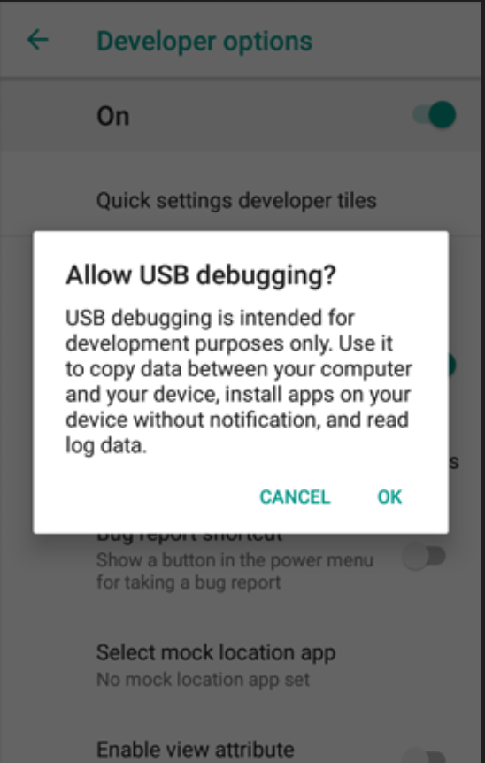

:::tip
Some AOSP devices ship with USB debugging already turned on - if that’s the case for your device you can skip this step. Once provisioned onto Esper and depending on the provisioning settings set up in your Provisioning Template, Esper prevents local adb debugging sessions unless enabled by you using Esper.
:::

### Provisioning via USB

If you are using a USB cable to connect your Android device to your development computer for provisioning, follow these steps.

Plug the USB cable into the Android device and then connect it to your development computer. An authorization dialog box to Allow USB debugging will pop up. Click **OK**. Checking **Always allow from this computer** is optional.

**NOTE**: If your AOSP device is configured to automatically allow an adb connection to a development PC, you will not see this dialog box. If you have adb installed on your development PC, you can verify you are connected by going to the command line and executing adb devices. You should see your device listed if this is the case. You can also see which device or devices are connected on the Select Devices screen.

Now go back to the Device Provisioner once the device is prepared, and on the Get started screen click **Next**.

**NOTE**: Some specialized AOSP devices have additional settings under Developer options that may need to be properly configured in order to provision your device using the Device Provisioner. This typically includes the mode that the USB port operates in, for example Host or Device. If you have any questions regarding the proper settings choices, please contact us directly.
 
:::tip
AOSP devices typically have multiple USB ports. Oftentimes only one of them is enabled for adb. Please consult the accompanying manual for the device. Alternatively you can try each USB port plugging it into your development PC until you find the one that invokes the Allow USB debugging dialog on your development PC. Frequently a Type A Male to Type A Male cable is needed, but it depends on the available USB ports on your development PC (e.g. USB C instead of Type A), as well as the appropriate port used by the device (it can be USB C, Mini, Micro, or Type A). 
:::

Following are the additional steps required to provision Xiaomi/Redmi devices:

Settings > About Phone > MIUI version > Tap until "You are now a developer" pop-up is displayed.
Settings > Additional Settings > Developer Options > Enable "USB debugging" > click "OK" on prompt.
Settings > Additional Settings > Developer Options > Enable " Install via USB".

**Note:** You need SIM inserted into your device, and you need to sign-in to your MI account.

Settings > Additional Settings > Developer Options > Disable "MIUI optimization".
Settings > Additional Settings > Developer Options > Click on "Revoke USB debugging authorization" > click "OK".
Settings > Additional Settings > Developer Options > Enable "USB Debugging*(Security settings)*"

**Note:** If provisioning still fails, You may need to remove the Google/MI account added previously.

### Provisioning via Wi-Fi

To enable adb via Wi-Fi on the same subnet used by your development PC you typically first need to execute an adb command to the device when it is connected via USB to your development PC (thus you need to have adb installed on your system). But it may be possible your device’s firmware is already set up for adb over Wi-Fi, which is useful for provisioning a large number of devices at once. Otherwise you will have to connect the device via USB cable to your development PC to start, in which case completing the process via a USB connection may be more efficient.

To provision using Wi-Fi first follow the above steps for [Using USB](./provisioner.md#provisioning-via-usb), and then keep your device connected via the USB cable to your development PC. 

Open up your command line, and then execute **adb tcpip 5555**. You can now disconnect the USB cable from your Android device to your development PC.

Note your Android device’s IP address, typically found in **Settings > About tablet** (or **About phone) > Status > IP address**. You will use the IP address in a later step.

### Provisioning via Ethernet

To provision via Ethernet, make sure your Android device or devices are connected to the same subnet as your development PC (noting the development PC can be connected via either Ethernet or Wi-Fi). You typically first need to execute an adb command to the device when it is connected via USB to your development PC (thus you need to have adb installed on your system). But it may be possible your device’s firmware is already set up for adb over Ethernet, which is useful for provisioning a large number of devices at once. Otherwise you will have to connect the device via USB cable to your development PC to start, in which case completing the process via a USB connection may be more efficient.

To provision using Ethernet first follow the above steps for [Using USB](./provisioner.md#provisioning-via-usb), and then keep your device connected via the USB cable to your development PC. 

Open up your command line, and then execute **adb tcpip 5555**. You can now disconnect the USB cable from your Android device to your development PC.

Note your Android device’s IP address, typically found in **Settings > About tablet** (or **About phone) > Status > IP address**. You will use the IP address in a later step.

## Selecting the Provisioning Template

If you clicked **Next** on the Get started screen, you should now be viewing the Select template screen. Select the template that you would like to use to provision your device by simply clicking on the radio button for that template. The available templates are listed in order from most recently created. You can use the Search box to type in the first few letters of the template name to filter the templates shown.

You need to have already created your **Provisioning Template** in the Esper Console in order to have it available for the Device Provisioner to use. You can not create a template in the Device Provisioner, it can only be done through the Esper Console. 

If you are in a session on the Device Provisioner on the *Select template* screen, and you then moved to the Esper Console to create a template, simply click **Previous** on the Device Provisioner when in the *Select template* screen to go back to Get started, then click **Next** to go back to the *Select template* screen. This refreshes the list of available templates, you should now see your new template listed.

If you selected the wrong template, simply click on the **X** next to the template name in the Selected template field, and select the proper template.

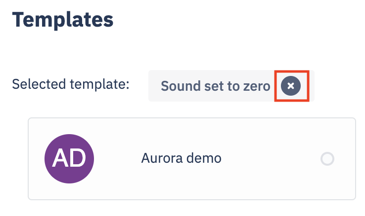

Once you have your template selected, click **Next**.

## Download Applications

You will now be on the *Download Applications* screen. The Device Provisioner will display all the Enterprise Apps associated with the selected Provisioning Template.

**NOTE**: Only the apps that are uploaded to your Esper Endpoint (called Enterprise Apps) will be displayed. If there are managed Google Play apps associated with your template, they will not be shown here but will still be included in provisioning if your device is GMS. Typically the Device Provisioner is used for AOSP devices that do not include Google Play.
 
These Enterprise Apps will be downloaded to your PC to be installed on the device or devices you’re provisioning during the next step. This keeps each device from having to retrieve the app or apps from your endpoint during provisioning, especially useful if you are provisioning multiple devices at once using the Device Provisioner.

A limited number of use cases require an app be side-loaded in addition to the ones listed in the template. To do so, under Additional Application first select whether the APK you wish to install when provisioning is located on your development PC (**Local Application Path** which is the default) or is downloaded via a URL (**URL of Application**). If Local Application Path is selected then click on **Select a local apk** and navigate to where you have the APK stored on your PC. If **URL of Application** is selected, then you enter the URL of the download point for the APK in the entry field and then click **Add**.

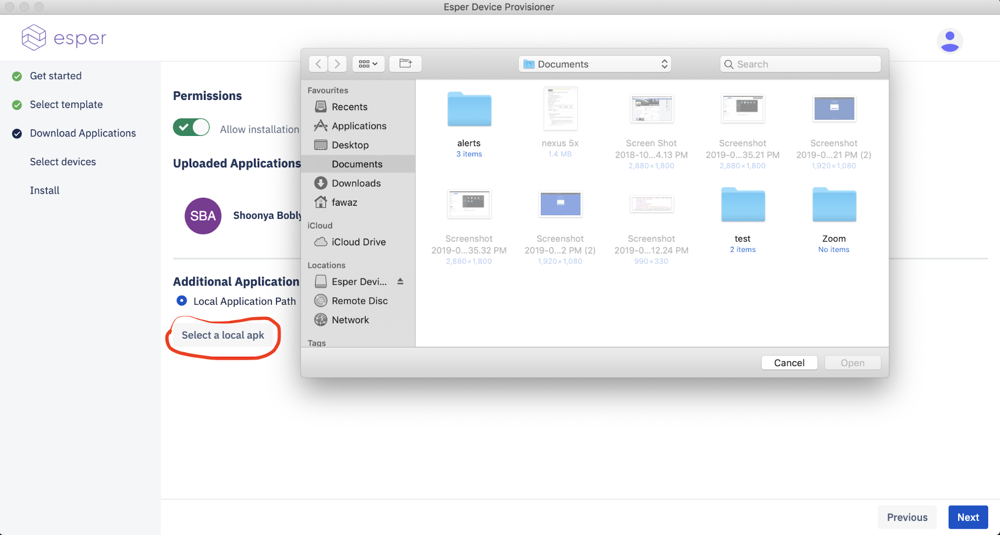

**NOTE**: Any additional applications included for installation via this method will be set to Hide by Esper. You will need to manually Show them either in **Devices->Apps->Actions** or in **Groups->Apps->Approvals** if you want the shortcut available for the app or apps on the Home screen.
 
You also have the option to modify the permissions for application install. One is **Allow installation of apps from unknown sources**, this is set to on by default - turn it off if you wish to prevent these types of apps from being installed. The other is **Disable Package Verifier**, it is turned on to enable you to install unsigned apps which may be the case during your app development phase.

Some device firmware is implemented such that it prevents enrollment of the device into Esper. We may supply you with a special Esper debug agent and helper to help us determine the issue or issues with enrollment. If that’s the case, turn **Debug Esper Agent** to on. Two fields will appear - one to enter the full path for the agent, and another for the full path of the agent helper. You will need to manually enter these paths.

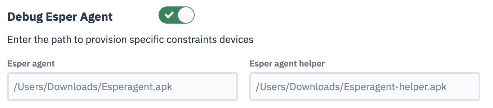

Once you are satisfied with your selections on the Download Applications screen, click **Next**.

## Select Devices

If the Esper Device Provisioner has connected to the device or devices you are provisioning, the device will appear on the screen of your computer. It is possible to see multiple devices listed if you are set up to provision more than one device, or if you happen to have other devices on your local network that have adb enabled. Be sure to select only the device or devices you wish to provision by checking the appropriate selector next to each device listed under Select Devices.

### Devices Connected via USB

If your device or devices are connected using a USB, and you have allowed USB debugging on the device or devices, they will be listed under **Select Devices**. Simply select the checkbox next to each device you wish to provision (or Select all if you have multiple devices and wish to provision all of them), and then click **Install** in the lower right hand corner. 

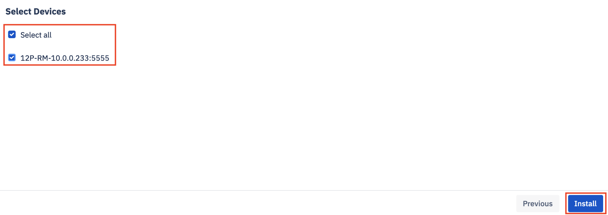

### Devices Connected via Wi-Fi or Ethernet

If your device is connected via either Wi-Fi or Ethernet and your device is not already listed under Select Devices, enter the device’s **IP address** and **Port number** in the fields under Add Devices, and click the **Connect** button. 

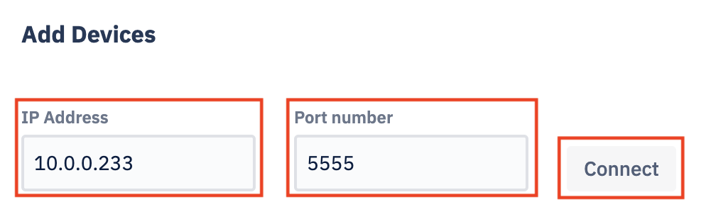

:::tip
The default port number for adb is 5555, unless you’ve changed it as part of connecting your device or devices via adb. Note you have to enter the port number in the field, the 5555 text displayed in the box is for example only, the field is not actually filled in.
:::

Once you click **Connect**, the device will be displayed under Select Devices. If you have more than one device to add, repeat the above steps. Once all devices have been added and then selected by either checking each individual checkbox per device or you have selected Select all, click on **Install**.

## Install

After clicking on Install in the Select devices screen, you will be taken to the Install screen showing you the installation progress of the Esper agent on the device or devices to be provisioned. Note this is not actually performing the provisioning, instead it is installing the required device-side software needed to provision your device or devices. To complete the process you will need to follow the prompts from the Esper agent locally on your device.

There is an indicator showing the percent installation progress on the device on the right side of the Device name information bar.

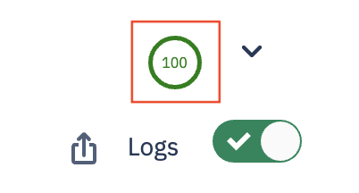

You have the option to click the downward arrow to see details of the installation. To stop viewing the details, click on the arrow again noting it will now be an upward arrow.

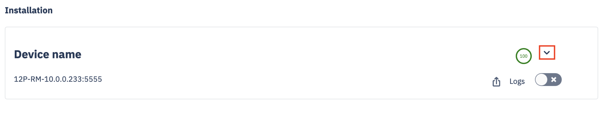

When in the details view you will see the step-by-step progress for installing the Esper agent on your device.

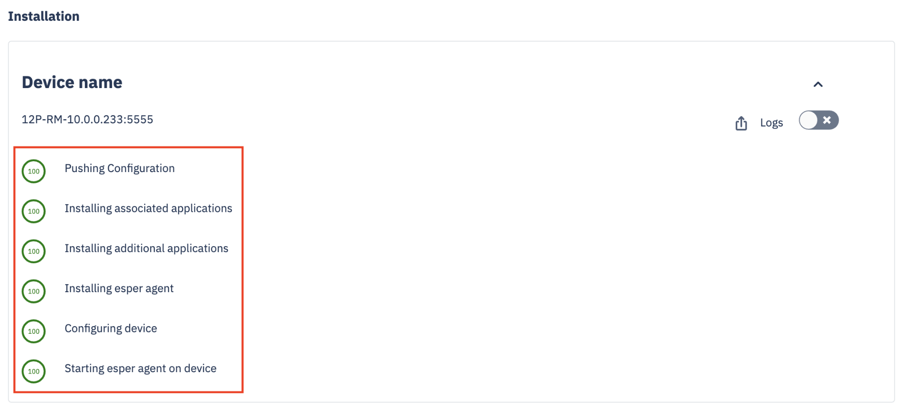

To view detailed installation logs as the device-side software is installed, toggle the **Logs** switch. These logs are useful to Esper support if you are unsuccessful in installing the Esper agent software on your device, but are unneeded for typical use.

A log window will appear showing you the installation progress on the device. Note you need to have selected the downward arrow to see details in order for the installation log window to display.

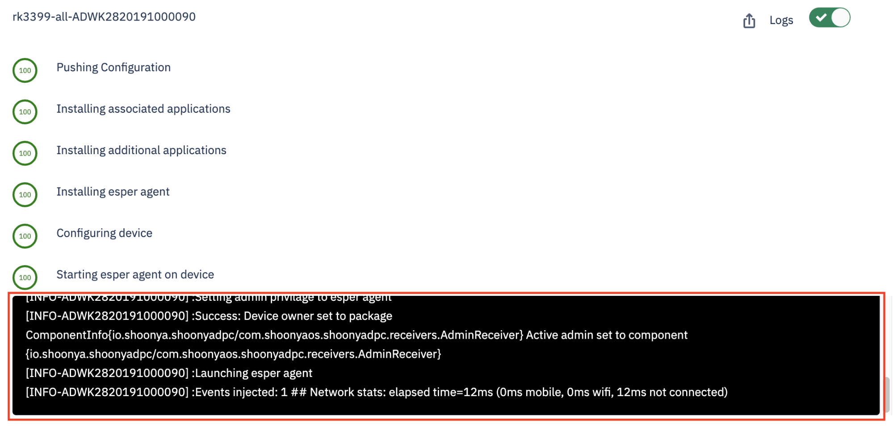

To download a copy of the logs to share with Esper, click the download button. A dialog box will appear to save the log file as locally on your development PC without an extension (it is a text file). You do not need to have **Logs** set to on in order to download the log file.

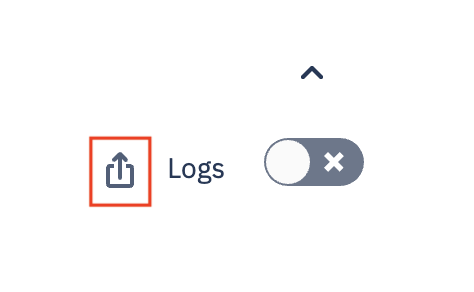

Once the Esper agent is successfully installed on the device, the progress indicator will show 100.

If you are viewing details the last step of Starting esper agent on device will show as 100.

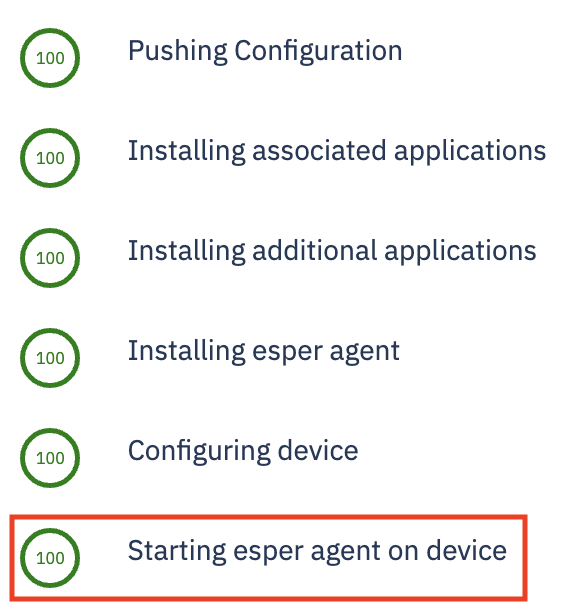

You are now done with the Device Provisioner, and you can click **Close** which will exit the Device Provisioner.

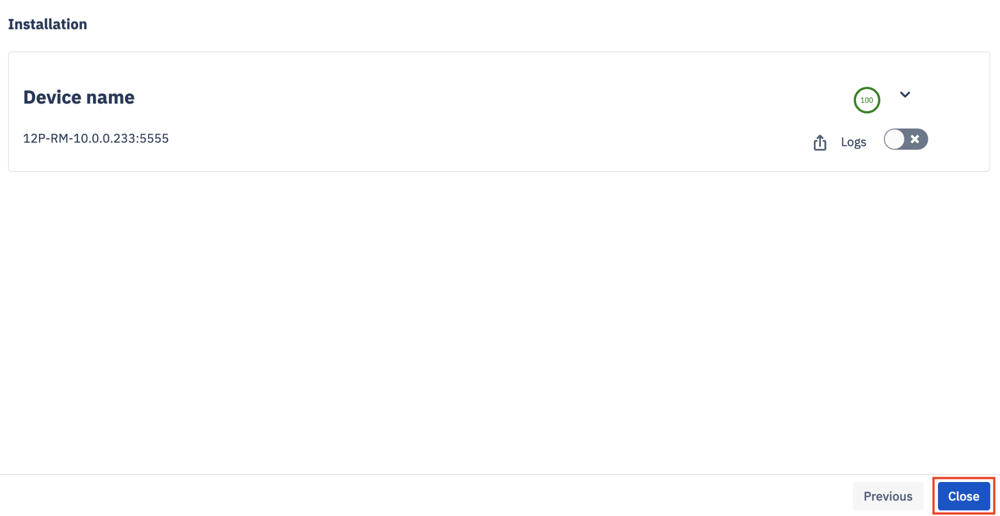

To complete the provisioning process, please now go to your device or devices that have installed the Esper agent.

## Steps on the Device

Upon successful installation of the Esper agent on the device, the agent will automatically start and begin enrollment and provisioning of the device moving through several setup screens.

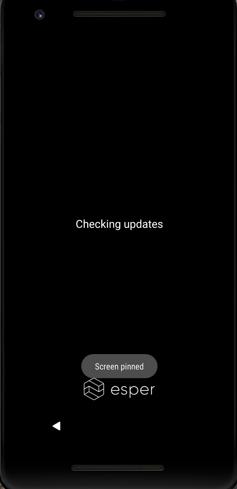

During provisioning you may encounter various notifications related to specific variations in the Android firmware.  If the device displays a prompt like the one shown below, select Decline. If you accept it is possible that the security check may block the installation of apps by the Device Provisioner.

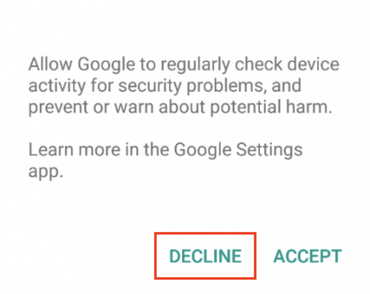
 
If your device includes Google Play, that service will need to be updated which can take some time. Additionally if you’ve included Google Play apps in your Provisioning Template on a device that supports Google Play, those apps will be installed by the Google Play service thus is dependent on Google Play’s current system load and quality of service.

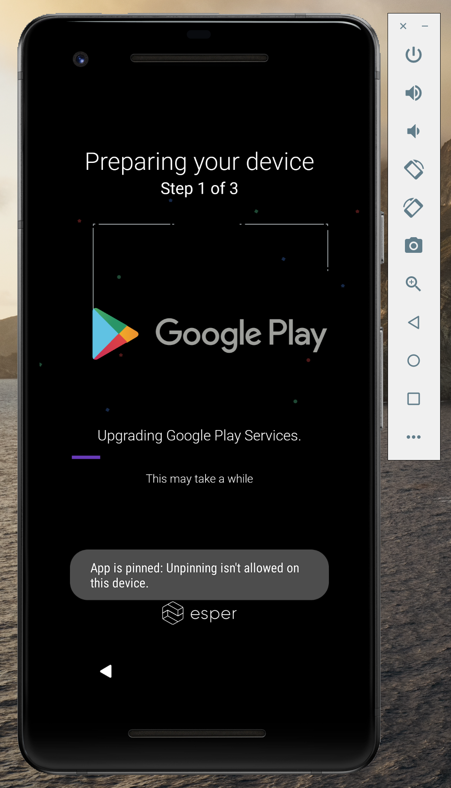

If you wish to exit the provisioning process for any reason, touch or click on the Esper logo 6 times to bring up the option to factory reset the device.

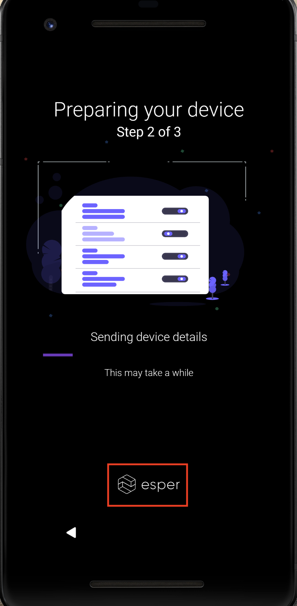

You typically will need to take several actions on the device, depending on the state of the device’s firmware. The example below is based on an Android 7.1 GMS device. Earlier Android versions such as Android 4.4 and Android 5.1 will exhibit slightly different behavior (e.g Activate device administrator and enabling accessibility services) - follow the prompts provided by the Esper agent to successfully complete enrollment and provisioning. On devices without a touch screen or if navigation buttons are not displayed, an external peripheral device like a mouse will be required.

On some devices these actions will not need to be taken, in these cases you will not be prompted by the Esper agent. Please [contact Esper](mailto:support@esper.io) if you run into any issues completing the provisioning process on  the device.

Typically you will need to resolve the permission for Esper to modify System settings, to do so touch or click on **RESOLVE** to open up the Android System settings app to provide the permission.

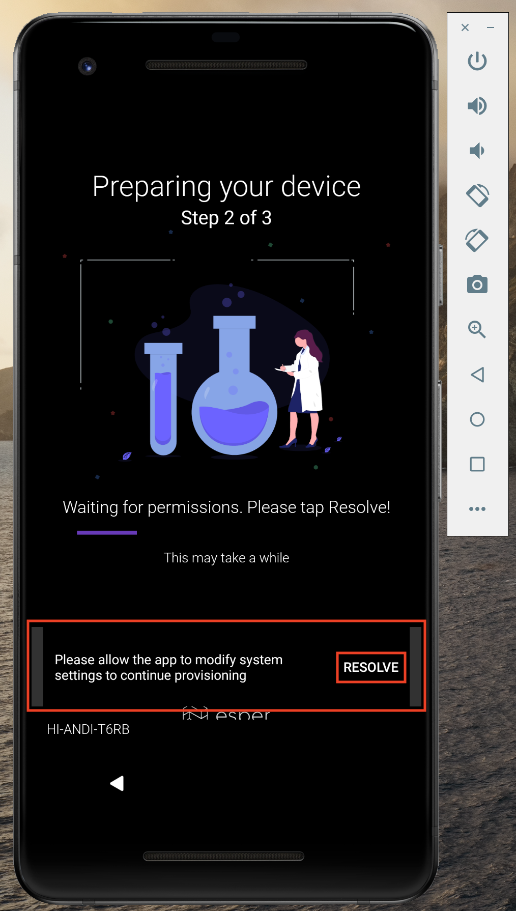

You are taken to the *Can modify system settings* screen where you will see a list of apps that have been granted or are requesting permission to modify system settings - you will see *Esper Device Management* currently set to *No* or *Not allowed*. Touch or click on **Esper Device Management**.

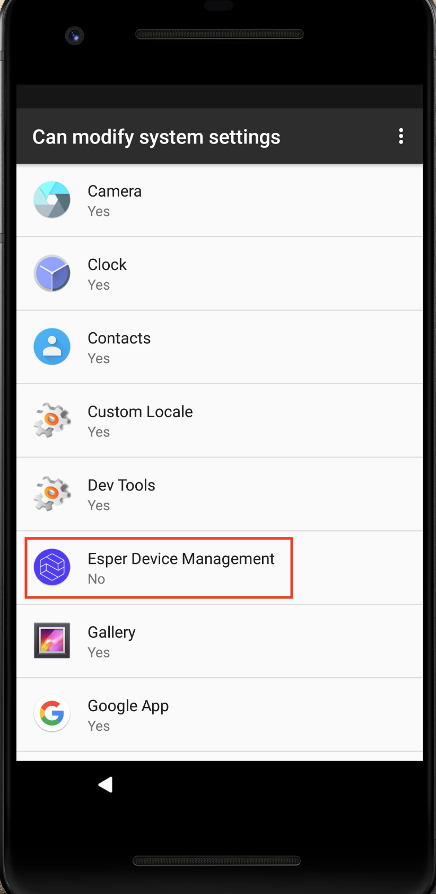

You will then be taken to Modify system settings for *Esper Device Management*. Turn on the switch located on the right side of the screen to *Allow modify system settings*.

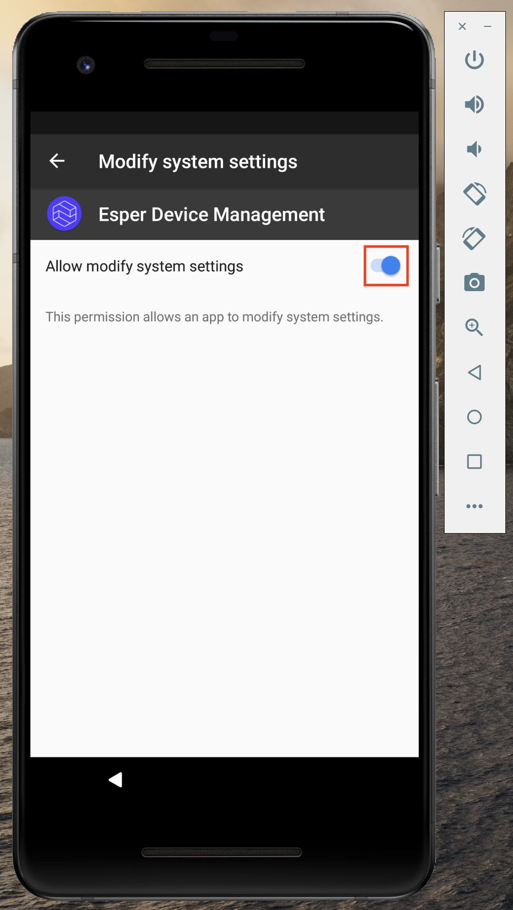

Next click the back button in the upper lefthand corner of the screen.

You will now be taken back to the *Can modify system settings* screen, noting *Esper Device Management* is now set to *Yes* or *Allowed* for modifying system settings. Now click the back button in the Nav bar.

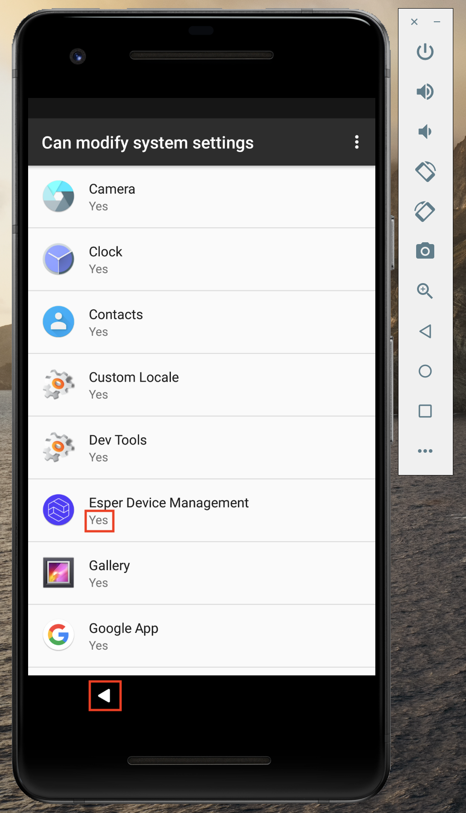

You will now return to the Esper agent. You will typically need to grant another permission to allow Esper to draw over other apps, we do this to ensure a smooth experience for Kiosk mode apps. Touch or click on **RESOLVE** to open up the Android system settings app to provide the permission.

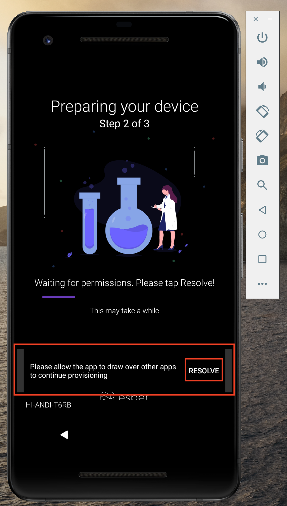

You are taken to the *Display over other apps* or *Draw over other apps* screen where you will see a list of apps that have been granted or are requesting permission to display over other apps - you will see Esper Device Management currently set to No or Not allowed. Touch or click on **Esper Device Management**.

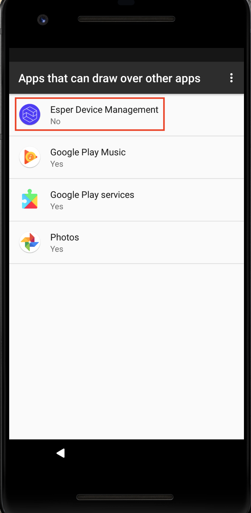

You will then be taken to *Display over other apps* or *Draw over other apps* for *Esper Device Management*. Turn on the switch located on the right side of the screen to *Allow display over other apps* or *Permit drawing over other apps*.
  
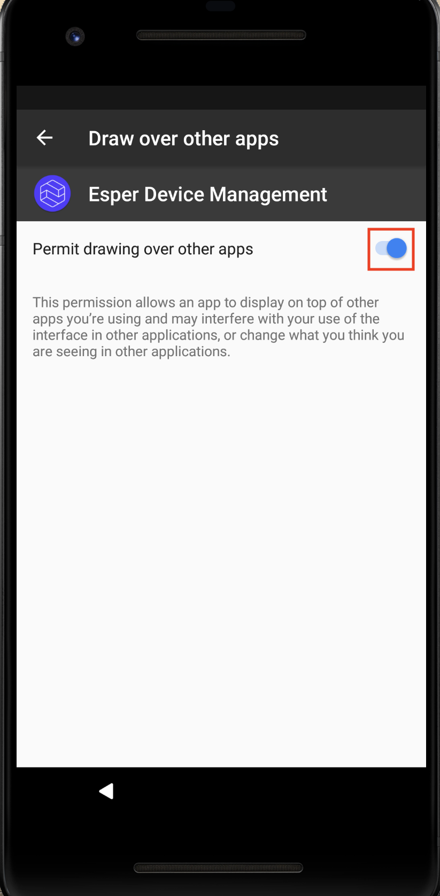

Next click the back button in the upper lefthand corner of the screen.

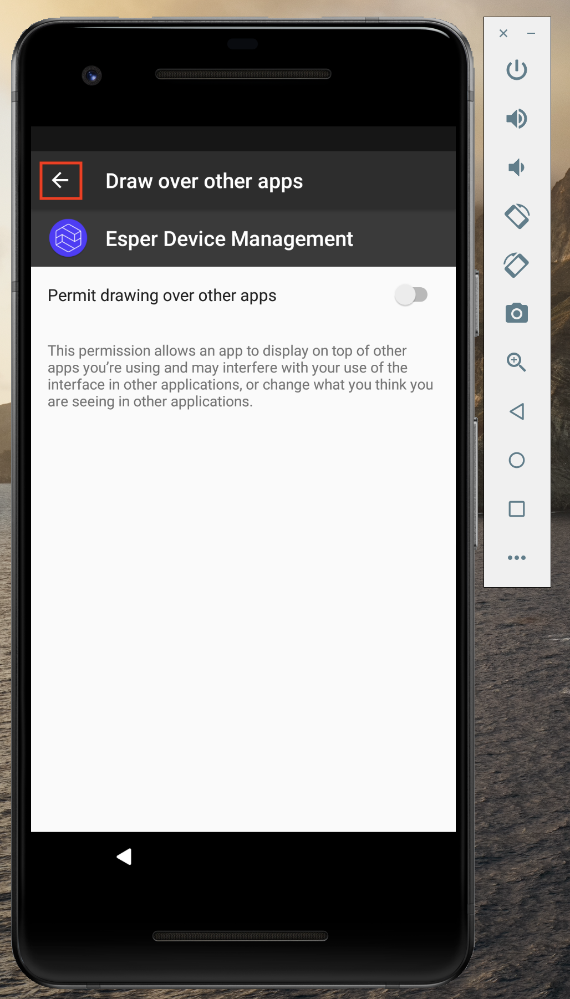

You will now be taken back to the *Display over other apps* screen, noting *Esper Device Management* is now set to *Yes* or *Allowed* for *drawing over other apps*. Now click the back button in the Nav bar. 

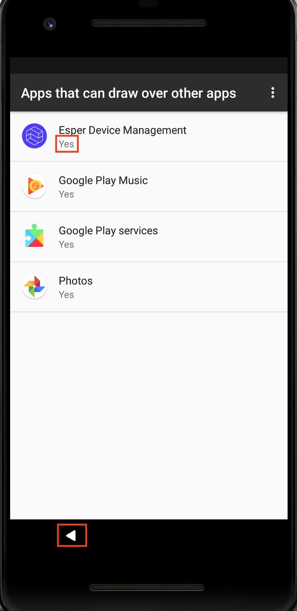

You will now return to the Esper agent to install any Esper Enterprise apps.

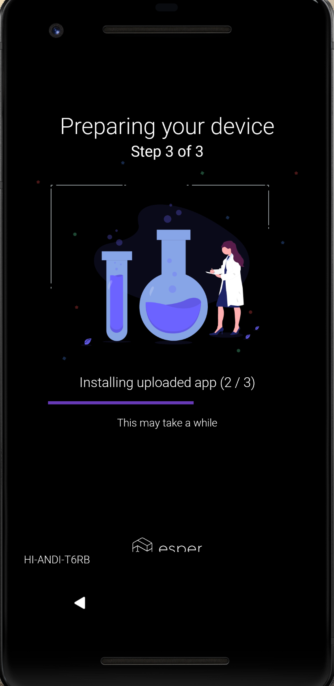

After this step, your provisioning will be finished and you’ll see your device set up according to your provisioning template. In this example we’ve provisioned in multi application mode with 3 Enterprise apps installed from the Esper Cloud and managed Google Play enabled.

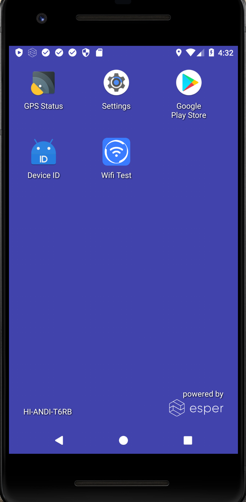

### Handling Other Notifications During Provisioning

If you plan to use the Esper Cloud to install your own Enterprise apps, we recommend not enabling Google Play Protect to prevent your apps from being blocked.
Occasionally the device ships with a custom launcher app in ROM. In that case you’ll get a popup to choose which app is used as the Home app. Choose **Esper**, select **Always**.

You may also encounter notifications to improve location accuracy. Agreeing to use these services means you are passing your location data to a third party. While you typically need to accept end user licensing agreements (EULAs) in order for the device to function, optional choices regarding diagnostic data and additional services are frequently presented. You should evaluate the tradeoff based on your specific use case and decide accordingly - we typically recommend declining these services.

If you encounter any other notifications you are not sure how to handle, just [contact Esper](mailto:support@esper.io).

## Provisioning an AVD

An Android Virtual Device (AVD) is a particular device configuration simulated by the Android Emulator on your development PC. With the Device Provisioner you can enroll and provision the device to your Esper Endpoint, making it available for your development and test use.

Begin by creating and / or running an AVD out of the many configurations available to you via Android Studio, see the [Android Studio documentation](https://developer.android.com/studio/run/managing-avds).

Once the AVD is running, start the Device Provisioner and follow the steps to [prepare the device as instructed](./provisioner.md#preparing-a-device-for-provisioning), [select your Provisioning Template](./provisioner.md#selecting-the-provisioning-template), and [download your Enterprise applications](./provisioner.md#download-applications).

When you get to the Select devices screen, you will see your AVD displayed as an emulated device. (In some cases you may need to first successfully execute **adb tcpip 5555** via the command line on the AVD in order for the Device Provisioner to connect to the AVD.) Select it and click on **Install**.

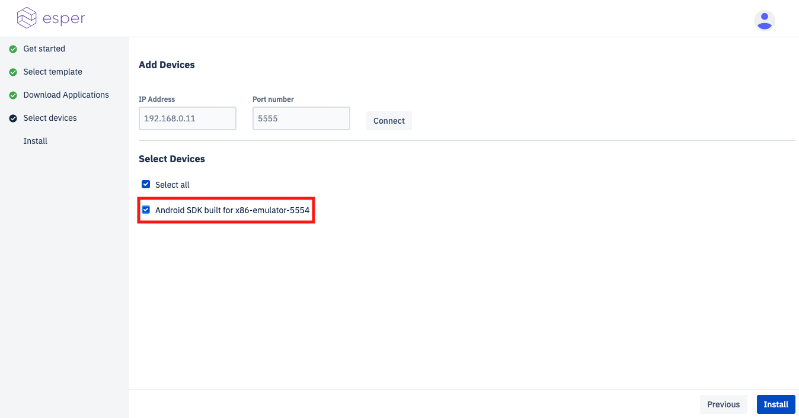

Once the [installation process of the Esper agent](./provisioner.md#install) on the device is successfully completed, take the appropriate [actions on the device](./provisioner.md#steps-on-the-device) to finish enrollment and provisioning. Once that’s done the AVD is not part of your Esper fleet. You can manage it as you would an actual Android device.

## Logging Out of the Device Provisioner

To log the Device Provisioner out of your endpoint, simply click on the person icon in the upper righthand corner of your screen. A dropdown will appear showing the account you are logged into. Click **Log out** to log out of your account.

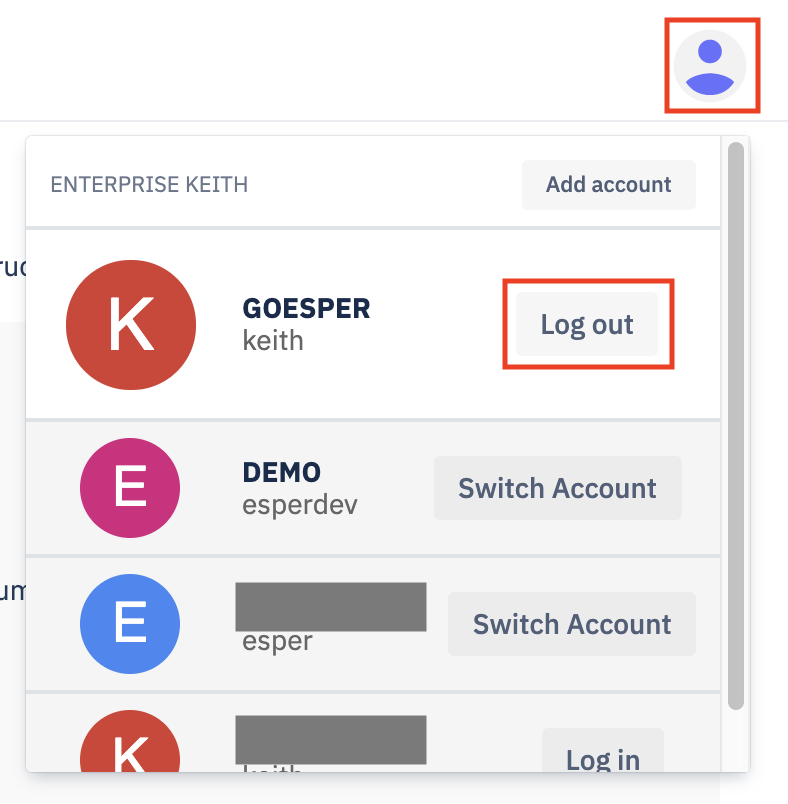

If you only have a single endpoint configured with the Device Provisioner, you will be presented with the login screen again before you can use the application. If you have multiple endpoints configured, you can then select which account you either want to log back into, or switch to if you are already logged in.

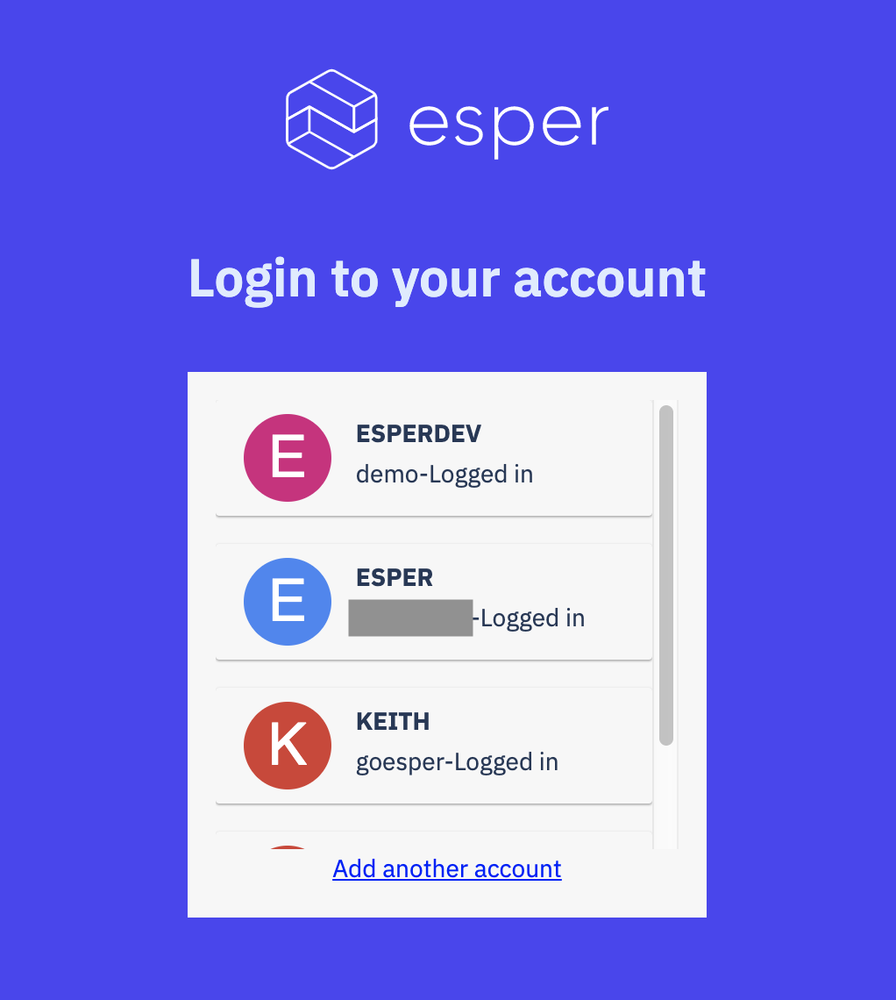

## Using the Device Provisioner with Multiple Esper Endpoints

The Device Provisioner can be configured to work with multiple Esper Endpoints. To add your account for an additional endpoint, click on the person icon in the upper righthand corner of your screen then click **Add account**.

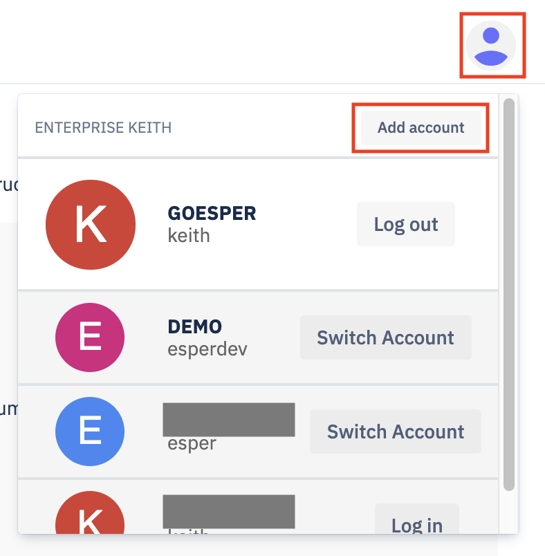

You will be taken to the login screen, click on **Add another account**.

You will now be taken to the login screen. Follow the same steps used when you set up your first endpoint login.

Once completed, to switch accounts you simply open up the Device Provisioner, click on the person icon in the upper righthand corner, and then click on **Switch Account** for the account you wish to use. Note you cannot switch account when you are on the Install screen. Simply close the Device Provisioner, open it again and then change the account.

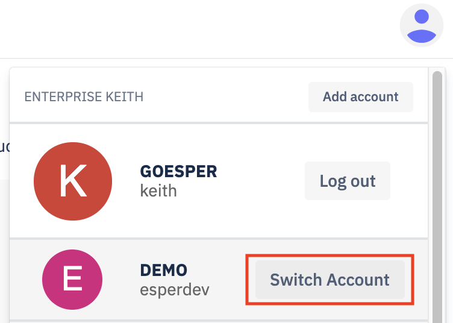

:::tip
To exit the account dropdown, click the person icon.
::: 
