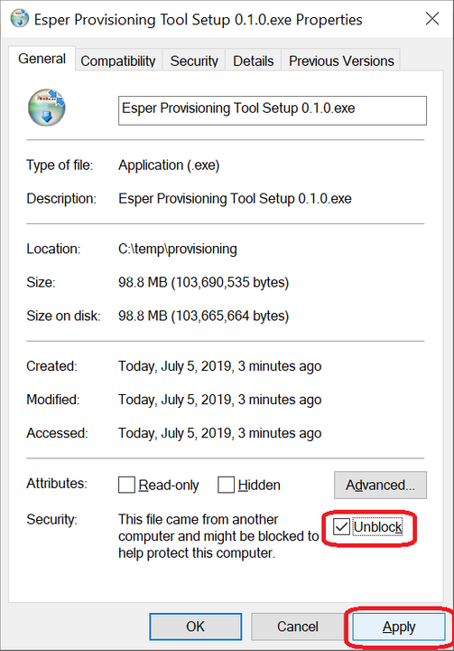
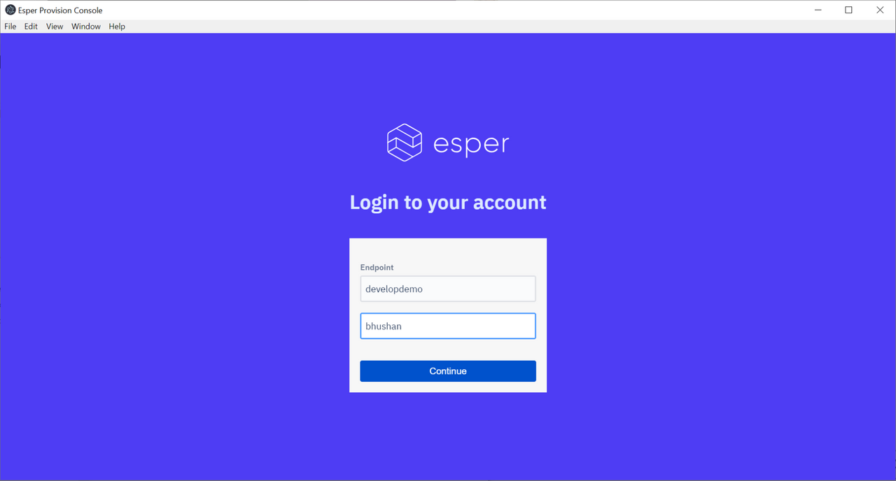
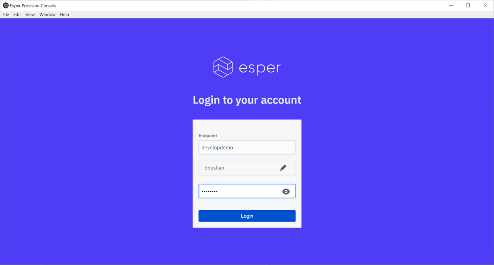

# Esper Device Provisioner

Average reading time : {{ $page.readingTime.text.replace(' read', '') }}s

## Instructions for Windows 10 OS

1. Download the Esper Device Provisioner from here:

https://drive.google.com/open?id=1byC7jLxH18_m0YoW3k9NKif_FnZaog7N

2. Open File Explorer (you can use the Windows Key + E shortcut), and go to where you have downloaded the file. Most probably, it will be in your Downloads’ folder:

3. (Optional Step): Move the downloaded file to a temporary location, such as C:\temp\provisioning, so it’s easier to find the next time you need it:

4. Executable files downloaded from the internet are rightly not trusted by Windows by default. As a result, you have to tell Windows that it is safe to execute the file, as you’ve downloaded it from Esper, which you trust. To do so, right-click on the file, and click on Properties:

5. In the resulting dialog, check the Unblock option, and click on Apply. This will indicate to Windows that it’s OK to execute this file:

6. Now double-click on the file, and you will see a dialog that shows the app being installed locally on your PC:

7. Once it’s done you will be greeted by the following dialog:

8. Enter your endpoint credentials in this dialog--the endpoint name, followed by your endpoint username and then click Continue:

9. Now enter your password for your endpoint and click on Login:

10. You will now be greeted by the following screen:

Click on Next on this screen.

11. The next screen will show you your endpoint’s templates. If you don’t have any templates, please login to your endpoint, and create a template for Provisioning. Select the template that you want to provision your device with, and click Next:

12. You will now be greeted by a screen where all Uploaded Apps associated with the template will be listed. Note that these are only the apps that are uploaded to your Esper endpoint and not PlayForWork apps. So if there’s a PlayForWork app associated with your template, they will not be shown here. 

Apps that appear under the Uploaded Apps section will be downloaded locally to your PC and installed to your device in the next step. This makes the device skip the step to fetch the app from your endpoint during provisioning. This is especially helpful when you have multiple devices to provision, and want to save on the device’s bandwidth.

Some devices require that some apps be side-loaded in addition to the ones listed in the template. These apps can be listed in the Additional APKs section. You can list the paths either by their remote URL or take then from your local computer.

Note: Additional APKs always get installed before Uploaded Apps onto the device.

13. Before you click Next on the above dialog, ensure that:

a. You have enabled ADB on your device. Note that ADB over USB is supported automatically by the Esper provisioner. In this case make sure your device is attached to the local computer via a USB cable. 

In case your device is in ADB-over TCPIP mode, then you can provide ip address and port number of device in the provisioner. And then click connect button.

b. Your device or devices are connected to the PC on which the provisioner app is running.

c. When you attach your device to the PC, you will be greeted with a prompt like the one shown below. Make sure you check the Always allow from this computer checkbox, followed by the OK button.

d. Make sure you don’t have any accounts under Accounts in Settings.

14. Once you do the above, click Next on the provisioning tool, and you will start seeing your device in it:

Now select your device or multiple devices if you have multiple devices connected, and click on the Install button.

15. You will now see a dialog with the installation progress:

If you click on the little carat icon to the right, you can see the details of the provisioning:

It will look like something shown below:

You can see logs of provisioner just by toggling Logs.
Also you can download logs just by clicking on this button:

During provisioning if you see a prompt like the one shown below, select Decline.

When provisioning is complete, you will see this in the dialog:

Now you can click on the Prev button and repeat the steps for more devices. Once you are done, simply exit the application using the Close button or the X icon at the top right.

Instructions for MacOS
Download the Esper Device Provisioner from here:

http://downloads.esper.io/esper-provisioner/mac/Esper%20Device%20Provisioner-1.0.0-beta.dmg

Open Finder and go to where you have downloaded the file. Most probably, it will be in your Downloads’ folder

:

Move the Esper Device Provisioner to Applications folder:

Executable files downloaded from the internet are rightly not trusted by MacOs by default. As a result, you have to tell MacOs that it is safe to execute the file, as you’ve downloaded it from Esper, which you trust. To do so, go to System Preferences, and click on Security & Privacy:

In the resulting dialog, click the Open Anyway button. In the resulting dialog click on Open:

Once it’s done you will be greeted by the following dialog:

Enter your endpoint credentials in this dialog--the endpoint name, followed by your endpoint username and then click Continue:

Now enter your password for your endpoint and click on Login:

You will now be greeted by the following screen:

Click on Next on this screen.

The next screen will show you your endpoint’s templates. If you don’t have any templates, please login to your endpoint, and create a template for Provisioning. Select the template that you want to provision your device with, and click Next:

You will now be greeted by a screen where all Uploaded Apps associated with the template will be listed. Note that these are only the apps that are uploaded to your Esper endpoint and not PlayForWork apps. So if there’s a PlayForWork app associated with your template, they will not be shown here.

Apps that appear under the Uploaded Apps section will be downloaded locally to your PC and installed to your device in the next step. This makes the device skip the step to fetch the app from your endpoint during provisioning. This is especially helpful when you have multiple devices to provision, and want to save on the device’s bandwidth.

Some devices require that some apps be side-loaded in addition to the ones listed in the template. These apps can be listed in the Additional APKs section. You can list the paths either by their remote URL or take then from your local computer.

Note: Additional APKs always get installed before Uploaded Apps onto the device.

Before you click Next on the above dialog, ensure that:

You have enabled ADB on your device. Note that ADB over USB is supported automatically by the Esper provisioner. In this case make sure your device is attached to the local computer via a USB cable. 

In case your device is in ADB-over TCPIP mode, then you can provide ip address and port number of device in the provisioner. And then click connect button.

Your device or devices are connected to the PC on which the provisioner app is running.

When you attach your device to the PC, you will be greeted with a prompt like the one shown below. Make sure you check the Always allow from this computer checkbox, followed by the OK button.

Make sure you don’t have any accounts under Accounts in Settings.

Once you do the above, click Next on the provisioning tool, and you will start seeing your device in it:

Now select your device or multiple devices if you have multiple devices connected, and click on the Install button.

You will now see a dialog with the installation progress:

If you click on the little carat icon to the right, you can see the details of the provisioning:

It will look like something shown below:

You can see logs of provisioner just by toggling Logs.
Also you can download logs just by clicking on this button:

During provisioning if you see a prompt like the one shown below, select Decline.

When provisioning is complete, you will see this in the dialog:

Now you can click on the Prev button and repeat the steps for more devices. Once you are done, simply exit the application using the Close button or the X icon at the top right.
