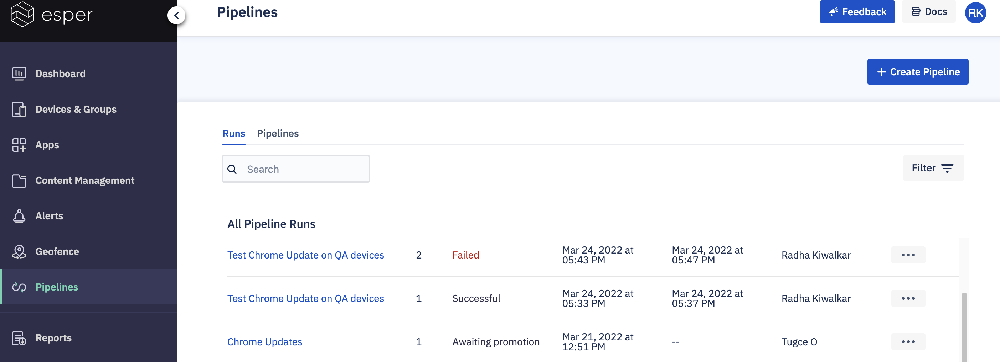
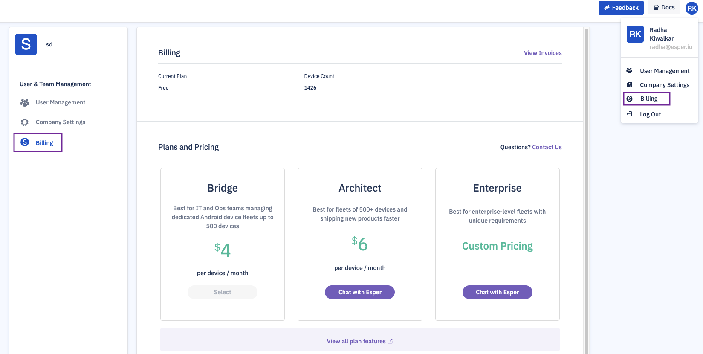
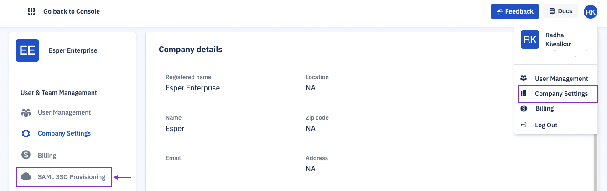
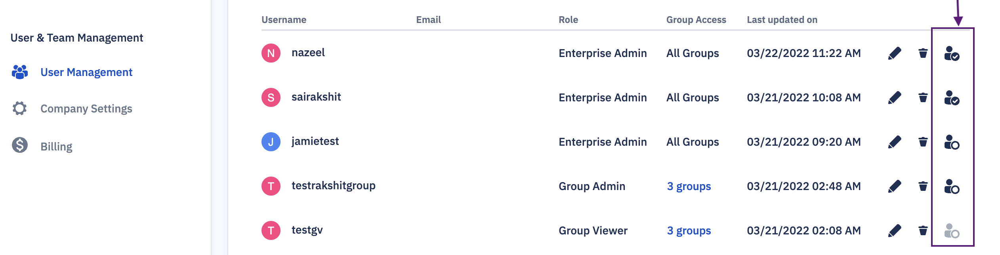

# Esper Release Notes - DevRel 81

Date: 4/12/2022

  

Esper DevRel 81 is a major release with exciting new features and updates. Along with an improved Pipeline experience via the Console, we're introducing payment, groups and blueprint, and SAML SSO for new endpoints. You can find the complete breakdown of what’s new below.

## NEW CUSTOMERS

If you signed up for Esper Platform on or after Apr 12, 2022, you receive our full new experience.

### Pipeline feature
    

Esper Pipelines enable you to ensure the smooth completion of actions (Application install) on large fleets of devices by providing a way to automate them. Learn more about Pipelines [here](https://console-docs-v2.esper.io/pipeline/).

Instead of checking each device for the operation success/failure, this UI gives you a summary of all their pipelines and each stage of individual pipelines for your entire device fleet.

  

### Self-serve payments
    

The enterprise admin can purchase the Bridge plan— Esper's offering for IT and Ops team— via the Console. Log in to the Console, click the profile icon, and choose the ‘Billing’ option from the menu.

  

You can view your current plan, purchase the Bridge plan, and download the invoice here. Please contact [Esper sales](https://www.esper.io/contact-us) to upgrade to Architect or Enterprise plans.

### SSO integration and new login flow
    

If you have an Identity Provider (IdP), you can now add Esper to your SSO platform! Enterprise administrators can now configure [SAML SSO](https://console-docs-v2.esper.io/miscellaneous/saml.html) via the Console. Log in to the Console, click the profile icon and navigate to your company settings.

:::tip
We Support any IdP that adheres to the SAML 2.0 protocol such as PingFederate and Okta.
:::

### Groups and Blueprint
    

Esper's Devices and Groups section can help organize your fleet into manageable chunks. Rather than managing thousands of devices, creating groups simplifies your task to manage a smaller collection of device configurations and content. You can configure groups via blueprints. A blueprint is a collection of settings that are associated with a group. Since a group is managed using a blueprint, we recommend creating a blueprint as soon as you start a group. [Here](https://console-docs-v2.esper.io/devices-groups/) you can find the complete documentation for this feature. We have also created [guides](https://docs.esper.io/home/guides) to help familiarize this new feature.

### Added Guides and Tutorials
    

We have added a tile to host all the [guides and tutorials.](https://docs.esper.io/home/guides) This will be your one-stop shop to quickly acquaint yourself with the features.

## EXISTING CUSTOMERS

We are following a phased release for our existing customers — accounts created before April 12, 2022. As a valued Esper user, we will be migrating you to this new experience shortly to make sure that current setup is not disrupt. In the meantime, if you have any questions please contact [Esper Team](https://support.esper.io/s/).

### Improved pipelines UI
    

We have improved the pipeline experience on the Console. The landing page displays all Runs and Pipelines for your organization. Instead of checking each device for the operation success/failure, this new UI gives you a complete picture of the application commands for your entire device fleet. 

You can now create only 3 stages via the Console. For each stage, you can add up to 5 operations.

### Support for Android 12
    

We now support provisioning for Android 12 devices with EMM support. We have also added new permissions for Bluetooth— scan, connect and advertise.

### Bugs and Improvements

  

-   For seamless provisioning of Android 8.1 and 9 devices, we have integrated wifi regex functionality with seamless provisioning. Please contact your sales team to know more about this feature.
    
-   We have added a new tile to host all the [guides and tutorials](https://docs.esper.io/home/guides). This will be your stop to acquaint yourself with the latest features quickly.
    
-   We have enabled key events on the remote viewer in the window mode. While the remote viewer session is in progress, you can use your keyboard to type in the remote device—search bars, text box, etc., without clicking on the keyboard display on the remote device.
    
-   By default, the users will not have permission to factory reset the device. The Enterprise administrator can allow or deny the factory reset permissions to other enterprise users or group admins. This feature is available under the User management section of the Esper Console.
    

Please contact [Esper support](https://support.esper.io/s/) to enable this feature.

-   We now provide means to differentiate between Wi-Fi and LTE device behavior. You can choose to Enterprise applications or Esper agent or upgrade Esper Agent only on Wi-Fi. Please contact [Esper support](https://support.esper.io/s/) to know more about this feature.
    
-   Send message quick action was failing with “Window Has Expired” error message. We have now fixed the time relative to the devices, and the devices receive a message as expected.
    
-   You should now be able to search devices using IMEI serial numbers.
    

  

We’re excited to launch DevRel 81 today, and the Esper team is hard at work on DevRel 82, which is currently scheduled to launch in May 2021. Please [reach out](https://support.esper.io/s/) to share your thoughts on how Esper can improve future releases.

