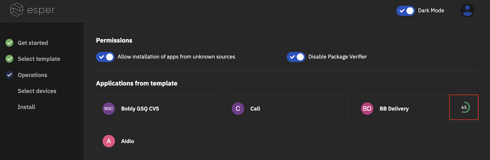
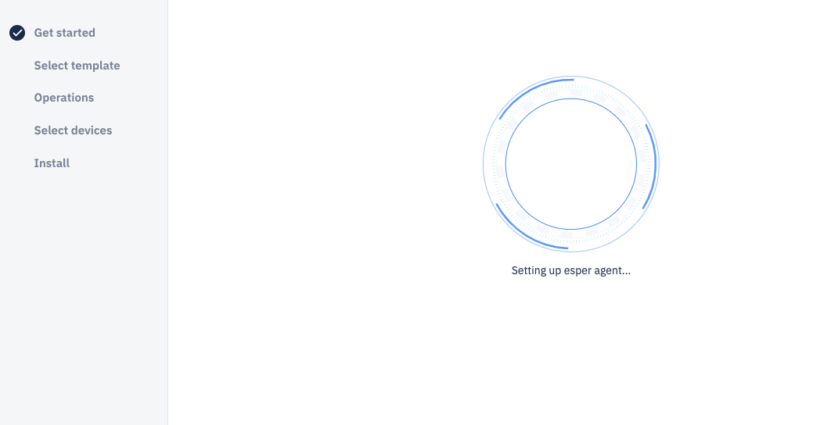

# Device Provisioner Release Notes

June 2022

Here’s what’s new in electron version v6.2.0

## Display download status for applications
    

On the “Operations” step, we have added the completion percentage status when downloading applications.

  

## Bugs and Improvements:

-   We have added messaging — display the percentage of application download — to the logs while provisioning a device.
    

-   We have added detail description of the background tasks for the initial setup spinner.
    

